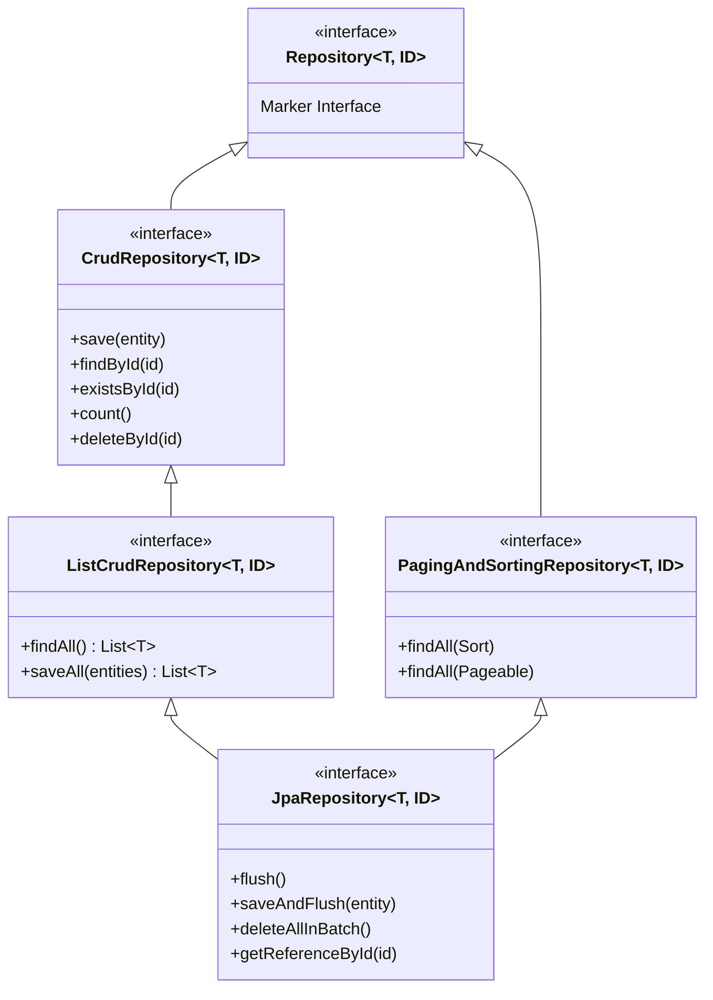

# Day 22: Spring Data Repositories & Query Methods

> **"If you write raw SQL string concatenations or manual JDBC loops to load AI chat histories, your code is vulnerable to SQL injection, prone to N+1 query storms, and unmaintainable. Spring Data JPA turns repository interfaces into type-safe, optimized SQL query engines at application startup."**

---

| Previous Day | Course Hub | Next Day |
|:---|:---:|---:|
| [Day 21: JPA & Hibernate Foundations](../Day_21_JPA_Hibernate_Foundations/Day_21_JPA_Hibernate_Foundations.md) | [All 60 Days Overview](../../README.md) | [Day 23: Entity Relationships & Fetch Strategies](../Day_23_Entity_Relationships_Fetch_Strategies/Day_23_Entity_Relationships_Fetch_Strategies.md) |

---

## Table of Contents

1. [Why This Day Matters for a 3-Year Enterprise Gen AI Engineer](#1-why-this-day-matters-for-a-3-year-enterprise-gen-ai-engineer)
2. [Real-World Analogy: The Voice-Activated Archival Clerk](#2-real-world-analogy-the-voice-activated-archival-clerk)
3. [The Spring Data Repository Hierarchy](#3-the-spring-data-repository-hierarchy)
4. [Method Name Query Derivation DSL In-Depth](#4-method-name-query-derivation-dsl-in-depth)
5. [Custom Queries with `@Query`: JPQL vs Native SQL](#5-custom-queries-with-query-jpql-vs-native-sql)
6. [Pagination & Sorting: `Page<T>` vs `Slice<T>` for AI Chat Feeds](#6-pagination--sorting-paget-vs-slicet-for-ai-chat-feeds)
7. [Dynamic Filtering with Spring Data Specifications](#7-dynamic-filtering-with-spring-data-specifications)
8. [Bulk Operations with `@Modifying`](#8-bulk-operations-with-modifying)
9. [Hands-On Code Walkthrough](#9-hands-on-code-walkthrough)
10. [Step-by-Step Compilation & Execution](#10-step-by-step-compilation--execution)
11. [Hands-On Exercises (With Complete Solutions)](#11-hands-on-exercises-with-complete-solutions)
12. [Self-Check Quiz](#12-self-check-quiz)

---

## 1. Why This Day Matters for a 3-Year Enterprise Gen AI Engineer

When you build conversational AI agents, RAG document pipelines, or prompt engineering portals, **how you query data directly dictates latency, database load, and memory usage**:

1. **Context Window Assembly**: Before calling an LLM (e.g., `gpt-4o` or `claude-3-5-sonnet`), you must assemble the last $N$ messages of the conversation. If you query all 10,000 historical messages of a user and filter them in Java memory, your server crashes with `OutOfMemoryError`. You must query only the most recent tokens using chronological sorting and limit clauses.
2. **The `COUNT(*)` Pagination Bottleneck**: Junior developers use `Page<T>` for everything. When a chat message table grows to 10 million rows, every page request triggers an unindexed `SELECT COUNT(*)` scan that takes **1.8 seconds on PostgreSQL**, freezing your API!
3. **Dynamic Prompt Filtering**: In production prompt registries, users filter templates by model (`gpt-4o`), active status (`true`), minimum version (`> 2`), and search keywords (`"customer-support"`). Writing 16 separate query methods for every permutation is unmaintainable; you need **Spring Data Specifications**.
4. **Tenant Token Accounting**: Aggregating token consumption per enterprise organization requires aggregate JPQL queries (`SUM(tokenCount)`) that run in the database engine rather than transferring millions of rows across the network wire.

---

## 2. Real-World Analogy: The Voice-Activated Archival Clerk

```
TRADITIONAL RAW JDBC:
[ Developer ] ──► Handwrites a 15-page requisition form in Latin:
                  "SELECT m.id, m.content, m.tokens FROM messages m WHERE..."
                  If one spelling mistake occurs, the archive rejects the letter.

SPRING DATA JPA:
[ Developer ] ──► Declares interface method:
                  "findBySessionIdOrderByCreatedAtAsc(String sessionId)"
                  
[ Smart Clerk ] ─► Listens to the method name, immediately understands the intent,
 (Dynamic Proxy)   generates the exact SQL, executes it against the database,
                   and hands back a typed List<ChatMessage> in milliseconds!
```

Spring Data JPA is your **smart archival clerk**. You do not write query implementations. You declare an interface, and at application startup, Spring Data uses **dynamic bytecode proxies** to translate your English-like method names into high-performance SQL queries.

---

## 3. The Spring Data Repository Hierarchy

Spring Data organizes repositories into a clean inheritance hierarchy:



### Which Interface Should You Extend?
- **`CrudRepository<T, ID>`**: Basic CRUD operations. Legacy interface that returns `Iterable<T>` (requires casting or wrapping to `List`).
- **`ListCrudRepository<T, ID>`**: Introduced in Spring Data 3.0 / Spring Boot 3; returns clean `List<T>` without casting.
- **`JpaRepository<T, ID>`**: **The enterprise standard**. Extends `ListCrudRepository` and `PagingAndSortingRepository`, adding JPA-specific persistence context operations like `flush()`, `saveAndFlush()`, and batch deletes (`deleteAllInBatch()`).

```java
@Repository
public interface ChatMessageRepository extends JpaRepository<ChatMessage, Long> {
    // Methods declared here
}
```

---

## 4. Method Name Query Derivation DSL In-Depth

Spring Data parses the name of interface methods using an internal compiler parser. It splits the method name into **subject** and **predicate**.

```
    findBySessionIdAndRoleOrderByCreatedAtDesc
    ├───┘ ├─────────┴─────┘ ├─────────────────┘
   Prefix     Criteria            Sorting
```

### Supported Query Keywords for Gen AI Repositories

| Keyword | Example Method | Generated SQL Equivalent |
| :--- | :--- | :--- |
| `And` | `findBySessionIdAndRole(s, r)` | `WHERE session_id = ? AND role = ?` |
| `Or` | `findByModelOrProvider(m, p)` | `WHERE model = ? OR provider = ?` |
| `Between` | `findByTokenCountBetween(min, max)` | `WHERE token_count BETWEEN ? AND ?` |
| `LessThan` / `GreaterThan` | `findByCreatedAtAfter(instant)` | `WHERE created_at > ?` |
| `IsNull` / `IsNotNull` | `findByDeletedAtIsNull()` | `WHERE deleted_at IS NULL` |
| `Like` / `Containing` | `findByContentContainingIgnoreCase(kw)` | `WHERE LOWER(content) LIKE LOWER('%' || ? || '%')` |
| `In` | `findByModelFamilyIn(List<String> models)`| `WHERE model_family IN (?, ?, ?)` |
| `True` / `False` | `findByActiveTrue()` | `WHERE active = TRUE` |
| `Top` / `First` | `findTop10BySessionIdOrderByCreatedAtDesc(s)` | `WHERE session_id = ? ORDER BY created_at DESC LIMIT 10` |
| `Distinct` | `findDistinctModelFamilyBy()` | `SELECT DISTINCT model_family FROM ...` |

---

## 5. Custom Queries with `@Query`: JPQL vs Native SQL

When queries become complex—such as joins across multiple tables, aggregation math, or subqueries—method names become unwieldy (`findByUserTenantOrganizationIdAndCreatedAtAfter...`). Use **`@Query`**.

### 1. JPQL (Java Persistence Query Language)
JPQL queries operate on **Java Entity classes and property names**, not database tables and columns. It is completely portable across databases.

```java
@Query("""
    SELECT m FROM ChatMessage m
    WHERE m.session.id = :sessionId
      AND m.tokenCount <= :maxTokens
    ORDER BY m.createdAt ASC
""")
List<ChatMessage> findEligibleContextMessages(
    @Param("sessionId") Long sessionId,
    @Param("maxTokens") int maxTokens
);
```

#### Aggregate JPQL for Token Metrics
```java
@Query("""
    SELECT COALESCE(SUM(m.tokenCount), 0)
    FROM ChatMessage m
    WHERE m.session.userId = :userId
      AND m.createdAt >= :since
""")
int sumTokensConsumedByUserSince(
    @Param("userId") String userId,
    @Param("since") Instant since
);
```

### 2. Native SQL (`nativeQuery = true`)
Native queries execute raw PostgreSQL SQL directly. Use native queries when leveraging **PostgreSQL-specific capabilities** (e.g., `JSONB` indexing, full-text search `tsvector`, or `pgvector` similarity search):

```java
@Query(
    value = """
        SELECT * FROM document_chunks
        ORDER BY embedding <=> cast(:queryVector as vector)
        LIMIT :topK
    """,
    nativeQuery = true
)
List<DocumentChunk> findNearestNeighbors(
    @Param("queryVector") String queryVector,
    @Param("topK") int topK
);
```

---

## 6. Pagination & Sorting: `Page<T>` vs `Slice<T>` for AI Chat Feeds

When presenting conversation histories in chat interfaces, you must paginate. Spring Data offers three options:

### The Hidden Trap of `Page<T>`
```java
Page<ChatMessage> findBySessionId(String sessionId, Pageable pageable);
```
To calculate `Page.getTotalPages()` and `Page.getTotalElements()`, Spring Data automatically issues **TWO SQL queries**:
1. `SELECT * FROM chat_messages WHERE session_id = ? LIMIT 20 OFFSET 0;`
2. `SELECT COUNT(*) FROM chat_messages WHERE session_id = ?;` ⚠️

On a table with tens of millions of chat messages, **the `SELECT COUNT(*)` query triggers an expensive sequence scan on PostgreSQL**, adding hundreds of milliseconds of latency to every single message sent by a user!

### The Solution: `Slice<T>` for Infinite Scroll
```java
Slice<ChatMessage> findBySessionId(String sessionId, Pageable pageable);
```
In modern AI chat interfaces (like ChatGPT or Claude), the user does not care about "Page 42 of 87". They simply scroll up to load older messages.

`Slice<T>` solves this by querying `LIMIT (pageSize + 1)`:
- If you request `size = 20`, Hibernate queries `LIMIT 21`.
- If 21 rows return, Hibernate discards the 21st row and sets `slice.hasNext() = true`.
- **ZERO `COUNT(*)` queries are executed!** Your database performance increases by up to 10x!

```java
// Pageable instantiation with Sort
Pageable pageable = PageRequest.of(0, 20, Sort.by("createdAt").descending());
Slice<ChatMessage> recentMessages = messageRepository.findBySessionId("sess_101", pageable);

if (recentMessages.hasNext()) {
    // Show "Load older messages..." button in UI
}
```

---

## 7. Dynamic Filtering with Spring Data Specifications

What if your application has an AI Prompt Template Marketplace where users search with any combination of optional filters:
- Model Family: `"gpt-4o"` (optional)
- Active Only: `true` (optional)
- Keyword Search: `"summarize"` (optional)
- Author: `"alice"` (optional)

If you use method names, you would need $2^4 = 16$ method combinations!

### Enter `JpaSpecificationExecutor<T>`
Spring Data Specifications are based on the JPA Criteria API, allowing you to combine atomic search predicates dynamically using `and()` and `or()`:

```java
public class PromptSpecifications {

    public static Specification<PromptTemplate> hasModelFamily(String model) {
        return (root, query, cb) -> 
            (model == null || model.isBlank()) ? null : cb.equal(root.get("modelFamily"), model);
    }

    public static Specification<PromptTemplate> isActive(Boolean active) {
        return (root, query, cb) -> 
            active == null ? null : cb.equal(root.get("active"), active);
    }

    public static Specification<PromptTemplate> contentContains(String keyword) {
        return (root, query, cb) -> 
            (keyword == null || keyword.isBlank()) ? null : 
            cb.like(cb.lower(root.get("templateContent")), "%" + keyword.toLowerCase() + "%");
    }
}
```

#### Combining in Service Layer
```java
Specification<PromptTemplate> spec = Specification
    .where(PromptSpecifications.hasModelFamily(filter.model()))
    .and(PromptSpecifications.isActive(filter.active()))
    .and(PromptSpecifications.contentContains(filter.keyword()));

Page<PromptTemplate> results = promptRepository.findAll(spec, pageable);
```

---

## 8. Bulk Operations with `@Modifying`

When deleting or updating millions of rows (e.g., soft-deleting conversation histories older than 90 days), loading each entity into memory and calling setters triggers millions of individual SQL UPDATE queries.

Use `@Modifying` with `@Query` to execute a single bulk DML statement in PostgreSQL:

```java
@Modifying(clearAutomatically = true)
@Transactional
@Query("UPDATE ChatMessage m SET m.deleted = true WHERE m.createdAt < :cutoff")
int softDeleteMessagesOlderThan(@Param("cutoff") Instant cutoff);
```

> **IMPORTANT**: Always set `clearAutomatically = true` on `@Modifying` queries. Bulk DML statements execute directly in the database, bypassing Hibernate's Persistence Context. Clearing the Persistence Context prevents stale entities in the First-Level Cache from overriding the updated database state.

---

## 9. Hands-On Code Walkthrough

In this day's companion code (`Phase_04_Spring_Data_JPA_Database/Day_22_Spring_Data_Repositories_Queries/code/`), we built:

1. **`ChatMessageEntity.java`**: Domain model with `sessionId`, `role`, `content`, `tokenCount`, and `createdAt`.
2. **`DynamicQuerySimulator.java`**: Simulates Spring Data's internal mechanisms:
   - Query derivation: `findBySessionIdOrderByCreatedAtAsc`, `findBySessionIdAndRole`, `findByTokenCountBetween`, `countBySessionId`.
   - Custom JPQL: `sumTokensBySessionId`.
   - Performance comparison between `Page<T>` (with `COUNT(*)`) vs `Slice<T>` (optimized `LIMIT size + 1`).
3. **`RepositoryDemo.java`**: Driver executing and logging all 5 query patterns.

---

## 10. Step-by-Step Compilation & Execution

```powershell
# 1. Navigate to course root
cd "c:\Users\sriva\OneDrive\Desktop\GEN AI COURSE\JAVA"

# 2. Compile Day 22 code
javac Phase_04_Spring_Data_JPA_Database/Day_22_Spring_Data_Repositories_Queries/code/*.java

# 3. Execute the Repository demo
java -cp Phase_04_Spring_Data_JPA_Database/Day_22_Spring_Data_Repositories_Queries code.RepositoryDemo
```

### Verified Output

```
================================================================================
 DAY 22: SPRING DATA REPOSITORIES, METHOD DERIVATION, JPQL & PAGINATION         
================================================================================

--- SCENARIO 1: Method Name Derived Query (Chronological Chat History) ---
  [Spring Data Derived Query] Executing: SELECT * FROM chat_messages WHERE session_id = 'sess_ai_101' ORDER BY created_at ASC
 Retrieved 5 messages for session 'sess_ai_101':
   ChatMessageEntity[id=1, session='sess_ai_101', role=SYSTEM, tokens=14, text='You are an expert Spring Bo...']
   ChatMessageEntity[id=2, session='sess_ai_101', role=USER, tokens=11, text='How does Spring Data genera...']
   ChatMessageEntity[id=3, session='sess_ai_101', role=ASSISTANT, tokens=19, text='Spring Data parses the meth...']
   ChatMessageEntity[id=4, session='sess_ai_101', role=USER, tokens=9, text='What is the difference betw...']
   ChatMessageEntity[id=5, session='sess_ai_101', role=ASSISTANT, tokens=18, text='Page executes a count query...']

--- SCENARIO 2: Multi-Criteria Derived Query (Only USER Messages) ---
  [Spring Data Derived Query] Executing: SELECT * FROM chat_messages WHERE session_id = 'sess_ai_101' AND role = 'USER'
 Found 2 user messages:
   ChatMessageEntity[id=2, session='sess_ai_101', role=USER, tokens=11, text='How does Spring Data genera...']
   ChatMessageEntity[id=4, session='sess_ai_101', role=USER, tokens=9, text='What is the difference betw...']

--- SCENARIO 3: Custom JPQL Aggregation (Token Sum by Session) ---
  [Custom @Query JPQL] Executing: SELECT COALESCE(SUM(m.tokenCount), 0) FROM ChatMessageEntity m WHERE m.sessionId = :sessionId
  [Spring Data Derived Query] Executing: SELECT COUNT(*) FROM chat_messages WHERE session_id = 'sess_ai_101'
 Session 'sess_ai_101' Stats: Total Messages = 5, Total Tokens Consumed = 71

--- SCENARIO 4: Standard Page<T> Pagination (Page size = 2) ---
  [Spring Data Page<T>] Query 1: SELECT * FROM chat_messages WHERE session_id = 'sess_ai_101' LIMIT 2 OFFSET 0
  [Spring Data Page<T>] Query 2 (Heavy!): SELECT COUNT(*) FROM chat_messages WHERE session_id = 'sess_ai_101'
 Page 0 Results:
   Total Elements: 5
   Total Pages: 3
   Has Next Page? true

--- SCENARIO 5: High-Performance Slice<T> Pagination (Zero COUNT(*) Overhead) ---
  [Spring Data Slice<T>] Optimized Single Query (ZERO COUNT(*)): SELECT * FROM chat_messages WHERE session_id = 'sess_ai_101' LIMIT 3 OFFSET 0
 Slice 0 Results (Ideal for AI chat infinite scroll):
   Items in slice: 2
   Has Next Page (without executing COUNT(*))? true
```

---

## 11. Hands-On Exercises (With Complete Solutions)

### Exercise 1: Keyset Pagination for Infinite Chat History
**Task**: Standard `OFFSET` pagination degrades in performance as `OFFSET` grows large (e.g. `OFFSET 100000`). Write a Spring Data repository method using **Keyset Pagination** (seeking by `id < :lastSeenId`) that fetches the previous 20 messages with $O(1)$ index lookup speed.

#### Solution:
```java
@Repository
public interface ChatMessageRepository extends JpaRepository<ChatMessage, Long> {

    @Query("""
        SELECT m FROM ChatMessage m
        WHERE m.sessionId = :sessionId
          AND (:lastSeenId IS NULL OR m.id < :lastSeenId)
        ORDER BY m.id DESC
        LIMIT :limit
    """)
    List<ChatMessage> findChatHistoryKeyset(
        @Param("sessionId") String sessionId,
        @Param("lastSeenId") Long lastSeenId,
        @Param("limit") int limit
    );
}
```

---

### Exercise 2: Native PostgreSQL pgvector Cosine Search Query
**Task**: Write a native query method in `DocumentChunkRepository` that calculates cosine distance (`<=>`) against a query vector and returns chunks with similarity above a threshold.

#### Solution:
```java
@Repository
public interface DocumentChunkRepository extends JpaRepository<DocumentChunk, Long> {

    @Query(
        value = """
            SELECT *, 1 - (embedding <=> cast(:queryVector as vector)) AS similarity_score
            FROM document_chunks
            WHERE document_id = :docId
              AND (1 - (embedding <=> cast(:queryVector as vector))) >= :minSimilarity
            ORDER BY embedding <=> cast(:queryVector as vector) ASC
            LIMIT :topK
        """,
        nativeQuery = true
    )
    List<DocumentChunk> searchSimilarChunks(
        @Param("docId") String docId,
        @Param("queryVector") String queryVector,
        @Param("minSimilarity") double minSimilarity,
        @Param("topK") int topK
    );
}
```

---

### Exercise 3: Dynamic Specification for Token Consumption Audits
**Task**: Build a Specification that dynamically filters token ledger records by `userId`, date range (`from` and `to`), and model name.

#### Solution:
```java
public class TokenAuditSpecifications {

    public static Specification<TokenAuditRecord> filterAudits(
            String userId, Instant from, Instant to, String modelName) {
        return (root, query, cb) -> {
            List<Predicate> predicates = new ArrayList<>();

            if (userId != null && !userId.isBlank()) {
                predicates.add(cb.equal(root.get("userId"), userId));
            }
            if (from != null) {
                predicates.add(cb.greaterThanOrEqualTo(root.get("timestamp"), from));
            }
            if (to != null) {
                predicates.add(cb.lessThanOrEqualTo(root.get("timestamp"), to));
            }
            if (modelName != null && !modelName.isBlank()) {
                predicates.add(cb.equal(root.get("modelName"), modelName));
            }

            return cb.and(predicates.toArray(new Predicate[0]));
        };
    }
}
```

---

## 12. Self-Check Quiz

### Q1: Why is `Slice<T>` preferred over `Page<T>` when paginating chat messages in AI conversation feeds?
> **Answer**: `Page<T>` executes two SQL statements: the data retrieval query and a heavy `SELECT COUNT(*)` query to calculate total elements and total pages. On large tables, `COUNT(*)` performs an expensive full table or index scan. `Slice<T>` queries `LIMIT (pageSize + 1)` in a single query with zero `COUNT(*)` overhead, providing fast, responsive infinite scrolling.

### Q2: What is the difference between JPQL and Native SQL in `@Query`?
> **Answer**: JPQL operates on Java entity classes and attributes (`SELECT p FROM PromptTemplate p WHERE p.active = true`). It is vendor-independent and type-safe across different relational engines. Native SQL (`nativeQuery = true`) executes raw database dialect SQL (e.g. PostgreSQL), allowing the use of vendor-specific extensions such as `JSONB`, `vector`, and specialized text functions.

### Q3: Why is `clearAutomatically = true` essential on `@Modifying` repository queries?
> **Answer**: `@Modifying` queries execute bulk DML (`UPDATE` or `DELETE`) statements directly against the database, bypassing Hibernate's in-memory Persistence Context. If `clearAutomatically = true` is omitted, existing managed entities in the First-Level Cache will retain stale in-memory field values, leading to data inconsistency.

### Q4: How does Spring Data implement repository interfaces without developer-written implementation classes?
> **Answer**: At application startup during Spring context initialization, Spring Data inspects all interfaces extending `Repository`. It dynamically creates runtime Java reflection proxies (`JdkDynamicAopProxy` / ByteBuddy) backed by `SimpleJpaRepository` and registers them as Spring beans.

### Q5: What keyword in Spring Data derived queries allows retrieving only unique model names?
> **Answer**: `findDistinctModelFamilyBy()` or `findDistinctBy...`.

---

### What's Next?

We can now query and paginate entities with high performance. But in real-world AI platforms, entities are rarely isolated tables. A `ConversationSession` has many `ChatMessages`; a `Document` has many `DocumentChunks`; a `User` has many `PromptTemplates`.

How do you map these relationships without falling victim to the catastrophic **N+1 Query Problem** that slows production backends to a crawl?

Proceed to **[Day 23: Entity Relationships & Fetch Strategies (`@OneToMany`, `@ManyToOne`, N+1 Problem, `JOIN FETCH`)](../Day_23_Entity_Relationships_Fetch_Strategies/Day_23_Entity_Relationships_Fetch_Strategies.md)**!
