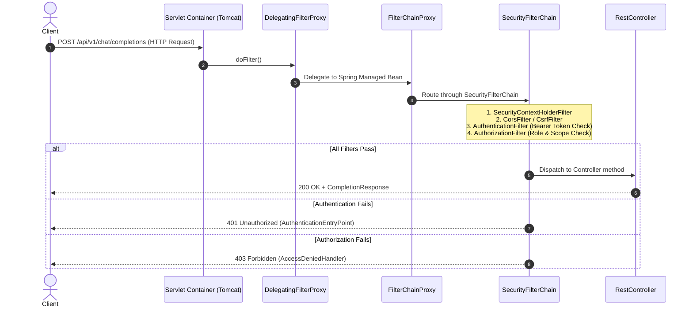

# Day 27: Security Fundamentals & Spring Security Architecture

> **"In a traditional CRUD app, an unauthenticated endpoint might leak user profiles. In a Generative AI platform, an unauthenticated endpoint allows automated bots to call `gpt-4o` or Claude in tight loops, burning through $50,000 of your company's credit card balance in an afternoon. In AI engineering, security is not a feature—it is a financial survival requirement."**

---

| Previous Day | Course Hub | Next Day |
|:---|:---:|---:|
| [Day 26: PostgreSQL pgvector — Your Vector Database](../../Phase_04_Spring_Data_JPA_Database/Day_26_PostgreSQL_pgvector_Vector_Database/Day_26_PostgreSQL_pgvector_Vector_Database.md) | [All 60 Days Overview](../../README.md) | [Day 28: JWT Authentication from Scratch](../Day_28_JWT_Authentication/Day_28_JWT_Authentication.md) |

---

## 1. Topic Overview

Spring Security 6 enforces authentication and authorization across enterprise applications using an intercepted HTTP pipeline called the `SecurityFilterChain`. In Generative AI platforms, this security architecture prevents financial denial of service (FDoS) attacks, stops unauthorized model inference, enforces multi-tenant isolation, and protects proprietary system prompts through modern, stateless lambda-configured filter chains.

---

## 2. Basic Foundations (True Zero)

### Authentication vs. Authorization
When securing any API, two fundamental questions must be answered in strict sequence:
1. **Authentication (`AuthN`) — "Who are you?"**: Validating identity credentials (passwords, JWT bearer tokens, or API keys). If validation fails, the API responds with **HTTP 401 Unauthorized**.
2. **Authorization (`AuthZ`) — "What are you allowed to do?"**: Determining whether the authenticated identity possesses the permissions or roles required to execute the requested action. If permissions are insufficient, the API responds with **HTTP 403 Forbidden**.

```
+-----------------------------------------------------------------------------------+
|               THE AIRPORT CUSTOMS & BOARDING GATE ANALOGY                         |
|                                                                                   |
|                                [ AIRPORT TERMINAL ]                               |
|                                         |                                         |
|                                         v                                         |
|             [ STEP 1: PASSPORT CONTROL (AUTHENTICATION - AuthN) ]                 |
|             "Who are you? Prove your identity with a valid passport."             |
|             Officer checks passport photo and biometric signature.                |
|                                         |                                         |
|                     +-------------------+-------------------+                     |
|                     | Pass?                                 | Fail?               |
|                     v                                       v                     |
|         Identity verified: "Alice"              401 UNAUTHORIZED                  |
|                     |                       (Turn away at the border!)            |
|                     v                                                             |
|             [ STEP 2: BOARDING GATE (AUTHORIZATION - AuthZ) ]                     |
|             "What privileges does your boarding pass grant?"                     |
|                     |                                                             |
|           +---------+-------------------------+                                   |
|           |                                   |                                   |
|           v                                   v                                   |
|   [ Economy Seat 24B ]             [ First Class / Cockpit ]                      |
|   (Granted: SCOPE_ai:chat)         (Requires: ROLE_ADMIN / PILOT)                 |
|   Access Granted to Model!         Access Denied: 403 FORBIDDEN!                  |
+-----------------------------------------------------------------------------------+
```

### Minimal Beginner-Friendly Working Code Example

Below is a self-contained Java simulation demonstrating how a security filter intercepts an incoming request, validates credentials, populates a security context, and enforces access permissions.

```java
import java.util.*;

public class BasicSecurityFilterExample {

    // Simulates Spring Security's Authentication object
    record AuthenticationToken(String principal, List<String> authorities, boolean isAuthenticated) {}

    // Simulates SecurityContextHolder using ThreadLocal storage
    static class SecurityContextHolder {
        private static final ThreadLocal<AuthenticationToken> context = new ThreadLocal<>();

        public static void setAuthentication(AuthenticationToken auth) { context.set(auth); }
        public static AuthenticationToken getAuthentication() { return context.get(); }
        public static void clearContext() { context.remove(); }
    }

    // Simulates a filter gatekeeper
    public static void executeRequest(String path, String authHeader) {
        try {
            // 1. Authentication Filter Phase
            if (authHeader != null && authHeader.startsWith("Bearer secret-token-alice")) {
                SecurityContextHolder.setAuthentication(
                    new AuthenticationToken("alice", List.of("ROLE_USER", "SCOPE_ai:chat"), true)
                );
            }

            // 2. Authorization Filter Phase
            AuthenticationToken currentAuth = SecurityContextHolder.getAuthentication();

            if (path.startsWith("/api/v1/public")) {
                System.out.println("200 OK: Public endpoint accessed successfully.");
            } else if (currentAuth == null || !currentAuth.isAuthenticated()) {
                System.out.println("401 Unauthorized: Valid credentials required to access " + path);
            } else if (path.startsWith("/api/v1/admin") && !currentAuth.authorities().contains("ROLE_ADMIN")) {
                System.out.println("403 Forbidden: User '" + currentAuth.principal() + "' lacks ROLE_ADMIN for " + path);
            } else {
                System.out.println("200 OK: User '" + currentAuth.principal() + "' successfully accessed " + path);
            }
        } finally {
            // Mandatory cleanup to prevent thread-pool memory leaks
            SecurityContextHolder.clearContext();
        }
    }

    public static void main(String[] args) {
        System.out.println("--- Test 1: Anonymous Request to Protected Chat ---");
        executeRequest("/api/v1/chat/completions", null);

        System.out.println("\n--- Test 2: Authenticated User Accessing Chat ---");
        executeRequest("/api/v1/chat/completions", "Bearer secret-token-alice");

        System.out.println("\n--- Test 3: Authenticated User Accessing Admin Deploy ---");
        executeRequest("/api/v1/admin/deploy", "Bearer secret-token-alice");
    }
}
```

#### Line-by-Line Walkthrough:
- **Lines 6–7**: `AuthenticationToken` encapsulates the principal (user identity), granted authorities (roles/scopes), and an authentication flag.
- **Lines 10–16**: `SecurityContextHolder` utilizes `ThreadLocal` to attach the identity to the executing request thread without passing credentials as explicit method parameters.
- **Lines 22–26**: Simulates an authentication filter extracting the `Authorization: Bearer` header. If valid, it binds the authenticated principal to the current thread.
- **Lines 31–37**: Simulates an authorization filter. If credentials are missing, it halts with `401 Unauthorized`. If the user is authenticated but lacks `ROLE_ADMIN`, it halts with `403 Forbidden`.
- **Line 41**: The `finally` block executes `clearContext()`, ensuring recycled server threads never leak previous credentials.

---

## 3. Core Concept Walkthrough (Basic → Intermediate)

### Spring Security 6 Architecture & Filter Chain

Spring Security sits between the Servlet Container (Tomcat) and your application controllers:



### Core Security Domain Objects

```
+-----------------------------------------------------------------------------+
|                            SecurityContextHolder                            |
|             (Static accessor: SecurityContextHolder.getContext())           |
+--------------------------------------┬--------------------------------------+
                                       | holds
                                       v
+-----------------------------------------------------------------------------+
|                               SecurityContext                               |
|                     (Bound to current request thread)                       |
+--------------------------------------┬--------------------------------------+
                                       | holds
                                       v
+-----------------------------------------------------------------------------+
|                               Authentication                                |
|  - getPrincipal(): Object (e.g. UserDetails / String username)              |
|  - getCredentials(): Object (e.g. password / token)                         |
|  - getAuthorities(): Collection<GrantedAuthority> (ROLE_ADMIN, SCOPE_ai)    |
|  - isAuthenticated(): boolean                                               |
+-----------------------------------------------------------------------------+
```

---

### Modern Spring Boot 3 Security Configuration

In Spring Boot 3 (Java 21), the legacy `WebSecurityConfigurerAdapter` class was completely removed. Security is now configured using component-based `@Bean` declarations with modern lambda DSLs:

```java
package com.example.genai.config;

import org.springframework.context.annotation.Bean;
import org.springframework.context.annotation.Configuration;
import org.springframework.security.config.annotation.web.builders.HttpSecurity;
import org.springframework.security.config.annotation.web.configuration.EnableWebSecurity;
import org.springframework.security.config.http.SessionCreationPolicy;
import org.springframework.security.web.SecurityFilterChain;

@Configuration
@EnableWebSecurity
public class SecurityConfig {

    @Bean
    public SecurityFilterChain securityFilterChain(HttpSecurity http) throws Exception {
        return http
            // 1. Disable CSRF for stateless REST APIs
            .csrf(csrf -> csrf.disable())

            // 2. Set Stateless Session Management (No JSESSIONID cookies)
            .sessionManagement(session -> 
                session.sessionCreationPolicy(SessionCreationPolicy.STATELESS)
            )

            // 3. Define URL Authorization Rules
            .authorizeHttpRequests(auth -> auth
                // Public endpoints accessible without authentication
                .requestMatchers(
                    "/api/v1/public/**",
                    "/v3/api-docs/**",
                    "/swagger-ui/**",
                    "/swagger-ui.html"
                ).permitAll()

                // Admin endpoints require ROLE_ADMIN
                .requestMatchers("/api/v1/admin/**").hasRole("ADMIN")

                // AI inference endpoints require specific granted authorities
                .requestMatchers("/api/v1/chat/**").hasAuthority("SCOPE_ai:chat")
                .requestMatchers("/api/v1/rag/**").hasAuthority("SCOPE_ai:rag")

                // All other endpoints require authentication
                .anyRequest().authenticated()
            )
            .build();
    }
}
```

---

### Enterprise RFC 7807 Exception Handlers

Spring Security should never return HTML error pages to REST clients. Enterprise APIs implement custom security entry points returning RFC 7807 `ProblemDetail` JSON objects:

#### 1. AuthenticationEntryPoint (HTTP 401)
```java
@Component
public class CustomAuthenticationEntryPoint implements AuthenticationEntryPoint {

    @Override
    public void commence(HttpServletRequest request, HttpServletResponse response, 
                         AuthenticationException authException) throws IOException {

        response.setStatus(HttpStatus.UNAUTHORIZED.value());
        response.setContentType(MediaType.APPLICATION_PROBLEM_JSON_VALUE);

        ProblemDetail pd = ProblemDetail.forStatusAndDetail(
            HttpStatus.UNAUTHORIZED.value(),
            "Full authentication credentials are required to access this AI resource"
        );
        pd.setTitle("Unauthorized");
        pd.setType(URI.create("https://api.enterprise-ai.internal/errors/unauthorized"));
        pd.setInstance(URI.create(request.getRequestURI()));

        new ObjectMapper().writeValue(response.getOutputStream(), pd);
    }
}
```

#### 2. AccessDeniedHandler (HTTP 403)
```java
@Component
public class CustomAccessDeniedHandler implements AccessDeniedHandler {

    @Override
    public void handle(HttpServletRequest request, HttpServletResponse response, 
                       AccessDeniedException accessDeniedException) throws IOException {

        response.setStatus(HttpStatus.FORBIDDEN.value());
        response.setContentType(MediaType.APPLICATION_PROBLEM_JSON_VALUE);

        ProblemDetail pd = ProblemDetail.forStatusAndDetail(
            HttpStatus.FORBIDDEN.value(),
            "You do not possess the required authorities to perform this operation"
        );
        pd.setTitle("Forbidden");
        pd.setType(URI.create("https://api.enterprise-ai.internal/errors/forbidden"));
        pd.setInstance(URI.create(request.getRequestURI()));

        new ObjectMapper().writeValue(response.getOutputStream(), pd);
    }
}
```

---

## 4. Prerequisite & Supporting Concepts

### Prerequisite / Supporting Concept: DelegatingFilterProxy & FilterChainProxy
The Servlet container (Tomcat) initializes standard Java Servlet filters before the Spring application context exists. Tomcat has no direct knowledge of Spring beans, dependency injection, or `@Configuration` classes.

`DelegatingFilterProxy` acts as the bridge. It is registered in the servlet container under the name `springSecurityFilterChain`. When an HTTP request arrives, it looks up the real Spring-managed `FilterChainProxy` bean inside the `ApplicationContext` and delegates the request to the Spring Security pipeline.

### Prerequisite / Supporting Concept: ThreadLocal Storage & Thread Recycling
`SecurityContextHolder` uses a `ThreadLocal` variable by default (`MODE_THREADLOCAL`). In standard servlet containers, Tomcat uses a thread pool to process requests. If thread `Tomcat-Worker-1` processes a request for user Alice and finishes, that thread is returned to the pool.

If `SecurityContextHolder.clearContext()` is not executed, and `Tomcat-Worker-1` is reused to process an unauthenticated request from an external attacker, the attacker inherits Alice's credentials! Spring Security's `SecurityContextHolderFilter` automatically clears this context in a `finally` block to guarantee safety.

### Prerequisite / Supporting Concept: Why CSRF is Disabled in Stateless APIs
Cross-Site Request Forgery (CSRF) exploits ambient browser authentication: browsers automatically attach stored cookies (`JSESSIONID`) to cross-origin requests.

In modern stateless REST APIs:
- Authentication is passed via custom HTTP headers: `Authorization: Bearer <jwt>`.
- Browsers never automatically attach custom authorization headers to cross-site requests.
- Since ambient credentials do not exist, CSRF attacks are physically impossible, making `.csrf(csrf -> csrf.disable())` standard and safe.

---

## 5. Advanced Depth (Intermediate → Advanced)

### Financial Denial of Service (FDoS) in AI Platforms

In traditional web applications, an unauthenticated endpoint leaks database rows or burns CPU cycles. In Generative AI, each call to an LLM provider costs real money ($0.03 to $0.15 per inference). A simple automated script executing 1,000 requests per minute will burn hundreds of dollars within minutes.

```
+-----------------------------------------------------------------------------------+
| BAD PRACTICE: Open AI Inference Endpoints                                         |
|                                                                                   |
| @PostMapping("/api/v1/chat")                                                      |
| public ChatResponse chat(@RequestBody ChatRequest request) {                      |
|     return openAiClient.generate(request.prompt()); // VULNERABLE TO FDOS!       |
| }                                                                                 |
+-----------------------------------------------------------------------------------+
| GOOD PRACTICE: Strict Scope Enforcement & Rate Limiting                           |
|                                                                                   |
| .requestMatchers("/api/v1/chat/**").hasAuthority("SCOPE_ai:chat")                 |
| // Enforces authenticated identity and granular entitlement before invoking LLM!   |
+-----------------------------------------------------------------------------------+
```

---

### Hands-On Simulation Code Walkthrough

The companion code repository demonstrates this architecture:
- `AuthenticationToken.java`: Implementation of Spring Security's `Authentication` object holding principal, credentials, and granted authorities.
- `SecurityContext.java`: Simulates `SecurityContextHolder` with `ThreadLocal` storage and mandatory cleanup.
- `SecurityFilterChainSimulator.java`: Recreates the core filter pipeline verifying `permitAll()`, `hasRole()`, and `hasAuthority()`.
- `SecurityArchitectureDemo.java`: Executable test harness verifying all 5 security scenarios.

```powershell
# Compile Day 27 code
javac Phase_05_Spring_Security/Day_27_Security_Fundamentals_Architecture/code/*.java

# Run the security demo
java -cp Phase_05_Spring_Security/Day_27_Security_Fundamentals_Architecture code.SecurityArchitectureDemo
```

#### Verified Execution Output:
```
================================================================================
 DAY 27: SPRING SECURITY FUNDAMENTALS, FILTER CHAIN & ACCESS CONTROL            
================================================================================

--- SCENARIO 1: Anonymous Access to Public Endpoint (permitAll) ---
  --> [FilterChainProxy] Intercepting GET /api/v1/public/health
      [AuthFilter] No bearer token. Marked as anonymousUser.
      [AuthzFilter] Public path matched: permitAll() -> Access Granted.
 Result: HTTP Status 200 -> {"status":"public_ok"}

--- SCENARIO 2: Anonymous Access to Protected LLM Chat Endpoint ---
  --> [FilterChainProxy] Intercepting POST /api/v1/chat/completions
      [AuthFilter] No bearer token. Marked as anonymousUser.
      [AuthzFilter] Access Denied: User is not authenticated -> 401 Unauthorized
 Result: HTTP Status 401 -> {"error":"Unauthorized","message":"Full authentication is required to access this resource"}

--- SCENARIO 3: Authenticated User (Alice) Calling Chat Endpoint ---
  --> [FilterChainProxy] Intercepting POST /api/v1/chat/completions
      [AuthFilter] Successfully authenticated: Authentication[principal='alice', authenticated=true, authorities=[SCOPE_ai:chat, ROLE_USER]]
      [AuthzFilter] Chat path matched: SCOPE_ai:chat verified -> Access Granted.
 Result: HTTP Status 200 -> {"id":"cmpl_9821","completion":"Access granted to LLM inference pipeline."}

--- SCENARIO 4: Regular User (Alice) Attempting Admin Model Configuration ---
  --> [FilterChainProxy] Intercepting POST /api/v1/admin/models/deploy
      [AuthFilter] Successfully authenticated: Authentication[principal='alice', authenticated=true, authorities=[SCOPE_ai:chat, ROLE_USER]]
      [AuthzFilter] Access Denied: Missing ROLE_ADMIN -> 403 Forbidden
 Result: HTTP Status 403 -> {"error":"Forbidden","message":"Access denied: Requires ROLE_ADMIN"}

--- SCENARIO 5: Admin User (Bob) Deploying AI Model ---
  --> [FilterChainProxy] Intercepting POST /api/v1/admin/models/deploy
      [AuthFilter] Successfully authenticated: Authentication[principal='bob', authenticated=true, authorities=[ROLE_USER, ROLE_ADMIN, SCOPE_ai:chat, SCOPE_ai:admin]]
      [AuthzFilter] Admin path matched: ROLE_ADMIN verified -> Access Granted.
 Result: HTTP Status 200 -> {"status":"admin_ok","action":"manage_model_deployments"}

================================================================================
 DAY 27 DEMONSTRATION COMPLETE: SECURITY FILTER CHAIN FULLY VERIFIED!           
================================================================================
```

---

## 6. Quick Recap

| Concept | Description | Enterprise Rule / Best Practice |
| :--- | :--- | :--- |
| **Authentication (`AuthN`)** | Verifying user identity | Fails with `401 Unauthorized`. |
| **Authorization (`AuthZ`)** | Verifying permissions/roles | Fails with `403 Forbidden`. |
| **`SecurityFilterChain`** | Pipeline of Servlet Filters | Configure via `@Bean SecurityFilterChain` with lambda DSL. |
| **`SecurityContextHolder`** | Stores `Authentication` on current thread | Always clear at the end of execution to prevent thread pool leakage. |
| **`csrf.disable()`** | Disables CSRF protection | Standard for stateless REST APIs using `Bearer` tokens. |
| **`hasRole("ADMIN")`** | Automatically checks for `"ROLE_ADMIN"` | Equivalent to `hasAuthority("ROLE_ADMIN")`. |
| **RFC 7807 `ProblemDetail`** | Standard JSON error structure | Return structured JSON rather than raw HTML on security errors. |

---

## 7. Self-Check Questions & Practice Exercises

### Conceptual & Architectural Questions

#### Q1: Why is CSRF disabled (`csrf.disable()`) in stateless REST APIs?
**Answer**: CSRF attacks rely on browsers automatically attaching saved session cookies (`JSESSIONID`) to cross-origin requests. Modern stateless REST APIs authenticate via `Authorization: Bearer <token>` headers stored in application memory. Because browsers never automatically attach custom Authorization headers to cross-origin requests, CSRF attacks cannot occur, making CSRF protection redundant.

#### Q2: Why was `WebSecurityConfigurerAdapter` removed in Spring Boot 3?
**Answer**: `WebSecurityConfigurerAdapter` forced applications into inheritance-based configuration, making it difficult to compose multiple security configurations, apply conditional filters, or maintain clean bean boundaries. Spring Security 6 replaced it with component-based `@Bean` declarations (`SecurityFilterChain`), providing superior modularity and lambda-based configuration DSLs.

#### Q3: What is the purpose of `DelegatingFilterProxy` in the Servlet Container?
**Answer**: Standard Servlet Containers (like Tomcat) initialize standard filters before the Spring `ApplicationContext` is created. `DelegatingFilterProxy` acts as a bridge: it is registered in Tomcat and intercepts incoming HTTP requests, delegating them to the Spring-managed `FilterChainProxy` bean inside the Spring context.

#### Q4: When does an application return `401 Unauthorized` versus `403 Forbidden`?
**Answer**: An application returns `401 Unauthorized` when the user has **not provided valid authentication credentials** (e.g., missing or expired token). It returns `403 Forbidden` when the user's identity is **verified and authenticated**, but they lack the required permissions or roles to access the requested resource.

#### Q5: Why is `SecurityContextHolder.clearContext()` essential in asynchronous or pooled-thread environments?
**Answer**: `SecurityContextHolder` stores authentication state in a `ThreadLocal`. In web servers using thread pools, threads are recycled across requests. If you fail to clear the security context at the end of the request, the next unrelated client request handled by that recycled thread will inherit the previous user's credentials, causing severe privilege escalation vulnerabilities.

---

### Hands-On Practice Exercises

#### Exercise 1: Custom API Key Header Authentication Filter
**Task**: In enterprise B2B setups, partner microservices call your AI gateway using an API Key header: `X-API-Key: ak_enterprise_secret_99`. Write a custom Spring `OncePerRequestFilter` that inspects this header, verifies it against a service, and populates the `SecurityContext`.

```java
// Solution:
@Component
public class ApiKeyAuthenticationFilter extends OncePerRequestFilter {

    public static final String API_KEY_HEADER = "X-API-Key";
    private final ApiKeyVerificationService apiKeyService;

    public ApiKeyAuthenticationFilter(ApiKeyVerificationService apiKeyService) {
        this.apiKeyService = apiKeyService;
    }

    @Override
    protected void doFilterInternal(HttpServletRequest request, HttpServletResponse response, 
                                    FilterChain filterChain) throws ServletException, IOException {

        String apiKey = request.getHeader(API_KEY_HEADER);

        if (apiKey != null && !apiKey.isBlank()) {
            Optional<TenantIdentity> tenant = apiKeyService.verifyApiKey(apiKey);
            if (tenant.isPresent()) {
                var authorities = List.of(
                    new SimpleGrantedAuthority("ROLE_API_CLIENT"), 
                    new SimpleGrantedAuthority("SCOPE_ai:infer")
                );
                var authentication = new PreAuthenticatedAuthenticationToken(tenant.get().tenantId(), apiKey, authorities);
                SecurityContextHolder.getContext().setAuthentication(authentication);
            }
        }

        try {
            filterChain.doFilter(request, response);
        } finally {
            SecurityContextHolder.clearContext(); // Prevent thread leak!
        }
    }
}
```

#### Exercise 2: Registering Custom Filter in `SecurityFilterChain`
**Task**: Register `ApiKeyAuthenticationFilter` to execute **before** `UsernamePasswordAuthenticationFilter` in Spring Boot 3.

```java
// Solution:
@Bean
public SecurityFilterChain securityFilterChain(HttpSecurity http, ApiKeyAuthenticationFilter apiKeyFilter) throws Exception {
    return http
        .csrf(csrf -> csrf.disable())
        .sessionManagement(s -> s.sessionCreationPolicy(SessionCreationPolicy.STATELESS))
        .addFilterBefore(apiKeyFilter, UsernamePasswordAuthenticationFilter.class)
        .authorizeHttpRequests(auth -> auth
            .requestMatchers("/api/v1/public/**").permitAll()
            .requestMatchers("/api/v1/infer/**").hasAuthority("SCOPE_ai:infer")
            .anyRequest().authenticated()
        )
        .build();
}
```

#### Exercise 3: Role vs Authority Syntax in Spring Security
**Task**: Explain the difference between `hasRole("ADMIN")` and `hasAuthority("ROLE_ADMIN")`.

```java
// Solution:
// In Spring Security:
// hasRole("ADMIN") automatically prepends the prefix "ROLE_" to the string!
// It looks for a GrantedAuthority named "ROLE_ADMIN".

// hasAuthority("ROLE_ADMIN") looks for the EXACT string match "ROLE_ADMIN".
// hasAuthority("SCOPE_ai:chat") looks for the exact permission string.

// Therefore:
// .hasRole("ADMIN") is equivalent to .hasAuthority("ROLE_ADMIN")
```

---

| Previous Day | Course Hub | Next Day |
|:---|:---:|---:|
| [Day 26: PostgreSQL pgvector — Your Vector Database](../../Phase_04_Spring_Data_JPA_Database/Day_26_PostgreSQL_pgvector_Vector_Database/Day_26_PostgreSQL_pgvector_Vector_Database.md) | [All 60 Days Overview](../../README.md) | [Day 28: JWT Authentication from Scratch](../Day_28_JWT_Authentication/Day_28_JWT_Authentication.md) |
