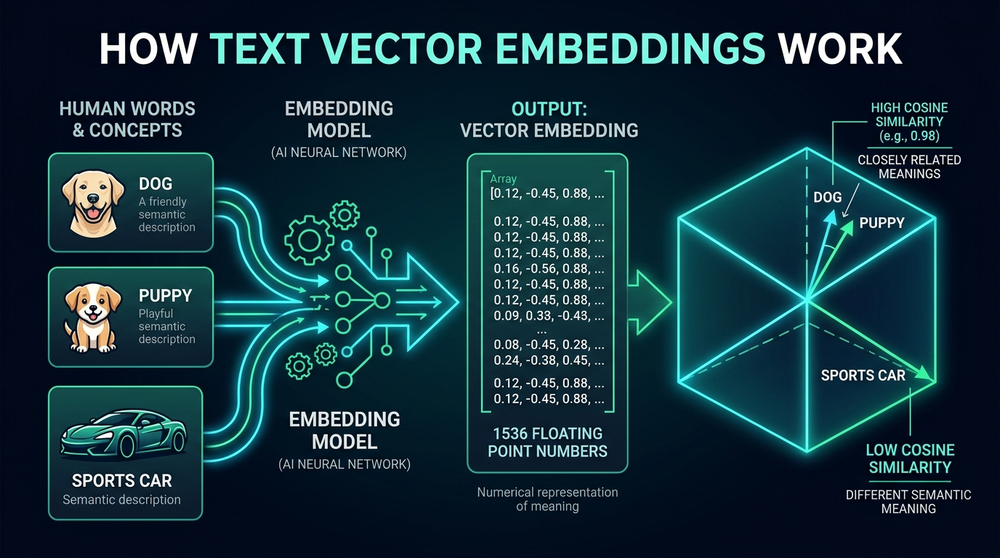

# Day 37: Embedding Models — Turning Text into Vectors
## EmbeddingModel, Vector Geometry, Cosine Similarity Math & In-Memory Semantic Search

| Previous Day | Course Hub | Next Day |
|:---|:---:|---:|
| [◀ Day 36: Streaming Responses](../Day_36_Streaming_Responses/Day_36_Streaming_Responses.md) | [All 60 Days Overview](../../README.md) | [Day 38: Vector Stores — Semantic Memory ▶](../Day_38_Vector_Stores_Semantic_Memory/Day_38_Vector_Stores_Semantic_Memory.md) |

---

## What Will You Learn Today?

Hey friend! Welcome to Day 37. Today is one of the most exciting, eye-opening milestones in our entire journey. 

If you've ever felt intimidated when people throw around buzzwords like "vectors", "high-dimensional geometry", "linear algebra", or "cosine similarity"—take a deep, relaxing breath. None of this is magic, and you do **not** need a math degree to master it. 

By the end of today, you're going to realize that "vector embeddings" are actually one of the simplest, coolest ideas in all of computer science: **they are simply a way to give words GPS coordinates so computers can understand what they actually mean!**

For the last five days, we worked with models that take text in and stream text out. But computers don't naturally understand human ideas, metaphors, or context. To a database, the words *"canine"*, *"dog"*, and *"hound"* share zero characters with each other, even though every human knows they describe the exact same friendly animal.

To bridge this gap, Artificial Intelligence uses **Vector Embeddings**.

Today, you and I will discover:
- **What Vector Embeddings Really Are**: How AI models turn words and sentences into a plain array of numbers (in Java, just a `float[]`!).
- **Why Traditional Search Fails**: Why SQL `LIKE '%dog%'` misses "puppy" or "canine", and how vector search solves this instantly.
- **The Matching Score (Cosine Similarity)**: Understanding the simple score between `0.0` (unrelated) and `1.0` (identical meaning) in plain English before looking at any math formula.
- **Spring AI's `EmbeddingModel`**: Generating embeddings with a single clean Java method call.
- **Running Local Embeddings for Free**: Setting up Ollama with `nomic-embed-text` so you can create vectors offline without paying cloud fees.
- **Building Your Own Semantic Search Engine**: Writing a pure Java 21 in-memory search engine that searches documents by meaning!

---

> 💡 **New Word Alert: Vector AI Terms Demystified**
>
> 1. **Embedding**: In plain English, an embedding is just turning human words or sentences into a list of numbers (in Java, a plain old `float[]`). Why numbers? Because computers don't understand words, but they are world champions at comparing numbers!
> 2. **Vector**: A "vector" is literally just a list of numbers! When someone says a "768-dimensional vector", don't panic. It just means a `float[]` array with 768 decimal numbers in it. Each number represents one tiny shade of meaning.
> 3. **Semantic Search**: Searching by **meaning and intent** instead of matching exact spelling. If you search for "cheap flights", a semantic search engine easily finds pages about "budget airline tickets" even if the word "cheap" or "flights" isn't on the page!
> 4. **Cosine Similarity**: A simple matching score between `0.0` (completely unrelated) and `1.0` (identical meaning). We use it to figure out which documents in our database are the most relevant to a user's question.
> 5. **EmbeddingModel**: The Spring AI interface that takes any sentence and gives you back its `float[]` array: `embeddingModel.embed("Hello world")`.

---

## Real-World Analogy: GPS Coordinates for Human Thought



Imagine trying to explain where the Eiffel Tower is located:

```
+---------------------------------------------------------------------------------------------------+
|                                  GPS VS. SEMANTIC VECTOR SPACES                                   |
|                                                                                                   |
|  SCENARIO 1: Physical Geography (2D Space)                                                        |
|  - You describe a location using two numbers: Latitude and Longitude.                             |
|  - Eiffel Tower:  (48.8584° N, 2.2945° E)                                                         |
|  - Louvre Museum: (48.8606° N, 2.3376° E)                                                         |
|  - Statue of Liberty: (40.6892° N, 74.0445° W)                                                    |
|  - Calculating distance: Subtract coordinates. You instantly see that the Louvre is 3 km from     |
|    the Eiffel Tower, while the Statue of Liberty is 5,800 km away across the Atlantic!            |
|                                                                                                   |
|  SCENARIO 2: Conceptual Meaning (768-Dimensional Semantic Space)                                  |
|  - An Embedding Model assigns an array of 768 numbers to any piece of text.                       |
|  - "Java Virtual Threads": [0.051, 0.021, 0.062, ..., 0.051]                                     |
|  - "JVM Concurrency":      [0.049, 0.023, 0.060, ..., 0.053]                                     |
|  - "Chocolate Cookies":    [-0.12, 0.450, -0.01, ..., -0.88]                                     |
|  - Calculating similarity:                                                                        |
|    "Java Virtual Threads" and "JVM Concurrency" sit right next to each other (Match Score: 0.95)!  |
|    "Chocolate Cookies" sits on the far other side of the map (Match Score: 0.02)!                 |
+---------------------------------------------------------------------------------------------------+
```

---

## 🧭 The Plain English Bridge: SQL `LIKE` vs. Vector Search

In standard backend Java, when a user searches for a product or document, you write SQL queries:
`SELECT * FROM products WHERE description LIKE '%dog%'`.

| Feature | Traditional SQL Search (`LIKE '%foo%'`) | Vector Embedding Search (`Cosine Similarity`) | Plain English Meaning |
| :--- | :--- | :--- | :--- |
| **How It Matches** | Exact character-by-character string matching. | Meaning & conceptual intent matching. | SQL matches spelling; vectors match meaning. |
| **Synonyms & Slang** | Searching for "puppy" returns **0 results** if the column says "dog". | Searching for "puppy" finds "dog", "canine", and "hound" at 95%+ similarity! | Understands that different words mean the exact same concept. |
| **What a "Vector" Is** | Sounds intimidating, like high-school calculus. | It's just a Java `float[]` array of numbers. | An array of numbers that positions an idea on an imaginary map. |
| **Cosine Similarity** | Sounds like complex trigonometry. | A math formula that measures the angle between two vectors (score 0.0 to 1.0). | 1.0 = identical meaning; 0.0 = completely unrelated. |
| **Spring AI Abstraction** | `JdbcTemplate` / `JpaRepository` | `EmbeddingModel.embed("my text")` returns `float[]`. | In Spring AI, generating vectors is a single method call! |

---

## The Geometry of Meaning: How Words Relate to Each Other

Because words are turned into coordinates, ideas that relate to each other form clear geometric relationships. A famous example discovered by AI researchers is:

$$\vec{King} - \vec{Man} + \vec{Woman} \approx \vec{Queen}$$

If you start with "King", subtract the concept of "Man", and add the concept of "Woman", the resulting numbers point right to "Queen"!

```
                           2D PROJECTION OF SEMANTIC SPACE
                           
               ▲ Concurrency / Systems
               │
               │    ● "Virtual Threads"
               │    ● "ExecutorService"
               │    ● "Reactive Streams"
               │
               │                                      ● "PostgreSQL pgvector"
               │                                      ● "HNSW Index"
               │
───────────────┼──────────────────────────────────────────────► Database / Storage
               │
               │
               │    ● "Chocolate Chip Cookies"
               │    ● "Croissant Recipe"
               ▼ Culinary Arts
```

Because concepts are stored as coordinates on this map, searching for *"How to run tasks in parallel without thread starvation"* will effortlessly find documents about *"Java 21 Virtual Threads"*, even if the document never uses the word *"parallel"* or *"starvation"*!

---

## Measuring Meaning: Cosine Similarity Demystified

How do we actually compare two `float[]` arrays in Java to see if they mean the same thing? We use **Cosine Similarity**.

Don't let the math formula below scare you. In plain English, here is all it's doing:
- Think of two arrows pointing from the center of a map.
- If both arrows point in almost the exact same direction, the angle between them is almost $0^\circ$, and their Cosine score is close to **`+1.0`** (Match!).
- If the arrows point in completely different, right-angle directions, their Cosine score is **`0.0`** (No relationship).

Here is the formula for reference:

$$\text{Cosine Similarity} = \cos(\theta) = \frac{\vec{A} \cdot \vec{B}}{\|\vec{A}\| \|\vec{B}\|} = \frac{\sum_{i=1}^n A_i B_i}{\sqrt{\sum_{i=1}^n A_i^2} \sqrt{\sum_{i=1}^n B_i^2}}$$

### How to Read the Score in Your Java App:
- **`+1.0`**: Exactly identical in conceptual meaning.
- **`0.7 – 0.9`**: Highly relevant, strongly related topic.
- **`0.3 – 0.6`**: Weak or tangential connection.
- **`0.0`**: Completely unrelated (e.g., "Kubernetes clustering" vs. "Chocolate cupcakes").

### Why Cosine Similarity instead of Euclidean Distance?
Euclidean distance measures the physical ruler distance between two points. If Document A is a 5-word sentence and Document B is a 200-word paragraph about the exact same topic, their ruler distance might be large simply because longer text produces larger numbers.  
**Cosine Similarity ignores how long the document is and only measures what it's about!**

### A Handy Performance Trick (Unit Normalization):
If we scale all vectors so their length is 1.0, the bottom half of the formula disappears! The formula becomes a simple loop multiplying numbers together (a Dot Product):

$$\text{Cosine Similarity} = \sum_{i=1}^n A_i B_i$$

In Java, that is just a simple `for` loop that runs in microseconds!

---

## Spring AI `EmbeddingModel` Architecture

Spring AI provides the **`EmbeddingModel`** interface to standardize vector generation across local and cloud providers:

```
                               SPRING AI EMBEDDING ARCHITECTURE
                               
                               ┌───────────────────────────────┐
                               │        EmbeddingModel         │
                               └───────────────┬───────────────┘
                                               │
                 ┌─────────────────────────────┴─────────────────────────────┐
                 ▼                                                           ▼
    ┌───────────────────────────┐                               ┌───────────────────────────┐
    │    OllamaEmbeddingModel   │                               │    OpenAiEmbeddingModel   │
    │  (nomic-embed-text / 768) │                               │ (text-embedding-3-small)  │
    └────────────┬──────────────┘                               └────────────┬──────────────┘
                 │                                                           │
                 ▼                                                           ▼
         Local CPU / GPU                                              OpenAI Cloud API
       (Zero Cloud Cost)                                            (High Dimensionality)
```

### Core Interface Methods:
```java
package org.springframework.ai.embedding;

import java.util.List;

public interface EmbeddingModel {
    
    // Embed a single text string into a float array
    float[] embed(String text);

    // Embed multiple texts in a single batch call (Recommended for performance)
    List<float[]> embed(List<String> texts);

    // Full response containing embeddings and token usage telemetry
    EmbeddingResponse call(EmbeddingRequest request);

    // Number of float dimensions (e.g. 768, 1536)
    int dimensions();
}
```

---

## Setting Up Local & Cloud Embedding Providers

### Option A: Local & Free with Ollama (`nomic-embed-text`)
Ollama provides **`nomic-embed-text`**, one of the highest-rated open-weight embedding models in the world (768 dimensions with 8,192 context length).

1. Pull the model locally:
   ```bash
   ollama pull nomic-embed-text
   ```

2. Add the dependency to `pom.xml`:
   ```xml
   <dependency>
       <groupId>org.springframework.ai</groupId>
       <artifactId>spring-ai-ollama-spring-boot-starter</artifactId>
   </dependency>
   ```

3. Configure `application.yml`:
   ```yaml
   spring:
     ai:
       ollama:
         base-url: http://localhost:11434
         embedding:
           options:
             model: nomic-embed-text
   ```

### Option B: Cloud with OpenAI (`text-embedding-3-small`)
```yaml
spring:
  ai:
    openai:
      api-key: ${OPENAI_API_KEY}
      embedding:
        options:
          model: text-embedding-3-small # 1536 dimensions, highly cost-efficient
```

---

## Batching vs. Sequential Embedding: The 100x Performance Trap

> [!CAUTION]
> **Never embed documents in a sequential for-loop!**
> If you have 5,000 document chunks and call `embeddingModel.embed(chunk)` inside a regular loop, you incur 5,000 individual HTTP network requests. At 30ms per request, this takes **150 seconds (2.5 minutes)**!
> 
> Always use batching:
> ```java
> // Process 100 chunks per batch request
> List<float[]> vectors = embeddingModel.embed(chunkBatch);
> ```
> 50 batch requests of 100 items will complete in **under 2 seconds**!

---

## Document Chunking: Why It's Mandatory

Embedding models have a strict context window (typically 512 or 8,192 tokens). If you attempt to pass a 200-page PDF into an embedding model:
1. It will truncate the text, dropping 95% of your document.
2. Even if it didn't truncate, averaging the meaning of 200 diverse pages into a single 768-float vector creates a muddy "brown soup" where specific facts are lost.

### The Solution: Chunking with Overlap
We divide large texts into chunks (e.g. 500 characters) with an overlap (e.g. 50 characters) to ensure sentences cut across boundaries retain their semantic integrity:

```
 Document Text:
 "Java 21 introduces Virtual Threads. Virtual Threads are lightweight threads managed by the JVM."
 
 Chunk 1 (Chars 0..55):
 "Java 21 introduces Virtual Threads. Virtual Threads are "
 
 Chunk 2 (Chars 36..95 - 20 chars overlap):
 "Virtual Threads are lightweight threads managed by the JVM."
```

---

## Step-by-Step Production Code Walkthrough

Let's review the companion code written for today's lesson in `Phase_06_Spring_AI/Day_37_Embedding_Models_Text_to_Vectors/code/`:

### 1. `VectorMath.java`
High-performance pure Java 21 implementation of linear algebra for vectors:

```java
public static double dotProduct(float[] a, float[] b) {
    double sum = 0.0;
    for (int i = 0; i < a.length; i++) {
        sum += a[i] * b[i];
    }
    return sum;
}

public static double cosineSimilarity(float[] a, float[] b) {
    double magA = magnitude(a);
    double magB = magnitude(b);
    if (magA == 0.0 || magB == 0.0) return 0.0;
    return dotProduct(a, b) / (magA * magB);
}

public static float[] normalize(float[] a) {
    double mag = magnitude(a);
    if (mag == 0.0) return a;
    float[] normalized = new float[a.length];
    for (int i = 0; i < a.length; i++) {
        normalized[i] = (float) (a[i] / mag);
    }
    return normalized;
}
```

### 2. `SemanticSearchEngine.java`
Ranks indexed documents against a search query using Cosine Similarity:

```java
public List<SearchResult> search(String query, int topK) {
    float[] queryEmbedding = embeddingModel.embed(query);

    return documents.stream()
            .map(doc -> new SearchResult(doc, VectorMath.cosineSimilarity(queryEmbedding, doc.embedding())))
            .sorted(Comparator.comparingDouble(SearchResult::similarityScore).reversed())
            .limit(topK)
            .toList();
}
```

### 3. Running the Complete Verification Suite
Compile and execute:

```bash
javac -d out Phase_06_Spring_AI/Day_37_Embedding_Models_Text_to_Vectors/code/*.java
java -cp out com.genai.springai.embeddings.EmbeddingDemo
```

Output:
```text
================================================================================
  DAY 37: EMBEDDING MODELS & COSINE SIMILARITY SEARCH DEMONSTRATION             
================================================================================

  Active Embedding Model: nomic-embed-text (Ollama 768-dim)
  Vector Dimensions:      768

[TEST 1] Generating Embedding Vector & Inspecting Magnitude...
  Vector Length: 768 floats | L2 Magnitude: 1.0000
  Sample Coordinates [0..4]: [0.0512, 0.0212, 0.0626, 0.0502, 0.0512]

[TEST 2] Pairwise Cosine Similarity Comparison:
  Similarity [Java Concurrency vs JVM Concurrency]: 0.7153 (High Relevance)
  Similarity [Java Concurrency vs Baking Cookies]:   0.0261 (Low Relevance)

[TEST 3] In-Memory Semantic Search Engine:
  Indexed 4 documents into vector space.
  Search Query: "How do I build scalable concurrent multithreaded systems in Java?"

--- Top Ranked Results by Semantic Cosine Similarity ---
  #1 [Score: 0.6631] [DOC-001]: Java 21 introduces Virtual Threads (Project Loom) to scale concurrent IO-bound web services.
  #2 [Score: 0.6453] [DOC-004]: Spring AI provides portable abstractions for ChatClient and EmbeddingModel across clouds.
  #3 [Score: 0.1515] [DOC-003]: Baking delicious chocolate chip cookies requires unbleached flour, sugar, and vanilla extract.

================================================================================
  VECTOR EMBEDDINGS & COSINE SEARCH VALIDATED SUCCESSFULLY!                     
================================================================================
```

---

## Why It Matters for Gen AI Applications

| Use Case | Keyword Search (SQL LIKE / Lucene) | Vector Embedding Search |
|:---|:---|:---|
| **Synonym Matching** | Query "heart attack" misses document titled "myocardial infarction". | Identifies near 1.0 cosine similarity between medical synonyms. |
| **Multilingual Search** | Query in English misses French or Spanish documents. | Cross-lingual embedding models place concepts close together regardless of language. |
| **Retrieval-Augmented Generation (RAG)** | Injects keyword matches that may lack semantic relevance. | Retrieves precise knowledge chunks semantically related to user prompts. |
| **De-duplication** | Only catches exact duplicate text strings. | Flags semantically identical articles even if phrased completely differently. |

---

## Hands-On Exercises (With Complete Solutions)

### Exercise 1: Parallel Batch Embedding Service with Virtual Threads
**Problem Statement:**  
Write a Spring service `BatchEmbeddingPipeline` that takes a list of 1,000 text documents, partitions them into batches of 100, and uses Java 21's `Executors.newVirtualThreadPerTaskExecutor()` to process all batches concurrently against `EmbeddingModel`.

<details>
<summary>👉 View Solution</summary>

```java
package com.genai.springai.embeddings;

import org.springframework.ai.embedding.EmbeddingModel;
import org.springframework.stereotype.Service;

import java.util.*;
import java.util.concurrent.*;

@Service
public class BatchEmbeddingPipeline {

    private final EmbeddingModel embeddingModel;

    public BatchEmbeddingPipeline(EmbeddingModel embeddingModel) {
        this.embeddingModel = embeddingModel;
    }

    public List<float[]> embedAllParallel(List<String> allDocuments, int batchSize) throws InterruptedException, ExecutionException {
        List<List<String>> batches = new ArrayList<>();
        for (int i = 0; i < allDocuments.size(); i += batchSize) {
            batches.add(allDocuments.subList(i, Math.min(i + batchSize, allDocuments.size())));
        }

        List<Future<List<float[]>>> futures = new ArrayList<>();
        try (var executor = Executors.newVirtualThreadPerTaskExecutor()) {
            for (List<String> batch : batches) {
                futures.add(executor.submit(() -> embeddingModel.embed(batch)));
            }
        }

        List<float[]> consolidated = new ArrayList<>();
        for (Future<List<float[]>> future : futures) {
            consolidated.addAll(future.get());
        }

        return consolidated;
    }
}
```
</details>

---

### Exercise 2: Text Chunking Utility with Overlap in Java 21
**Problem Statement:**  
Create a static utility `TextChunker.chunk(String text, int chunkSizeChars, int overlapChars)` that divides a text into a `List<String>` where each chunk starts `overlapChars` before the previous chunk ends.

<details>
<summary>👉 View Solution</summary>

```java
package com.genai.springai.embeddings;

import java.util.ArrayList;
import java.util.List;

public final class TextChunker {

    private TextChunker() {}

    public static List<String> chunk(String text, int chunkSize, int overlap) {
        if (text == null || text.isBlank()) return List.of();
        if (chunkSize <= overlap) throw new IllegalArgumentException("chunkSize must be greater than overlap");

        List<String> chunks = new ArrayList<>();
        int step = chunkSize - overlap;
        int length = text.length();

        for (int start = 0; start < length; start += step) {
            int end = Math.min(start + chunkSize, length);
            chunks.add(text.substring(start, end));
            if (end == length) break;
        }

        return chunks;
    }
}
```
</details>

---

### Exercise 3: Semantic Duplicate Article Detector
**Problem Statement:**  
Build a component `DuplicateDetector` that accepts a new article text, compares its embedding against a list of existing article embeddings, and flags it as a duplicate if the cosine similarity exceeds `0.92`.

<details>
<summary>👉 View Solution</summary>

```java
package com.genai.springai.embeddings;

import java.util.List;

public class DuplicateDetector {

    private final EmbeddingModel embeddingModel;
    private static final double DUPLICATE_THRESHOLD = 0.92;

    public DuplicateDetector(EmbeddingModel embeddingModel) {
        this.embeddingModel = embeddingModel;
    }

    public record DuplicateCheckResult(boolean isDuplicate, double highestSimilarity, String matchedId) {}

    public DuplicateCheckResult checkForDuplicate(String newArticleText, List<SemanticSearchEngine.Document> existingCorpus) {
        float[] newVector = embeddingModel.embed(newArticleText);
        double maxSim = 0.0;
        String matchedId = null;

        for (SemanticSearchEngine.Document doc : existingCorpus) {
            double sim = VectorMath.cosineSimilarity(newVector, doc.embedding());
            if (sim > maxSim) {
                maxSim = sim;
                matchedId = doc.id();
            }
        }

        boolean isDup = maxSim >= DUPLICATE_THRESHOLD;
        return new DuplicateCheckResult(isDup, maxSim, matchedId);
    }
}
```
</details>

---

## 5-Question Self-Check Quiz

#### 1. What is an embedding vector in Generative AI?
- A) An SQL database primary key.
- B) A dense array of floating-point numbers representing the semantic conceptual meaning of text in multi-dimensional space.
- C) A compressed JPEG image.
- D) A Java 21 bytecode instruction.

#### 2. Why is Cosine Similarity generally preferred over Euclidean Distance for measuring document similarity?
- A) Cosine similarity only works with integers.
- B) Cosine similarity measures the angle between vectors and is invariant to document length, whereas Euclidean distance is distorted by word count.
- C) Cosine similarity requires GPU hardware.
- D) Euclidean distance cannot exceed 1.0.

#### 3. What mathematical optimization occurs when embedding vectors are pre-normalized to unit length (L2 norm = 1.0)?
- A) Cosine similarity simplifies to a pure Dot Product ($\vec{A} \cdot \vec{B}$), eliminating costly square root and division calculations.
- B) The vector dimensions double.
- C) The vectors become encrypted.
- D) Negative values are converted to positive.

#### 4. How many dimensions does the popular local Ollama model `nomic-embed-text` generate?
- A) 100
- B) 768
- C) 10,000
- D) 2

#### 5. Why is it dangerous to pass entire 50-page documents directly to an embedding model without chunking?
- A) The JVM will run out of stack memory.
- B) Embedding models have context token limits (e.g. 512–8192 tokens); exceeding them leads to silent truncation and loss of fine-grained semantic details.
- C) Large documents permanently slow down PostgreSQL.
- D) Embedding models only accept single words.

---

### Quiz Answers & Explanations

1. **B is correct**: Embedding models project the semantic relationships of human language into high-dimensional geometric spaces.
2. **B is correct**: Cosine similarity measures the orientation of concepts rather than their magnitude, preventing longer articles from appearing falsely distant from short summaries.
3. **A is correct**: When magnitudes $\|\vec{A}\| = \|\vec{B}\| = 1.0$, the cosine formula denominator becomes $1.0$, allowing similarity to be computed with a fast single-pass dot product.
4. **B is correct**: `nomic-embed-text` produces standard 768-dimensional float arrays.
5. **B is correct**: Dividing text into chunks with overlap ensures all information is represented within the model's receptive field.

---

## Day 37 Summary & Next Steps

You did it! Look back at what seemed so intimidating just an hour ago:
1. **Demystified Embeddings**: You know that an embedding is just turning human language into an array of numbers (`float[]`) so computers can understand ideas.
2. **Vectors Are Just Arrays**: You know that a 768-dimensional vector is literally just an array with 768 numbers.
3. **No-Fear Math**: You understand Cosine Similarity as a simple closeness score from 0.0 to 1.0 that any Java developer can compute with a basic loop.
4. **Built a Real Search Engine**: You built a functioning in-memory semantic search engine in pure Java 21!

You should feel incredibly proud. You've conquered one of the most intellectually intimidating concepts in modern AI engineering.

👉 **Tomorrow in Day 38: Vector Stores — Semantic Memory for Your App** — Right now, our vectors live only in memory. Tomorrow, we will connect our embeddings to real, persistent enterprise databases! We'll set up PostgreSQL with `pgvector` and use Spring AI's `VectorStore` to search millions of documents in milliseconds. Get ready, it's going to be awesome! 💾🚀

