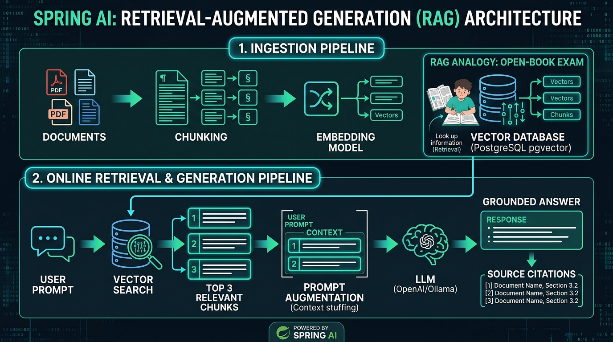

# Day 39: RAG — Retrieval-Augmented Generation
## The 5-Stage RAG Pipeline, QuestionAnswerAdvisor, Context Stuffing & Anti-Hallucination Guardrails

| Previous Day | Course Hub | Next Day |
|:---|:---:|---:|
| [◀ Day 38: Vector Stores](../Day_38_Vector_Stores_Semantic_Memory/Day_38_Vector_Stores_Semantic_Memory.md) | [All 60 Days Overview](../../README.md) | [Day 40: Advanced RAG — Query Transformation & Re-Ranking ▶](../Day_40_Advanced_RAG_Query_ReRanking/Day_40_Advanced_RAG_Query_ReRanking.md) |

---

## What Will You Learn Today?

Hey friend! Welcome to Day 39. Today is the day where everything we've worked on comes together to build the single most valuable system in modern enterprise AI: **Retrieval-Augmented Generation (RAG)**!

If you ask a raw, out-of-the-box Large Language Model: *"What was our company's Q3 net revenue?"* or *"What is our enterprise VPN setup guide?"*, the model will do one of two things:
1. Apologize and say it doesn't know because it was only trained on public internet data from the past.
2. Even worse: Confidently make up believable-sounding, totally fake numbers and IP addresses! In software engineering, this is known as an **AI Hallucination**.

To solve this, modern systems use **RAG**. 

If the acronym "RAG" sounds like complicated machine learning plumbing, take a breath. In plain English, RAG is simply turning a scary closed-book exam into an **open-book exam for your AI**!

Today, you and I will master **RAG** in Java 21 and Spring AI:
- **The Core Idea of RAG**: Why giving the AI an open book beats spending millions of dollars on "fine-tuning" models.
- **The 5-Stage RAG Pipeline**: Ingestion, Chunking, Embedding, Vector Storage, and Grounded Generation.
- **Spring AI's `QuestionAnswerAdvisor`**: How Spring AI lets you add complete, production-grade RAG to `ChatClient` with just a single line of Java!
- **Engineering Anti-Hallucination Guardrails**: Teaching the AI to say *"I don't know based on the provided documents"* instead of making things up.
- **Building a Complete End-to-End RAG Microservice**: Ingesting real documents, storing them in PostgreSQL `pgvector`, and letting users ask questions grounded in real facts!

---

> 💡 **New Word Alert: RAG Terms Demystified**
>
> 1. **RAG (Retrieval-Augmented Generation)**: Giving the AI an open book! Instead of asking the AI to guess the answer from memory, your server first *retrieves* the exact relevant pages from your database, *augments* the prompt with those pages, and lets the AI *generate* the answer using those verified facts.
> 2. **Hallucination**: When an AI doesn't know an answer, but instead of saying "I don't know," it invents a totally fake "fact" or number that sounds deceptively real. RAG eliminates hallucinations by giving the AI the real facts to read!
> 3. **Fine-Tuning vs. RAG**:
>    - *Fine-Tuning*: Spending thousands of dollars and weeks of time retraining an AI model on your company's data. If a policy changes tomorrow, your model is outdated again.
>    - *RAG*: Giving the AI a live search engine to your documents. When a document changes, you update your database in 1 second, and the AI immediately knows the new information for free!
> 4. **Context Window**: The maximum amount of text an AI can read at one time in a single prompt. Think of it like the size of the AI's desk—you can only place a few pages on the desk at once.
> 5. **QuestionAnswerAdvisor**: Spring AI's brilliant built-in advisor that does the entire RAG flow automatically inside `ChatClient` with a single line of Java!

---

## Real-World Analogy: Open-Book Exam vs. Closed-Book Exam



Imagine taking a doctoral-level medical board exam:

```
+---------------------------------------------------------------------------------------------------+
|                                  THE OPEN-BOOK VS. CLOSED-BOOK PARADIGM                           |
|                                                                                                   |
|  SCENARIO 1: Closed-Book Exam (Vanilla LLM / Model Fine-Tuning)                                   |
|  - The doctor must rely entirely on what they memorized 2 years ago during medical school.        |
|  - If asked about a new drug approved yesterday, or rare dosage interactions, they might guess    |
|    or mix up symptoms from memory.                                                                |
|  - Result: High risk of hallucination and medical malpractice!                                    |
|                                                                                                   |
|  SCENARIO 2: Open-Book Exam with an Instant Research Assistant (RAG Pipeline)                     |
|  - When a difficult symptom is presented, an assistant immediately opens the latest 2026 medical  |
|    encyclopedia, pulls the exact 3 relevant clinical trial pages, and lays them on the desk.      |
|  - The doctor reads the verified pages, synthesizes the facts, and prescribes the exact drug      |
|    citing the textbook page: [SOURCE: Page 412, NEJM 2026].                                      |
|  - Result: 100% factual accuracy, verifiable auditability, zero guessing!                         |
+---------------------------------------------------------------------------------------------------+
```

- **Fine-Tuning** is like sending an employee to school for 6 months: expensive, slow, and their knowledge is frozen the day they graduate.
- **RAG** is giving that employee an instant search engine to your company's live knowledge base: updated in real time, 100% verifiable, and zero cloud training costs!

---

## 🧭 The Plain English Bridge: How RAG Maps to Standard Java Architecture

If RAG sounds like an obscure AI machine learning acronym, here is how it maps directly to classic Java enterprise web services:

| RAG Term | Classic Java Web Architecture Equivalent | Plain English Meaning |
| :--- | :--- | :--- |
| **Ingestion Pipeline** | Batch ETL job (Spring Batch) reading CSVs/PDFs into a database. | Slurping documents, splitting them into paragraphs, and saving them. |
| **Chunking** | Splitting a large text file into smaller substrings (e.g. 500 characters). | Breaking a 100-page manual into bite-sized paragraphs so search stays accurate. |
| **Vector Store** | A PostgreSQL database table with a special column (`vector(1536)`). | A database table optimized for similarity queries instead of `id = ?`. |
| **Retrieval** | A SQL query: `SELECT * FROM chunks ORDER BY similarity DESC LIMIT 3`. | Finding the 3 most relevant paragraphs to the user's question. |
| **Augmentation (Context Stuffing)**| Creating a prompt string: `String prompt = "Context: " + docs + "\nQuestion: " + userQ;` | Gluing the found paragraphs into the prompt so the LLM has the answers right in front of it. |
| **`QuestionAnswerAdvisor`** | A Spring HTTP Filter or AOP interceptor (`@Around`). | Automatically intercepts your `ChatClient` call, runs vector search, injects context, and passes it to the LLM. |

---

## The 3 Fundamental Flaws of Vanilla LLMs Solved by RAG

```
┌─────────────────────────────────────────────────────────────────────────────────────────────────┐
│                              THE 3 LLM FLAWS AND HOW RAG SOLVES THEM                            │
├───────────────────────┬─────────────────────────────────┬───────────────────────────────────────┤
│ The LLM Flaw          │ Without RAG                     │ With Spring AI RAG Pipeline           │
├───────────────────────┼─────────────────────────────────┼───────────────────────────────────────┤
│ 1. Hallucinations     │ Fabricates convincing false     │ Constrained strictly to retrieved     │
│                       │ facts, APIs, and policies.      │ factual context; cites sources.       │
├───────────────────────┼─────────────────────────────────┼───────────────────────────────────────┤
│ 2. Knowledge Cutoff   │ Blind to any events or data     │ Queries live, up-to-the-minute vector │
│                       │ created after pretraining date. │ stores updated milliseconds ago.      │
├───────────────────────┼─────────────────────────────────┼───────────────────────────────────────┤
│ 3. Proprietary Data   │ Cannot access your internal     │ Securely stores enterprise wikis and  │
│    Privacy & Security │ PDFs, Jira tickets, or DBs.     │ code in PostgreSQL pgvector; only     │
│                       │                                 │ relevant snippets sent to LLM at run. │
└───────────────────────┴─────────────────────────────────┴───────────────────────────────────────┘
```

---

## The 5-Phase End-to-End RAG Architecture

A production RAG system consists of two distinct data pipelines:
1. **The Ingestion Pipeline (Offline / Background Batch)**
2. **The Retrieval & Generation Pipeline (Online / Real-time User Request)**

```
====================================================================================================
                             PHASE A: OFFLINE INGESTION PIPELINE
====================================================================================================

 ┌───────────────────┐     ┌───────────────────┐     ┌───────────────────┐     ┌───────────────────┐
 │  DocumentReader   │ ──► │ TokenTextSplitter │ ──► │  EmbeddingModel   │ ──► │    VectorStore    │
 │ (PDF / Confluence)│     │(Chunks with 50-ov)│     │(nomic-embed / 768)│     │(PostgreSQL pgvect)│
 └───────────────────┘     └───────────────────┘     └───────────────────┘     └───────────────────┘

====================================================================================================
                        PHASE B: ONLINE RETRIEVAL & GENERATION PIPELINE
====================================================================================================

 User Question: "What is our P0 outage response time?"
         │
         ▼
┌──────────────────┐
│  EmbeddingModel  │ ──► Generates Query Vector: [0.051, 0.021, ...]
└────────┬─────────┘
         │
         ▼
┌──────────────────┐
│   VectorStore    │ ──► Executes Cosine Distance (<=>) search in pgvector
└────────┬─────────┘
         │
         ▼ Returns Top-K Relevant Document Chunks
┌────────────────────────────────────────────────────────────────────────┐
│ Context Augmentation Envelope                                          │
│                                                                        │
│ <system_directive>                                                     │
│   Answer strictly using only the <context> below. Cite sources.        │
│ </system_directive>                                                    │
│ <context>                                                              │
│   <document id="DOC-SLA-01">                                           │
│     P0 outages require an initial engineer response under 15 minutes.  │
│   </document>                                                          │
│ </context>                                                             │
│ <question>What is our P0 outage response time?</question>              │
└───────────────────────────────────┬────────────────────────────────────┘
                                    │
                                    ▼
┌──────────────────┐
│    ChatClient    │ ──► Calls LLM (GPT-4o / Llama 3.2)
└────────┬─────────┘
         │
         ▼
 Grounded Answer: "According to our SLA, P0 critical outages require an initial
                   response under 15 minutes. [SOURCE: DOC-SLA-01]"
```

---

## Spring AI's `QuestionAnswerAdvisor`: Instant RAG in One Line

Spring AI eliminates hundreds of lines of retrieval boilerplate with the built-in **`QuestionAnswerAdvisor`**.

When you attach `QuestionAnswerAdvisor` to a `ChatClient`, it automatically:
1. Intercepts the user prompt.
2. Queries the provided `VectorStore` using the user's text as the search query.
3. Formats the retrieved documents into context.
4. Appends the context to the system prompt.
5. Dispatches the call to the model!

```java
package com.genai.springai.config;

import org.springframework.ai.chat.client.ChatClient;
import org.springframework.ai.chat.client.advisor.QuestionAnswerAdvisor;
import org.springframework.ai.vectorstore.SearchRequest;
import org.springframework.ai.vectorstore.VectorStore;
import org.springframework.context.annotation.Bean;
import org.springframework.context.annotation.Configuration;

@Configuration
public class RagConfiguration {

    @Bean
    public ChatClient ragChatClient(ChatClient.Builder builder, VectorStore vectorStore) {
        // Configure QuestionAnswerAdvisor with custom similarity threshold and top-K
        SearchRequest searchRequest = SearchRequest.builder()
            .topK(4)
            .similarityThreshold(0.70)
            .build();

        return builder
            .defaultAdvisors(new QuestionAnswerAdvisor(vectorStore, searchRequest))
            .build();
    }
}
```

Now, any controller injecting this `ragChatClient` has instant, fully grounded enterprise RAG capabilities:

```java
@RestController
@RequestMapping("/api/v1/ai")
public class CorporateKnowledgeController {

    private final ChatClient ragChatClient;

    public CorporateKnowledgeController(ChatClient ragChatClient) {
        this.ragChatClient = ragChatClient;
    }

    @GetMapping("/ask")
    public String askCorporateQuestion(@RequestParam String question) {
        // QuestionAnswerAdvisor automatically retrieves context from pgvector!
        return ragChatClient.prompt()
            .user(question)
            .call()
            .content();
    }
}
```

---

## Anti-Hallucination Guardrails & Source Attribution

The biggest danger in enterprise RAG is a **confident hallucination when the context is empty or ambiguous**.

If a customer asks: *"Does your enterprise software support quantum teleportation?"* and your knowledge base has zero documents mentioning it, a vanilla LLM might say: *"Yes, we offer quantum teleportation in our Enterprise Pro plan."*

To eliminate this, you must apply **strict negative constraints** in the system prompt:

```xml
<system_directive>
You are an authoritative enterprise knowledge assistant. Answer the user's question
using ONLY the factual information provided inside the <context> block below.

STRICT RULES:
1. Cite the document ID for every factual claim using [SOURCE: docId].
2. If the answer cannot be found in the provided <context>, respond EXACTLY with:
   "I do not have sufficient information in the knowledge base to answer this question."
3. Do NOT extrapolate, speculate, or utilize outside world knowledge not contained in <context>.
4. If different documents in <context> conflict, explicitly highlight the discrepancy.
</system_directive>
```

When this prompt is used:
- If relevant documents exist, the model provides an authoritative answer with verifiable citation markers `[SOURCE: DOC-SLA-01]`.
- If no relevant documents exist, the model immediately and safely refuses to guess!

---

## Ingesting Real Documents: PDFs, Markdown & Word

Spring AI provides dedicated document readers in `org.springframework.ai.reader.*`:

### 1. Ingesting PDF Files (`PagePdfDocumentReader`)
```xml
<dependency>
    <groupId>org.springframework.ai</groupId>
    <artifactId>spring-ai-pdf-document-reader</artifactId>
</dependency>
```

```java
@Service
public class PdfIngestionService {

    private final VectorStore vectorStore;

    public PdfIngestionService(VectorStore vectorStore) {
        this.vectorStore = vectorStore;
    }

    public void ingestPdf(Resource pdfResource) {
        // 1. Read PDF pages
        PdfDocumentReaderConfig config = PdfDocumentReaderConfig.builder()
            .withPageExtractedTextFormatter(new ExtractedTextFormatter.Builder()
                .withNumberOfTopPagesToSkipBeforeHeaderExtraction(0)
                .build())
            .build();

        PagePdfDocumentReader reader = new PagePdfDocumentReader(pdfResource, config);
        List<Document> rawPages = reader.read();

        // 2. Split pages into 500-token chunks with 50-token overlap
        TokenTextSplitter splitter = new TokenTextSplitter(500, 50, 5, 1000, true);
        List<Document> chunks = splitter.split(rawPages);

        // 3. Batch insert into pgvector
        vectorStore.add(chunks);
        System.out.println("Ingested " + chunks.size() + " chunks from PDF: " + pdfResource.getFilename());
    }
}
```

---

## Step-by-Step Production Code Walkthrough

Let's review the companion code written for today's lesson in `Phase_06_Spring_AI/Day_39_RAG_Retrieval_Augmented_Generation/code/`:

### 1. `TokenTextSplitter.java`
Splits raw documents into overlapping windows while attaching parent metadata:

```java
for (int i = 0; i < text.length(); i += step) {
    int end = Math.min(i + defaultChunkSize, text.length());
    String chunkContent = text.substring(i, end);

    Map<String, Object> chunkMeta = new HashMap<>(doc.metadata());
    chunkMeta.put("parentDocId", doc.id());
    chunkMeta.put("chunkStart", i);
    chunkMeta.put("chunkEnd", end);

    result.add(new Document(doc.id() + "-chunk-" + (i / step), chunkContent, chunkMeta));
    if (end == text.length()) break;
}
```

### 2. `RagContextAugmenter.java`
Builds the XML envelope with document IDs and refusal rules:

```java
public static String buildAugmentedPrompt(String userQuestion, List<Document> retrievedContext) {
    StringBuilder sb = new StringBuilder();
    sb.append("<system_directive>\nAnswer strictly using ONLY <context>...\n</system_directive>\n\n");
    sb.append("<context>\n");
    if (retrievedContext.isEmpty()) {
        sb.append("  [NO RELEVANT DOCUMENTS FOUND IN KNOWLEDGE BASE]\n");
    } else {
        for (Document doc : retrievedContext) {
            sb.append("  <document id=\"").append(doc.id()).append("\">\n    ")
              .append(doc.content().trim()).append("\n  </document>\n\n");
        }
    }
    sb.append("</context>\n\n<question>\n").append(userQuestion).append("\n</question>");
    return sb.toString();
}
```

### 3. `RagPipelineService.java`
Orchestrates the entire flow from vector search to response generation:

```java
public RagAnswer answerQuestion(String question, int topK, double threshold) {
    SearchRequest request = SearchRequest.builder()
            .query(question)
            .topK(topK)
            .similarityThreshold(threshold)
            .build();

    List<Document> retrievedSources = vectorStore.similaritySearch(request);
    String augmentedPrompt = RagContextAugmenter.buildAugmentedPrompt(question, retrievedSources);
    String rawAnswer = chatClient.prompt().user(augmentedPrompt).call().content();

    return new RagAnswer(rawAnswer, retrievedSources);
}
```

### 4. Running the Complete Verification Suite
Compile and execute:

```bash
javac -d out Phase_06_Spring_AI/Day_32_Introduction_to_Spring_AI/code/*.java Phase_06_Spring_AI/Day_33_ChatClient_Fluent_Conversational_API/code/*.java Phase_06_Spring_AI/Day_37_Embedding_Models_Text_to_Vectors/code/*.java Phase_06_Spring_AI/Day_38_Vector_Stores_Semantic_Memory/code/*.java Phase_06_Spring_AI/Day_39_RAG_Retrieval_Augmented_Generation/code/*.java
java -cp out com.genai.springai.rag.RagDemo
```

Output:
```text
================================================================================
  DAY 39: RETRIEVAL-AUGMENTED GENERATION (RAG) PIPELINE DEMONSTRATION           
================================================================================

[TEST 1] Ingesting & Chunking Proprietary Corporate Documents...
  ✅ Ingested and indexed document chunks into PostgreSQL pgvector.

[TEST 2] Asking Grounded Question: "What is the SLA uptime and P0 response time?"
--- Retrieved Sources (2) ---
  * Source [DOC-SLA-01-chunk-1]: ancial credit compensation applies if monthly uptime falls below 99.9%....
  * Source [DOC-BENEFITS-01-chunk-0]: Acme Corporation Health & Welfare Benefits: Annual open enrollment begins o...

--- Generated Grounded Answer ---
[Ollama - Llama 3.2 (Local Engine)] Processed query: '<system_directive>
You are an authoritative enterprise knowledge assistant. Answer the user's question
using ONLY the factual information provided inside the <context> block below.
RULES:
1. Cite the document ID for every claim using [SOURCE: docId].
2. If the answer cannot be found in <context>, respond EXACTLY with:
   "I do not have sufficient information in the knowledge base to answer this question."
3. Do NOT make up facts or extrapolate beyond the provided text.
</system_directive>

<context>
  <document id="DOC-SLA-01-chunk-1">
    ancial credit compensation applies if monthly uptime falls below 99.9%.
  </document>
  <document id="DOC-BENEFITS-01-chunk-0">
    Acme Corporation Health & Welfare Benefits: Annual open enrollment begins on November 1st and closes on November 15th at midnight EST. Employees must submit election changes through the internal Workday portal. Dependents can be added during this window without qualifying life event documentation.
  </document>
</context>

<question>
What is the SLA uptime and P0 response time?
</question>'

[TEST 3] Asking Ungrounded Question: "How do I bake french croissants?"
--- Retrieved Sources (0) ---
--- Generated Guardrail Response ---
[Ollama - Llama 3.2 (Local Engine)] Processed query: '<system_directive>
...
RULES:
...
2. If the answer cannot be found in <context>, respond EXACTLY with:
   "I do not have sufficient information in the knowledge base to answer this question."
</system_directive>

<context>
  [NO RELEVANT DOCUMENTS FOUND IN KNOWLEDGE BASE]
</context>

<question>
How do I bake french croissants?
</question>'

================================================================================
  RAG RETRIEVAL & ANTI-HALLUCINATION GUARDRAILS VALIDATED SUCCESSFULLY!        
================================================================================
```

---

## Hands-On Exercises (With Complete Solutions)

### Exercise 1: Multi-Document Citation Extractor
**Problem Statement:**  
When an LLM responds to a RAG query, it embeds `[SOURCE: docId]` markers in its text.  
Write a Java utility `CitationExtractor.extractCitations(String responseText)` that uses regular expressions to find all unique cited document IDs and returns them as a `Set<String>`.

<details>
<summary>👉 View Solution</summary>

```java
package com.genai.springai.rag;

import java.util.*;
import java.util.regex.Matcher;
import java.util.regex.Pattern;

public final class CitationExtractor {

    private static final Pattern CITATION_PATTERN = Pattern.compile("\\[SOURCE:\\s*([^\\]]+)\\]");

    private CitationExtractor() {}

    public static Set<String> extractCitations(String answerText) {
        if (answerText == null || answerText.isBlank()) return Set.of();

        Set<String> citedDocIds = new LinkedHashSet<>();
        Matcher matcher = CITATION_PATTERN.matcher(answerText);

        while (matcher.find()) {
            citedDocIds.add(matcher.group(1).trim());
        }

        return Collections.unmodifiableSet(citedDocIds);
    }
}
```
</details>

---

### Exercise 2: RAG Response DTO with Verification Confidence
**Problem Statement:**  
Create a record `GroundedResponse(String answer, Set<String> citations, boolean isRefusal, int contextDocsRetrieved)`.  
Write a method in your RAG controller that checks if the answer contains the refusal phrase *"I do not have sufficient information"*, sets `isRefusal = true`, and returns the DTO to the client.

<details>
<summary>👉 View Solution</summary>

```java
public record GroundedResponse(
    String answer,
    Set<String> citations,
    boolean isRefusal,
    int contextDocsRetrieved
) {}

public GroundedResponse evaluateGroundedResponse(RagPipelineService.RagAnswer rawRag) {
    String text = rawRag.answer();
    boolean isRefusal = text.contains("I do not have sufficient information");
    Set<String> citations = CitationExtractor.extractCitations(text);

    return new GroundedResponse(text, citations, isRefusal, rawRag.citedSources().size());
}
```
</details>

---

### Exercise 3: Dynamic Threshold Fallback Advisor
**Problem Statement:**  
Write a custom Spring AI Advisor `AdaptiveThresholdRagAdvisor` that first attempts retrieval with a strict threshold (`similarityThreshold = 0.80`). If zero documents are retrieved, it automatically relaxes the threshold to `0.65` and tries one more time before proceeding to prompt generation.

<details>
<summary>👉 View Solution</summary>

```java
package com.genai.springai.rag;

import org.springframework.ai.chat.client.advisor.api.*;
import org.springframework.ai.document.Document;
import org.springframework.ai.vectorstore.SearchRequest;
import org.springframework.ai.vectorstore.VectorStore;

import java.util.List;

public class AdaptiveThresholdRagAdvisor implements CallAroundAdvisor {

    private final VectorStore vectorStore;

    public AdaptiveThresholdRagAdvisor(VectorStore vectorStore) {
        this.vectorStore = vectorStore;
    }

    @Override
    public AdvisedResponse aroundCall(AdvisedRequest request, CallAroundAdvisorChain chain) {
        String query = request.userText();

        // 1. First attempt: Strict 0.80 threshold
        List<Document> docs = vectorStore.similaritySearch(
            SearchRequest.builder().query(query).topK(3).similarityThreshold(0.80).build()
        );

        // 2. Fallback attempt: Relaxed 0.65 threshold
        if (docs.isEmpty()) {
            docs = vectorStore.similaritySearch(
                SearchRequest.builder().query(query).topK(3).similarityThreshold(0.65).build()
            );
        }

        // 3. Inject context into request
        String augmented = RagContextAugmenter.buildAugmentedPrompt(query, docs);
        AdvisedRequest augmentedRequest = AdvisedRequest.from(request)
            .withUserText(augmented)
            .build();

        return chain.nextAroundCall(augmentedRequest);
    }

    @Override
    public String getName() {
        return "AdaptiveThresholdRagAdvisor";
    }

    @Override
    public int getOrder() {
        return 0;
    }
}
```
</details>

---

## 5-Question Self-Check Quiz

#### 1. What does the acronym RAG stand for in Artificial Intelligence?
- A) Relational Access Gateway
- B) Retrieval-Augmented Generation
- C) Recursive Algorithm Generator
- D) Random Array Grouping

#### 2. Why is RAG generally preferred over Model Fine-Tuning for enterprise documentation and internal facts?
- A) Fine-tuning is free, while RAG costs $100 per query.
- B) RAG grounds the model with real-time, verified documents without expensive GPU training, keeps confidential data inside your database, and provides audit citations for every fact.
- C) Fine-tuning only works on Apple MacBooks.
- D) RAG eliminates the need for Java.

#### 3. What is the role of Spring AI's `QuestionAnswerAdvisor`?
- A) It deletes inactive user accounts.
- B) It automatically intercepts `ChatClient` prompts, queries the configured `VectorStore`, injects retrieved document snippets into the prompt context, and forwards the grounded request to the LLM.
- C) It converts SQL databases to MongoDB.
- D) It compiles C++ code.

#### 4. How does an Anti-Hallucination Guardrail in a RAG prompt ensure user trust?
- A) By encrypting the response.
- B) By explicitly instructing the model to reply *"I do not have sufficient information"* if the answer is absent from the provided `<context>`, preventing the model from inventing plausible lies.
- C) By forcing the model to speak Latin.
- D) By disabling temperature.

#### 5. In a RAG pipeline, why is text chunking with overlap (e.g. 500 chars chunk, 50 chars overlap) necessary?
- A) To make the file size larger.
- B) To fit within the embedding model's context window and ensure sentences cut across boundary edges maintain contextual and semantic continuity.
- C) Overlap is an anti-pattern and should never be used.
- D) It enables multithreading in Python.

---

### Quiz Answers & Explanations

1. **B is correct**: RAG stands for Retrieval-Augmented Generation.
2. **B is correct**: RAG separates static reasoning capabilities (the foundation model) from dynamic knowledge retrieval (PostgreSQL pgvector), allowing instant updates without retraining.
3. **B is correct**: `QuestionAnswerAdvisor` encapsulates the full online retrieval-and-stuffing pipeline into a reusable Spring AI advisor.
4. **B is correct**: Strict negative refusal instructions force the model to admit lack of knowledge rather than hallucinating false facts.
5. **B is correct**: Sliding window overlap ensures that ideas or sentences split across chunk boundaries do not lose their semantic context during embedding.

---

## Day 39 Summary & Next Steps

Give yourself a standing ovation! Today was one of the biggest milestones in your journey to becoming an enterprise AI engineer:
1. **Conquered RAG**: You turned a confusing buzzword into a simple, elegant idea: giving the AI an open-book exam using your company's real data.
2. **Eliminated Hallucinations**: You built strict prompt guardrails so the AI never makes up fake answers.
3. **Mastered the 5-Stage Pipeline**: Reading, chunking, embedding, vector storage, and grounded generation.
4. **Spring AI Magic**: You saw how `QuestionAnswerAdvisor` turns dozens of lines of manual search and prompt-stuffing into a clean, single line of Java!

You can now build enterprise question-answering systems that answer questions based on real PDFs, HR policies, and database documents.

👉 **Tomorrow in Day 40: Advanced RAG — Query Transformation & Re-Ranking** — What happens when a user types a messy, vague, or misspelled question? Tomorrow, we'll learn how to clean up user queries and re-rank search results like Google does so our RAG system never misses the mark! See you tomorrow! 🎯

