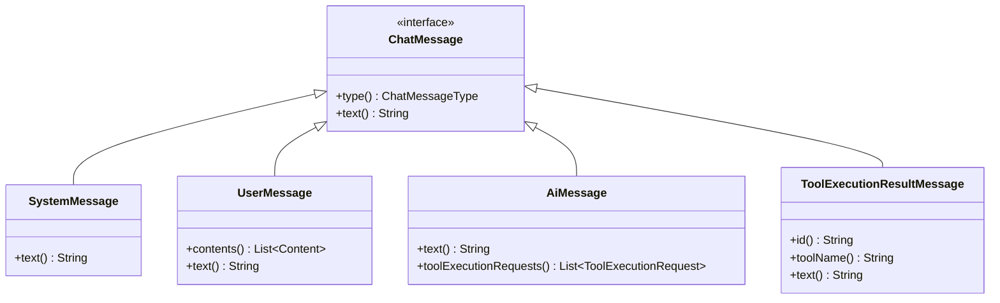
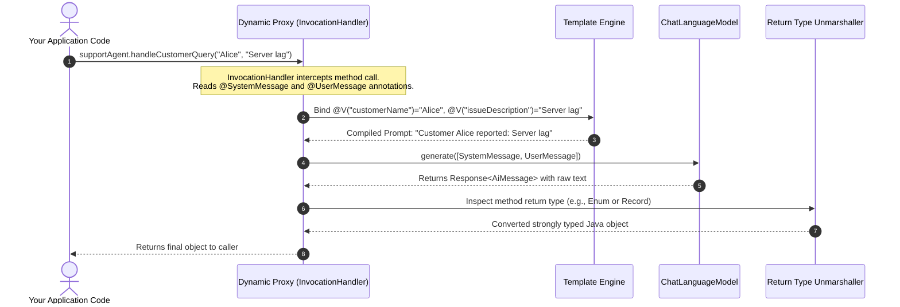

# Day 43: LangChain4j Introduction & AiServices

## Declarative, Interface-Driven AI Engineering for the Java Ecosystem

| Previous Day | Course Hub | Next Day |
|:---|:---:|---:|
| [Day 42: Multimodal AI — Vision, Audio & Images](../../Phase_06_Spring_AI/Day_42_Multimodal_AI_Vision_Audio_Images/Day_42_Multimodal_AI_Vision_Audio_Images.md) | [All 60 Days Overview](../../README.md) | [Day 44: Memory & Conversation Management](../Day_44_Memory_Conversation_Management/Day_44_Memory_Conversation_Management.md) |

---

## Friendly Welcome: Declarative AI with Java Interfaces

Hey there, friend! Welcome to Day 43—and welcome to **Phase 7: LangChain4j & Autonomous Agents**!

In Phase 6, you built amazing applications using the official Spring AI framework. But the enterprise Java AI ecosystem is vibrant and expanding rapidly. Right alongside Spring AI stands another widely loved, powerful open-source champion: **LangChain4j**.

If Spring AI is like Spring's native framework, **LangChain4j is the community's favorite Swiss Army Knife**—lightweight, framework-agnostic, and packed with cutting-edge tools for building autonomous agents.

Best of all? LangChain4j introduced **`AiServices`**: a revolutionary, declarative approach where you write a plain Java interface with a couple of annotations, and the framework automatically writes the AI implementation for you! If you know how to write a Spring Data repository interface, you already know 90% of how to use LangChain4j!

---

> 💡 **New Word Alert! Key Concepts for Today**
>
> - **LangChain4j**: A popular open-source Java library that brings the power of Python's LangChain to idiomatic, type-safe Java. It works anywhere—in plain Java, Spring Boot, Quarkus, or Micronaut.
> - **`AiServices`**: LangChain4j's flagship superpower. You declare a standard Java interface (`interface SupportAgent`), decorate it with `@SystemMessage` and `@UserMessage`, and LangChain4j automatically generates the working implementation at runtime.
> - **`@V("name")`**: An annotation that binds a Java method parameter (like `String ticketId`) to a `{{ticketId}}` placeholder in your prompt template.
> - **`ChatLanguageModel`**: The core LangChain4j interface representing any LLM (OpenAI, Anthropic, Gemini, Ollama, etc.) that accepts messages and returns responses.
> - **Dynamic Proxy (`java.lang.reflect.Proxy`)**: The built-in JVM magic trick that creates a working object from an interface at runtime. (It is the exact same engine that powers Spring Data JPA and `@Transactional`!).

---

## What Will You Learn Today?

- **The Declarative Revolution in AI**: Why constructing prompts manually with string concatenation is the modern equivalent of raw JDBC, and how `AiServices` brings the elegance of Spring Data and Feign to LLMs.
- **LangChain4j vs. Spring AI**: An objective, architectural comparison of the two dominant Java AI ecosystems—strengths, trade-offs, and when to choose each.
- **Core Model Contracts**: Exploring `ChatLanguageModel`, `StreamingChatLanguageModel`, `ChatMessage` hierarchies, and token accounting (`TokenUsage`).
- **The Crown Jewel: `AiServices`**: Defining sophisticated AI agents with nothing more than a plain Java interface decorated with `@SystemMessage`, `@UserMessage`, and `@V`.
- **Automatic Type Conversion**: How `AiServices` deserializes LLM outputs directly into Java `enums`, records, `boolean` flags, and `List<T>` without boilerplate parsing.
- **Under the Hood of Dynamic Proxies**: How `java.lang.reflect.Proxy` intercepts your interface method invocations, populates templates, dispatches to the neural model, and unmarshalls responses.

---

## 1. Real-World Analogy: Spring Data Repositories for Large Language Models

Remember how Java developers interacted with relational databases before Spring Data JPA?

You had to write twenty lines of boilerplate:
1. Open a `Connection`.
2. Prepare a raw SQL statement string with `?` placeholders.
3. Manually map columns into entity fields: `rs.getString("first_name")`, `rs.getLong("id")`.
4. Catch `SQLException` and remember to close the connection in a `finally` block.

Then came **Spring Data JPA**:

```java
// Spring Data generates the entire database query and mapping at runtime!
public interface CustomerRepository extends JpaRepository<Customer, Long> {
    List<Customer> findByLastNameIgnoreCase(String lastName);
}
```

You wrote an interface, and the framework generated the implementation dynamically.

```
      IMPERATIVE LLM CALLS (BOILERPLATE)               DECLARATIVE AISERVICES (LANGCHAIN4J)
   ┌─────────────────────────────────────────┐       ┌──────────────────────────────────────────────┐
   │ • Build PromptTemplate with HashMap     │       │ public interface SupportAgent {              │
   │ • Format template with parameters       │       │     @SystemMessage("You are Acme Support")   │
   │ • Create UserMessage & SystemMessage    │       │     @UserMessage("Audit {{ticketId}}")       │
   │ • Call ChatLanguageModel.generate()     │       │     TicketAudit audit(@V("ticketId") String);│
   │ • Extract AiMessage text content        │       │ }                                            │
   │ • Parse JSON into POJO with Jackson     │       └──────────────────────┬───────────────────────┘
   │ • Catch parsing & API exceptions        │                              │
   └─────────────────────────────────────────┘                              ▼
                                                      ┌──────────────────────────────────────────────┐
                                                      │  AiServices.create(SupportAgent.class, model)│
                                                      │  • Generates Dynamic Proxy                   │
                                                      │  • Handles Templating & Variables            │
                                                      │  • Invokes Model & Auto-Converts Return Type │
                                                      └──────────────────────────────────────────────┘
```

**LangChain4j's `AiServices` is Spring Data for Large Language Models.**

Instead of writing imperative code to construct prompts, manage message arrays, invoke models, and parse strings, you define a **Java interface**. LangChain4j inspects the annotations, creates a runtime **Dynamic Proxy**, and handles all prompt compilation, model communication, conversational memory, tool calling, and return-type conversion behind the scenes.

---

## 2. Spring AI vs. LangChain4j: The Architectural Comparison

Both frameworks represent the cutting edge of Generative AI in the Java ecosystem. Understanding their architectural philosophies enables senior engineers to select the optimal tool for their platform.

| Architectural Dimension | Spring AI | LangChain4j |
| :--- | :--- | :--- |
| **Primary Philosophy** | Deep native integration with Spring Boot, Spring Data, and Spring Cloud conventions. | Framework-agnostic, lightweight, and community-driven (supports plain Java SE, Spring Boot, Quarkus, Micronaut). |
| **Declarative AI API** | `ChatClient` fluent builder API (`.prompt().user(...).call().content()`). | `AiServices` interface-driven declarative dynamic proxy (`@SystemMessage`, `@UserMessage`). |
| **Model Providers** | OpenAI, Azure OpenAI, Anthropic, Bedrock, Ollama, Vertex AI, Mistral, Groq. | OpenAI, Azure, Anthropic, Ollama, Google Gemini, HuggingFace, LocalAI, Cohere, Jina, Mistral, and more. |
| **Memory Management** | `ChatMemory` repository abstraction (in-memory, Cassandra, etc.). | Rich built-in chat memory policies: `MessageWindowChatMemory`, `TokenWindowChatMemory`, persistent store SPI. |
| **RAG Ecosystem** | `VectorStore` interface, `Document`, ETL pipeline readers/splitters. | Modular `EmbeddingStore`, `ContentRetriever`, `QueryTransformer`, `EmbeddingModel`, `ScoringModel` (Re-ranking). |
| **Agent Paradigm** | Tool calling loops integrated into `ChatClient`. | Autonomous ReAct agents, dynamic multi-tool execution, declarative `@Tool` methods. |
| **When to Choose** | When your organization is 100% invested in the modern Spring Boot 3.x ecosystem and prefers standard Spring auto-configuration. | When you require pure declarative interfaces, need to run outside Spring (e.g. Quarkus, AWS Lambda, Android, plain CLI), or want cutting-edge community features. |

---

## 🧭 The Mid-Level Java Developer Bridge: LangChain4j Demystified

If you've spent your career in enterprise Java, you've used Spring Data JPA and OpenFeign interfaces. LangChain4j will feel instantly familiar:

| If You Know In Java... | LangChain4j Equivalent | Plain English Meaning |
| :--- | :--- | :--- |
| **OpenFeign / Retrofit** | `AiServices.builder(MyAgent.class)` | You write an interface; the library auto-generates the HTTP client calls under the hood using Java dynamic proxies. |
| **Spring Data `@Query`** | `@UserMessage("Summarize this: {{text}}")` | You write the template on an interface method; the library fills in the parameters. |
| **Jackson `ObjectMapper`** | Automatic return type conversion | If your method returns `MyRecord`, LangChain4j tells the LLM to reply in JSON and deserializes it automatically! |
| **Spring Web Interceptor** | `ChatMemory` / `ContentRetriever` | Plugs into the conversation lifecycle to inject past history or database search results automatically. |
| **`java.lang.reflect.Proxy`** | The engine behind `AiServices` | The exact same JVM magic that powers `@Transactional` and Spring Data interfaces. |

---

## 3. Core Architecture: Models and Messages

At the foundation of LangChain4j are three core contracts:

### 3.1 `ChatLanguageModel`

The primary abstraction for communicating with a text-based conversational model:

```java
package dev.langchain4j.model.chat;

import dev.langchain4j.data.message.ChatMessage;
import dev.langchain4j.model.output.Response;

import java.util.List;

public interface ChatLanguageModel {
    // Basic single prompt
    default String generate(String userMessage) { ... }

    // Multi-turn message sequence
    Response<AiMessage> generate(List<ChatMessage> messages);
}
```

### 3.2 The `ChatMessage` Hierarchy

LangChain4j models conversational turns using explicit strongly typed classes:



- **`SystemMessage`**: Guides the persona, constraints, and instructions of the model.
- **`UserMessage`**: Represents text (and optional multimodal images) submitted by the human user.
- **`AiMessage`**: The output generated by the assistant, containing either conversational text or structured tool execution requests.
- **`ToolExecutionResultMessage`**: Contains the output resulting from executing a local Java tool, returned to the model.

### 3.3 `Response<T>` and `TokenUsage`

Frontier production systems must track API usage costs. LangChain4j wraps model results in a `Response<T>` object that encapsulates:
- The actual payload (`AiMessage`, `String`, or typed domain entity).
- `TokenUsage`: Exact count of `inputTokenCount()`, `outputTokenCount()`, and `totalTokenCount()`.
- `FinishReason`: Why the model stopped (`STOP`, `LENGTH`, `TOOL_EXECUTION`).

---

## 4. The Crown Jewel: Declarative `AiServices`

The most powerful feature of LangChain4j is **`AiServices`**. It allows you to define complex AI behaviors using nothing more than a plain Java interface.

### Step 1: Define the Declarative Interface

```java
package com.genai.langchain4j.support;

import dev.langchain4j.service.SystemMessage;
import dev.langchain4j.service.UserMessage;
import dev.langchain4j.service.V;

@SystemMessage("""
    You are a Tier-3 Technical Support Engineer for Acme Cloud Systems.
    Respond politely, concisely, and cite official enterprise SLA documentation.
    """)
public interface CustomerSupportService {

    @UserMessage("Customer {{customerName}} reported: {{issueDescription}}")
    String triageIssue(
        @V("customerName") String customerName, 
        @V("issueDescription") String issueDescription
    );

    @UserMessage("Generate a 1-sentence executive summary of this incident report: {{incidentDetails}}")
    String summarizeIncident(@V("incidentDetails") String incidentDetails);
}
```

### Step 2: Instantiate the Service with `AiServices.create()`

```java
package com.genai.langchain4j.support;

import dev.langchain4j.model.chat.ChatLanguageModel;
import dev.langchain4j.model.openai.OpenAiChatModel;
import dev.langchain4j.service.AiServices;

public class SupportApplication {

    public static void main(String[] args) {
        // 1. Configure the model
        ChatLanguageModel model = OpenAiChatModel.builder()
            .apiKey(System.getenv("OPENAI_API_KEY"))
            .modelName("gpt-4o")
            .temperature(0.2)
            .build();

        // 2. Instantiate the declarative AI service
        CustomerSupportService support = AiServices.create(CustomerSupportService.class, model);

        // 3. Invoke pure Java methods!
        String triageResult = support.triageIssue(
            "Acme Logistics", 
            "Kafka cluster replication lag exceeded 15 seconds during peak volume."
        );

        System.out.println(triageResult);
    }
}
```

Notice what is missing: **No prompt templates, no string concatenation, no JSON parsing, no HTTP requests.** You invoked a plain Java method with strongly typed parameters, and LangChain4j handled the rest.

---

## 5. Automatic Return-Type Conversions

`AiServices` is not restricted to returning `String`. It can automatically deserialize model responses into Java primitive wrappers, enums, records, and collections!

### 5.1 Returning Java Enums

If your interface method returns an `enum`, LangChain4j automatically instructs the model to choose one of the valid enum values and parses it directly:

```java
public interface ContentModerator {

    enum ModerationCategory { SAFE, HARMFUL, SPAM, COPYRIGHT_INFRINGEMENT }

    @SystemMessage("You are an automated compliance officer. Classify the user content.")
    @UserMessage("Evaluate this submission: {{content}}")
    ModerationCategory moderate(@V("content") String content);
}
```

Usage:
```java
ContentModerator moderator = AiServices.create(ContentModerator.class, model);
ModerationCategory decision = moderator.moderate("Buy cheap crypto fast at http://bit.ly/spam");
// decision == ModerationCategory.SPAM !
```

### 5.2 Returning Java Records / POJOs

When an interface method returns a custom Java `record` or class, LangChain4j extracts JSON from the LLM output and uses Jackson to map it directly into an instance:

```java
public interface ResumeParser {

    public record CandidateProfile(
        String fullName,
        String email,
        int yearsOfExperience,
        List<String> coreTechnologies,
        boolean requiresVisaSponsorship
    ) {}

    @SystemMessage("Extract structured candidate profile information from the supplied resume text.")
    @UserMessage("Resume text: {{resumeText}}")
    CandidateProfile parseResume(@V("resumeText") String resumeText);
}
```

---

## 6. Under the Hood: How `AiServices` Works

How does LangChain4j turn an interface into executable code without generating source files? It leverages Java's native **Dynamic Proxy (`java.lang.reflect.Proxy`)** and reflection.



When you call `AiServices.create(MyInterface.class, model)`:
1. Java creates an implementation of `MyInterface` at runtime using `Proxy.newProxyInstance(...)`.
2. When any method is invoked, the `InvocationHandler` intercepts the call.
3. It inspects the method's metadata:
   - Finds `@SystemMessage` on the method or the parent interface.
   - Finds `@UserMessage` and extracts template variables like `{{name}}`.
   - Reads method parameters annotated with `@V("name")` and substitutes their runtime values.
4. It packages the messages into `ChatMessage` instances and invokes `ChatLanguageModel.generate()`.
5. It inspects the method's return type:
   - If `String`, it returns the text directly.
   - If an `enum`, it matches the text to `Enum.valueOf()`.
   - If a custom class or record, it parses the JSON via Jackson.
   - If `boolean`, it converts "true"/"false" responses.
   - If `Response<T>`, it packages the object alongside `TokenUsage` and `FinishReason`.

---

## 7. Maven Dependencies Setup

To use LangChain4j in your enterprise project, include the core dependency and your desired model provider:

```xml
<dependencies>
    <!-- 1. LangChain4j Core & AiServices -->
    <dependency>
        <groupId>dev.langchain4j</groupId>
        <artifactId>langchain4j</artifactId>
        <version>0.35.0</version>
    </dependency>

    <!-- 2. OpenAI Provider (includes GPT-4o, embeddings) -->
    <dependency>
        <groupId>dev.langchain4j</groupId>
        <artifactId>langchain4j-open-ai</artifactId>
        <version>0.35.0</version>
    </dependency>

    <!-- 3. Ollama Provider (for 100% free local models like Llama 3.2) -->
    <dependency>
        <groupId>dev.langchain4j</groupId>
        <artifactId>langchain4j-ollama</artifactId>
        <version>0.35.0</version>
    </dependency>
</dependencies>
```

---

## 8. Complete Runnable Companion Code Architecture

In this lesson's companion code (`Phase_07_LangChain4j/Day_43_LangChain4j_Introduction_AiServices/code/`), we build a complete, pure Java 21 implementation of LangChain4j's core and `AiServices` dynamic proxy from scratch without external dependencies:

```
Day_43_LangChain4j_Introduction_AiServices/code/
├── ChatMessage.java               # Immutable record representing System, User, and AI chat turns
├── TokenUsage.java                # Token accounting record (input, output, total tokens)
├── ModelResponse.java             # Wraps generated text with token usage telemetry
├── ChatLanguageModel.java         # Functional contract for chat model implementations
├── SimulatedChatModel.java        # Deterministic local simulation of a frontier model
├── SystemMessage.java             # Custom runtime annotation for system prompts
├── UserMessage.java               # Custom runtime annotation for user templates
├── V.java                         # Custom runtime annotation for variable binding {{var}}
├── AiServices.java                # Dynamic Proxy factory generating runtime interface proxies
├── SupportAgent.java              # Declarative interface for customer support workflows
├── SentimentClassifier.java       # Declarative interface demonstrating enum return types
└── LangChain4jAiServicesDemo.java # Executable verification suite demonstrating proxy execution
```

### Verification & Demonstration Output

Execute `LangChain4jAiServicesDemo.java`:

```bash
javac -d out Phase_07_LangChain4j/Day_43_LangChain4j_Introduction_AiServices/code/*.java
java -cp out com.genai.langchain4j.aiservices.LangChain4jAiServicesDemo
```

```
==================================================================
  DAY 43: LANGCHAIN4J AISERVICES DECLARATIVE INTERFACES DEMO     
==================================================================

--- 1. Declarative Prompt with @V Variable Substitution ---
Agent Response:
I understand you wish to request a refund. Under Acme Cloud Solutions policy, service refund requests are eligible within 30 days of billing cycle generation.

--- 2. Direct Chat Invocation ---
Agent Response:
Hello! I am your Acme Enterprise Support Assistant. How may I assist your engineering team today?

--- 3. Declarative Return-Type Conversion to Enum ---
Review 1 ('stellar, fast'):      Sentiment.POSITIVE
Review 2 ('crashed, terrible'):  Sentiment.NEGATIVE
Review 3 ('restarted schedule'): Sentiment.NEUTRAL

--- 4. Telemetry and Token Accounting ---
Output Content: I understand you wish to request a refund. Under Acme Cloud Solutions policy, service refund requests are eligible within 30 days of billing cycle generation.
Tokens Consumed: [Input: 43, Output: 39, Total: 82]

==================================================================
  LANGCHAIN4J AISERVICES DEMO COMPLETED SUCCESSFULLY             
==================================================================
```

---

## 9. Why LangChain4j Matters for Enterprise Java Engineers

1. **Idiomatic Clean Code**: By decoupling business interfaces from model client mechanics, your application logic remains pure and decoupled from specific LLM providers.
2. **Effortless Unit Testing & Mocking**: Because your AI capabilities are plain Java interfaces, writing unit tests is trivial: you can mock `CustomerSupportService` with standard Mockito (`when(support.triageIssue(...)).thenReturn(...)`) without touching the network or spending tokens.
3. **Seamless Portability**: If your team migrates from OpenAI to AWS Bedrock or local Ollama, you only change one line in your configuration class. None of your `AiServices` interfaces need to be altered.

---

## 10. Practical Exercises

### Exercise 1: Build a Declarative Translation Service
**Task**: Define an interface `LanguageTranslator` with a method `translate(@V("text") String text, @V("targetLanguage") String lang)`. Decorate it with `@SystemMessage` instructing the model to act as a professional linguist, and `@UserMessage` with variable placeholders.
**Solution**:
```java
package com.genai.langchain4j.exercises;

import com.genai.langchain4j.aiservices.SystemMessage;
import com.genai.langchain4j.aiservices.UserMessage;
import com.genai.langchain4j.aiservices.V;

public interface LanguageTranslator {

    @SystemMessage("You are an expert diplomatic translator. Preserve cultural nuances and technical terminology.")
    @UserMessage("Translate the following text into {{targetLanguage}}: {{text}}")
    String translate(@V("text") String text, @V("targetLanguage") String targetLanguage);
}
```

### Exercise 2: Boolean Verification Service
**Task**: Define an interface `SecurityPolicyAuditor` that returns a `boolean` indicating whether a given pull request commit message adheres to Conventional Commits standards.
**Solution**:
```java
package com.genai.langchain4j.exercises;

import com.genai.langchain4j.aiservices.SystemMessage;
import com.genai.langchain4j.aiservices.UserMessage;
import com.genai.langchain4j.aiservices.V;

public interface SecurityPolicyAuditor {

    @SystemMessage("""
        You are a strict Git CI/CD compliance bot.
        Evaluate if the commit message conforms to Conventional Commits (e.g. feat:, fix:, chore:, docs:).
        Respond strictly with true or false.
        """)
    @UserMessage("Commit message: {{commitMsg}}")
    boolean isCompliant(@V("commitMsg") String commitMessage);
}
```

### Exercise 3: Multi-Parameter Code Refactoring Assistant
**Task**: Build an interface `CodeRefactoringService` with a method `refactor(@V("language") String lang, @V("codeSnippet") String code, @V("optimizationGoal") String goal)` that generates an optimized version of the code.
**Solution**:
```java
package com.genai.langchain4j.exercises;

import com.genai.langchain4j.aiservices.SystemMessage;
import com.genai.langchain4j.aiservices.UserMessage;
import com.genai.langchain4j.aiservices.V;

public interface CodeRefactoringService {

    @SystemMessage("You are a Principal Software Engineer specializing in high-performance computing.")
    @UserMessage("""
        Optimize the following {{language}} code snippet for {{optimizationGoal}}.
        Code:
        {{codeSnippet}}
        """)
    String refactor(
        @V("language") String language,
        @V("codeSnippet") String codeSnippet,
        @V("optimizationGoal") String optimizationGoal
    );
}
```

---

## 11. Self-Check Quiz

### Question 1: What is the primary conceptual advantage of LangChain4j's `AiServices`?
- A) It speeds up GPU matrix multiplication on OpenAI's servers.
- B) It allows developers to define AI behavior declaratively using plain Java interfaces and annotations, eliminating imperative prompt-building boilerplate.
- C) It replaces the Java Virtual Machine with a Python runtime.
- D) It bypasses API billing.

*Answer*: **B**. `AiServices` operates like Spring Data repositories: you define an interface with annotations, and the framework generates the proxy implementation that manages prompt templates, parameter binding, model invocation, and return-type conversion.

---

### Question 2: In LangChain4j, which annotation binds a method parameter to a `{{placeholder}}` in `@UserMessage`?
- A) `@PathVariable`
- B) `@Param`
- C) `@V`
- D) `@Value`

*Answer*: **C**. LangChain4j uses the `@V("variableName")` annotation to link method arguments to matching `{{variableName}}` placeholders within `@UserMessage` templates.

---

### Question 3: How does `AiServices` handle interface methods that return an `enum`?
- A) It throws an `UnsupportedOperationException`.
- B) It automatically prompts the model with the allowed enum constants and converts the model's text output to the matching enum value via `Enum.valueOf()`.
- C) It only works with `String` return types.
- D) It generates a new Java class at runtime and restarts the application.

*Answer*: **B**. LangChain4j inspects the enum return type, supplies the list of valid enum constants to the model, and parses the response directly into the typed enum constant.

---

### Question 4: How is `AiServices` implemented under the hood in pure Java?
- A) Through bytecode manipulation using CGLIB.
- B) Using standard Java Dynamic Proxies (`java.lang.reflect.Proxy`) and reflection to intercept method calls at runtime.
- C) By writing `.java` files to disk and invoking `javac`.
- D) By compiling C++ native libraries via JNI.

*Answer*: **B**. LangChain4j uses `Proxy.newProxyInstance()` to construct an `InvocationHandler` that intercepts calls to your interface methods, resolves annotations, builds prompts, calls the model, and formats the output.

---

### Question 5: Why is having an interface-based AI design advantageous for automated testing?
- A) Interfaces do not need unit testing.
- B) It allows you to mock the AI service interface using standard tools like Mockito, enabling fast and free unit testing without sending network requests to an LLM provider.
- C) It forces JUnit to run in virtual threads.
- D) It encrypts unit test results.

*Answer*: **B**. Because your application depends on a plain Java interface rather than concrete LLM client code, you can easily mock the interface in test suites, simulating AI responses without latency, network dependencies, or API costs.

---

## 12. Day 43 Wrap-Up & What's Next

What an incredible kickoff to Phase 7! You just experienced the declarative revolution in AI engineering.

Here is what you unlocked today:
- **`AiServices` is Spring Data for LLMs**: Just write a Java interface with `@SystemMessage` and `@UserMessage`, and LangChain4j creates the dynamic proxy implementation automatically.
- **Automatic Type Conversion**: Methods can return Java records, enums, or booleans, and LangChain4j forces the model to respond in structured JSON and parses it seamlessly.
- **Mock-Friendly Testing**: Because your code depends on a plain Java interface, you can easily mock it with Mockito during unit tests without making live network calls to OpenAI.

### What's Coming Up Next?
Right now, each call to an `AiServices` method is completely stateless—it forgets what the user said in the previous turn.

Tomorrow in **[Day 44: Memory & Conversation Management](../Day_44_Memory_Conversation_Management/Day_44_Memory_Conversation_Management.md)**, we'll give our LangChain4j agents persistent memory! You'll learn how to configure token-window memory, sliding window histories, and store chat history in databases so your agents remember multi-turn conversations effortlessly!

---

| Previous Day | Course Hub | Next Day |
|:---|:---:|---:|
| [Day 42: Multimodal AI — Vision, Audio & Images](../../Phase_06_Spring_AI/Day_42_Multimodal_AI_Vision_Audio_Images/Day_42_Multimodal_AI_Vision_Audio_Images.md) | [All 60 Days Overview](../../README.md) | [Day 44: Memory & Conversation Management](../Day_44_Memory_Conversation_Management/Day_44_Memory_Conversation_Management.md) |

