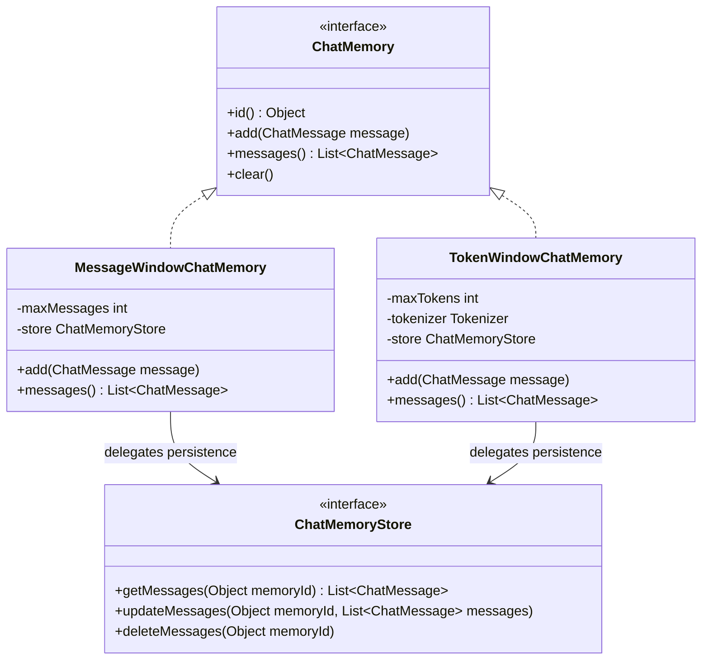
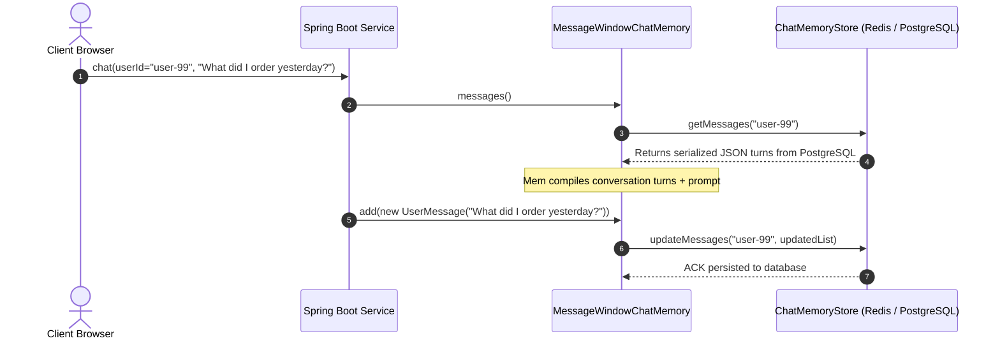

# Day 44: Memory and Conversation Management

## Mastering Conversational Continuity, Sliding Windows, and Multi-Tenant State in Java

| Previous Day | Course Hub | Next Day |
|:---|:---:|---:|
| [Day 43: LangChain4j Introduction & AiServices](../Day_43_LangChain4j_Introduction_AiServices/Day_43_LangChain4j_Introduction_AiServices.md) | [All 60 Days Overview](../../README.md) | [Day 45: Structured Extraction & Guardrails](../Day_45_Structured_Extraction_Guardrails/Day_45_Structured_Extraction_Guardrails.md) |

---

## What Will You Learn Today?

- **The Statelessness Dilemma**: Why Large Language Models have zero organic memory between HTTP calls, and the architectural trade-offs of simulating state.
- **The Core Memory Abstraction**: Mastering LangChain4j's `ChatMemory` interface, message addition, retrieval, and lifecycle management.
- **Eviction Strategies**: Implementing `MessageWindowChatMemory` (turn-count sliding windows) and `TokenWindowChatMemory` (strict tokenizer-calibrated token budgeting).
- **The System Prompt Invariant**: Guaranteeing that foundational system instructions and security constraints are *never* evicted during memory pruning.
- **Multi-Tenant & Per-User Memory**: Routing distinct user sessions dynamically using `@MemoryId` and `ChatMemoryProvider` to eliminate cross-user data leakage.
- **Persistent Storage SPI (`ChatMemoryStore`)**: Moving beyond ephemeral in-memory storage to production-ready persistence using PostgreSQL and Redis.

---

## 1. Real-World Analogy: The Goldfish Problem vs. The Executive Briefing Folder

Imagine an enterprise hiring a senior executive advisor with severe retrograde amnesia:
- The moment you leave her office, she forgets who you are, what you discussed, and every decision made five minutes ago.
- When you walk in and ask, *"Did you approve that budget change we discussed?"*, she stares blankly: *"What budget change? Who are you?"*

To solve this, junior engineers often adopt the **"Dump the Entire Filing Cabinet"** approach:
Every time you walk into her office, you hand her an enormous 2,000-page binder containing every conversation from the past three years.

```
       NAIVE UNBOUNDED CONTEXT DUMP                    INTELLIGENT SLIDING WINDOW MEMORY
   ┌─────────────────────────────────────┐         ┌──────────────────────────────────────────────┐
   │ Turn 1: "Hi, I'm Alice."            │         │ 1. Core Mandate: (NEVER EVICTED)             │
   │ Turn 2: "Where is the printer?"     │         │    [SYSTEM] "You are Acme HR Assistant"      │
   │ Turn 3: "Thanks."                   │         ├──────────────────────────────────────────────┤
   │ ... [500 TURNS LATER] ...           │         │ 2. Recent Active Context (Sliding Window):   │
   │ Turn 501: "What's my PTO balance?"  │         │    [USER] "I am planning a trip in August."  │
   │                                     │         │    [AI]   "You currently have 14 PTO days."  │
   │ 💥 150,000 Tokens! Context Overflow!│         │    [USER] "Can you book 5 of them?"          │
   │ 💸 $4.50 per individual question!   │         ├──────────────────────────────────────────────┤
   │ ⏳ 6-second round-trip latency!     │         │ 3. Archived to Database (ChatMemoryStore):   │
   │                                     │         │    Turns 1-498 persisted to PostgreSQL JSONB │
   └─────────────────────────────────────┘         └──────────────────────────────────────────────┘
```

The consequences of unbounded history are disastrous:
1. **Context Window Exhaustion**: You crash into model limits ($128\text{k}$ tokens).
2. **Exponential Financial Costs**: You pay token fees for every past message repeatedly on every turn.
3. **Severe Latency Spikes**: Processing 100,000 historical tokens on every interaction slows response times from 300ms to 8 seconds.

**Intelligent Memory Management** acts like an executive briefing folder:
- It pins the permanent mission statement at the top (**System Message**).
- It retains the last $N$ relevant turns or $K$ tokens (**Sliding Window**).
- It persists historical turns to disk/database (**ChatMemoryStore**) for auditing, and evicts stale chatter.

---

## 2. LangChain4j Memory Architecture

LangChain4j isolates conversational memory behind clean, composable abstractions:



### 2.1 The Core `ChatMemory` Contract

```java
package dev.langchain4j.memory;

import dev.langchain4j.data.message.ChatMessage;
import java.util.List;

public interface ChatMemory {
    Object id();
    void add(ChatMessage message);
    List<ChatMessage> messages();
    void clear();
}
```

Every conversational turn—whether user input or model output—is added to `ChatMemory`. When generating the next turn, the framework reads `messages()` to reconstruct the dialogue context.

---

## 3. Eviction Strategies: Message vs. Token Windows

### 3.1 `MessageWindowChatMemory` (Count-Based Pruning)

The simplest and most popular eviction policy. It retains the last $N$ messages in the conversation:

```java
import dev.langchain4j.memory.chat.MessageWindowChatMemory;

ChatMemory memory = MessageWindowChatMemory.builder()
    .id("session-101")
    .maxMessages(10) // Retains last 10 messages
    .build();
```

### 3.2 `TokenWindowChatMemory` (Budget-Based Pruning)

In enterprise applications with variable message lengths (e.g., users pasting 2,000-line stack traces or JSON payloads), counting turns is insufficient: a single turn could consume 20,000 tokens!

`TokenWindowChatMemory` uses a `Tokenizer` (such as OpenAI's BPE cl100k_base) to measure the exact token footprint of every turn:

```java
import dev.langchain4j.memory.chat.TokenWindowChatMemory;
import dev.langchain4j.model.openai.OpenAiTokenizer;

ChatMemory memory = TokenWindowChatMemory.builder()
    .id("session-102")
    .maxTokens(4000, new OpenAiTokenizer("gpt-4o"))
    .build();
```

### 3.3 The Golden Invariant: Never Evict the System Message!

A catastrophic bug in naive sliding window implementations is evicting the very first message when the window overflows. **If the first message is your `@SystemMessage`, evicting it strips away all persona constraints, guardrails, and compliance instructions!**

```
       NAIVE PRUNING BUG                                  CORRECT LANGCHAIN4J BEHAVIOR
   ┌─────────────────────────────────────┐         ┌──────────────────────────────────────────────┐
   │ Window size: 3 messages             │         │ Window size: 3 messages                      │
   │ Turn 0: [SYSTEM] "You are a doctor" │         │ Turn 0: [SYSTEM] "You are a doctor" (PINNED) │
   │ Turn 1: [USER] "I have a cough"     │         ├──────────────────────────────────────────────┤
   │ Turn 2: [AI] "Drink fluids"         │         │ Turn 1: [USER] "I have a cough" (EVICTED)    │
   │ Turn 3: [USER] "Now what?"          │         │ Turn 2: [AI] "Drink fluids"                  │
   ├─────────────────────────────────────┤         │ Turn 3: [USER] "Now what?"                   │
   │ 💥 Turn 0 EVICTED!                  │         ├──────────────────────────────────────────────┤
   │ Agent forgets it is a doctor!       │         │ ✅ SYSTEM message remains preserved forever! │
   └─────────────────────────────────────┘         └──────────────────────────────────────────────┘
```

LangChain4j guarantees that if a `SystemMessage` is present at index 0, it is **never pruned**; only older non-system dialogue turns slide out of the window.

---

## 4. Multi-Tenant Per-User Memory Isolation

In production web applications, thousands of concurrent users interact with your Spring Boot service. If you share a single `ChatMemory` instance, User B will read User A's private banking balance or medical notes!

LangChain4j solves this through **`@MemoryId`** and **`ChatMemoryProvider`**.

### Step 1: Define the Multi-Tenant `AiServices` Interface

Annotate the user or session identifier with `@MemoryId`:

```java
package com.genai.langchain4j.memory;

import dev.langchain4j.service.MemoryId;
import dev.langchain4j.service.SystemMessage;
import dev.langchain4j.service.UserMessage;

@SystemMessage("You are an enterprise HR benefits counselor. Maintain complete user confidentiality.")
public interface HrAssistantService {

    String chat(
        @MemoryId String employeeId, 
        @UserMessage String userQuestion
    );
}
```

### Step 2: Configure `ChatMemoryProvider`

Instead of providing a single memory instance, provide a factory function that resolves or constructs a memory instance for each unique `@MemoryId`:

```java
package com.genai.langchain4j.memory;

import dev.langchain4j.memory.chat.MessageWindowChatMemory;
import dev.langchain4j.model.chat.ChatLanguageModel;
import dev.langchain4j.service.AiServices;

public class HrApplication {

    public static HrAssistantService createService(ChatLanguageModel model, ChatMemoryStore persistentStore) {
        return AiServices.builder(HrAssistantService.class)
            .chatLanguageModel(model)
            // Dynamically provisions or restores an isolated memory window per employeeId!
            .chatMemoryProvider(memoryId -> MessageWindowChatMemory.builder()
                .id(memoryId)
                .maxMessages(10)
                .chatMemoryStore(persistentStore)
                .build()
            )
            .build();
    }
}
```

Now, when Alice calls `assistant.chat("EMP-001", "My salary is $120k")`, her history is stored strictly under key `EMP-001`. When Bob calls `assistant.chat("EMP-002", "What is my salary?")`, the agent has zero knowledge of Alice's conversation!

---

## 5. Enterprise Persistence: `ChatMemoryStore` SPI

By default, LangChain4j keeps message windows in memory. If your Spring Boot pod restarts or a horizontal auto-scaler spins up a new replica, the user's conversation vanishes.

In production, you plug in a persistent `ChatMemoryStore`.



### 5.1 Implementing a Production `ChatMemoryStore` with Spring Data / PostgreSQL

```java
package com.genai.langchain4j.memory;

import com.fasterxml.jackson.core.type.TypeReference;
import com.fasterxml.jackson.databind.ObjectMapper;
import dev.langchain4j.data.message.ChatMessage;
import dev.langchain4j.data.message.ChatMessageDeserializer;
import dev.langchain4j.data.message.ChatMessageSerializer;
import dev.langchain4j.store.memory.chat.ChatMemoryStore;
import org.springframework.jdbc.core.JdbcTemplate;
import org.springframework.stereotype.Component;

import java.util.List;

@Component
public class PostgresChatMemoryStore implements ChatMemoryStore {

    private final JdbcTemplate jdbcTemplate;

    public PostgresChatMemoryStore(JdbcTemplate jdbcTemplate) {
        this.jdbcTemplate = jdbcTemplate;
    }

    @Override
    public List<ChatMessage> getMessages(Object memoryId) {
        String sql = "SELECT messages_json FROM chat_memory WHERE memory_id = ?";
        List<String> rows = jdbcTemplate.query(sql, (rs, rowNum) -> rs.getString("messages_json"), memoryId.toString());

        if (rows.isEmpty()) {
            return List.of();
        }

        // LangChain4j provides built-in serializers for ChatMessage JSON!
        return ChatMessageDeserializer.messagesFromJson(rows.get(0));
    }

    @Override
    public void updateMessages(Object memoryId, List<ChatMessage> messages) {
        String json = ChatMessageSerializer.messagesToJson(messages);
        String sql = """
            INSERT INTO chat_memory (memory_id, messages_json, updated_at)
            VALUES (?, ?::jsonb, NOW())
            ON CONFLICT (memory_id) DO UPDATE
            SET messages_json = EXCLUDED.messages_json, updated_at = NOW()
            """;
        jdbcTemplate.update(sql, memoryId.toString(), json);
    }

    @Override
    public void deleteMessages(Object memoryId) {
        String sql = "DELETE FROM chat_memory WHERE memory_id = ?";
        jdbcTemplate.update(sql, memoryId.toString());
    }
}
```

---

## 6. Complete Runnable Companion Code Architecture

In this lesson's companion code (`Phase_07_LangChain4j/Day_44_Memory_Conversation_Management/code/`), we provide a complete, pure Java 21 implementation verifying all memory mechanics:

```
Day_44_Memory_Conversation_Management/code/
├── ChatMessage.java               # Immutable record with estimated token calculation
├── ChatMemory.java                # Core contract for conversational memory operations
├── ChatMemoryStore.java           # Persistence SPI contract matching LangChain4j
├── PersistentChatMemoryStore.java # Thread-safe storage simulation tracking multi-tenant sessions
├── MessageWindowChatMemory.java   # Sliding window pruner with inviolable SystemMessage protection
├── TokenWindowChatMemory.java     # Strict budget-based pruner with token capacity enforcement
├── ChatMemoryProvider.java        # Functional factory interface for multi-tenant memory creation
├── PerUserChatManager.java        # Session manager orchestrating isolated user conversations
└── ConversationMemoryDemo.java    # Executable verification verifying single-user & multi-tenant isolation
```

### Verification & Demonstration Output

Execute `ConversationMemoryDemo.java`:

```bash
javac -d out Phase_07_LangChain4j/Day_44_Memory_Conversation_Management/code/*.java
java -cp out com.genai.langchain4j.memory.ConversationMemoryDemo
```

```
==================================================================
  DAY 44: LANGCHAIN4J CHAT MEMORY & CONVERSATION MANAGEMENT DEMO  
==================================================================

--- 1. MessageWindowChatMemory (Max 5 Messages) ---
Current Message Count: 5
[Before Overflow]
   - SYSTEM : System Rule: You are a strict compliance agent.
   - USER   : Turn 1: My name is Alice.
   - AI     : Turn 1: Hello Alice, registered.
   - USER   : Turn 2: What is policy 101?
   - AI     : Turn 2: Policy 101 covers MFA.

Adding Turn 3 (Triggers eviction of oldest conversational turns)...
[After Overflow (Notice System Prompt is Intact!)]
   - SYSTEM : System Rule: You are a strict compliance agent.
   - USER   : Turn 2: What is policy 101?
   - AI     : Turn 2: Policy 101 covers MFA.
   - USER   : Turn 3: Update my email to alice@acme.com.
   - AI     : Turn 3: Email updated.

--- 2. TokenWindowChatMemory (Max 50 Tokens) ---
Tokens: 24 / 50
[Token Window Initial]
   - SYSTEM : System: Concise Assistant.
   - USER   : A brief message about Kubernetes.
   - AI     : Kubernetes automates container deployment.

Adding a large message that forces token-based eviction...
Tokens after eviction: 16 / 50
[Token Window Post-Eviction]
   - SYSTEM : System: Concise Assistant.
   - AI     : The control plane manages cluster state.

--- 3. Multi-Tenant Per-User Memory Isolation ---
Alice's Memory Turn Count: 4
[Alice Session (ID: user_alice_404)]
   - USER   : Hello, I am Alice from Accounting.
   - AI     : Acknowledged: 'Hello, I am Alice from Accounting.'. Total history length for user_alice_404: 1 messages.
   - USER   : Where is the ledger file?
   - AI     : Acknowledged: 'Where is the ledger file?'. Total history length for user_alice_404: 3 messages.

Bob's Memory Turn Count: 2
[Bob Session (ID: user_bob_505)]
   - USER   : Hi, I am Bob from DevOps.
   - AI     : Acknowledged: 'Hi, I am Bob from DevOps.'. Total history length for user_bob_505: 1 messages.

Total Active Sessions in Persistent Store: 4

==================================================================
  CONVERSATION MEMORY VERIFICATION COMPLETED SUCCESSFULLY         
==================================================================
```

---

## 7. Why Conversation Management Matters for Senior Engineers

1. **Deterministic Cost Control**: Uncontrolled conversational growth will deplete your LLM budget within weeks. Enforcing a strict 10-message or 4,000-token window caps your cost per turn to a fixed, predictable ceiling.
2. **Strict Multi-Tenant Security**: In enterprise compliance environments (GDPR, HIPAA, SOC-2), mixing conversational memory between users is a critical security vulnerability. Using `@MemoryId` with persistent database isolation guarantees absolute tenant separation.
3. **Low Latency SLAs**: By keeping the active message payload compact, your Time-to-First-Token (TTFT) remains consistently sub-second regardless of whether the user has been chatting for five minutes or five hours.

---

## 8. Practical Exercises

### Exercise 1: Implement an Automated Session Reset Timer
**Task**: Build a `TtlChatMemoryStore` wrapper around a `ChatMemoryStore` that tracks the timestamp of the last message in each session. If more than 30 minutes have elapsed since the last update, automatically delete the session messages and start fresh.
**Solution**:
```java
package com.genai.langchain4j.exercises;

import com.genai.langchain4j.memory.ChatMessage;
import com.genai.langchain4j.memory.ChatMemoryStore;

import java.time.Duration;
import java.time.Instant;
import java.util.*;

public class TtlChatMemoryStore implements ChatMemoryStore {

    private final ChatMemoryStore delegate;
    private final Duration sessionTtl;
    private final Map<Object, Instant> lastAccessTimes = new HashMap<>();

    public TtlChatMemoryStore(ChatMemoryStore delegate, Duration sessionTtl) {
        this.delegate = delegate;
        this.sessionTtl = sessionTtl;
    }

    @Override
    public synchronized List<ChatMessage> getMessages(Object memoryId) {
        Instant lastAccess = lastAccessTimes.get(memoryId);
        if (lastAccess != null && Duration.between(lastAccess, Instant.now()).compareTo(sessionTtl) > 0) {
            // Expired! Clear session
            deleteMessages(memoryId);
            return List.of();
        }
        lastAccessTimes.put(memoryId, Instant.now());
        return delegate.getMessages(memoryId);
    }

    @Override
    public synchronized void updateMessages(Object memoryId, List<ChatMessage> messages) {
        lastAccessTimes.put(memoryId, Instant.now());
        delegate.updateMessages(memoryId, messages);
    }

    @Override
    public synchronized void deleteMessages(Object memoryId) {
        lastAccessTimes.remove(memoryId);
        delegate.deleteMessages(memoryId);
    }
}
```

### Exercise 2: Conversation Export to Markdown Auditor
**Task**: Write a utility method `String exportTranscriptToMarkdown(ChatMemory memory)` that formats all messages in a `ChatMemory` into an executive markdown audit log with roles and message counts.
**Solution**:
```java
package com.genai.langchain4j.exercises;

import com.genai.langchain4j.memory.ChatMemory;
import com.genai.langchain4j.memory.ChatMessage;

public class TranscriptAuditExporter {

    public static String exportTranscriptToMarkdown(ChatMemory memory) {
        StringBuilder sb = new StringBuilder();
        sb.append("# Conversational Audit Log (Session: ").append(memory.id()).append(")\n\n");
        sb.append("| Turn | Role | Content |\n");
        sb.append("| :--- | :--- | :--- |\n");

        int turn = 1;
        for (ChatMessage msg : memory.messages()) {
            sb.append(String.format("| %d | **%s** | %s |\n", turn++, msg.role(), msg.text().replace("\n", " ")));
        }
        return sb.toString();
    }
}
```

### Exercise 3: PII Masking Memory Filter
**Task**: Build a memory interceptor that scrubs sensitive credit card numbers (matching regex `\b\d{4}[ -]?\d{4}[ -]?\d{4}[ -]?\d{4}\b`) from user messages before persisting them into `ChatMemory`.
**Solution**:
```java
package com.genai.langchain4j.exercises;

import com.genai.langchain4j.memory.ChatMessage;

public class PiiScrubbingMemoryFilter {

    private static final String CC_REGEX = "\\b(?:\\d[ -]*?){13,16}\\b";

    public static ChatMessage sanitize(ChatMessage original) {
        if (original.role() != ChatMessage.Role.USER) {
            return original;
        }

        String scrubbed = original.text().replaceAll(CC_REGEX, "[REDACTED_CREDIT_CARD]");
        return new ChatMessage(original.role(), scrubbed);
    }
}
```

---

## 9. Self-Check Quiz

### Question 1: Why is an unbounded conversation history dangerous in production LLM applications?
- A) Large Language Models automatically crash if they receive more than 10 messages.
- B) It causes context window overflow errors, drives token costs exponentially higher with every turn, and introduces severe latency spikes.
- C) Relational databases cannot store more than 100 strings.
- D) It violates the HTTP/1.1 protocol specification.

*Answer*: **B**. Every turn in an unbounded history retransmits all past tokens. This leads to context length violations ($128\text{k}$ tokens), massive token bills, and degrading response times.

---

### Question 2: In `MessageWindowChatMemory`, what happens to the leading `SystemMessage` when the window overflows?
- A) It is evicted first because it is the oldest message.
- B) It is retained permanently; the window evicts the oldest non-system dialogue turns to preserve agent instructions.
- C) It throws a `BufferOverflowException`.
- D) It is overwritten by the latest user message.

*Answer*: **B**. LangChain4j guarantees that the leading `SystemMessage` is never discarded, ensuring that core system guardrails and persona constraints remain active regardless of conversation length.

---

### Question 3: How does `AiServices` isolate chat history for different concurrent users?
- A) By creating a separate JVM process for each user.
- B) Using the `@MemoryId` annotation on a method parameter combined with a `ChatMemoryProvider` that returns dedicated memory instances per ID.
- C) By prefixing all user names to the system prompt.
- D) LangChain4j can only handle one user at a time.

*Answer*: **B**. Tagging a user ID parameter with `@MemoryId` instructs `AiServices` to look up or construct an isolated `ChatMemory` for that specific identifier via `ChatMemoryProvider`.

---

### Question 4: When should you prefer `TokenWindowChatMemory` over `MessageWindowChatMemory`?
- A) Always, because message counts are deprecated.
- B) When users submit large, highly variable payloads (e.g., code snippets, CSV files, log dumps) where counting turns does not protect against token budget exhaustion.
- C) Only when running on mobile Android devices.
- D) When using local Ollama models instead of OpenAI.

*Answer*: **B**. A single user turn can contain 15,000 tokens of error logs. A count-based window cannot detect this, whereas `TokenWindowChatMemory` measures exact token weight and enforces your token budget.

---

### Question 5: What is the purpose of the `ChatMemoryStore` interface in LangChain4j?
- A) To cache generated embedding vectors in memory.
- B) To provide a pluggable persistence SPI for saving and restoring conversational turns to external databases (PostgreSQL, Redis, MongoDB) across application restarts.
- C) To serialize Java bytecode into native assemblies.
- D) To charge the user's credit card for API usage.

*Answer*: **B**. `ChatMemoryStore` is the storage SPI decoupling memory window logic from the database layer, allowing chat histories to persist in PostgreSQL, Redis, or DynamoDB across server restarts and cluster scaling.

---

| Previous Day | Course Hub | Next Day |
|:---|:---:|---:|
| [Day 43: LangChain4j Introduction & AiServices](../Day_43_LangChain4j_Introduction_AiServices/Day_43_LangChain4j_Introduction_AiServices.md) | [All 60 Days Overview](../../README.md) | [Day 45: Structured Extraction & Guardrails](../Day_45_Structured_Extraction_Guardrails/Day_45_Structured_Extraction_Guardrails.md) |
