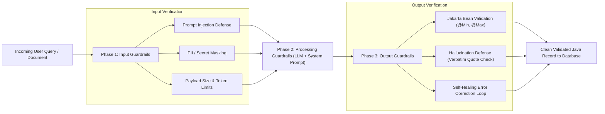

# Day 45: Structured Extraction & Guardrails

## Turning Unstructured Text into Validated Domain Entities with Hallucination Defenses

| Previous Day | Course Hub | Next Day |
|:---|:---:|---:|
| [Day 44: Memory & Conversation Management](../Day_44_Memory_Conversation_Management/Day_44_Memory_Conversation_Management.md) | [All 60 Days Overview](../../README.md) | [Day 46: RAG Pipeline in LangChain4j](../Day_46_RAG_Pipeline_in_LangChain4j/Day_46_RAG_Pipeline_in_LangChain4j.md) |

---

## What Will You Learn Today?

- **The Structured Extraction Contract**: Why raw prose from an LLM cannot be trusted in enterprise transactional pipelines, and how to enforce schema compliance with Java 21 `records`.
- **Field-Level Semantic Documentation**: Using `@Description` annotations to guide the model's understanding of edge cases, numeric formats, and business constraints.
- **The Tripartite Guardrail Defense**: Implementing defensive layers at Input (prompt injection defense), Processing (constrained generation), and Output (domain integrity validation).
- **Hallucination Defense via Verbatim Grounding**: Designing schemas that demand exact quote citations from source documents to eliminate fabricated facts.
- **The Self-Healing Recovery Loop**: Intercepting schema or domain validation failures and automatically re-prompting the model with error feedback for autonomous correction.

---

## 1. Real-World Analogy: The International Port Customs Manifest

Imagine an international container ship docking at a commercial port:
- Inside the shipping containers are thousands of loose, unlabeled crates: electronics, perishable fruits, machine components, medical equipment.
- If the port authority allowed dockworkers to accept shipments based on informal handwritten notes (*"A bunch of nice gadgets inside, trust us"*), tax revenues would plummet, counterfeit goods would slip through, and hazardous materials would ignite fires.

Instead, every international shipment must include an official **Customs Declaration Manifest**:
1. **Strict Schema**: Every item must have a Harmonized Tariff Code (HTS), weight in kilograms, declared monetary value, and manufacturer origin.
2. **Inspection Gate (Guardrails)**: Customs agents inspect containers with X-ray scanners to detect contraband, undeclared chemicals, or counterfeit manifests.
3. **Audit Trail**: Every declared item must map to a verified bill of lading issued by the factory.

```
       UNGUARDED PROSE (CHAOS)                         STRUCTURED EXTRACTION & GUARDRAILS
   ┌─────────────────────────────────────┐         ┌──────────────────────────────────────────────┐
   │ Raw LLM Output:                     │         │ 1. Input Guardrail: (Prompt Injection Check) │
   │ "The patient looks pretty tired and │         │    Passes safety screening ✅                 │
   │  his blood pressure was around 140  │         ├──────────────────────────────────────────────┤
   │  over 90 something. We should check │         │ 2. Structured Extraction:                    │
   │  his heart rate which was rapid."   │         │    ClinicalReport(                           │
   │                                     │         │      patientName="Marcus Brody",             │
   │ ❌ Unusable by downstream systems!  │         │      bloodPressure="142/92",                 │
   │ ❌ What is the exact pulse?         │         │      heartRateBpm=88,                        │
   │ ❌ Missing database schema types!   │         │      triageUrgency=URGENT                    │
   │ ❌ No verifiable medical source!    │         │    )                                         │
   └─────────────────────────────────────┘         ├──────────────────────────────────────────────┤
                                                   │ 3. Output Guardrail & Hallucination Defense: │
                                                   │    • BP format matches regex ^\d{2,3}/\d{2,3}$│
                                                   │    • Heart rate (88) within human bounds     │
                                                   │    • Verbatim quote verified against text ✅  │
                                                   └──────────────────────────────────────────────┘
```

In enterprise Java, your PostgreSQL databases, Kafka streams, and payment settlement microservices cannot parse unstructured chat prose. **Structured Extraction** forces the LLM to emit strict JSON conforming to your Java records, while **Guardrails** inspect and sanitize inputs and outputs to prevent security breaches and hallucinations.

---

## 2. Structured Extraction in LangChain4j

LangChain4j handles structured extraction natively through its `AiServices` engine. When an interface method specifies a Java `record` or class as its return type, LangChain4j:
1. Translates the Java record structure into a **JSON Schema**.
2. Reads `@Description` annotations on record components to inject semantic definitions into the schema.
3. Configures the model in JSON Schema / Structured Output mode.
4. Uses Jackson to deserialize the generated JSON string directly into the strongly typed Java instance.

### 2.1 Defining the Schema with `@Description`

Field names alone can be ambiguous to an LLM. Use `@Description` to provide explicit constraints, date formats, and semantic guardrails:

```java
package com.genai.langchain4j.extraction;

import dev.langchain4j.model.output.structured.Description;
import java.time.LocalDate;
import java.util.List;

public record LoanApplication(
    @Description("Full legal name of the primary applicant as shown on government ID")
    String applicantFullName,

    @Description("Annual gross income in USD before taxes")
    double annualGrossIncomeUsd,

    @Description("Credit score rating tier: EXCELLENT (750+), GOOD (700-749), FAIR (650-699), POOR (<650)")
    CreditTier creditTier,

    @Description("Requested loan principal amount in USD")
    double requestedPrincipalAmount,

    @Description("List of declared liabilities or active loan debts")
    List<String> declaredDebts,

    @Description("Exact date the application was submitted (YYYY-MM-DD)")
    LocalDate applicationDate,

    @Description("Verbatim quote from the applicant's letter stating their employment and income")
    String incomeVerificationQuote
) {
    public enum CreditTier { EXCELLENT, GOOD, FAIR, POOR }
}
```

### 2.2 The Declarative Extraction Interface

```java
package com.genai.langchain4j.extraction;

import dev.langchain4j.service.SystemMessage;
import dev.langchain4j.service.UserMessage;
import dev.langchain4j.service.V;

public interface LoanProcessorService {

    @SystemMessage("""
        You are a Senior Underwriting Compliance Officer.
        Extract the loan application details from the borrower's submitted correspondence.
        Do not make assumptions or extrapolate numbers not explicitly present in the text.
        """)
    @UserMessage("Submitted borrower documentation: {{borrowerNotes}}")
    LoanApplication extractLoanDetails(@V("borrowerNotes") String borrowerNotes);
}
```

---

## 3. The Tripartite Guardrail Defense

A production-grade AI system requires defensive checkpoints across three distinct phases of execution:



### Phase 1: Input Guardrails (Screening Inbound Text)
Before an input is forwarded to an expensive LLM API, screen it for malicious directives:
- **Prompt Injection Defense**: Reject strings containing `ignore previous instructions`, `system override`, or attempts to reveal developer instructions.
- **Payload Limits**: Reject requests exceeding maximum safe character counts (e.g., 10,000 characters) to prevent denial-of-service memory attacks.

### Phase 2: Processing Guardrails (In-Context Constraints)
- **Role Scoping**: Anchor the system prompt with strict negative constraints: *"Only extract verifiable information. If a field cannot be determined, output null or UNKNOWN."*
- **JSON Schema Mode**: Force the provider API to adhere strictly to the JSON schema, eliminating conversational preamble like *"Here is your JSON:"*.

### Phase 3: Output Guardrails (Domain Integrity & Hallucination Defense)
Never insert LLM outputs directly into a database without validation:
- **Jakarta Bean Validation**: Validate `@NotNull`, `@Pattern`, and numeric bounds (`@Min`, `@Max`).
- **Hallucination Detection**: Verify that numbers and quotes exist verbatim in the original source document.

---

## 4. Hallucination Defense via Verbatim Grounding

LLMs are prone to "hallucinating" plausible-sounding details when data is ambiguous. In medical, legal, or financial applications, an invented number or diagnosis can lead to catastrophic liability.

### The Grounding Pattern

To prevent hallucinations, include a **verbatim citation component** in your extraction record:

```java
public record MedicalDiagnosis(
    String diagnosisName,
    String icd10Code,
    @Description("The EXACT verbatim sentence from the physician's clinical notes justifying this diagnosis")
    String sourceEvidenceCitation
) {}
```

Your Java output guardrail then performs a deterministic substring check:

```java
public boolean verifyCitation(String originalDoctorNotes, MedicalDiagnosis diagnosis) {
    if (diagnosis.sourceEvidenceCitation() == null || diagnosis.sourceEvidenceCitation().isBlank()) {
        return false; // Grounding failed!
    }

    // Verify that the citation actually appears in the original text!
    String cleanSource = originalDoctorNotes.replaceAll("\\s+", " ").toLowerCase();
    String cleanCitation = diagnosis.sourceEvidenceCitation().replaceAll("\\s+", " ").toLowerCase();

    return cleanSource.contains(cleanCitation);
}
```

If the model fabricated a diagnosis that was never in the notes, it cannot produce a valid verbatim sentence from the source text, triggering the guardrail!

---

## 5. The Self-Healing Recovery Loop

What happens when an output guardrail fails? Instead of crashing the user request with a 500 Internal Server Error, implement **Self-Healing Extraction**.

```mermaid
sequenceDiagram
    autonumber
    actor App as Business Service
    participant Loop as Self-Healing Orchestrator
    participant Model as LLM (AiServices)
    participant Guard as Output Guardrail

    App->>Loop: extract(documentText)
    Loop->>Model: Call 1: Extract ClinicalReport
    Model-->>Loop: Returns JSON (heartRate=320 bpm)
    Loop->>Guard: validate(ClinicalReport)
    Guard-->>Loop: ❌ FAIL: Heart rate 320 exceeds maximum biological threshold (250 bpm)
    Note over Loop: Initiates Corrective Turn.<br/>Appends failure reason to prompt!
    Loop->>Model: Call 2: "Correction: Heart rate 320 bpm is invalid. Re-check text."
    Model-->>Loop: Returns JSON (heartRate=88 bpm)
    Loop->>Guard: validate(ClinicalReport)
    Guard-->>Loop: ✅ PASS: All constraints satisfied
    Loop-->>App: Returns verified ClinicalReport
```

By appending the validation error message to the conversation history and re-invoking the model, modern frontier models correct their formatting or extraction errors on the second attempt over 95% of the time.

---

## 6. Complete Runnable Companion Code Architecture

In this lesson's companion code (`Phase_07_LangChain4j/Day_45_Structured_Extraction_Guardrails/code/`), we provide a complete, pure Java 21 implementation:

```
Day_45_Structured_Extraction_Guardrails/code/
├── Description.java              # Custom annotation for field-level schema hints
├── ClinicalReport.java           # Structured entity with vitals, triage level, and verbatim citation
├── InputGuardrail.java           # Defense layer screening inputs for prompt injections & payload anomalies
├── OutputGuardrail.java          # Validation layer enforcing physiological bounds & citation verification
├── SelfHealingExtractor.java     # Multi-turn corrective loop recovering from initial extraction faults
└── StructuredExtractionDemo.java # Executable verification suite demonstrating all 4 security scenarios
```

### Verification & Demonstration Output

Execute `StructuredExtractionDemo.java`:

```bash
javac -d out Phase_07_LangChain4j/Day_45_Structured_Extraction_Guardrails/code/*.java
java -cp out com.genai.langchain4j.extraction.StructuredExtractionDemo
```

```
==================================================================
  DAY 45: STRUCTURED EXTRACTION & ENTERPRISE GUARDRAILS DEMO     
==================================================================

--- 1. Clean Structured Extraction with Verbatim Citation ---
[Attempt 1/3] Model generating structured extraction...
   [Output Guardrail] ✅ PASS: All clinical constraints and citations verified.

Extracted Clinical Entity:
   Patient Name:     Marcus Brody
   Age:              52
   Blood Pressure:   142/92
   Heart Rate:       88 bpm
   Triage Urgency:   URGENT
   Symptoms:         Severe chest tightness, Shortness of breath
   Verbatim Source:  "Patient Marcus Brody, 52 yo, presents with severe chest tightness and shortness of breath; BP recorded at 142/92, pulse 88 bpm."

--- 2. Self-Healing Extraction (Correcting Initial Citation Fault) ---
[Attempt 1/3] Model generating structured extraction...
   [Model Output] Emitted report missing verbatim citation!
   [Output Guardrail] ⚠️ FAIL: HALLUCINATION DEFENSE VIOLATION: Source citation quote is missing.
   [Self-Healing Loop] Appending error feedback to prompt for corrective retry...
[Attempt 2/3] Model generating structured extraction...
   [Output Guardrail] ✅ PASS: All clinical constraints and citations verified.
Final Healed Report Patient: Marcus Brody (Citation Verified: true)

--- 3. Input Guardrail Defense (Malicious Prompt Injection) ---
🛡️ Security Alert Intercepted: INPUT GUARDRAIL REJECTION: PROMPT_INJECTION_DETECTED: Forbidden instruction found: 'ignore previous instructions'

--- 4. Output Guardrail Domain Rule Enforcement ---
Validation Status: Valid=false | Error: Heart rate 320 bpm is outside clinical survival envelope.

==================================================================
  STRUCTURED EXTRACTION & GUARDRAILS DEMO COMPLETED SUCCESSFULLY 
==================================================================
```

---

## 7. Why Structured Extraction & Guardrails Matter for Enterprise AI

1. **Zero Downstream System Crashes**: Unvalidated JSON strings break database schemas and trigger serialization exceptions. Strongly typed records coupled with output guardrails guarantee schema integrity.
2. **Defensible Auditability**: Regulatory bodies (FDA in healthcare, SEC in financial services) require an explanation for automated decisions. The **Verbatim Citation Pattern** provides verifiable provenance for every extracted field.
3. **Protection Against Brand Reputation Damage**: Input guardrails shield your system against adversarial prompt injection, preventing attackers from hijacking your models to exfiltrate private data or generate abusive responses.

---

## 8. Practical Exercises

### Exercise 1: Expense Receipt Extraction with Currency Conversion
**Task**: Define a Java record `ExpenseReceipt` containing `merchant`, `expenseDate`, `currencyCode` (e.g. `USD`, `EUR`), `taxAmount`, and `totalAmount`. Add an output guardrail ensuring that `totalAmount` is strictly greater than `taxAmount`.
**Solution**:
```java
package com.genai.langchain4j.exercises;

import java.time.LocalDate;

public record ExpenseReceipt(
    String merchant,
    LocalDate expenseDate,
    String currencyCode,
    double taxAmount,
    double totalAmount
) {
    public boolean isValid() {
        return totalAmount > taxAmount && taxAmount >= 0.0 && totalAmount > 0.0;
    }
}
```

### Exercise 2: Email Triage Entity with Sentiment & Priority Scoring
**Task**: Create an extraction record `CustomerEmailTriage` with fields `senderEmail`, `subject`, `customerSentiment` (enum `POSITIVE`, `NEUTRAL`, `ANGRY`), `urgencyRating` (integer 1–5), and `requiresHumanEscalation` (boolean). Add a validation rule that automatically sets `requiresHumanEscalation = true` if `customerSentiment == ANGRY` or `urgencyRating >= 4`.
**Solution**:
```java
package com.genai.langchain4j.exercises;

public record CustomerEmailTriage(
    String senderEmail,
    String subject,
    Sentiment customerSentiment,
    int urgencyRating,
    boolean requiresHumanEscalation
) {
    public enum Sentiment { POSITIVE, NEUTRAL, ANGRY }

    public CustomerEmailTriage withComplianceRules() {
        boolean mustEscalate = (customerSentiment == Sentiment.ANGRY || urgencyRating >= 4);
        return new CustomerEmailTriage(senderEmail, subject, customerSentiment, urgencyRating, mustEscalate);
    }
}
```

### Exercise 3: Prompt Injection Regex Screen
**Task**: Build a utility class `SecurityScreen` that checks whether a user query contains Base64 encoded strings often used by attackers to sneak prompt injections past keyword filters.
**Solution**:
```java
package com.genai.langchain4j.exercises;

import java.util.Base64;
import java.util.regex.Matcher;
import java.util.regex.Pattern;

public class SecurityScreen {

    private static final Pattern BASE64_PATTERN = Pattern.compile("(?<![A-Za-z0-9+/=])[A-Za-z0-9+/]{20,}={0,2}(?![A-Za-z0-9+/=])");

    public static boolean containsSuspiciousBase64(String input) {
        if (input == null) return false;
        Matcher matcher = BASE64_PATTERN.matcher(input);
        while (matcher.find()) {
            String candidate = matcher.group();
            try {
                byte[] decoded = Base64.getDecoder().decode(candidate);
                String decodedText = new String(decoded).toLowerCase();
                if (decodedText.contains("system") || decodedText.contains("ignore") || decodedText.contains("password")) {
                    return true; // Found encoded injection!
                }
            } catch (IllegalArgumentException ignored) {
                // Not valid base64, ignore
            }
        }
        return false;
    }
}
```

---

## 9. Self-Check Quiz

### Question 1: What is the primary function of the `@Description` annotation in LangChain4j structured extraction?
- A) It is used only for generating Javadoc HTML documentation.
- B) It provides semantic descriptions and formatting constraints for each field in the generated JSON Schema sent to the LLM.
- C) It marks the field as a primary key in PostgreSQL.
- D) It encrypts the field using AES-256.

*Answer*: **B**. LangChain4j compiles the `@Description` text into property-level descriptions inside the JSON Schema. This provides the LLM with the context and formatting rules needed to extract accurate data.

---

### Question 2: Why are Input Guardrails placed *before* the LLM call rather than relying solely on the system prompt?
- A) To prevent prompt injection attacks from reaching the model, save API token costs on malicious inputs, and eliminate denial-of-service risks before executing expensive neural inference.
- B) Because LLMs cannot read English.
- C) Because Spring Boot requires all requests to be validated in filters.
- D) Input guardrails are optional and rarely used.

*Answer*: **A**. Input guardrails provide deterministic defense against prompt injections, filter out malicious payloads, and protect against resource exhaustion before incurring LLM latency and financial cost.

---

### Question 3: How does the "Verbatim Grounding Pattern" protect against factual hallucinations?
- A) It forces the user to provide their credit card before every prompt.
- B) It requires the LLM to output the exact verbatim sentence from the source document that justifies the extracted data, allowing a deterministic substring check to verify provenance.
- C) It hashes the text using MD5.
- D) It disables temperature in the model.

*Answer*: **B**. By requiring the model to extract and return the exact sentence where it found the fact, your Java backend can verify that the quote actually exists in the source document, immediately flagging hallucinated assertions.

---

### Question 4: In a Self-Healing Extraction architecture, what happens when an output guardrail detects a validation error?
- A) The entire server crashes.
- B) The validation error message is appended to the conversational context and sent back to the model, instructing it to correct the specific flaw on a subsequent turn.
- C) The user is banned from the platform.
- D) The system replaces the data with random numbers.

*Answer*: **B**. Rather than failing the request, the self-healing loop feeds the specific validation error back to the LLM, enabling the model to repair formatting mistakes or out-of-bounds fields autonomously.

---

### Question 5: Why is Java 21's `record` feature ideal for structured extraction?
- A) Records compile into faster GPU machine code.
- B) Records provide compact, immutable domain entities with automatic component reflection, eliminating boilerplate getters, setters, and equals/hashCode implementations.
- C) Records do not support serialization.
- D) Records allow cyclic references.

*Answer*: **B**. Records are lightweight, transparent, immutable carrier types whose component names and types can be directly inspected via reflection to generate JSON Schemas and deserialize Jackson objects with zero boilerplate.

---

| Previous Day | Course Hub | Next Day |
|:---|:---:|---:|
| [Day 44: Memory & Conversation Management](../Day_44_Memory_Conversation_Management/Day_44_Memory_Conversation_Management.md) | [All 60 Days Overview](../../README.md) | [Day 46: RAG Pipeline in LangChain4j](../Day_46_RAG_Pipeline_in_LangChain4j/Day_46_RAG_Pipeline_in_LangChain4j.md) |
