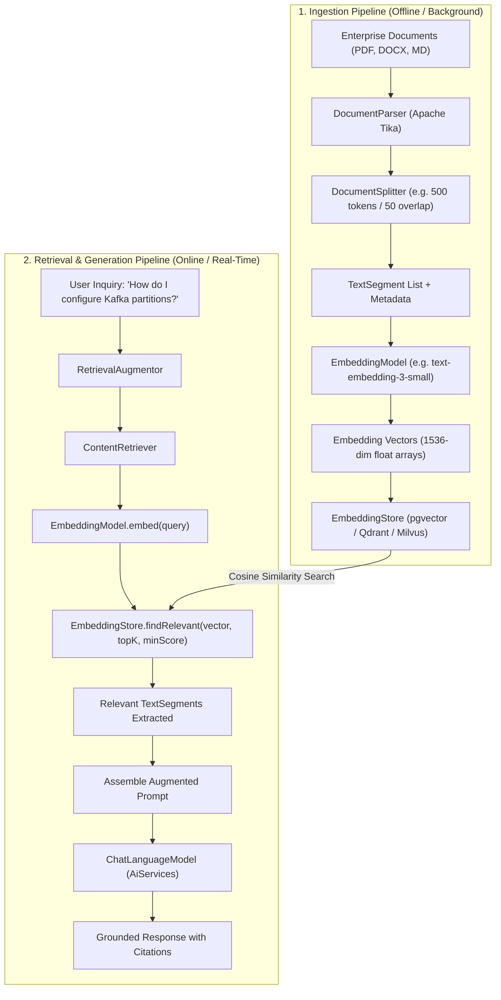

# Day 46: RAG Pipeline in LangChain4j

## Composable Document Ingestion, Semantic Retrieval, and Context Augmentation in Java

| Previous Day | Course Hub | Next Day |
|:---|:---:|---:|
| [Day 45: Structured Extraction & Guardrails](../Day_45_Structured_Extraction_Guardrails/Day_45_Structured_Extraction_Guardrails.md) | [All 60 Days Overview](../../README.md) | [Day 47: Advanced RAG — Chunking, Scoring & Re-Ranking](../Day_47_Advanced_RAG_Chunking_ReRanking/Day_47_Advanced_RAG_Chunking_ReRanking.md) |

---

## Friendly Welcome: The Open-Book AI Superpower

Hey there, friend! Welcome to Day 46.

Imagine you are sitting for the most difficult legal or medical examination in the world:
- If you had to take it **closed-book**, you'd have to memorize hundreds of thousands of laws and statistics. You'd likely forget the 2026 tax limits or hallucinate an outdated regulation.
- But imagine taking it **open-book with a world-class research librarian sitting next to you**! The moment a difficult question appears, the librarian speeds to the library shelves, photocopies the exact two paragraphs that answer the question, and lays them on your desk. You read the excerpt and answer with 100% factual accuracy, citing the exact chapter and page!

That open-book research superpower is **Retrieval-Augmented Generation (RAG)**!

Today, we are going to build a complete, composable RAG pipeline from scratch in LangChain4j. You'll learn how to parse enterprise documents (PDFs, Word docs, Markdown), chunk them into clean text segments, index them into vector stores, and connect your semantic search engine directly into your `AiServices` interfaces with one line of code!

---

> 💡 **New Word Alert! Key Concepts for Today**
>
> - **RAG (Retrieval-Augmented Generation)**: The technique of retrieving relevant facts from your private company documents and feeding them into the AI prompt before generating an answer. It eliminates hallucinations and grounds the AI in reality!
> - **Ingestion Pipeline**: The background "write path" where you parse raw documents (PDF, DOCX, TXT), split them into chunks, calculate embedding vectors, and save them in a vector database.
> - **`TextSegment`**: A manageable chunk of text (e.g. 300 to 500 tokens) accompanied by metadata (like document title, URL, page number, and tenant ID).
> - **`ContentRetriever`**: LangChain4j's core search SPI. Given a user query, it finds and returns the most relevant `TextSegment`s from your vector store or search index.
> - **`minScore`**: A similarity score cutoff (e.g. `0.75`). It tells the system: *"If the best matching document isn't relevant enough, don't include it!"* This prevents the AI from answering with irrelevant nonsense.
> - **Easy-RAG**: A convenient LangChain4j utility that lets you point to a folder of files and automatically parses, chunks, embeds, and indexes them with a single line of Java code!

---

## What Will You Learn Today?

- **The Decoupled RAG Philosophy**: Why LangChain4j splits RAG into clean, composable SPIs (Ingestion, Storage, Retrieval, Augmentation) rather than a monolithic black box.
- **The Ingestion Pipeline**: Parsing enterprise PDFs, Word documents, and text files, chunking them into `TextSegment` objects, generating vectors via `EmbeddingModel`, and indexing into `EmbeddingStore`.
- **The Core Retrieval SPIs**: Mastering `ContentRetriever`, `EmbeddingStoreContentRetriever`, and `RetrievalAugmentor`.
- **Declarative RAG with `AiServices`**: Connecting your semantic search engine directly into declarative Java interfaces with a single builder method.
- **Easy-RAG for Rapid Prototyping**: Ingesting directories of multi-format enterprise files with turnkey one-liners.
- **Precision Filtering & Quality Thresholds**: Tuning cosine similarity cutoffs (`minScore`) and document count limits (`maxResults`) to prevent token waste and context pollution.

---

## 1. Real-World Analogy: The Open-Book University Exam

Imagine sitting for the world's most demanding corporate tax law examination:

### Approach A: The Closed-Book Exam (Raw LLM)
You are locked in a room with no notes, no internet, and no tax code books. You must rely solely on whatever facts you memorized during university three years ago:
- When asked: *"Under Section 179 of the 2026 tax code, what is the equipment depreciation limit?"*
- You cannot remember the updated 2026 figure. You guess: *"Probably $1,000,000."*
- You hallucinated an outdated or incorrect number. In high-stakes business, this causes catastrophic regulatory fines.

### Approach B: The Open-Book Exam with an Expert Research Librarian (RAG)
You sit at a desk equipped with a high-speed research librarian:
1. When the question arrives, you hand it to the librarian: *"Find the section on 2026 equipment depreciation."*
2. The librarian consults the library catalog index (**Vector Store**), navigates directly to the exact shelf and page (**Semantic Retrieval**), photocopies the relevant paragraph, and lays it on your desk (**Context Augmentation**).
3. You read the excerpt: *"Section 179 limit for 2026 is $1,220,000."*
4. You synthesize the answer for the examiner with 100% factual accuracy and cite the official publication.

```
       RAW MODEL (CLOSED BOOK)                          RAG PIPELINE (OPEN BOOK)
   ┌──────────────────────────────┐            ┌──────────────────────────────────────────────┐
   │ Prompt: "What is the refund  │            │ User Prompt: "What is the refund policy?"    │
   │  policy for Tier-2 accounts?"│            └──────────────────────┬───────────────────────┘
   └──────────────┬───────────────┘                                   │
                  ▼                                                   ▼
   ┌──────────────────────────────┐            ┌──────────────────────────────────────────────┐
   │ Model Guess / Hallucination: │            │ ContentRetriever & EmbeddingStore            │
   │ "Refunds are typically 14    │            │ • Converts query to vector via EmbeddingModel│
   │  days, but check your terms."│            │ • Retrieves top-2 matches from pgvector      │
   │                              │            │   [Match 1: "Policy 402: 30-day window"]     │
   │ (Vague, ungrounded, unverified)           └──────────────────────┬───────────────────────┘
   └──────────────────────────────┘                                   │
                                                                      ▼
                                                       ┌──────────────────────────────────────────────┐
                                                       │ RetrievalAugmentor                           │
                                                       │ Injects retrieved paragraph into prompt:     │
                                                       │ "Answer using strictly this excerpt: ..."    │
                                                       └──────────────────────┬───────────────────────┘
                                                                              │
                                                                              ▼
                                                       ┌──────────────────────────────────────────────┐
                                                       │ Grounded Verifiable Response:                │
                                                       │ "Tier-2 accounts are eligible for refunds    │
                                                       │  within 30 calendar days (Policy 402)."      │
                                                       └──────────────────────────────────────────────┘
```

---

## 2. The Two Halves of LangChain4j RAG: Ingestion vs. Retrieval

A production RAG architecture consists of two asynchronous lifecycles:
1. **The Ingestion Pipeline (Write Path)**: Runs in the background (or via event triggers) to convert unstructured documents into indexed vector records.
2. **The Retrieval & Generation Pipeline (Read Path)**: Runs on-demand when a user submits a question.



---

## 3. Core Architectural Contracts

LangChain4j organizes RAG around distinct, single-responsibility interfaces:

### 3.1 `TextSegment`
A `TextSegment` represents a discrete chunk of text extracted from a larger document, accompanied by a key-value `Metadata` map (e.g. document name, page number, author, tenant ID):

```java
package dev.langchain4j.data.segment;

import dev.langchain4j.data.document.Metadata;

public class TextSegment {
    private final String text;
    private final Metadata metadata;
    // ...
}
```

### 3.2 `EmbeddingModel`
The engine that transforms human language strings into dense floating-point vector arrays:

```java
package dev.langchain4j.model.embedding;

import dev.langchain4j.data.embedding.Embedding;
import dev.langchain4j.data.segment.TextSegment;
import java.util.List;

public interface EmbeddingModel {
    Embedding embed(String text);
    Embedding embed(TextSegment textSegment);
    List<Embedding> embedAll(List<TextSegment> textSegments);
}
```

### 3.3 `EmbeddingStore<TextSegment>`
The database interface managing vector storage and similarity searches:

```java
package dev.langchain4j.store.embedding;

import dev.langchain4j.data.embedding.Embedding;
import dev.langchain4j.data.segment.TextSegment;
import java.util.List;

public interface EmbeddingStore<Embedded> {
    String add(Embedding embedding);
    void add(String id, Embedding embedding);
    String add(Embedding embedding, Embedded embedded);
    List<String> addAll(List<Embedding> embeddings, List<Embedded> embedded);

    List<EmbeddingMatch<Embedded>> findRelevant(Embedding referenceEmbedding, int maxResults, double minScore);
}
```

### 3.4 `ContentRetriever`
The high-level query SPI that bridges retrieval into `AiServices`:

```java
package dev.langchain4j.rag.content.retriever;

import dev.langchain4j.rag.content.Content;
import dev.langchain4j.rag.query.Query;
import java.util.List;

public interface ContentRetriever {
    List<Content> retrieve(Query query);
}
```

---

## 4. Easy-RAG: Rapid Prototyping in 3 Lines of Code

For quick prototypes, LangChain4j provides **Easy-RAG** via `EmbeddingStoreIngestor`:

```java
package com.genai.langchain4j.rag;

import dev.langchain4j.data.document.Document;
import dev.langchain4j.data.document.loader.FileSystemDocumentLoader;
import dev.langchain4j.model.openai.OpenAiEmbeddingModel;
import dev.langchain4j.store.embedding.inmemory.InMemoryEmbeddingStore;
import dev.langchain4j.store.embedding.EmbeddingStoreIngestor;

import java.util.List;

public class EasyRagSetup {

    public static InMemoryEmbeddingStore buildStoreFromFolder(String folderPath) {
        // 1. Load all PDFs, Word docs, and Markdown from directory
        List<Document> documents = FileSystemDocumentLoader.loadDocuments(folderPath);

        // 2. Initialize vector store & embedding model
        InMemoryEmbeddingStore embeddingStore = new InMemoryEmbeddingStore();
        OpenAiEmbeddingModel embeddingModel = OpenAiEmbeddingModel.withApiKey(System.getenv("OPENAI_API_KEY"));

        // 3. One-line ingestion pipeline: parses, splits, embeds, and indexes!
        EmbeddingStoreIngestor.ingest(documents, embeddingStore);

        return embeddingStore;
    }
}
```

---

## 5. Declarative RAG with `AiServices`

Connecting your RAG pipeline to a declarative interface is achieved via `.contentRetriever(...)`:

### Step 1: Define the Declarative Agent Interface

```java
package com.genai.langchain4j.rag;

import dev.langchain4j.service.SystemMessage;
import dev.langchain4j.service.UserMessage;

@SystemMessage("""
    You are an expert enterprise systems architect for Acme Cloud Solutions.
    Answer all user inquiries strictly using the corporate knowledge base retrieved for you.
    If the answer is not present in the provided excerpts, clearly state that you do not know.
    """)
public interface EnterpriseArchitectAgent {

    String askQuestion(@UserMessage String question);
}
```

### Step 2: Bind the `ContentRetriever` into `AiServices`

```java
package com.genai.langchain4j.rag;

import dev.langchain4j.model.chat.ChatLanguageModel;
import dev.langchain4j.model.embedding.EmbeddingModel;
import dev.langchain4j.rag.content.retriever.EmbeddingStoreContentRetriever;
import dev.langchain4j.service.AiServices;
import dev.langchain4j.store.embedding.EmbeddingStore;

public class AgentFactory {

    public static EnterpriseArchitectAgent createAgent(
            ChatLanguageModel chatModel,
            EmbeddingModel embeddingModel,
            EmbeddingStore store) {

        // Configure semantic search: top-3 closest matches with at least 0.75 similarity
        EmbeddingStoreContentRetriever contentRetriever = EmbeddingStoreContentRetriever.builder()
            .embeddingStore(store)
            .embeddingModel(embeddingModel)
            .maxResults(3)
            .minScore(0.75) // Prevents irrelevant document hallucination
            .build();

        // Declarative binding: LangChain4j automatically executes the RAG retrieval loop!
        return AiServices.builder(EnterpriseArchitectAgent.class)
            .chatLanguageModel(chatModel)
            .contentRetriever(contentRetriever)
            .build();
    }
}
```

---

## 6. Complete Runnable Companion Code Architecture

In this lesson's companion code (`Phase_07_LangChain4j/Day_46_RAG_Pipeline_in_LangChain4j/code/`), we provide a complete, pure Java 21 implementation of LangChain4j's RAG pipeline:

```
Day_46_RAG_Pipeline_in_LangChain4j/code/
├── TextSegment.java                   # Document chunk holding text and metadata
├── Embedding.java                     # Dense float array vector with cosine similarity
├── EmbeddingMatch.java                # Search match result container with score sorting
├── EmbeddingModel.java                # Functional contract for text embedding
├── SimulatedEmbeddingModel.java       # Deterministic 8-dimensional semantic embedding engine
├── InMemoryEmbeddingStore.java        # Thread-safe vector store with similarity scoring
├── ContentRetriever.java              # Retrieval SPI contract matching LangChain4j
├── EmbeddingStoreContentRetriever.java# Vector-backed implementation of ContentRetriever
├── RetrievalAugmentor.java            # Enterprise prompt builder assembling grounded context
└── LangChain4jRagDemo.java            # Executable verification suite demonstrating ingestion and RAG queries
```

### Verification & Demonstration Output

Execute `LangChain4jRagDemo.java`:

```bash
javac -d out Phase_07_LangChain4j/Day_46_RAG_Pipeline_in_LangChain4j/code/*.java
java -cp out com.genai.langchain4j.rag.LangChain4jRagDemo
```

```
==================================================================
  DAY 46: LANGCHAIN4J RAG PIPELINE & RETRIEVAL AUGMENTATION DEMO 
==================================================================

--- 1. Ingesting Enterprise Knowledge Base Documents ---
   [Ingested doc-1] from k8s-security.pdf: "Acme Cloud Kubernetes clusters enforce Pod Securit..."
   [Ingested doc-2] from spring-database-guide.pdf: "Spring Boot microservices connect to pgvector data..."
   [Ingested doc-3] from corporate-policy.pdf: "Enterprise refund policy permits customer subscrip..."
   [Ingested doc-4] from kafka-operations.pdf: "Apache Kafka cluster partitions must be scaled to ..."
Total Indexed Documents: 4

--- 2. Executing Semantic Query on Database Policies ---
Retrieved Sources Count: 1
   -> Matched Doc: spring-database-guide.pdf | Spring Boot microservices connect to pgvector database instances using HikariCP connection pools capped at 20 connections.

Generated Augmented Prompt Sent to LLM:

Answer the customer inquiry based exclusively on the following enterprise documentation:

--- BEGIN DOCUMENTATION CONTEXT ---
[Source 1] (doc: spring-database-guide.pdf, section: HikariPools):
Spring Boot microservices connect to pgvector database instances using HikariCP connection pools capped at 20 connections.

--- END DOCUMENTATION CONTEXT ---

User Inquiry: How many connections are configured for the Spring postgres database pool?
If the documentation does not contain the answer, state clearly that you do not know.

--- 3. Executing Semantic Query on Refund Timelines ---
Retrieved Sources Count: 1
   -> Matched Doc: corporate-policy.pdf | Enterprise refund policy permits customer subscription reversals strictly within 30 calendar days of invoice dispatch.

==================================================================
  LANGCHAIN4J RAG PIPELINE VERIFICATION COMPLETED SUCCESSFULLY   
==================================================================
```

---

## 7. Why LangChain4j RAG Matters for Senior Engineers

1. **Decoupled Architecture**: Unlike frameworks that bundle vector search tightly with model communication, LangChain4j treats `ContentRetriever` as an independent SPI. You can swap in hybrid search, Elasticsearch, or pgvector without changing your prompt templates or domain interfaces.
2. **Deterministic Grounding**: By enforcing strict `minScore` cutoffs, queries that do not match enterprise documents return zero sources, allowing the agent to honestly report that it does not know rather than fabricating an answer.
3. **Clean Enterprise Maintenance**: Upgrading embedding models or re-indexing vector stores is completely decoupled from your business layer.

---

## 8. Practical Exercises

### Exercise 1: Multi-Tenant Metadata Filtering
**Task**: Extend `ContentRetriever` to accept a `tenantId` string, filtering matches so that queries from `tenant-A` never retrieve documents belonging to `tenant-B`.
**Solution**:
```java
package com.genai.langchain4j.exercises;

import com.genai.langchain4j.rag.TextSegment;
import java.util.List;

public class MultiTenantContentRetriever {

    public static List<TextSegment> filterByTenant(List<TextSegment> retrieved, String expectedTenantId) {
        return retrieved.stream()
            .filter(seg -> expectedTenantId.equals(seg.metadata().get("tenantId")))
            .toList();
    }
}
```

### Exercise 2: Document Source Citation Formatter
**Task**: Build a helper method `String formatCitations(List<TextSegment> segments)` that converts retrieved segments into a markdown table of cited sources (Doc Name, Section, Excerpt).
**Solution**:
```java
package com.genai.langchain4j.exercises;

import com.genai.langchain4j.rag.TextSegment;
import java.util.List;

public class CitationFormatter {

    public static String formatCitations(List<TextSegment> segments) {
        StringBuilder sb = new StringBuilder("| # | Document | Section | Excerpt |\n|---|---|---|---|\n");
        for (int i = 0; i < segments.size(); i++) {
            TextSegment s = segments.get(i);
            sb.append(String.format("| %d | %s | %s | %s |\n",
                i + 1,
                s.metadata().getOrDefault("document", "Unknown"),
                s.metadata().getOrDefault("section", "N/A"),
                s.text().substring(0, Math.min(60, s.text().length())) + "..."
            ));
        }
        return sb.toString();
    }
}
```

### Exercise 3: Reciprocal Similarity Threshold Calibrator
**Task**: Write a utility method that checks the distribution of scores in `List<Double> similarityScores`. If the top score is below a strict threshold of $0.65$, return an empty list to signal that no relevant context was found.
**Solution**:
```java
package com.genai.langchain4j.exercises;

import java.util.List;

public class RelevanceThresholdCalibrator {

    public static final double MIN_ACCEPTABLE_SIMILARITY = 0.65;

    public static boolean isContextReliable(List<Double> scores) {
        if (scores == null || scores.isEmpty()) return false;
        return scores.get(0) >= MIN_ACCEPTABLE_SIMILARITY;
    }
}
```

---

## 9. Self-Check Quiz

### Question 1: What is the primary role of `ContentRetriever` in LangChain4j?
- A) To convert Java bytecodes into WebAssembly.
- B) To act as the standard query SPI that accepts a user query and returns relevant `TextSegment` contents from a vector store or search index.
- C) To bill the user's credit card.
- D) To format JSON schemas.

*Answer*: **B**. `ContentRetriever` is the foundational SPI bridging retrieval mechanisms (vector stores, hybrid search, keyword indexes) to the generation layer (`AiServices`).

---

### Question 2: In LangChain4j RAG, why is setting a `minScore` threshold on `EmbeddingStoreContentRetriever` critical?
- A) It speeds up the GPU clock rate.
- B) It prevents low-similarity, irrelevant documents from being injected into the prompt, preventing the model from hallucinating or answering off-topic questions.
- C) It is required by the SQL standard.
- D) It reduces the memory size of Java virtual threads.

*Answer*: **B**. Without a `minScore` threshold, the vector store will always return the top-K closest vectors, even if their similarity is completely irrelevant to the user's question, causing context contamination.

---

### Question 3: What is Easy-RAG in LangChain4j?
- A) A low-cost subscription tier from OpenAI.
- B) A turnkey utility (`EmbeddingStoreIngestor`) that automates document parsing, recursive splitting, embedding generation, and vector indexing in a few lines of code.
- C) A specialized Python script that runs outside the JVM.
- D) An embedded relational database.

*Answer*: **B**. Easy-RAG provides high-level convenience methods allowing developers to point to a folder of enterprise files and have them automatically parsed, chunked, embedded, and stored with minimal boilerplate.

---

### Question 4: How are retrieved documents injected into a declarative `AiServices` agent?
- A) By passing them manually in every method invocation.
- B) By configuring `.contentRetriever(...)` on the `AiServices.builder(...)`, allowing the framework to execute retrieval and prompt augmentation transparently.
- C) By writing the files to the JVM classpath.
- D) `AiServices` does not support RAG.

*Answer*: **B**. By attaching a `ContentRetriever` to `AiServices.builder()`, LangChain4j intercepts user messages, queries the retriever, constructs the augmented prompt, and invokes the model automatically.

---

### Question 5: What is the purpose of `TextSegment` metadata in enterprise search?
- A) To store the author, document title, section heading, and security tenant ID alongside the text chunk, enabling post-filtering and verifiable citations.
- B) To store Java class reflection bytecodes.
- C) To encrypt the database disk partition.
- D) Metadata is ignored by LangChain4j.

*Answer*: **A**. Metadata carries critical provenance data (document URI, page number, tenant ID) allowing systems to format source citations and filter search results by security context.

---

## 10. Day 46 Wrap-Up & What's Next

You've built the open-book research engine that powers modern enterprise AI search!

Let's review today's golden rules:
- **Two asynchronous paths**: The background Ingestion Pipeline (parse, chunk, embed, store) and the real-time Retrieval Pipeline (search, augment, generate).
- **`ContentRetriever` is the bridge**: It queries your vector store and returns relevant `TextSegment`s with metadata intact.
- **Tune `minScore`**: Protect your context window from low-quality, irrelevant noise by enforcing a strict similarity cutoff.
- **Easy-RAG for rapid wins**: Ingesting an entire folder of mixed enterprise documents takes just a few lines of code.

### What's Coming Up Next?
Basic vector search is great, but what happens when a user types a vague question? Or what if a search returns 20 documents, but the truly crucial fact is buried at #18?

Tomorrow in **[Day 47: Advanced RAG — Chunking, Scoring & Re-Ranking](../Day_47_Advanced_RAG_Chunking_ReRanking/Day_47_Advanced_RAG_Chunking_ReRanking.md)**, we'll level up our retrieval game with semantic chunking, cross-encoder re-ranking models (like Cohere and Jina), and query expansion!

---

| Previous Day | Course Hub | Next Day |
|:---|:---:|---:|
| [Day 45: Structured Extraction & Guardrails](../Day_45_Structured_Extraction_Guardrails/Day_45_Structured_Extraction_Guardrails.md) | [All 60 Days Overview](../../README.md) | [Day 47: Advanced RAG — Chunking, Scoring & Re-Ranking](../Day_47_Advanced_RAG_Chunking_ReRanking/Day_47_Advanced_RAG_Chunking_ReRanking.md) |

