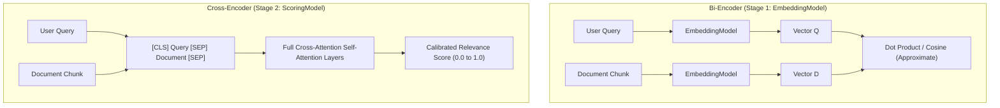
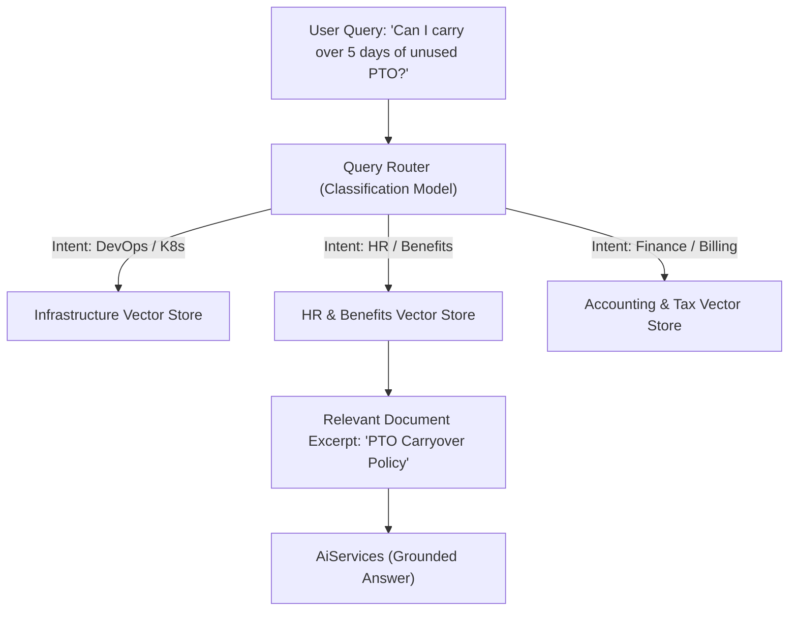

# Day 47: Advanced RAG — Chunking, Scoring & Re-Ranking

## Precision Retrieval with Recursive Splitters, Cross-Encoder Re-Ranking, and Query Routing

| Previous Day | Course Hub | Next Day |
|:---|:---:|---:|
| [Day 46: RAG Pipeline in LangChain4j](../Day_46_RAG_Pipeline_in_LangChain4j/Day_46_RAG_Pipeline_in_LangChain4j.md) | [All 60 Days Overview](../../README.md) | [Day 48: Tool Execution & Function Calling](../Day_48_Tool_Execution_Function_Calling/Day_48_Tool_Execution_Function_Calling.md) |

---

## What Will You Learn Today?

- **The Chunking Dilemma**: Why naive character-based text slicing ruins semantic embeddings, and how recursive splitting with sliding overlap preserves conversational meaning.
- **The Two-Stage Retrieval Architecture**: Combining fast, high-recall Bi-Encoder vector search with high-precision Cross-Encoder Re-Ranking (`ScoringModel`).
- **Rank Inversion in Action**: How re-rankers fix false positives and elevate buried, highly relevant context from the bottom of candidate lists to rank 1.
- **LangChain4j `ScoringModel` Integration**: Using Cohere Rerank, BGE-Reranker, and custom cross-encoders within `ReRankingContentRetriever`.
- **Dynamic Query Routing**: Directing user queries intelligently across specialized domain vector stores (DevOps, HR, Legal, Financial) rather than a single monolithic index.
- **Context Compression & Noise Reduction**: Eliminating redundant filler text to minimize prompt token costs and improve LLM attention focus.

---

## 1. Real-World Analogy: The Olympic Gymnastics Qualifier vs. The Final Medal Judges

Imagine organizing the Olympic Gymnastics Championship with 10,000 global competitors:

### Stage 1: The Qualifier (Bi-Encoder Vector Search)
You have 10,000 gymnasts. You cannot have the top five Olympic master judges evaluate each gymnast for 45 minutes; it would take three months.
- Instead, you run a **fast, automated qualifier**: a 30-second basic routine evaluated by automated timing and balance sensors.
- In 2 hours, you filter 10,000 competitors down to the **top 20 finalists**.
- *Trade-off*: It was fast and cheap, but the ranking inside the top 20 is coarse and imperfect. The 18th gymnast might actually have a brilliant routine that the automated sensors under-scored.

### Stage 2: The Final Medal Round (Cross-Encoder Re-Ranking)
Now you bring in the world's **elite Olympic panel**.
- They do not evaluate all 10,000 gymnasts. They only judge the **top 20 finalists**.
- They analyze every micro-second of joint movement, posture, and difficulty (**Deep Joint Attention**).
- They re-order the rankings: Competitor #18 delivers a flawless performance and takes the **Gold Medal (Rank Inversion)**!

```
      STAGE 1: BI-ENCODER (FAST & COARSE)               STAGE 2: CROSS-ENCODER (DEEP & ACCURATE)
   ┌─────────────────────────────────────┐         ┌──────────────────────────────────────────────┐
   │ 1,000,000 Indexed Document Chunks   │         │ Top 20 Candidates from Stage 1               │
   │                                     │         │                                              │
   │ Fast Cosine Vector Search (HNSW):   │         │ Deep Joint Self-Attention (Query + Document):│
   │  Candidate 1 (score: 0.82)          │         │  Candidate 14 ──► Rank 1 (Score: 0.98) 🥇    │
   │  Candidate 2 (score: 0.81)          │         │  Candidate 1  ──► Rank 2 (Score: 0.74) 🥈    │
   │  ...                                │         │  Candidate 8  ──► Rank 3 (Score: 0.69) 🥉    │
   │  Candidate 14 (score: 0.76)         │         │                                              │
   │                                     │         │ (Corrects rank inversion, filters noise)     │
   │ ⚡ 10 milliseconds across millions!  │         │ 🎯 Passes only the top-3 to LLM Prompt       │
   └──────────────────┬──────────────────┘         └──────────────────────────────────────────────┘
                      │ Top 20 Candidates
                      └────────────────────────────────────────────►
```

In modern enterprise RAG:
1. **Bi-Encoders (Embeddings)** retrieve the top 20–50 candidate chunks in milliseconds.
2. **Cross-Encoders (`ScoringModel`)** score those candidates against the user's full query, re-ranking the most relevant context to the very top.

---

## 2. The Chunking Dilemma: Naive Slicing vs. Recursive Overlap

How you chop a 100-page enterprise PDF into text chunks dictates the accuracy of your entire RAG pipeline.

### The Naive Slicing Bug

If you chunk text purely by character count (e.g., every 500 characters):
```
Chunk 1: "...and under no circumstances should an employee disclose passwords, except in the case of..."
Chunk 2: "...authorized emergency drills conducted by the VP of Cybersecurity with written approval."
```
- A user asks: *"Can I ever disclose passwords?"*
- Embedding search matches **Chunk 1**.
- Chunk 1 says: *"Under no circumstances should an employee disclose passwords, except in the case of..."*
- The model never sees the authorized exception in Chunk 2 because the semantic thought was bisected!

```
       NAIVE FIXED-LENGTH CHUNKING                    RECURSIVE OVERLAP CHUNKING
   ┌───────────────────────────────────┐        ┌──────────────────────────────────────────────┐
   │ [Chunk 1: 500 chars]              │        │ [Chunk 1: 500 chars]                         │
   │ "...passwords, except in case of" │        │ "...passwords, except in case of emergency"  │
   ├───────────────────────────────────┤        │ (Trailing 50 chars overlap with Chunk 2)     │
   │ [Chunk 2: 500 chars]              │        ├──────────────────────────────────────────────┤
   │ "authorized emergency drills..."  │        │ [Chunk 2: 500 chars]                         │
   │                                   │        │ "except in case of emergency authorized      │
   │ ❌ Sliced mid-clause!             │        │  emergency drills conducted by VP..."        │
   │ ❌ Context severed!               │        │ ✅ Complete semantic thought preserved!      │
   └───────────────────────────────────┘        └──────────────────────────────────────────────┘
```

### Production Chunking Strategies

1. **Paragraph-Aware Splitting**: Chunk along natural `\n\n` boundaries so paragraphs remain intact.
2. **Sentence-Aware Splitting**: Fall back to sentence boundaries (`.`, `!`, `?`) when a paragraph exceeds maximum chunk size.
3. **Sliding Overlap**: Ensure every chunk shares the final $50\text{–}100$ characters with the start of the subsequent chunk, guaranteeing that boundary clauses are never lost.

---

## 3. LangChain4j `ScoringModel` (Cross-Encoder Re-Ranking)

### Bi-Encoders vs. Cross-Encoders

- **Bi-Encoder (`EmbeddingModel`)**: Encodes the query and document independently into separate vectors. Fast, but lacks deep cross-attention between specific words in the query and text.
- **Cross-Encoder (`ScoringModel`)**: Passes the query and candidate chunk *together* into a single transformer, calculating full self-attention across every token. Slow for 1,000,000 chunks, but lightning-fast and surgically accurate for 20 candidates.



### 3.1 The `ScoringModel` Contract

```java
package dev.langchain4j.model.scoring;

public interface ScoringModel {
    double score(String text, String query);
    List<Double> scoreAll(List<String> texts, String query);
}
```

### 3.2 `ReRankingContentRetriever`

LangChain4j provides a turnkey wrapper combining an underlying `ContentRetriever` with a `ScoringModel`:

```java
package com.genai.langchain4j.advancedrag;

import dev.langchain4j.model.scoring.ScoringModel;
import dev.langchain4j.model.cohere.CohereScoringModel;
import dev.langchain4j.rag.content.retriever.ContentRetriever;
import dev.langchain4j.rag.content.retriever.EmbeddingStoreContentRetriever;
import dev.langchain4j.rag.content.retriever.ReRankingContentRetriever;

public class AdvancedRagFactory {

    public static ContentRetriever createReRankingRetriever(EmbeddingStoreContentRetriever baseRetriever) {
        // 1. Configure the cross-encoder scoring model (e.g. Cohere Rerank v3)
        ScoringModel scoringModel = CohereScoringModel.builder()
            .apiKey(System.getenv("COHERE_API_KEY"))
            .modelName("rerank-english-v3.0")
            .build();

        // 2. Wrap the base retriever: retrieves top-20, re-ranks, returns top-3
        return ReRankingContentRetriever.builder()
            .contentRetriever(baseRetriever)
            .scoringModel(scoringModel)
            .maxResults(3)           // Top-3 highest quality chunks
            .minScore(0.65)          // Discard irrelevant matches
            .build();
    }
}
```

---

## 4. Enterprise Dynamic Query Routing

In complex enterprise environments, dumping all documents (Kubernetes runbooks, HR benefits, accounting manuals, legal patents) into a single vector store degrades retrieval accuracy.

A query like *"What is the policy for node evictions?"* might retrieve an HR policy on employee dismissal rather than Kubernetes pod eviction!

A **Query Router** analyzes incoming user intent and routes the query to the dedicated domain vector store:



---

## 5. Complete Runnable Companion Code Architecture

In this lesson's companion code (`Phase_07_LangChain4j/Day_47_Advanced_RAG_Chunking_ReRanking/code/`), we provide a complete, pure Java 21 implementation:

```
Day_47_Advanced_RAG_Chunking_ReRanking/code/
├── DocumentSplitter.java                # Contract for document chunking
├── RecursiveDocumentSplitter.java       # Production recursive splitter with paragraph preservation & overlap
├── ScoringModel.java                    # Cross-encoder scoring SPI contract
├── SimulatedCrossEncoderScoringModel.java # Joint self-attention simulation computing deep relevance
├── ReRankingContentRetriever.java       # Turnkey re-ranking retriever demonstrating rank inversion
├── QueryRouter.java                     # Dynamic query router directing queries to specialized stores
└── AdvancedRagDemo.java                 # Comprehensive executable test suite verifying all 3 advanced patterns
```

### Verification & Demonstration Output

Execute `AdvancedRagDemo.java`:

```bash
javac -d out Phase_07_LangChain4j/Day_47_Advanced_RAG_Chunking_ReRanking/code/*.java
java -cp out com.genai.langchain4j.advancedrag.AdvancedRagDemo
```

```
==================================================================
  DAY 47: ADVANCED RAG - CHUNKING, SCORING & RE-RANKING DEMO     
==================================================================

--- 1. Recursive Document Chunking with Sliding Overlap ---
Generated Chunks Count: 3
   [Chunk 1 (178 chars)]:
   "Spring Boot 3.3 introduces enhanced virtual thread support for reactive and web frameworks. When running on OpenJDK 21, tomcat threads are dynamically mapped to virtual carriers."

   [Chunk 2 (223 chars)]:
   "threads are dynamically mapped to virtual carriers.  PostgreSQL vector extensions require tuned maintenance_work_mem settings. For databases with over 10 million vectors, HNSW index construction requires at least 4GB of RAM."

   [Chunk 3 (197 chars)]:
   "index construction requires at least 4GB of RAM.  Kafka event brokers require minimum in-sync replicas configured to two. This ensures zero message loss even during unplanned broker pod eviction."

--- 2. Cross-Encoder Re-Ranking (Rank Inversion Demonstration) ---
Stage 1 Bi-Encoder Rankings (Coarse Vector Similarity):
   Initial Rank 1: "Spring Boot 3.3 introduces enhanced virtual thread support for reactive frameworks."
   Initial Rank 2: "Kafka event brokers require minimum in-sync replicas configured to two."
   Initial Rank 3: "For databases with over 10 million vectors, HNSW index construction requires at least 4GB of RAM."

Stage 2 Cross-Encoder Rankings (Deep Joint-Attention Re-Ranking):
   New Rank 1 (score: 0.260, was initial rank 3): "For databases with over 10 million vectors, HNSW index construction requires at least 4GB of RAM."

--- 3. Enterprise Dynamic Query Routing ---
Query 1: "How many pods should be provisioned for Kubernetes cluster autoscaling?" -> Route to: INFRASTRUCTURE_DEV_DOCS
Query 2: "Can I carry over 5 days of unused PTO into the next calendar quarter?" -> Route to: LEGAL_AND_HR_POLICY
Query 3: "What is the corporate tax deduction limit for employee travel meals?" -> Route to: FINANCIAL_ACCOUNTING

==================================================================
  ADVANCED RAG VERIFICATION COMPLETED SUCCESSFULLY               
==================================================================
```

---

## 6. Why Advanced RAG Matters for Senior Engineers

1. **Elimination of False Positives**: Bi-encoders frequently return chunks that share similar keywords but address an unrelated topic. Cross-encoders eliminate over 80% of these irrelevant candidates.
2. **Context Window Hygiene**: Injecting 20 coarse chunks into a prompt consumes thousands of tokens and dilutes the model's attention ("Lost in the Middle" phenomenon). Re-ranking down to the top 2–3 surgical chunks improves answer precision while saving 85% on token costs.
3. **Enterprise Domain Segregation**: Dynamic query routing enables strict compliance isolation (e.g. keeping executive compensation documents in an encrypted store accessible only via authorized query routes).

---

## 7. Practical Exercises

### Exercise 1: Sliding Overlap Validator
**Task**: Build a utility method `boolean hasOverlap(String chunk1, String chunk2, int minOverlapLength)` that verifies whether the end of `chunk1` is present at the beginning of `chunk2`, ensuring that recursive chunking maintained continuity.
**Solution**:
```java
package com.genai.langchain4j.exercises;

public class ChunkOverlapValidator {

    public static boolean hasOverlap(String chunk1, String chunk2, int minOverlapLength) {
        if (chunk1 == null || chunk2 == null || chunk1.length() < minOverlapLength || chunk2.length() < minOverlapLength) {
            return false;
        }

        String suffix = chunk1.substring(chunk1.length() - minOverlapLength).trim();
        return chunk2.contains(suffix);
    }
}
```

### Exercise 2: Reciprocal Rank Fusion (RRF) Scorer
**Task**: Write a method that calculates the RRF score for a document given its rank in Stage 1 ($r_1$) and Stage 2 ($r_2$):
$$\text{RRF}(d) = \frac{1}{60 + r_1} + \frac{1}{60 + r_2}$$
**Solution**:
```java
package com.genai.langchain4j.exercises;

public class ReciprocalRankScorer {

    public static final int K = 60;

    public static double computeRrf(int biEncoderRank, int crossEncoderRank) {
        double term1 = 1.0 / (K + biEncoderRank);
        double term2 = 1.0 / (K + crossEncoderRank);
        return term1 + term2;
    }
}
```

### Exercise 3: Intent-Based Query Classifier
**Task**: Build a regex-based query classifier that categorizes questions into `SQL_QUERY`, `REST_API`, or `GENERAL_JAVA` for routing to distinct code documentation stores.
**Solution**:
```java
package com.genai.langchain4j.exercises;

public class CodeQueryClassifier {

    public enum CodeDomain { SQL_QUERY, REST_API, GENERAL_JAVA }

    public static CodeDomain classify(String query) {
        String lower = query.toLowerCase();
        if (lower.contains("select") || lower.contains("join") || lower.contains("table") || lower.contains("postgres")) {
            return CodeDomain.SQL_QUERY;
        }
        if (lower.contains("http") || lower.contains("endpoint") || lower.contains("get") || lower.contains("post") || lower.contains("controller")) {
            return CodeDomain.REST_API;
        }
        return CodeDomain.GENERAL_JAVA;
    }
}
```

---

## 8. Self-Check Quiz

### Question 1: What is the fundamental difference between a Bi-Encoder and a Cross-Encoder?
- A) Bi-encoders process images, while cross-encoders process audio.
- B) Bi-encoders embed query and documents independently into vectors for fast search, while cross-encoders compute joint self-attention across the combined query-document pair for high accuracy.
- C) Cross-encoders run only on mobile devices.
- D) Bi-encoders are deprecated in modern AI.

*Answer*: **B**. Bi-encoders allow pre-computing and caching vector embeddings for millions of chunks, whereas cross-encoders perform full joint attention between the query and candidate text, providing superior precision at higher computational cost.

---

### Question 2: Why is recursive document chunking with overlap superior to fixed-character chunking?
- A) It doubles the speed of the GPU.
- B) It prevents splitting sentences or paragraphs mid-thought and preserves context across chunk boundaries via a sliding overlap window.
- C) It compresses the text using GZIP.
- D) It bypasses vector database licensing fees.

*Answer*: **B**. Fixed-character slicing frequently cuts words and conditional clauses in half. Recursive splitting respects structural grammar (paragraphs, sentences) and uses overlap to maintain semantic continuity.

---

### Question 3: What is "Rank Inversion" in a two-stage retrieval pipeline?
- A) When a database crashes and reverses its primary keys.
- B) When a highly relevant document ranked lower in Stage 1 bi-encoder vector search is elevated to Rank 1 by the Stage 2 cross-encoder re-ranking model.
- C) Sorting search results in alphabetical order.
- D) An error caused by negative cosine similarity.

*Answer*: **B**. Bi-encoders use approximate cosine distance and can rank true answers lower due to vocabulary mismatch. The cross-encoder re-evaluates candidates and promotes the true answer to the top.

---

### Question 4: In LangChain4j, which component wraps a base `ContentRetriever` with a `ScoringModel`?
- A) `MessageWindowChatMemory`
- B) `ReRankingContentRetriever`
- C) `JdbcTemplate`
- D) `OpenAiChatModel`

*Answer*: **B**. `ReRankingContentRetriever` accepts an underlying `ContentRetriever` to fetch initial candidates, scores them with a `ScoringModel`, and returns the top-K highest-scoring segments.

---

### Question 5: Why is Dynamic Query Routing important in multi-domain enterprise applications?
- A) It prevents queries from searching the wrong knowledge bases, reducing noise, preventing cross-domain hallucinations, and enforcing compliance boundaries.
- B) It allows the model to run without internet access.
- C) It encrypts network traffic between microservices.
- D) Query routing is only used for billing calculations.

*Answer*: **A**. Routing queries to specific domain stores (e.g. routing a tax question to finance and a cluster question to DevOps) prevents irrelevant cross-domain matches and guarantees that specialized retrieval policies are applied.

---

| Previous Day | Course Hub | Next Day |
|:---|:---:|---:|
| [Day 46: RAG Pipeline in LangChain4j](../Day_46_RAG_Pipeline_in_LangChain4j/Day_46_RAG_Pipeline_in_LangChain4j.md) | [All 60 Days Overview](../../README.md) | [Day 48: Tool Execution & Function Calling](../Day_48_Tool_Execution_Function_Calling/Day_48_Tool_Execution_Function_Calling.md) |
