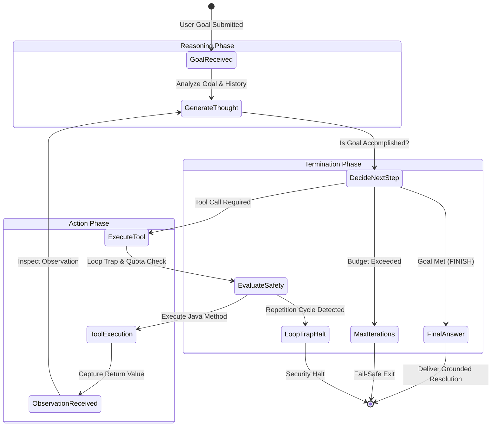

# Day 49: Building a ReAct Agent in Java

## Engineering Autonomous Multi-Step Reasoning, Tool Loops, and Industrial Safety Guards

| Previous Day | Course Hub | Next Day |
|:---|:---:|---:|
| [Day 48: Tool Execution & Function Calling](../Day_48_Tool_Execution_Function_Calling/Day_48_Tool_Execution_Function_Calling.md) | [All 60 Days Overview](../../README.md) | [Day 50: Model Context Protocol (MCP) in Java](../../Phase_08_Enterprise_Production/Day_50_Model_Context_Protocol_MCP/Day_50_Model_Context_Protocol_MCP.md) |

---

## What Will You Learn Today?

- **The Autonomous Leap: From Chatbots to Agents**: Why simple single-turn tool calling fails on complex business workflows, and how the ReAct (Reasoning + Acting) paradigm enables autonomous multi-step problem solving.
- **The Synergy of Thought and Action**: How interleaving verbal reasoning traces (*Thoughts*) with external tool invocations (*Actions*) eliminates both hallucinations and blind tool execution.
- **The ReAct State Machine in Pure Java**: Implementing the classic `Thought -> Action -> Observation -> Next Thought` cycle with explicit state management and token accounting.
- **Industrial Safety Guards & Stopping Conditions**: Preventing runaway billing and cluster crashes using iteration caps (`maxIterations`), loop-trap cycle detectors, and execution timeouts.
- **Human-in-the-Loop (HITL) Gateways**: Establishing mandatory sign-off checkpoints before agents execute irreversible or high-value state mutations.

---

## 1. Real-World Analogy: Sherlock Holmes and the Investigative Loop

Consider how a master detective solves a complex crime:

### The Impulsive Officer (Blind Action)
An inexperienced officer rushes around kicking down doors, arresting random suspects, and seizing property without planning. He expends massive energy and causes collateral damage, but fails to solve the crime.

### The Armchair Philosopher (Pure Reasoning)
A theorist sits in a comfortable armchair speculating on who *might* have stolen the jewels. Because he never visits the crime scene, swabs for DNA, or analyzes bank records, his theories remain pure fiction—plausible-sounding hallucinations.

### The Master Detective (ReAct: Reasoning + Acting)
Sherlock Holmes combines both disciplines in a continuous, disciplined feedback loop:
1. **Thought 1**: *"The safe was cracked from the inside without forced entry. I need to inspect the employee roster to see who was on duty last night."*
2. **Action 1**: Query the employee badge access database (`fetchBadgeLogs("2026-09-08")`).
3. **Observation 1**: *"Only one person entered between 2:00 AM and 4:00 AM: Maintenance Specialist John Doe."*
4. **Thought 2**: *"John Doe was on duty, but does he have financial motive? Let me inspect his recent transactions."*
5. **Action 2**: Query the company credit registry (`checkRecentCreditReport("EMP-771")`).
6. **Observation 2**: *"John Doe received a sudden wire transfer of $50,000 yesterday."*
7. **Thought 3**: *"I now have verified physical access and financial motive. The evidence is conclusive. I will draft the indictment."*
8. **Final Conclusion**: Present the definitive report backed by verified evidence.

```
       PURE REASONING (CoT)                            ReAct (REASONING + ACTING)
   ┌──────────────────────────────┐            ┌──────────────────────────────────────────────┐
   │ Speculates based on static   │            │ 1. THOUGHT: Need to fetch order tracking     │
   │  memory; hallucinates details│            │    ACTION:  fetchOrder(id="ORD-991")         │
   │                              │            │    OBSERVATION: {tracking: "TRK-7712"}       │
   └──────────────────────────────┘            ├──────────────────────────────────────────────┤
                                               │ 2. THOUGHT: Check carrier delay telemetry    │
       PURE ACTING (BLIND TOOLS)               │    ACTION:  checkCarrier(trk="TRK-7712")     │
   ┌──────────────────────────────┐            │    OBSERVATION: {delayHours: 72}             │
   │ Calls 5 tools in parallel    │            ├──────────────────────────────────────────────┤
   │  without understanding state;│            │ 3. THOUGHT: Delay > 48h; issue $50 credit    │
   │  wastes tokens & crashes     │            │    ACTION:  issueCredit(cust="C-88", $50)    │
   └──────────────────────────────┘            │    OBSERVATION: {status: "CREDITED"}         │
                                               ├──────────────────────────────────────────────┤
                                               │ 4. THOUGHT: Remediation complete. Finalize.  │
                                               │    FINAL ANSWER: Summary sent to customer ✅ │
                                               └──────────────────────────────────────────────┘
```

The **ReAct paradigm** (Yao et al., 2022) combines internal reasoning with external acting: **Thoughts** help the model track goals, break down sub-problems, and adjust strategies, while **Actions** connect the model to live enterprise infrastructure.

---

## 🧭 The Mid-Level Java Developer Bridge: An AI Agent is Just a `while` Loop

Many developers think "Autonomous AI Agents" are futuristic, complex beings. In Java code, **an agent is literally just a while-loop**:

```java
// What an AI Agent actually is in Java:
int iterations = 0;
while (iterations++ < MAX_TURNS) {
    ModelResponse response = llm.generate(promptWithTools);
    
    if (response.isDone()) {
        return response.finalAnswer(); // Finished!
    }
    
    // Execute the Java method the AI requested
    String toolResult = executeJavaMethod(response.toolName(), response.toolArgs());
    
    // Append the result to the prompt for the next loop iteration
    promptWithTools.appendObservation(toolResult);
}
```

| Agent Term | Plain Java Equivalent | Plain English Meaning |
| :--- | :--- | :--- |
| **Thought** | Internal reasoning string generated by LLM. | The AI writing notes to itself: *"I need to check inventory first."* |
| **Action** | Calling a Java method: `inventoryService.check(itemId)`. | The AI choosing which method to run on your server. |
| **Observation** | The return value from that method: `return "In Stock: 5"`. | The data your Java method returns to the AI. |
| **Max Iterations** | `if (turns++ > 10) break;` guardrail. | Prevents an infinite while-loop that wastes money or hangs your app! |
| **ReAct Loop** | Repeat `Thought -> Action -> Observation` until finished. | Sherlock Holmes investigating clues one-by-one until solving the case. |

---

## 2. The ReAct State Machine

At its core, a ReAct agent is a cyclic state machine:



### The 4 Pillars of the Loop:

1. **`Goal`**: The high-level objective assigned to the agent (e.g. *"Investigate why customer #881 was overcharged, calculate the refund, update the ledger, and notify the user"*).
2. **`Thought`**: The model's explicit reasoning step explaining *why* it is choosing an action based on all previous observations.
3. **`Action`**: The specific Java method name and parsed argument payload to execute.
4. **`Observation`**: The deterministic output returned by the Java runtime, appended to the history for the next iteration.

---

## 3. The 3 Essential Production Safety Guards

Deploying an autonomous agent without guardrails into an enterprise environment is like running an unattended script with root permissions. Three critical safeguards are mandatory:

### 1. Maximum Iterations Guard (`maxIterations`)
If an agent cannot solve a problem, it might cycle endlessly, consuming thousands of dollars in API tokens:
```java
if (iteration >= maxIterations) {
    return new AgentExecutionResult(goal, "Budget exceeded", steps, iteration, false, "MAX_ITERATIONS_EXCEEDED");
}
```
A typical enterprise limit is **5 to 10 iterations**.

### 2. Loop-Trap / Repetition Cycle Detector
A common LLM failure mode is getting stuck in an infinite repetition loop (e.g. calling `checkDatabase("unknown_user")`, receiving `{"error": "Not Found"}`, and immediately repeating the exact same call again).

Track the action signature (`toolName + arguments`). If the identical action executes twice consecutively with the same result, immediately halt the loop:

```java
String currentSignature = action.toolName() + ":" + action.arguments();
if (currentSignature.equals(lastActionSignature)) {
    consecutiveRepeats++;
    if (consecutiveRepeats >= 2) {
        log.warn("LOOP TRAP DETECTED: Agent repeating action '{}'", currentSignature);
        return new AgentExecutionResult(goal, "Aborted: Loop trap", steps, iteration, false, "LOOP_TRAP_DETECTED");
    }
}
```

### 3. Human-in-the-Loop (HITL) Gateway
Never allow an autonomous agent to execute irreversible, destructive, or high-value business actions (e.g., dropping database tables, wiring more than $5,000, sending mass marketing emails) without human confirmation:

```java
if (action.toolName().equals("executeWireTransfer") && (double) action.arguments().get("amount") > 5000.0) {
    String token = humanApprovalService.requestApproval(action);
    return new AgentExecutionResult(goal, "Awaiting human authorization token: " + token, steps, iteration, true, "PENDING_HUMAN_APPROVAL");
}
```

---

## 4. LangChain4j Autonomous Tool Calling with `AiServices`

In LangChain4j, you do not need to write raw string prompts to execute multi-step ReAct agent loops. **`AiServices` automatically implements the ReAct loop under the hood!**

When you bind multiple `@Tool` classes to an `AiServices` interface, LangChain4j will:
1. Submit the user prompt alongside all tool specifications.
2. If the model returns tool execution requests, LangChain4j executes the Java methods.
3. LangChain4j appends the tool results as `ToolExecutionResultMessage` instances.
4. It re-invokes the model.
5. If the model emits *another* tool execution request, it executes that tool as well!
6. It continues this autonomous loop until the model decides it has sufficient information to emit its final conversational answer.

```java
package com.genai.langchain4j.react;

import dev.langchain4j.model.openai.OpenAiChatModel;
import dev.langchain4j.service.AiServices;
import dev.langchain4j.service.SystemMessage;
import dev.langchain4j.service.UserMessage;

public class AutonomousSupportAgentApp {

    @SystemMessage("""
        You are an autonomous tier-3 customer claims investigator.
        Reason step-by-step through customer issues.
        Use tools to verify data, calculate delays, and issue remedies.
        When all actions are complete, deliver a clear executive summary.
        """)
    public interface ClaimsInvestigator {
        String resolveCustomerCase(@UserMessage String customerComplaint);
    }

    public static void main(String[] args) {
        OpenAiChatModel model = OpenAiChatModel.builder()
            .apiKey(System.getenv("OPENAI_API_KEY"))
            .modelName("gpt-4o")
            .temperature(0.1) // Low temperature for deterministic planning
            .build();

        ClaimsInvestigator agent = AiServices.builder(ClaimsInvestigator.class)
            .chatLanguageModel(model)
            .tools(new OrderManagementTools()) // Exposes all domain tools!
            .build();

        // Agent autonomously executes 3 tools in sequence to solve the case!
        String finalResolution = agent.resolveCustomerCase(
            "Customer CUST-881 complains that order ORD-991 was delayed. Please investigate and credit their account per policy."
        );

        System.out.println(finalResolution);
    }
}
```

---

## 5. Complete Runnable Companion Code Architecture

In this lesson's companion code (`Phase_07_LangChain4j/Day_49_Building_ReAct_Agent_in_Java/code/`), we provide a complete, pure Java 21 implementation of the ReAct autonomous loop:

```
Day_49_Building_ReAct_Agent_in_Java/code/
├── AgentAction.java            # Represents discrete tool actions and termination signals
├── AgentStep.java              # Record capturing Thought, Action, and Observation per iteration
├── AgentExecutionResult.java   # Record encapsulating the complete audit trail and stop reason
├── OrderManagementTools.java   # Enterprise tools: fetchOrder, checkCarrierTracking, issueWalletCredit
├── ReActAgentLoop.java         # Autonomous loop engine with loop-trap guards and iteration caps
└── ReActAgentDemo.java         # Executable verification verifying multi-step triage and loop defense
```

### Verification & Demonstration Output

Execute `ReActAgentDemo.java`:

```bash
javac -d out Phase_07_LangChain4j/Day_49_Building_ReAct_Agent_in_Java/code/*.java
java -cp out com.genai.langchain4j.react.ReActAgentDemo
```

```
==================================================================
  DAY 49: REACT (REASONING + ACTING) AUTONOMOUS AGENT DEMO       
==================================================================

--- SCENARIO 1: Autonomous Incident Triage & Resolution ---

[AGENT GOAL]: Investigate shipping delay on order ORD-991, calculate delay from carrier, issue $50 credit if delay > 48h, and finalize report.

--- ITERATION 1/6 ---
THOUGHT:     To resolve the complaint for order ORD-991, I first need to retrieve the order record to find the tracking number and customer ID.
ACTION:      fetchOrder with args {orderId=ORD-991}
OBSERVATION: {"orderId": "ORD-991", "customerId": "CUST-881", "trackingNumber": "TRK-7712", "status": "DELIVERED", "promisedDelivery": "2026-09-02"}

--- ITERATION 2/6 ---
THOUGHT:     The order has tracking number TRK-7712. Now I must query the carrier telemetry to determine if the shipment was delayed and by how many hours.
ACTION:      checkCarrierTracking with args {trackingNumber=TRK-7712}
OBSERVATION: {"trackingNumber": "TRK-7712", "carrier": "FedEx Express", "actualDelivery": "2026-09-05", "delayHours": 72, "delayCause": "Severe Hub Blizzard"}

--- ITERATION 3/6 ---
THOUGHT:     Carrier telemetry confirms the package was delayed by 72 hours due to a blizzard. Since the delay exceeds the 48-hour threshold, corporate policy dictates issuing a $50 courtesy credit to customer CUST-881.
ACTION:      issueWalletCredit with args {amount=50.0, customerId=CUST-881}
OBSERVATION: {"status": "CREDITED", "customerId": "CUST-881", "amount": 50.00, "currency": "USD", "newBalance": 150.00, "txnId": "TXN-CREDIT-404"}

--- ITERATION 4/6 ---
THOUGHT:     All investigative steps and remedial credits have been completed. I can now synthesize the final resolution memorandum for the customer.
FINAL ANSWER:
Investigation Complete:
1. Order ORD-991 was dispatched on time but experienced a 72-hour delivery delay via FedEx due to a blizzard hub closure.
2. Per our SLA commitment, customer account CUST-881 has been issued an automatic $50.00 wallet credit (Transaction: TXN-CREDIT-404).
3. Case marked as RESOLVED.

--- EXECUTION AUDIT SUMMARY ---
Goal:                Investigate shipping delay on order ORD-991, calculate delay from carrier, issue $50 credit if delay > 48h, and finalize report.
Status:              ✅ SUCCESS
Stop Reason:         GOAL_ACHIEVED
Total Iterations:    4
Recorded Steps:      3

--- SCENARIO 2: Runaway Repetition Loop Trap Detection ---

[AGENT GOAL]: Query the order status continuously until a new status is detected.

--- ITERATION 1/6 ---
THOUGHT:     I need to check the inventory database.
ACTION:      fetchOrder with args {orderId=ORD-LOOP}
OBSERVATION: {"error": "Order not found in database"}

--- ITERATION 2/6 ---
THOUGHT:     I need to check the inventory database.
ACTION:      fetchOrder with args {orderId=ORD-LOOP}
OBSERVATION: {"error": "Order not found in database"}

--- ITERATION 3/6 ---
THOUGHT:     I need to check the inventory database.
⚠️ LOOP TRAP DETECTED: Agent executed identical action 'fetchOrder:{orderId=ORD-LOOP}' multiple times! Halting execution.

Loop Trap Status:    LOOP_TRAP_DETECTED
Completed:           false

==================================================================
  REACT AGENT DEMO COMPLETED SUCCESSFULLY                        
==================================================================
```

---

## 6. Why Autonomous ReAct Agents Matter for Senior AI Engineers

1. **Shift from Reactive to Proactive Systems**: Traditional software waits for specific user clicks. Autonomous agents accept high-level goals (*"Reconcile all unbilled AWS compute instances for August"*) and systematically plan, test, execute, and verify the necessary database and cloud actions.
2. **Defensible Execution Provenance**: The sequence of `Thought -> Action -> Observation` steps forms an immutable, human-readable audit trail. If a customer or auditor asks why a $50 credit was issued, the trace documents the exact reasoning, tool telemetry, and timestamps.
3. **Resilience to Transient Errors**: If a database query fails, the agent's next thought can reason: *"The primary replica timed out; let me query the read-only cache instead."*

---

## 7. Practical Exercises

### Exercise 1: Step Counter Guardrail
**Task**: Build a wrapper class `GuardedAgentExecutor` that takes an agent and enforces both a maximum iteration count and a maximum total execution duration in milliseconds using `System.currentTimeMillis()`.
**Solution**:
```java
package com.genai.langchain4j.exercises;

import java.time.Duration;

public class GuardedAgentExecutor {

    private final int maxIterations;
    private final Duration maxTimeout;

    public GuardedAgentExecutor(int maxIterations, Duration maxTimeout) {
        this.maxIterations = maxIterations;
        this.maxTimeout = maxTimeout;
    }

    public boolean isExecutionAllowed(int currentIteration, long startTimestampMs) {
        if (currentIteration >= maxIterations) return false;
        long elapsed = System.currentTimeMillis() - startTimestampMs;
        return elapsed < maxTimeout.toMillis();
    }
}
```

### Exercise 2: Action Signature Serializer
**Task**: Write a utility method `String computeActionSignature(String toolName, Map<String, Object> arguments)` that produces a normalized, sorted signature string for cycle detection.
**Solution**:
```java
package com.genai.langchain4j.exercises;

import java.util.*;

public class ActionSignatureUtils {

    public static String computeActionSignature(String toolName, Map<String, Object> arguments) {
        if (arguments == null || arguments.isEmpty()) {
            return toolName + "()";
        }
        List<String> keys = new ArrayList<>(arguments.keySet());
        Collections.sort(keys);

        StringBuilder sb = new StringBuilder(toolName).append("(");
        for (int i = 0; i < keys.size(); i++) {
            String k = keys.get(i);
            sb.append(k).append("=").append(arguments.get(k));
            if (i < keys.size() - 1) sb.append(", ");
        }
        sb.append(")");
        return sb.toString();
    }
}
```

### Exercise 3: Audit Trail Markdown Generator
**Task**: Write a method `String renderAuditTrail(List<AgentStep> steps, String finalAnswer)` that converts a list of ReAct steps into an enterprise compliance report with expandable thought blocks.
**Solution**:
```java
package com.genai.langchain4j.exercises;

import com.genai.langchain4j.react.AgentStep;
import java.util.List;

public class AuditTrailRenderer {

    public static String renderAuditTrail(List<AgentStep> steps, String finalAnswer) {
        StringBuilder sb = new StringBuilder("# Autonomous Agent Execution Audit Log\n\n");
        for (AgentStep step : steps) {
            sb.append("### Step ").append(step.stepNumber()).append("\n");
            sb.append("**Thought**: *").append(step.thought()).append("*\n\n");
            sb.append("**Action**: `").append(step.action().toolName()).append("` with arguments: `").append(step.action().arguments()).append("`\n\n");
            sb.append("**Observation**: ```json\n").append(step.observation()).append("\n```\n\n");
        }
        sb.append("## Final Synthesis\n").append(finalAnswer).append("\n");
        return sb.toString();
    }
}
```

---

## 8. Self-Check Quiz

### Question 1: What is the core innovation of the ReAct (Reasoning + Acting) architecture?
- A) It replaces GPUs with TPUs.
- B) It interleaves verbal reasoning traces (Thoughts) with discrete tool execution (Actions), using environment observations to condition subsequent reasoning until a goal is achieved.
- C) It requires models to be trained exclusively in Java.
- D) It bypasses token fees by caching text locally.

*Answer*: **B**. ReAct combines reasoning (planning and goal tracking) with acting (executing external tools), creating an adaptive feedback loop that prevents hallucinations and blind tool calls.

---

### Question 2: In a ReAct agent loop, what is an "Observation"?
- A) A comment written by a human tester in a code review.
- B) The return value resulting from executing the selected Java tool method, fed back into the agent's context for the next reasoning step.
- C) An error logged in the JVM console.
- D) A metric sent to Prometheus.

*Answer*: **B**. An Observation is the environmental data returned by the Java tool (e.g. database rows, API status, math calculations) that grounds the model's next thought.

---

### Question 3: Why is a "Loop Trap Detector" necessary in autonomous agent execution?
- A) To detect when the CPU fan is spinning too fast.
- B) To detect when an agent repeatedly executes the exact same tool with the exact same arguments in a futile cycle, preventing infinite runaway loops and API billing surges.
- C) To restart the Spring Boot application container.
- D) Loop trap detectors are deprecated.

*Answer*: **B**. Models can become trapped in repetitive cycles when a tool returns an error. A loop trap detector recognizes identical repeated actions and safely terminates execution.

---

### Question 4: How does LangChain4j support autonomous ReAct agent loops declaratively?
- A) By compiling C++ source files.
- B) Through `AiServices`: when multiple tools are bound to an interface, the dynamic proxy automatically executes tools, feeds observations back, and re-invokes the model until a final text answer is reached.
- C) By requiring developers to write 500 lines of custom socket code.
- D) It only supports single-turn interactions.

*Answer*: **B**. LangChain4j's `AiServices` handles multi-step tool calling transparently, continuing the execution loop until the model decides the goal is achieved.

---

### Question 5: When should a Human-in-the-Loop (HITL) safeguard be triggered in an agent architecture?
- A) On every single keystroke.
- B) Before executing state-mutating, irreversible, or high-risk actions (e.g., wiring funds exceeding a threshold, deleting database records, dispatching unapproved emails).
- C) Only during unit tests.
- D) Never, because autonomous agents should be 100% unsupervised.

*Answer*: **B**. High-stakes enterprise actions must be intercepted by safety policies, requiring human authorization tokens before destructive mutations can be committed.

---

| Previous Day | Course Hub | Next Day |
|:---|:---:|---:|
| [Day 48: Tool Execution & Function Calling](../Day_48_Tool_Execution_Function_Calling/Day_48_Tool_Execution_Function_Calling.md) | [All 60 Days Overview](../../README.md) | [Day 50: Model Context Protocol (MCP) in Java](../../Phase_08_Enterprise_Production/Day_50_Model_Context_Protocol_MCP/Day_50_Model_Context_Protocol_MCP.md) |
