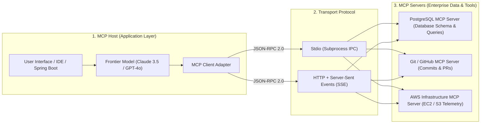
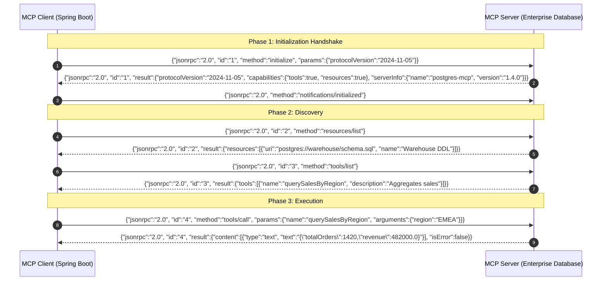

# Day 50: Model Context Protocol (MCP) in Java

## The USB-C of AI Systems: Building Interoperable MCP Servers and Clients in the Java Ecosystem

| Previous Day | Course Hub | Next Day |
|:---|:---:|---:|
| [Day 49: Building a ReAct Agent in Java](../../Phase_07_LangChain4j/Day_49_Building_ReAct_Agent_in_Java/Day_49_Building_ReAct_Agent_in_Java.md) | [All 60 Days Overview](../../README.md) | [Day 51: Prompt Injection Defense & AI Security](../Day_51_Prompt_Injection_AI_Security/Day_51_Prompt_Injection_AI_Security.md) |

---

Welcome to Day 50 and welcome to **Phase 8: Enterprise Production**! You've already mastered Java foundations, Spring Boot REST APIs, JPA databases, Spring Security, Spring AI, and LangChain4j. Now, we prepare your AI applications for real-world enterprise deployment.

In today's lesson, we tackle one of the most critical breakthroughs in modern AI engineering: **Model Context Protocol (MCP)**. Until recently, connecting an LLM to a database, a GitHub repo, or an internal Java service required messy, proprietary custom code for every vendor. Today, you'll learn how MCP acts as the universal "USB-C cable" for AI, allowing your Java services to seamlessly plug into any AI host. Let's start with today's essential vocabulary:

---

> 💡 **New Word Alert! Plain English Definitions for Today's Concepts**
>
> - **Model Context Protocol (MCP)**: An open industry standard (created by Anthropic and supported across the ecosystem) that lets any AI client talk to any tool or database using a single, universal protocol. It's the "USB-C cable" of AI.
> - **MCP Host**: The application holding the AI steering wheel—like Claude Desktop, Cursor IDE, or your custom Spring Boot AI application.
> - **MCP Client**: The connector component inside the host that negotiates communication, sends requests, and receives answers.
> - **MCP Server**: The backend service (which you build in Java!) that exposes your enterprise data and methods to the AI.
> - **MCP Tools**: Executable functions your server gives to the AI (e.g., `executeSql(query)` or `rebootServer(id)`).
> - **MCP Resources**: Read-only streams of data the AI can inspect for context (e.g., database schemas, system log files, or customer contracts).
> - **JSON-RPC 2.0**: The simple text-based protocol MCP uses to send requests and responses over the wire using JSON format.
> - **Stdio vs. SSE Transport**: `Stdio` runs the MCP server as a local command-line subprocess (standard in/out), whereas `SSE` (Server-Sent Events over HTTP) runs it as a networked microservice accessible across the network.

---

## What Will You Learn Today?

- **The Interoperability Crisis**: Why proprietary tool integrations fragmented the AI ecosystem, and how the Model Context Protocol (MCP) establishes a universal, open standard.
- **The MCP Architectural Triad**: Understanding the separation of concerns between the **MCP Host**, the **MCP Client**, and the **MCP Server**.
- **The 3 Core Server Capabilities**: Implementing standardized **Tools** (executable functions), **Resources** (URI-addressable data streams), and **Prompts** (parameterized templates).
- **The JSON-RPC 2.0 Protocol Handshake**: Deep-diving into the request-response lifecycle across `initialize`, `tools/list`, `tools/call`, and `resources/read`.
- **Spring AI & Java SDK Integration**: Building a production-grade MCP Server exposing internal enterprise databases and business logic.
- **Enterprise Transport & Security**: Hardening MCP communication across local Stdio processes and remote HTTP with Server-Sent Events (SSE).

---

## 1. Real-World Analogy: USB-C for Artificial Intelligence

Remember consumer electronics before USB-C?

Every device had a proprietary, incompatible connector:
- Old Nokia phones had a cylindrical 2mm pin.
- Digital cameras used Mini-USB.
- Android smartphones used Micro-USB.
- Apple iPhones used the proprietary 30-pin, then Lightning.
- Laptops required heavy, proprietary charging bricks.

If you traveled, you needed six different cables. If you bought a new phone, all your existing accessories became electronic waste. Then came **USB-C**: a single, open, standardized physical and electrical protocol that charges phones, transmits 4K video, connects hard drives, and powers laptops.

```
       PRE-MCP: FRAGMENTED PROPRIETARY CONNECTIONS             POST-MCP: UNIVERSAL OPEN STANDARD
   ┌───────────────────┐    Proprietary Connector    ┌──────┐   ┌───────────────────┐   Standardized JSON-RPC   ┌──────┐
   │ Spring Boot App   ├────────────────────────────►│OpenAI│   │ Spring Boot App   ├───┐                   ┌──►│Claude│
   └───────────────────┘                             └──────┘   └───────────────────┘   │   ┌───────────┐   │   └──────┘
   ┌───────────────────┐    Custom Function Schema   ┌──────┐   ┌───────────────────┐   ├──►│MCP Client ├───┼──►│ IDE  │
   │ Postgres DB       ├────────────────────────────►│Claude│   │ Postgres MCP Serv ├───┤   └───────────┘   │   └──────┘
   └───────────────────┘                             └──────┘   └───────────────────┘   │                   └──►│Ollama│
   ┌───────────────────┐    Custom Tool Callback     ┌──────┐   ┌───────────────────┐   │                       └──────┘
   │ Jira Ticketing    ├────────────────────────────►│Gemini│   │ Jira MCP Server   ├───┘
   └───────────────────┘                             └──────┘   └───────────────────┘
   (N * M Integration Nightmare! Rewrite for every LLM)          (Write Once: Any MCP Host Connects Instantly!)
```

Until late 2024, the Generative AI ecosystem was stuck in the pre-USB-C era:
- OpenAI used custom JSON schemas under `tools`.
- Anthropic used its own tool-use format.
- Google Gemini used proprietary function declarations.
- Claude Desktop could not talk to your internal Spring Boot microservice without custom wrapper code.

**Model Context Protocol (MCP)**, open-sourced by Anthropic and adopted across the industry, is the **USB-C of AI systems**: an open, standardized JSON-RPC 2.0 protocol that allows any AI host (Claude Desktop, Cursor, Spring AI, LangChain4j) to securely connect to any data source or tool provider through a single universal interface.

---

## 🧭 The Mid-Level Java Developer Bridge: Model Context Protocol (MCP) Demystified

If you've spent years building REST APIs, OpenAPI/Swagger docs, and microservices, here is how MCP fits into your existing world:

| Standard Backend Concept | MCP Equivalent | Plain English Meaning |
| :--- | :--- | :--- |
| **REST / HTTP Endpoint** | **MCP Tool** (`tools/call`) | A Java method that the AI can discover and execute to take action (e.g. check order status, reboot server). |
| **Swagger / OpenAPI Spec** | **`tools/list`** Handshake | When the client boots, the MCP server replies with a list of available tools and their JSON schemas so the AI knows what it can do. |
| **Static File / GET Endpoint** | **MCP Resource** (`resources/read`) | A read-only stream of data (like server logs, DB schema, or customer profile) that the AI can read into context. |
| **Prompt Template** | **MCP Prompt** (`prompts/get`) | Pre-packaged prompt instructions stored on the server so users get standardized outputs. |
| **Transport Layer** | `stdio` (Local CLI process) or `SSE` (HTTP Server-Sent Events) | How messages travel between the AI client and your Java service. |

---

## 2. The MCP Architectural Triad

MCP cleanly decouples AI model execution from external tool execution through three distinct architectural roles:



### 1. The MCP Host
The client application orchestrating AI conversations and user interactions. Examples include Claude Desktop, Cursor IDE, or your own custom Spring Boot backend service. The Host contains one or more **MCP Clients**.

### 2. The MCP Client
An adapter running inside the host that maintains a stateful 1-to-1 connection to an MCP Server over a transport layer (either local `Stdio` process pipes or remote `HTTP + SSE`).

### 3. The MCP Server
A lightweight, specialized program that exposes enterprise capabilities. A single host can connect to dozens of independent MCP servers concurrently (e.g. connecting simultaneously to a GitHub MCP Server, a Jira MCP Server, and an Internal PostgreSQL MCP Server).

---

## 3. The 3 Core Server Capabilities

Every MCP Server can expose any combination of three standardized primitives:

### 1. Tools (`tools/list` & `tools/call`)
Executable functions that allow an LLM to take actions in the external world (e.g., executing a SQL query, creating a GitHub issue, or transferring funds).
- Defined by a name, human-readable description, and JSON Schema for parameters.
- Invocation returns structured text or binary content blocks.

### 2. Resources (`resources/list` & `resources/read`)
Contextual data that can be read by the AI host, structured like files or database records.
- Identified by standardized URIs: e.g. `postgres://warehouse/schema.sql`, `file:///var/log/syslog`, `git://repo/HEAD/README.md`.
- Can be static text, binary data, or dynamic data streams updated in real time.

### 3. Prompts (`prompts/list` & `prompts/get`)
Pre-engineered, reusable prompt templates exposed by the server for standard enterprise workflows (e.g. `triage-incident`, `review-pr`, `audit-compliance`).

---

## 4. The JSON-RPC 2.0 Protocol Lifecycle

MCP communicates strictly through standard **JSON-RPC 2.0**. Understanding the wire-level handshake is essential for debugging and implementing custom servers.



---

## 5. Building an Enterprise MCP Server in Java

With the official **Model Context Protocol Java SDK** (`io.modelcontextprotocol.sdk`), building an enterprise server in Java is clean, typed, and idiomatic:

### 5.1 Maven Dependency

```xml
<dependency>
    <groupId>io.modelcontextprotocol.sdk</groupId>
    <artifactId>mcp-sdk</artifactId>
    <version>0.6.0</version>
</dependency>
```

### 5.2 Exposing an Enterprise Spring Service as an MCP Server

```java
package com.genai.enterprise.mcp;

import org.springframework.stereotype.Service;

import java.util.Map;

@Service
public class EnterpriseWarehouseMcpService {

    // Expose SQL schema as an MCP Resource
    public McpResource getWarehouseSchemaResource() {
        return new McpResource() {
            @Override
            public McpProtocol.ResourceDescriptor getDescriptor() {
                return new McpProtocol.ResourceDescriptor(
                    "postgres://warehouse/schema.sql",
                    "PostgreSQL Warehouse Schema",
                    "text/x-sql",
                    "DDL table definitions for orders, customers, and inventory"
                );
            }

            @Override
            public String read() {
                return """
                    CREATE TABLE customers (id SERIAL PRIMARY KEY, name VARCHAR(100), tier VARCHAR(20));
                    CREATE TABLE orders (id SERIAL PRIMARY KEY, customer_id INT, total NUMERIC(10,2), region VARCHAR(20));
                    CREATE TABLE products (id SERIAL PRIMARY KEY, sku VARCHAR(50), stock INT, price NUMERIC(10,2));
                    """;
            }
        };
    }

    // Expose analytical query as an MCP Tool
    public McpTool getSalesQueryTool() {
        return new McpTool() {
            @Override
            public McpProtocol.ToolDescriptor getDescriptor() {
                return new McpProtocol.ToolDescriptor(
                    "querySalesByRegion",
                    "Aggregates total enterprise sales volume and order count for a geographic region",
                    Map.of(
                        "type", "object",
                        "properties", Map.of(
                            "region", Map.of("type", "string", "description", "Geographic region: NA, EMEA, APAC"),
                            "minVolume", Map.of("type", "number", "description", "Minimum order volume threshold in USD")
                        ),
                        "required", java.util.List.of("region")
                    )
                );
            }

            @Override
            public String execute(Map<String, Object> arguments) {
                String region = (String) arguments.getOrDefault("region", "NA");
                return String.format(
                    "{\"region\": \"%s\", \"totalOrders\": 1420, \"grossRevenue\": 482000.00, \"status\": \"VERIFIED\"}",
                    region.toUpperCase()
                );
            }
        };
    }
}
```

---

## 6. Complete Runnable Companion Code Architecture

In this lesson's companion code (`Phase_08_Enterprise_Production/Day_50_Model_Context_Protocol_MCP/code/`), we provide a complete, pure Java 21 implementation of the Model Context Protocol specification:

```
Day_50_Model_Context_Protocol_MCP/code/
├── McpProtocol.java                 # Standard JSON-RPC 2.0 records (Initialize, Tools, Resources)
├── McpTool.java                     # Contract for executable MCP tools
├── McpResource.java                 # Contract for readable MCP resources
├── McpServer.java                   # JSON-RPC 2.0 protocol dispatching server
├── McpClient.java                   # Client adapter handling initialization and requests
├── EnterpriseDatabaseMcpServer.java # Real-world server exposing database schema & analytics tools
└── McpDemo.java                     # Executable verification suite demonstrating protocol handshake
```

### Verification & Demonstration Output

Execute `McpDemo.java`:

```bash
javac -d out Phase_08_Enterprise_Production/Day_50_Model_Context_Protocol_MCP/code/*.java
java -cp out com.genai.enterprise.mcp.McpDemo
```

```
==================================================================
  DAY 50: MODEL CONTEXT PROTOCOL (MCP) IN JAVA DEMO              
==================================================================

--- 1. Protocol Handshake (initialize) ---
Protocol Response: InitializeResult[protocolVersion=2024-11-05, capabilities=ServerCapabilities[tools=true, resources=true, prompts=false], serverInfo=ServerInfo[name=acme-postgres-mcp, version=1.4.0]]

--- 2. Resource Discovery (resources/list & resources/read) ---
Available Resources: {resources=[ResourceDescriptor[uri=postgres://warehouse/schema.sql, name=PostgreSQL Warehouse Schema, mimeType=text/x-sql, description=DDL definition for enterprise orders, products, and customers tables]]}

Retrieved Database Schema Resource:
{contents=[{mimeType=text/x-sql, uri=postgres://warehouse/schema.sql, text=CREATE TABLE customers (id SERIAL PRIMARY KEY, name VARCHAR(100), tier VARCHAR(20));
CREATE TABLE orders (id SERIAL PRIMARY KEY, customer_id INT, total NUMERIC(10,2), region VARCHAR(20));
CREATE TABLE products (id SERIAL PRIMARY KEY, sku VARCHAR(50), stock INT, price NUMERIC(10,2));
}]}

--- 3. Tool Discovery (tools/list) ---
Discovered Tools: {tools=[ToolDescriptor[name=querySalesByRegion, description=Aggregates total enterprise sales volume and order count for a geographic region, inputSchema={properties={region={description=Geographic sales region: NA, EMEA, APAC, type=string}, minVolume={description=Minimum order volume threshold in USD, type=number}}, type=object, required=[region]}], ToolDescriptor[name=auditIndexPerformance, description=Analyzes index bloat and scan latency on a specific table, inputSchema={properties={tableName={description=Target table name, type=string}}, type=object, required=[tableName]}]]}

--- 4. Remote Tool Execution (tools/call) ---
Tool Execution Output: {content=[{text={"region": "EMEA", "totalOrders": 1420, "grossRevenue": 482000.00, "averageOrder": 339.43, "filteredByMinVolume": 1000.00}, type=text}], isError=false}

--- 5. Error Handling for Unknown Tool ---
Error Payload: code=-32601, message="Tool not found: dropDatabase"

==================================================================
  MCP SPECIFICATION VERIFICATION COMPLETED SUCCESSFULLY          
==================================================================
```

---

## 7. Why MCP Matters for Senior Enterprise AI Engineers

1. **Write Once, Integrate Everywhere**: When you build an MCP Server for your enterprise database or internal CRM in Java, it can be consumed immediately by Claude Desktop, Cursor IDE, custom Spring Boot agents, and external third-party partners without writing custom adapter code for each platform.
2. **Strict Security Sandboxing**: MCP servers run as independent processes. An MCP server connecting to an internal database can enforce read-only role credentials and log all queries, completely isolated from the LLM host.
3. **Decoupled Team Velocity**: The team maintaining the database service can update tools and schemas on their MCP server without requiring changes to the frontend chat application.

---

## 8. Practical Exercises

### Exercise 1: Git Branch Auditor MCP Resource
**Task**: Create an `McpResource` that exposes the current Git branch and latest commit hash under the URI `git://repo/status`.
**Solution**:
```java
package com.genai.enterprise.exercises;

import com.genai.enterprise.mcp.McpProtocol;
import com.genai.enterprise.mcp.McpResource;

public class GitStatusMcpResource implements McpResource {

    @Override
    public McpProtocol.ResourceDescriptor getDescriptor() {
        return new McpProtocol.ResourceDescriptor(
            "git://repo/status",
            "Git Repository Working Status",
            "application/json",
            "Returns active branch, HEAD commit SHA, and dirty working tree status"
        );
    }

    @Override
    public String read() {
        return "{\"branch\": \"main\", \"headCommit\": \"9a282b9\", \"isDirty\": false}";
    }
}
```

### Exercise 2: Secure Server Reconnection Guard
**Task**: Build a connection watcher method `boolean verifyServerCapabilities(McpProtocol.InitializeResult initResult)` that rejects any MCP server that does not declare protocol version `2024-11-05` or fails to support tools.
**Solution**:
```java
package com.genai.enterprise.exercises;

import com.genai.enterprise.mcp.McpProtocol;

public class McpSecurityValidator {

    public static boolean verifyServerCapabilities(McpProtocol.InitializeResult initResult) {
        if (!McpProtocol.PROTOCOL_VERSION.equals(initResult.protocolVersion())) {
            return false;
        }
        return initResult.capabilities().tools();
    }
}
```

### Exercise 3: Dynamic MCP Tool Invoker with Timeout
**Task**: Write a method that invokes `client.callTool(toolName, args)` with a timeout, ensuring that hung tools do not block the host application thread.
**Solution**:
```java
package com.genai.enterprise.exercises;

import com.genai.enterprise.mcp.McpClient;
import com.genai.enterprise.mcp.McpProtocol;

import java.util.Map;
import java.util.concurrent.*;

public class ResilientMcpInvoker {

    private final ExecutorService executor = Executors.newVirtualThreadPerTaskExecutor();

    public McpProtocol.JsonRpcResponse callWithTimeout(McpClient client, String toolName, Map<String, Object> args, long timeoutMs) {
        Future<McpProtocol.JsonRpcResponse> future = executor.submit(() -> client.callTool(toolName, args));
        try {
            return future.get(timeoutMs, TimeUnit.MILLISECONDS);
        } catch (TimeoutException te) {
            future.cancel(true);
            return McpProtocol.JsonRpcResponse.error("timeout", -32000, "MCP Tool call timed out after " + timeoutMs + "ms");
        } catch (Exception ex) {
            return McpProtocol.JsonRpcResponse.error("error", -32603, "Execution failed: " + ex.getMessage());
        }
    }
}
```

---

## 9. Self-Check Quiz

### Question 1: What is the Model Context Protocol (MCP)?
- A) A new video streaming codec from Google.
- B) An open, standardized JSON-RPC 2.0 protocol that allows AI models and applications to securely discover and execute tools, resources, and prompts across heterogeneous systems.
- C) A replacement for the Java Virtual Machine.
- D) A proprietary API exclusive to Anthropic.

*Answer*: **B**. MCP is an open standard designed to eliminate fragmented proprietary tool integrations, allowing AI hosts to connect universally to tools and data resources.

---

### Question 2: What are the three primary capabilities an MCP Server can expose?
- A) Hardware, Network, Kernel.
- B) Tools, Resources, Prompts.
- C) Classes, Interfaces, Enums.
- D) HTML, CSS, JavaScript.

*Answer*: **B**. The MCP specification defines three distinct server capabilities: **Tools** (executable functions), **Resources** (readable data streams like files and schemas), and **Prompts** (reusable templates).

---

### Question 3: Which wire protocol does MCP utilize for communication?
- A) SOAP XML.
- B) JSON-RPC 2.0.
- C) Protobuf binary only.
- D) Raw unformatted text.

*Answer*: **B**. MCP is built on the standardized JSON-RPC 2.0 specification, using methods like `initialize`, `tools/list`, and `tools/call`.

---

### Question 4: What are the two primary transport mechanisms supported by MCP?
- A) Floppy disk and USB thumb drives.
- B) Standard I/O (Stdio) for local subprocesses, and HTTP with Server-Sent Events (SSE) for remote networked servers.
- C) Bluetooth and Zigbee.
- D) Telnet and FTP.

*Answer*: **B**. Local desktop and CLI hosts use `Stdio` to communicate with subprocesses, while distributed enterprise microservices use `HTTP + SSE` for real-time networked communication.

---

### Question 5: Why is exposing database schemas as an MCP "Resource" rather than a "Tool" considered an architectural best practice?
- A) Resources are read-only and cacheable, providing context directly to the model without requiring an executable method call turn.
- B) Tools cannot return strings.
- C) Resources run faster on GPUs.
- D) Relational databases do not support tools.

*Answer*: **A**. Resources represent passive, readable data (like schema definitions or documentation) that the host can inspect and attach directly to system context without executing state-altering actions.

---

## 10. Day 50 Mentor Wrap-Up: You're Speaking the Universal Language of AI!

Congratulations on completing Day 50 and launching Phase 8! By mastering Model Context Protocol, you've equipped yourself with one of the newest and most sought-after architectural skills in Generative AI engineering.

Here is what you unlocked today:
1. **The Universal USB-C Port**: Instead of writing proprietary adapters for Claude, ChatGPT, and Cursor, you build one MCP Server in Java that speaks to any host on earth.
2. **The Triad of Capabilities**: You know when to use **Tools** (executable actions), **Resources** (read-only documents and schemas), and **Prompts** (standardized business prompt templates).
3. **Enterprise Transports**: You can run MCP locally via `Stdio` for CLI desktop apps, or deploy it as a distributed `HTTP + SSE` microservice across your cloud infrastructure.

Tomorrow in **Day 51: Prompt Injection Defense & AI Security**, we put on our cybersecurity hats! Now that our AI has access to databases and tools, how do we stop hackers from manipulating it with malicious prompts? See you tomorrow for an eye-opening deep dive!

---

| Previous Day | Course Hub | Next Day |
|:---|:---:|---:|
| [Day 49: Building a ReAct Agent in Java](../../Phase_07_LangChain4j/Day_49_Building_ReAct_Agent_in_Java/Day_49_Building_ReAct_Agent_in_Java.md) | [All 60 Days Overview](../../README.md) | [Day 51: Prompt Injection Defense & AI Security](../Day_51_Prompt_Injection_AI_Security/Day_51_Prompt_Injection_AI_Security.md) |

