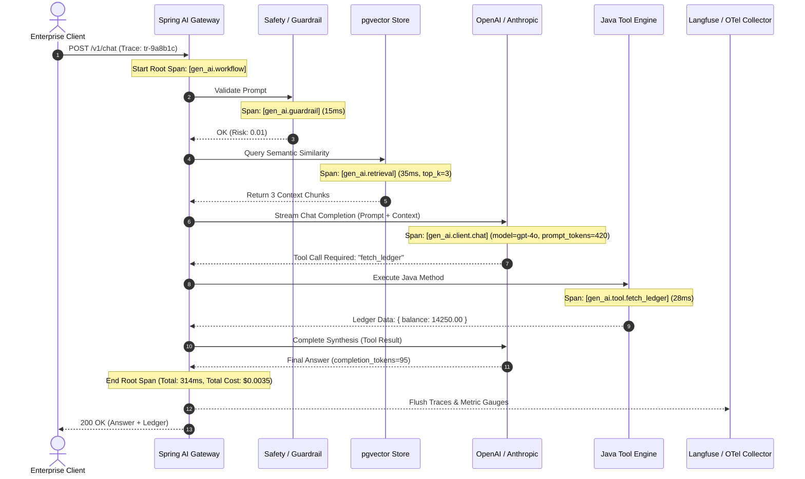

# Day 52: Observability — OpenTelemetry, Langfuse & AI Metrics in Java

## Distributed Tracing, Token Telemetry, and Production Performance Monitoring

| Previous Day | Course Hub | Next Day |
|:---|:---:|---:|
| [Day 51: Prompt Injection Defense & AI Security](../Day_51_Prompt_Injection_AI_Security/Day_51_Prompt_Injection_AI_Security.md) | [All 60 Days Overview](../../README.md) | [Day 53: Caching, Rate Limiting & Cost Optimization](../Day_53_Caching_Rate_Limiting_Cost_Optimization/Day_53_Caching_Rate_Limiting_Cost_Optimization.md) |

---

Welcome to Day 52! Yesterday we armored our application against hackers. But once your AI goes into production, a completely new operational challenge appears:
- *"Why did that customer's question take 7 seconds to answer?"*
- *"Why did our OpenAI API bill spike by $2,000 this weekend?"*
- *"Did the slowdown happen during vector search, the LLM call, or our internal SQL tool?"*

In traditional web apps, simple log lines like `HTTP 200 OK - 45ms` were enough. But an AI request is a multi-step financial transaction involving embeddings, vector searches, multiple LLM reasoning passes, and external tool calls. 

Today, you will learn how to turn on the flight data recorder! We'll use **OpenTelemetry** and **Langfuse** to track every millisecond and every penny across your Java AI workflows. Let's look at the key concepts first:

---

> 💡 **New Word Alert! Plain English Definitions for Today's Concepts**
>
> - **Observability**: The power to look at your dashboard and know *exactly* what happened under the hood without having to guess or attach a debugger in production.
> - **Trace**: The complete end-to-end journey of a single user request—from the moment the user hits "Send" to the final response.
> - **Span**: A single timed chapter within a trace. For example, one trace might contain 4 spans: (1) PII check [15ms], (2) pgvector search [40ms], (3) LLM call [1200ms], and (4) Java tool execution [30ms].
> - **OpenTelemetry (OTel)**: The vendor-neutral industry standard for generating and collecting traces, metrics, and logs across modern cloud microservices.
> - **Langfuse**: A modern observability platform designed specifically for Generative AI. It visualizes traces as beautiful interactive waterfalls, tracks token counts, and calculates dollar costs in real time.
> - **Token Telemetry**: Counting every prompt token and completion token consumed so you know exactly which prompt template or user is driving your AI expenses.

---

## 1. Real-World Analogy: The Commercial Flight Black Box & Radar Control Room

Imagine an ultra-modern commercial airliner navigating across transatlantic airspace. If an engine experiences a sudden drop in thrust, or turbulence rattles the aircraft, pilots and ground engineers do not open a terminal window and sift through gigabytes of raw, unstructured text files saying "something went wrong." 

Instead, the aircraft relies on two mission-critical systems:
1. **The Flight Data Recorder (The Black Box)**: Every valve opening, rudder movement, hydraulic pressure reading, fuel consumption milliliter, and pilot voice command is logged with nanosecond-accurate timestamps and hierarchical event sequences. 
2. **The Air Traffic Radar & Telemetry Feed**: Real-time telemetry is streamed to central control towers, calculating altitude, fuel burn financial rates, trajectory drift, and ETA down to the second.

```
       [ Commercial Airliner: Enterprise AI Pipeline ]
       ┌──────────────────────────────────────────────┐
       │ Request Arrives (Passenger Boarding)        │
       │   ├── Span 1: Prompt Safety Inspection       │
       │   ├── Span 2: Vector Embedding & Retrieval   │
       │   ├── Span 3: LLM Inference (Engine Burn)    │
       │   └── Span 4: Tool Execution (Landing Gear)  │
       └──────────────────────┬───────────────────────┘
                              │ Streams OpenTelemetry Spans
                              ▼
       [ The Control Room: Langfuse / Jaeger / Prometheus ]
       ┌──────────────────────────────────────────────┐
       │ 1. Trace Waterfall: Pinpoint 2000ms latency  │
       │ 2. Token Ledger: $0.0035 spent per query     │
       │ 3. Guardrails Audit: Redact PII / Leaks     │
       └──────────────────────────────────────────────┘
```

In traditional software, standard HTTP request-response logging (`GET /api/v1/orders - 200 OK - 42ms`) was sufficient. But Generative AI systems are **multi-stage, non-deterministic, distributed financial sinks**. A single user query can spawn:
- An embedding call ($0.00002, 35ms)
- A vector database query over 10M embeddings (12ms)
- An LLM call that consumes 1,200 prompt tokens ($0.006, 1,800ms)
- Two automated tool executions (SQL query + ERP REST API call, 140ms)
- A second LLM synthesis call (850 tokens, $0.004, 1,100ms)

If a user complains "The chatbot took 5 seconds and gave me hallucinated garbage", without distributed tracing you are flying blind in a storm. **OpenTelemetry** and **Langfuse** provide the flight recorder and telemetry dashboard for modern enterprise Java AI systems.

---

## 2. Under-the-Hood Architecture: OpenTelemetry Semantic Conventions for Gen AI

In traditional microservices, OpenTelemetry (OTel) standardizes HTTP, database, and messaging spans. In 2024, the Cloud Native Computing Foundation (CNCF) and OpenTelemetry working group released the official **OpenTelemetry Semantic Conventions for Generative AI Systems** (`gen_ai.*`).

### The Gen AI Trace Hierarchy



### Official OpenTelemetry Attributes for Gen AI

| Attribute Name | Type | Description | Example |
| :--- | :--- | :--- | :--- |
| `gen_ai.system` | `string` | The AI provider or engine | `openai`, `anthropic`, `ollama` |
| `gen_ai.request.model` | `string` | Requested model name | `gpt-4o`, `claude-3-5-sonnet` |
| `gen_ai.response.model` | `string` | Actual model serving output | `gpt-4o-2024-08-06` |
| `gen_ai.request.temperature` | `double` | Sampling temperature | `0.2` |
| `gen_ai.request.max_tokens` | `int` | Token generation limit | `4096` |
| `gen_ai.usage.input_tokens` | `int` | Number of tokens in prompt | `512` |
| `gen_ai.usage.output_tokens` | `int` | Number of tokens generated | `128` |
| `gen_ai.operation.name` | `string` | High-level AI operation | `chat`, `embeddings`, `tool` |
| `gen_ai.cost.usd` | `double` | Calculated financial cost | `0.00412` |

---

## 3. The Three Pillars of Enterprise AI Observability

```
                ┌──────────────────────────────────────────────┐
                │        ENTERPRISE AI OBSERVABILITY           │
                └──────────────────────┬───────────────────────┘
                                       │
         ┌─────────────────────────────┼─────────────────────────────┐
         ▼                             ▼                             ▼
  [ 1. Traces & Spans ]         [ 2. Cost & Tokens ]          [ 3. Evaluations ]
  • Hierarchical call tree      • Prompt token burn           • Hallucination score
  • Tool invocation latency     • Completion token burn       • Answer relevance
  • Bottleneck detection        • Per-tenant billing          • Context recall
  • Langfuse waterfall          • Rate limit headroom         • User thumbs-up/down
```

### Pillar 1: Distributed Tracing & Waterfall Analysis
A user query is not atomic. Tracing breaks the execution into parent and child spans. If response latency jumps from 400ms to 4,200ms, the waterfall immediately reveals whether the culprit is:
- pgvector index degradation (HNSW missing)
- External LLM API rate-throttling
- Slow internal database microservice called by a tool

### Pillar 2: Token Financials & Cost Attribution
In traditional web apps, CPU and RAM are fixed monthly costs. In Generative AI, every API request directly incurs a micro-charge on the company's credit card.
- Without observability, a misconfigured while-loop in an agent or a massive document retrieval can burn $10,000 in an afternoon.
- Telemetry enables **Cost Attribution by Organization**: tag every trace with `tenant.id="department_finance"` or `user.id="emp_401"`.

### Pillar 3: LLM Output Evaluations & Feedback Loops
Unlike static microservices, an AI service that returns HTTP 200 may still be returning toxic or hallucinated answers.
- Observability platforms (Langfuse, Arize Phoenix) capture user feedback scores (e.g., thumbs up, copy text, feedback comment).
- Automatically score outputs using offline LLM-as-a-judge models.

---

## 4. OpenTelemetry & Micrometer in Spring Boot 3 & Spring AI

Spring Boot 3 natively embeds **Micrometer Tracing**, seamlessly exporting to OpenTelemetry, Zipkin, or OTLP endpoints.

### Maven Dependencies for OpenTelemetry & Actuator

```xml
<dependencies>
    <!-- Spring Boot Actuator for Production Health & Metrics -->
    <dependency>
        <groupId>org.springframework.boot</groupId>
        <artifactId>spring-boot-starter-actuator</artifactId>
    </dependency>

    <!-- Micrometer Tracing Bridge to OpenTelemetry -->
    <dependency>
        <groupId>io.micrometer</groupId>
        <artifactId>micrometer-tracing-bridge-otel</artifactId>
    </dependency>

    <!-- OpenTelemetry Exporter for OTLP (Collector, Langfuse, Jaeger) -->
    <dependency>
        <groupId>io.opentelemetry</groupId>
        <artifactId>opentelemetry-exporter-otlp</artifactId>
    </dependency>

    <!-- Prometheus Metrics Exporter -->
    <dependency>
        <groupId>io.micrometer</groupId>
        <artifactId>micrometer-registry-prometheus</artifactId>
    </dependency>
</dependencies>
```

### Production `application.yml` Configuration

```yaml
management:
  endpoints:
    web:
      exposure:
        include: health,info,metrics,prometheus
  tracing:
    sampling:
      probability: 1.0  # In high-throughput production, tune to 0.1 (10%)
  otlp:
    tracing:
      endpoint: "http://otel-collector:4318/v1/traces"

spring:
  ai:
    chat:
      observations:
        include-prompt: false # CRITICAL: Set false in production to prevent PII leakage in traces
```

---

## 5. Langfuse Integration in Java

**Langfuse** is an open-source, SOC 2 compliant LLM engineering platform specifically designed for tracing, prompt versioning, and cost tracking.

### Architecture of Langfuse with Java

```
  ┌──────────────────────────────────────────────────────────┐
  │                 Spring Boot 3 / Java 21                 │
  │                                                          │
  │   AiTraceContext (ThreadLocal Span Stack)                │
  │       │                                                  │
  │       ├── Start Root Trace: tr-85365240                  │
  │       │     ├── Span: Prompt Guard                        │
  │       │     ├── Span: Vector Search                      │
  │       │     └── Span: LLM Chat Generation                │
  │       │                                                  │
  │       ▼                                                  │
  │   Langfuse Client / OTLP HTTP Sender                     │
  └──────────────────────────┬───────────────────────────────┘
                             │ POST /api/public/ingestion (JSON batch)
                             ▼
  ┌──────────────────────────────────────────────────────────┐
  │                      Langfuse Server                     │
  │  ├── Web UI: Visual waterfall timeline                   │
  │  ├── Token Pricing Engine: $0.003525 calculation         │
  │  ├── Latency percentiles (P50, P95, P99)                 │
  │  └── Dataset Benchmarking & LLM-as-a-Judge               │
  └──────────────────────────────────────────────────────────┘
```

---

## 6. Hands-On Implementation: Companion Code Walkthrough

Our companion repository inside `code/` implements a production-grade, zero-dependency OpenTelemetry & Langfuse trace engine in pure Java 21:

### 1. `AiSpan.java`
Models an OpenTelemetry-compliant trace span recording trace ID, span ID, parent span ID, start/end timestamps, latency calculation, and custom key-value attributes (`ai.model`, `ai.prompt.tokens`, `ai.cost.usd`).

### 2. `AiTraceContext.java`
A thread-safe `ThreadLocal` stack manager that automatically builds nested span hierarchies (parent-child relationships) without requiring developers to manually thread span IDs through every method parameter.

```java
// Starting parent span
AiSpan root = AiTraceContext.startSpan("enterprise.rag.pipeline");
try {
    // Starting child span (automatically sets parent to root's spanId)
    AiSpan child = AiTraceContext.startSpan("rag.embedding_generation");
    try {
        // execute embedding logic
    } finally {
        AiTraceContext.endCurrentSpan(collector);
    }
} finally {
    AiTraceContext.endCurrentSpan(collector);
}
```

### 3. `TokenCostCalculator.java`
Implements precise financial modeling based on industry pricing tables per 1,000,000 tokens:
- **GPT-4o**: $5.00 input / $15.00 output
- **GPT-4o-mini**: $0.15 input / $0.60 output
- **Claude 3.5 Sonnet**: $3.00 input / $15.00 output
- **Text-Embedding-3-Small**: $0.02 input
- **Local Llama 3.2**: $0.00 (marginal cost)

### 4. `TelemetryCollector.java`
Aggregates completed spans, calculates total trace duration, total tokens consumed, total financial cost, and renders an ASCII waterfall tree matching Langfuse and Jaeger dashboards:

```
==========================================================================
               ENTERPRISE AI OBSERVABILITY TRACE REPORT                  
==========================================================================
Trace ID: tr-85365240
Total Spans Recorded: 6
Total End-to-End Latency: 314 ms
Tokens Consumed: 438 prompt + 95 completion = 533 total
Total Cost: $0.003525 USD
--------------------------------------------------------------------------
TRACE SPAN HIERARCHY (Langfuse / OpenTelemetry Waterfall):
\-- [enterprise.rag.pipeline] 314 ms
    +-- [security.prompt_guard] 17 ms
    +-- [rag.embedding_generation] 49 ms | model=text-embedding-3-small | tokens=18 | cost=$0.00000
    +-- [rag.vector_database_search] 35 ms
    \-- [llm.chat_completion] 211 ms | model=gpt-4o | tokens=515 | cost=$0.00353
        \-- [tool.execution.fetch_account_balance] 27 ms
==========================================================================
```

### 5. `ObservabilityDemo.java`
Main test driver demonstrating the complete workflow and printing verified metrics.

---

## 7. Verifying the Implementation

Run the test suite directly from your terminal:

```powershell
javac -d out Phase_08_Enterprise_Production/Day_52_Observability_OpenTelemetry_Langfuse/code/*.java
java -cp out com.genai.enterprise.observability.ObservabilityDemo
Remove-Item -Recurse -Force out
```

---

## 8. Why Observability Matters for Generative AI

1. **Non-Deterministic Troubleshooting**: Unlike standard REST endpoints where deterministic input yields deterministic output, LLM outputs drift over time. Observability lets you correlate model version updates with user dissatisfaction.
2. **Cost Anomaly Detection**: A rogue customer or automated bot could send a 100,000-token prompt in a loop. With real-time token telemetry and alerts, you can automatically throttle or block abusive tenants before incurring thousands of dollars in bills.
3. **Data Privacy & Compliance (GDPR/HIPAA)**: Observability pipelines allow data masking interceptors to redact Social Security Numbers, API keys, and passwords *before* spans are transmitted to third-party dashboards.

---

## 9. Hands-On Exercises

### Exercise 1: Multi-Model Cost Comparison Filter
**Problem**: Write a Java method `calculateSavings(int promptTokens, int completionTokens)` that compares the cost of running a query on `gpt-4o` versus `gpt-4o-mini`, printing the dollar savings and percentage reduction.

**Solution**:
```java
public class CostOptimizationService {
    public static void printSavings(int promptTokens, int completionTokens) {
        double gpt4oCost = TokenCostCalculator.calculateCost("gpt-4o", promptTokens, completionTokens);
        double gpt4oMiniCost = TokenCostCalculator.calculateCost("gpt-4o-mini", promptTokens, completionTokens);
        double savings = gpt4oCost - gpt4oMiniCost;
        double percentReduction = (savings / gpt4oCost) * 100.0;

        System.out.printf("GPT-4o: $%.6f | GPT-4o-mini: $%.6f | Saved: $%.6f (%.1f%%)%n",
                gpt4oCost, gpt4oMiniCost, savings, percentReduction);
    }
}
```

### Exercise 2: Latency Bottleneck Detection
**Problem**: Write a utility method in `TelemetryCollector` that finds the span responsible for the largest percentage of total trace time and flags it as the primary bottleneck if it exceeds 60% of total latency.

**Solution**:
```java
public class BottleneckDetector {
    public static void identifyBottleneck(List<AiSpan> spans, long totalDurationMs) {
        AiSpan slowestSpan = null;
        long maxDuration = 0;

        for (AiSpan span : spans) {
            // Exclude root workflow span
            if (span.getParentSpanId() != null && span.getDurationMs() > maxDuration) {
                maxDuration = span.getDurationMs();
                slowestSpan = span;
            }
        }

        if (slowestSpan != null) {
            double percent = ((double) maxDuration / totalDurationMs) * 100.0;
            if (percent >= 60.0) {
                System.out.printf("[ALERT] Primary Bottleneck: Span '%s' took %d ms (%.1f%% of total trace)%n",
                        slowestSpan.getOperationName(), maxDuration, percent);
            }
        }
    }
}
```

### Exercise 3: Automated PII Masking Span Interceptor
**Problem**: Implement a span filter that checks the `prompt.content` attribute and replaces any 16-digit credit card number pattern with `[REDACTED_CARD]` before saving to telemetry.

**Solution**:
```java
import java.util.regex.Pattern;

public class PiiMaskingInterceptor {
    private static final Pattern CREDIT_CARD_PATTERN = Pattern.compile("\\b(?:\\d{4}[ -]?){3}\\d{4}\\b");

    public static String maskSensitiveData(String content) {
        if (content == null) return null;
        return CREDIT_CARD_PATTERN.matcher(content).replaceAll("[REDACTED_CARD]");
    }
}
```

---

## 10. Self-Check Quiz

### Question 1: What is the primary difference between traditional application tracing and Generative AI tracing?
- A) Traditional tracing uses HTTP headers, while AI tracing uses websockets.
- B) Generative AI tracing tracks multi-stage non-deterministic steps, token counts, model parameters, and financial costs alongside standard latency.
- C) Traditional tracing records timestamps, whereas AI tracing does not.
- D) Generative AI systems cannot be traced using OpenTelemetry.
*Answer: B. Gen AI tracing standardizes token consumption, model names, temperature, prompt/completion payloads, and financial costs via CNCF `gen_ai.*` conventions.*

### Question 2: Why should `include-prompt` often be set to `false` in production Spring AI OpenTelemetry configurations?
- A) Prompts make trace files too fast to process.
- B) OpenAI will refuse to respond if prompts are traced.
- C) Prompts frequently contain sensitive user PII, customer secrets, or proprietary data that must not be stored in unencrypted telemetry collectors.
- D) Prompts are already recorded in system memory by default.
*Answer: C. Compliance regulations like GDPR and HIPAA require strict redaction or omission of raw user inputs from logging and observability databases.*

### Question 3: In an OpenTelemetry trace hierarchy, what links a child span (like a vector database search) to its parent span (the RAG workflow)?
- A) The `model.name` attribute.
- B) The `parentSpanId` referencing the parent span's unique `spanId`.
- C) The HTTP port number.
- D) The client IP address.
*Answer: B. Distributed tracing relies on `traceId` to group the entire transaction and `parentSpanId` to construct the hierarchical call tree.*

### Question 4: If an enterprise application generates 1,000,000 prompt tokens and 200,000 completion tokens on GPT-4o ($5.00/1M prompt, $15.00/1M completion), what is the total cost?
- A) $20.00
- B) $8.00
- C) $5.00
- D) $10.00
*Answer: B. 1.0 * $5.00 = $5.00 for prompt tokens; 0.2 * $15.00 = $3.00 for completion tokens. Total = $5.00 + $3.00 = $8.00.*

### Question 5: What is the role of a tool like Langfuse in an enterprise AI system?
- A) It serves as a local vector database replacing PostgreSQL.
- B) It compiles Java bytecode into native machine instructions.
- C) It provides a centralized dashboard for LLM tracing, latency waterfalls, token financials, prompt management, and evaluation scores.
- D) It replaces the LLM model completely.
*Answer: C. Langfuse specializes in observability, evaluation, and analytics for Generative AI applications.*

---

## 11. Day 52 Mentor Wrap-Up: You Turned on the Radar Screen!

Telemetry is what separates weekend hobby projects from multi-million-dollar enterprise software. Today, you brought full operational transparency to your Java AI stack:

1. **The Commercial Flight Analogy**: Just like a black box recorder, your application now captures every span, duration, and parameter across complex multi-step workflows.
2. **OpenTelemetry Semantic Conventions**: You adopted the official CNCF standard (`gen_ai.system`, `gen_ai.usage.input_tokens`, `gen_ai.cost.usd`) so your data integrates smoothly with industry-standard observability collectors.
3. **Langfuse Waterfalls**: You visualized the exact timeline of requests, making it trivial to spot whether a 3-second delay was caused by vector retrieval or slow model inference.
4. **Token Cost Accounting**: You know down to the fourth decimal place how much each prompt costs the business.

Tomorrow in **Day 53: Caching, Rate Limiting & Cost Optimization**, we take this financial data and build active cost-saving machines! We'll explore semantic caching (answering similar questions instantly for $0) and token bucket rate limiters. See you tomorrow!

---

| Previous Day | Course Hub | Next Day |
|:---|:---:|---:|
| [Day 51: Prompt Injection Defense & AI Security](../Day_51_Prompt_Injection_AI_Security/Day_51_Prompt_Injection_AI_Security.md) | [All 60 Days Overview](../../README.md) | [Day 53: Caching, Rate Limiting & Cost Optimization](../Day_53_Caching_Rate_Limiting_Cost_Optimization/Day_53_Caching_Rate_Limiting_Cost_Optimization.md) |

