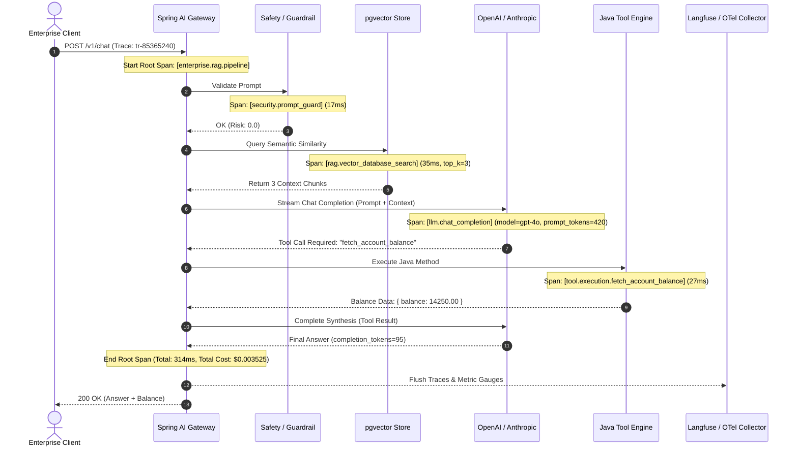

# Day 52: Observability — OpenTelemetry, Langfuse & AI Metrics in Java

| Previous Day | Course Hub | Next Day |
|:---|:---:|---:|
| [Day 51: Prompt Injection Defense & AI Security](../Day_51_Prompt_Injection_AI_Security/Day_51_Prompt_Injection_AI_Security.md) | [All 60 Days Overview](../../README.md) | [Day 53: Caching, Rate Limiting & Cost Optimization](../Day_53_Caching_Rate_Limiting_Cost_Optimization/Day_53_Caching_Rate_Limiting_Cost_Optimization.md) |

---

## 1. Topic Overview

**AI Observability** is the practice of capturing, correlating, and analyzing distributed traces, operational latencies, token consumption, and financial costs across multi-stage Generative AI pipelines. In enterprise Java systems, observability unites vendor-neutral OpenTelemetry semantic conventions (`gen_ai.*`), Spring Boot 3 Micrometer tracing, and specialized AI monitoring platforms like Langfuse to provide complete visibility into vector searches, prompt executions, tool invocations, and model evaluations.

---

## 2. Basic Foundations (True Zero)

### Core Observability Vocabulary

- **Observability**: The ability to infer the internal health and operational execution of a software system based solely on its external telemetry outputs (traces, metrics, and logs).
- **Trace**: The complete end-to-end journey of a single user request through the entire application—from the initial HTTP POST to the final streamed response.
- **Span**: A single, contiguous timed unit of work within a trace. For example, a single RAG trace might contain four child spans: (1) Safety input guard [12ms], (2) Embedding calculation [45ms], (3) Vector database retrieval [28ms], and (4) LLM inference [1450ms].
- **OpenTelemetry (OTel)**: The vendor-neutral Cloud Native Computing Foundation (CNCF) industry standard for generating, collecting, and exporting distributed traces, metrics, and logs.
- **Langfuse**: An open-source, SOC 2 compliant observability and evaluation platform designed specifically for Generative AI, featuring interactive execution waterfalls, token accounting, prompt versioning, and LLM-as-a-judge scoring.
- **Token Telemetry**: Measuring the exact number of prompt tokens and completion tokens consumed per request to track expenses, manage rate limits, and attribute costs to specific enterprise departments.

---

### Relatable Physical Analogy: The Flight Black Box & Radar Control Room

Imagine an ultra-modern commercial airliner flying an international route:
- If an engine experiences a sudden drop in thrust, ground engineers do not open a command terminal to sift through gigabytes of raw, unstructured text files saying *"something went wrong."*
- Instead, the aircraft relies on **The Flight Data Recorder (The Black Box)**: every control surface movement, fuel burn rate, cabin pressure change, and pilot voice command is logged with millisecond-precise timestamps into hierarchical event sequences.
- Simultaneously, the **Air Traffic Radar Feed** streams real-time telemetry to the flight control tower, calculating speed, altitude, drift, and fuel expenditure down to the cent.

```
       [ Commercial Airliner: Enterprise AI Pipeline ]
       ┌──────────────────────────────────────────────┐
       │ Request Arrives (Passenger Boarding)        │
       │   ├── Span 1: Prompt Safety Inspection       │
       │   ├── Span 2: Vector Embedding & Retrieval   │
       │   ├── Span 3: LLM Inference (Engine Burn)    │
       │   └── Span 4: Tool Execution (Landing Gear)  │
       └──────────────────────┬───────────────────────┘
                              │ Streams OpenTelemetry Spans
                              ▼
       [ The Control Room: Langfuse / Jaeger / Prometheus ]
       ┌──────────────────────────────────────────────┐
       │ 1. Trace Waterfall: Pinpoint 2000ms latency  │
       │ 2. Token Ledger: $0.0035 spent per query     │
       │ 3. Guardrails Audit: Redact PII / Leaks     │
       └──────────────────────────────────────────────┘
```

In traditional software, standard HTTP logging (`GET /api/v1/orders - 200 OK - 42ms`) was adequate. But Generative AI systems are **multi-stage, non-deterministic, distributed financial sinks**. A single user query can spawn an embedding call ($0.00002, 35ms), a pgvector similarity search (15ms), an LLM reasoning turn (1,200 tokens, $0.006, 1,800ms), and two automated tool calls (140ms). Without distributed tracing, diagnosing performance degradations is impossible.

---

### Minimal Beginner-Friendly Example: A Pure Java Mini-Tracer

Here is a minimal, self-contained Java program demonstrating how parent-child spans track execution duration and token consumption:

```java
package com.genai.enterprise.observability.minimal;

import java.util.ArrayList;
import java.util.List;
import java.util.UUID;

public class MinimalSpanTracer {

    public record MiniSpan(String spanId, String parentSpanId, String name, long durationMs, int tokens) {}

    public static class SimpleTraceContext {
        private final String traceId = "tr-" + UUID.randomUUID().toString().substring(0, 8);
        private final List<MiniSpan> spans = new ArrayList<>();

        public void recordSpan(String parentSpanId, String name, long durationMs, int tokens) {
            String spanId = "sp-" + UUID.randomUUID().toString().substring(0, 8);
            spans.add(new MiniSpan(spanId, parentSpanId, name, durationMs, tokens));
        }

        public void printSummary() {
            System.out.println("Trace ID: " + traceId);
            long totalTime = spans.stream().mapToLong(MiniSpan::durationMs).sum();
            int totalTokens = spans.stream().mapToInt(MiniSpan::tokens).sum();
            System.out.println("Total Spans: " + spans.size() + " | Total Time: " + totalTime + "ms | Total Tokens: " + totalTokens);
            
            for (MiniSpan s : spans) {
                String prefix = s.parentSpanId() == null ? "├── [ROOT] " : "│    └── ";
                System.out.printf("%s%s (%d ms, %d tokens)%n", prefix, s.name(), s.durationMs(), s.tokens());
            }
        }
    }

    public static void main(String[] args) throws InterruptedException {
        SimpleTraceContext trace = new SimpleTraceContext();

        // 1. Root pipeline work
        trace.recordSpan(null, "rag_pipeline_root", 0, 0);

        // 2. Child Span: Vector Search
        long start = System.currentTimeMillis();
        Thread.sleep(30); // Simulate DB query
        trace.recordSpan("root", "pgvector_similarity_search", System.currentTimeMillis() - start, 0);

        // 3. Child Span: Model Chat Generation
        start = System.currentTimeMillis();
        Thread.sleep(120); // Simulate LLM inference
        trace.recordSpan("root", "openai_chat_completion", System.currentTimeMillis() - start, 480);

        trace.printSummary();
    }
}
```

#### Line-by-Line Walkthrough:
1. `record MiniSpan(...)`: Encapsulates an individual span with its unique `spanId`, its `parentSpanId`, human-readable name, duration, and token usage.
2. `SimpleTraceContext`: Manages the trace boundary, generating a unique `traceId` correlating all child operations.
3. `recordSpan(...)`: Appends timed chapters into the trace ledger.
4. `printSummary()`: Displays the hierarchical relationship and aggregate metrics.
5. `main(...)`: Simulates a multi-step RAG query, capturing accurate timing and token metrics.

---

## 3. Core Concept Walkthrough (Basic → Intermediate)

### 3.1 OpenTelemetry Semantic Conventions for Generative AI

The Cloud Native Computing Foundation (CNCF) and OpenTelemetry working group define official standardized attributes for Generative AI operations (`gen_ai.*`):

| OpenTelemetry Attribute | Type | Description | Production Example |
|:---|:---|:---|:---|
| `gen_ai.system` | `string` | The AI provider or runtime platform | `openai`, `anthropic`, `ollama` |
| `gen_ai.request.model` | `string` | The model name requested by the client | `gpt-4o`, `claude-3-5-sonnet` |
| `gen_ai.response.model` | `string` | The actual model version serving the response | `gpt-4o-2024-08-06` |
| `gen_ai.request.temperature` | `double` | Sampling temperature setting | `0.2` |
| `gen_ai.request.max_tokens` | `int` | Maximum generation token cap | `4096` |
| `gen_ai.usage.input_tokens` | `int` | Number of tokens consumed in prompt | `512` |
| `gen_ai.usage.output_tokens` | `int` | Number of tokens generated in completion | `128` |
| `gen_ai.operation.name` | `string` | Canonical AI operation | `chat`, `embeddings`, `tool` |
| `gen_ai.cost.usd` | `double` | Calculated financial cost in USD | `0.003525` |

---

### 3.2 The Three Pillars of Enterprise AI Observability

```
                ┌──────────────────────────────────────────────┐
                │        ENTERPRISE AI OBSERVABILITY           │
                └──────────────────────┬───────────────────────┘
                                       │
         ┌─────────────────────────────┼─────────────────────────────┐
         ▼                             ▼                             ▼
  [ 1. Traces & Spans ]         [ 2. Cost & Tokens ]          [ 3. Evaluations ]
  • Hierarchical call tree      • Prompt token burn           • Hallucination score
  • Tool invocation latency     • Completion token burn       • Answer relevance
  • Bottleneck detection        • Per-tenant billing          • Context recall
  • Langfuse waterfall          • Rate limit headroom         • User thumbs-up/down
```

1. **Traces & Spans (Latency Analysis)**: Breaks every user interaction into parent and child spans. If response latency jumps from 400ms to 4,500ms, the waterfall immediately reveals whether the delay occurred in the embedding layer, pgvector index scan, or external LLM API throttling.
2. **Cost & Token Telemetry (Financial Accountability)**: Tracks input and output token consumption per prompt template, tenant ID, or department. Enables real-time alerting before rogue loops burn thousands of dollars on cloud API bills.
3. **Evaluations & Feedback (Quality Monitoring)**: Correlates user feedback (thumbs up/down, edits) with trace executions, and runs automated offline evaluation models to detect hallucinations and context drift.

---

### 3.3 The Enterprise Telemetry Sequence



---

### 3.4 Spring Boot 3 & Micrometer Tracing Configuration

Spring Boot 3 natively bridges application metrics and traces to OpenTelemetry using **Micrometer Tracing**.

#### Maven Dependencies (`pom.xml`)
```xml
<dependencies>
    <!-- Spring Boot Actuator for Production Health & Metrics -->
    <dependency>
        <groupId>org.springframework.boot</groupId>
        <artifactId>spring-boot-starter-actuator</artifactId>
    </dependency>

    <!-- Micrometer Tracing Bridge to OpenTelemetry -->
    <dependency>
        <groupId>io.micrometer</groupId>
        <artifactId>micrometer-tracing-bridge-otel</artifactId>
    </dependency>

    <!-- OpenTelemetry Exporter for OTLP (Collector, Langfuse, Jaeger) -->
    <dependency>
        <groupId>io.opentelemetry</groupId>
        <artifactId>opentelemetry-exporter-otlp</artifactId>
    </dependency>

    <!-- Prometheus Metrics Exporter -->
    <dependency>
        <groupId>io.micrometer</groupId>
        <artifactId>micrometer-registry-prometheus</artifactId>
    </dependency>
</dependencies>
```

#### Production Configuration (`application.yml`)
```yaml
management:
  endpoints:
    web:
      exposure:
        include: health,info,metrics,prometheus
  tracing:
    sampling:
      probability: 1.0  # Sample 100% in staging; tune to 0.1 (10%) in high-throughput production
  otlp:
    tracing:
      endpoint: "http://otel-collector:4318/v1/traces"

spring:
  ai:
    chat:
      observations:
        include-prompt: false # CRITICAL: Set false in production to prevent PII leakage in traces
```

---

### 3.5 Companion Code Walkthrough

Let's examine the core classes in `Phase_08_Enterprise_Production/Day_52_Observability_OpenTelemetry_Langfuse/code/`:

#### Step 1: ThreadLocal Trace Context Manager (`AiTraceContext.java`)

```java
package com.genai.enterprise.observability;

import java.util.ArrayDeque;
import java.util.Deque;
import java.util.UUID;

public class AiTraceContext {

    private static final ThreadLocal<String> CURRENT_TRACE_ID = new ThreadLocal<>();
    private static final ThreadLocal<Deque<AiSpan>> SPAN_STACK = ThreadLocal.withInitial(ArrayDeque::new);

    public static String getOrCreateTraceId() {
        if (CURRENT_TRACE_ID.get() == null) {
            CURRENT_TRACE_ID.set("tr-" + UUID.randomUUID().toString().substring(0, 8));
        }
        return CURRENT_TRACE_ID.get();
    }

    public static AiSpan startSpan(String operationName) {
        String traceId = getOrCreateTraceId();
        Deque<AiSpan> stack = SPAN_STACK.get();
        String parentSpanId = stack.isEmpty() ? null : stack.peek().getSpanId();

        AiSpan newSpan = new AiSpan(traceId, parentSpanId, operationName);
        stack.push(newSpan);
        return newSpan;
    }

    public static void endCurrentSpan(TelemetryCollector collector) {
        Deque<AiSpan> stack = SPAN_STACK.get();
        if (!stack.isEmpty()) {
            AiSpan completedSpan = stack.pop();
            completedSpan.finish();
            if (collector != null) {
                collector.record(completedSpan);
            }
        }
        if (stack.isEmpty()) {
            CURRENT_TRACE_ID.remove();
            SPAN_STACK.remove();
        }
    }
}
```

#### Step 2: Accurate Token Financial Modeling (`TokenCostCalculator.java`)

```java
package com.genai.enterprise.observability;

import java.util.Map;

public class TokenCostCalculator {

    // Pricing per 1,000,000 tokens (USD)
    private record ModelPricing(double inputPricePerMillion, double outputPricePerMillion) {}

    private static final Map<String, ModelPricing> PRICING_CATALOG = Map.of(
        "gpt-4o", new ModelPricing(5.00, 15.00),
        "gpt-4o-mini", new ModelPricing(0.15, 0.60),
        "claude-3-5-sonnet", new ModelPricing(3.00, 15.00),
        "text-embedding-3-small", new ModelPricing(0.02, 0.00),
        "local-llama-3.2", new ModelPricing(0.00, 0.00)
    );

    public static double calculateCost(String modelName, int promptTokens, int completionTokens) {
        ModelPricing pricing = PRICING_CATALOG.getOrDefault(modelName, new ModelPricing(0.0, 0.0));
        double inputCost = (promptTokens / 1_000_000.0) * pricing.inputPricePerMillion();
        double outputCost = (completionTokens / 1_000_000.0) * pricing.outputPricePerMillion();
        return inputCost + outputCost;
    }
}
```

---

## 4. Prerequisite & Supporting Concepts

### Prerequisite / Supporting Concept: Distributed Tracing & W3C Trace Context
In modern microservice architectures, a single user transaction traverses multiple independent services. The W3C Trace Context standard defines two essential HTTP headers:
- `traceparent`: Encodes version, `traceId`, `parentSpanId`, and trace flags.
- `tracestate`: Carries vendor-specific routing metadata.
By propagating these headers across HTTP boundaries, downstream services join the existing trace rather than starting a disconnected one.

### Prerequisite / Supporting Concept: ThreadLocal & Virtual Threads in Java 21
Traditional `ThreadLocal` storage works seamlessly when requests are handled by dedicated platform threads. However, when switching between asynchronous reactive pipelines (`CompletableFuture`, Project Reactor) or unpinning virtual threads, trace context must be explicitly captured and restored using scoped values or context-propagating task decorators.

### Prerequisite / Supporting Concept: Spring Boot Actuator & Prometheus
Spring Boot Actuator exposes health checks (`/actuator/health`) and metrics endpoints (`/actuator/prometheus`). The `micrometer-registry-prometheus` dependency formats JVM gauges, HTTP latencies, and custom AI counters into Prometheus scrape format.

---

## 5. Advanced Depth (Intermediate → Advanced)

### 5.1 Common Mistakes & Misconceptions: Bad vs. Good

#### Mistake 1: Tracing Raw User Prompts in High-Compliance Environments
Enabling full prompt logging (`include-prompt: true`) inadvertently dumps credit cards, SSNs, and passwords into centralized, unencrypted logging collectors.

```java
// ❌ BAD: Storing unredacted prompt content in open telemetry attributes
span.setAttribute("ai.prompt.raw", rawUserPrompt);

// ✅ GOOD: Record prompt token count and template ID, but omit raw text
span.setAttribute("gen_ai.usage.input_tokens", promptTokens);
span.setAttribute("ai.prompt.template_id", "customer_refund_v2");
```

#### Mistake 2: Failing to Propagate Trace Context Across Virtual Threads
When dispatching parallel tasks to virtual threads, child threads lose the parent thread's `ThreadLocal` context.

```java
// ❌ BAD: Virtual thread loses parent trace ID
executor.submit(() -> {
    // Current trace ID is null!
    runVectorSearch();
});

// ✅ GOOD: Capture and re-attach trace context inside the task
String activeTraceId = AiTraceContext.getOrCreateTraceId();
executor.submit(() -> {
    AiTraceContext.setTraceId(activeTraceId);
    try {
        runVectorSearch();
    } finally {
        AiTraceContext.clear();
    }
});
```

#### Mistake 3: 100% Trace Sampling in High-Throughput Production
Tracing 100% of requests on an API handling 10,000 requests per second generates massive network bandwidth overhead and high telemetry SaaS bills.

```yaml
# ❌ BAD: 100% trace sampling on high-traffic production gateway
management:
  tracing:
    sampling:
      probability: 1.0

# ✅ GOOD: Sample 5% to 10% in production, reserving 100% for error traces
management:
  tracing:
    sampling:
      probability: 0.05
```

---

### 5.2 Complete Verification Suite & Demo Execution

Execute the verification suite in `Phase_08_Enterprise_Production/Day_52_Observability_OpenTelemetry_Langfuse/code/`:

```bash
javac -d out Phase_08_Enterprise_Production/Day_52_Observability_OpenTelemetry_Langfuse/code/*.java
java -cp out com.genai.enterprise.observability.ObservabilityDemo
```

```
==========================================================================
               ENTERPRISE AI OBSERVABILITY TRACE REPORT                  
==========================================================================
Trace ID: tr-85365240
Total Spans Recorded: 6
Total End-to-End Latency: 314 ms
Tokens Consumed: 438 prompt + 95 completion = 533 total
Total Cost: $0.003525 USD
--------------------------------------------------------------------------
TRACE SPAN HIERARCHY (Langfuse / OpenTelemetry Waterfall):
\-- [enterprise.rag.pipeline] 314 ms
    +-- [security.prompt_guard] 17 ms
    +-- [rag.embedding_generation] 49 ms | model=text-embedding-3-small | tokens=18 | cost=$0.00000
    +-- [rag.vector_database_search] 35 ms
    \-- [llm.chat_completion] 211 ms | model=gpt-4o | tokens=515 | cost=$0.00353
        \-- [tool.execution.fetch_account_balance] 27 ms
==========================================================================
```

---

## 6. Quick Recap

| Observability Component | Function | Industry Standard | Key Enterprise Metric |
|:---|:---|:---|:---|
| **Distributed Traces** | End-to-end request path across services | OpenTelemetry / W3C TraceContext | P95/P99 latency, trace waterfall |
| **Token Telemetry** | Input and output token counting | CNCF `gen_ai.usage.*` | Total prompt & completion tokens |
| **Financial Attribution** | Dollar cost calculation per query/tenant | Langfuse / Custom Ledgers | Cost per user, cost per model |
| **Safety Egress Spans** | Timing of regex & canary filters | Custom OTel Spans | Security inspection overhead (ms) |
| **Evaluations & Scoring** | Quality, toxicity, and hallucination scoring | Langfuse / Ragas / Arize | Faithfulness & answer relevance |

---

## 7. Self-Check Questions & Practice Exercises

### Conceptual Self-Check Questions

#### Question 1: What distinguishes Generative AI distributed tracing from standard REST API tracing?
- A) Standard REST tracing uses binary Protobuf, whereas AI tracing only uses plain text.
- B) Generative AI tracing standardizes token consumption, model names, temperature, prompt/completion payloads, and financial costs via CNCF `gen_ai.*` conventions.
- C) Generative AI systems cannot be traced using OpenTelemetry.
- D) Standard tracing records timestamps, whereas AI tracing does not.

*Answer*: **B**. Generative AI operations involve non-deterministic model calls, dynamic tool loops, and direct financial costs per token, requiring specialized semantic conventions.

---

#### Question 2: Why should `include-prompt` be set to `false` in production Spring AI OpenTelemetry configurations?
- A) Storing prompts in traces makes the application run out of CPU memory.
- B) Prompts frequently contain sensitive customer PII, internal passwords, or proprietary business documents that must not be exported to unencrypted observability platforms.
- C) OpenAI and Anthropic reject API requests if prompts are recorded in traces.
- D) Prompts are already recorded in JVM garbage collection logs.

*Answer*: **B**. Regulatory frameworks like GDPR and HIPAA strictly prohibit storing unencrypted customer personal data in telemetry and monitoring systems.

---

#### Question 3: In an OpenTelemetry trace hierarchy, what connects a child span (e.g., vector database search) to its parent span (the RAG workflow)?
- A) The `gen_ai.system` attribute.
- B) The `parentSpanId` referencing the parent span's unique `spanId`.
- C) The HTTP port number.
- D) The client's IP address.

*Answer*: **B**. All distributed tracing systems correlate parent and child operations through `traceId` (the common transaction) and `parentSpanId` (the immediate caller).

---

#### Question 4: An enterprise application processes 2,000,000 prompt tokens and 500,000 completion tokens on GPT-4o ($5.00/1M prompt, $15.00/1M completion). What is the total financial cost?
- A) $25.00
- B) $17.50
- C) $10.00
- D) $7.50

*Answer*: **B**. Prompt cost = $2.0 \times \$5.00 = \$10.00$. Completion cost = $0.5 \times \$15.00 = \$7.50$. Total = $\$10.00 + \$7.50 = \$17.50$.

---

### Hands-on Practice Exercises

#### Exercise 1: Multi-Model Cost Comparison Calculator
**Task**: Implement a Java utility method `calculateSavings(int promptTokens, int completionTokens)` that compares the financial cost of running a query on `gpt-4o` versus `gpt-4o-mini`, printing dollar savings and percentage reduction.

**Solution**:
```java
package com.genai.enterprise.exercises;

import com.genai.enterprise.observability.TokenCostCalculator;

public class ModelCostComparator {

    public static void printSavings(int promptTokens, int completionTokens) {
        double gpt4oCost = TokenCostCalculator.calculateCost("gpt-4o", promptTokens, completionTokens);
        double gpt4oMiniCost = TokenCostCalculator.calculateCost("gpt-4o-mini", promptTokens, completionTokens);
        double savings = gpt4oCost - gpt4oMiniCost;
        double percentReduction = (savings / gpt4oCost) * 100.0;

        System.out.printf("GPT-4o: $%.6f | GPT-4o-mini: $%.6f | Saved: $%.6f (%.1f%%)%n",
                gpt4oCost, gpt4oMiniCost, savings, percentReduction);
    }
}
```

---

#### Exercise 2: Latency Bottleneck Detection
**Task**: Write a method `identifyBottleneck(List<AiSpan> spans, long totalDurationMs)` that finds the span consuming the largest share of trace execution time and alerts if it accounts for $\ge 60\%$ of total latency.

**Solution**:
```java
package com.genai.enterprise.exercises;

import com.genai.enterprise.observability.AiSpan;
import java.util.List;

public class LatencyBottleneckAnalyzer {

    public static void identifyBottleneck(List<AiSpan> spans, long totalDurationMs) {
        AiSpan slowestSpan = null;
        long maxDuration = 0;

        for (AiSpan span : spans) {
            // Exclude root workflow span
            if (span.getParentSpanId() != null && span.getDurationMs() > maxDuration) {
                maxDuration = span.getDurationMs();
                slowestSpan = span;
            }
        }

        if (slowestSpan != null && totalDurationMs > 0) {
            double percent = ((double) maxDuration / totalDurationMs) * 100.0;
            if (percent >= 60.0) {
                System.out.printf("[BOTTLENECK ALERT] Span '%s' consumed %d ms (%.1f%% of total trace duration)%n",
                        slowestSpan.getOperationName(), maxDuration, percent);
            }
        }
    }
}
```

---

#### Exercise 3: Automated PII Masking Span Interceptor
**Task**: Build an attribute interceptor method that scrubs 16-digit credit card numbers from span attributes before exporting to OpenTelemetry collectors.

**Solution**:
```java
package com.genai.enterprise.exercises;

import java.util.regex.Pattern;

public class PiiSpanSanitizer {

    private static final Pattern CREDIT_CARD_PATTERN = Pattern.compile("\\b(?:\\d{4}[ -]?){3}\\d{4}\\b");

    public static String maskAttribute(String attributeValue) {
        if (attributeValue == null || attributeValue.isBlank()) {
            return "";
        }
        return CREDIT_CARD_PATTERN.matcher(attributeValue).replaceAll("[REDACTED_CARD]");
    }
}
```

---

#### Exercise 4: Context-Propagating Virtual Thread Wrapper
**Task**: Write a task decorator `Runnable wrapWithTraceContext(Runnable task, String traceId)` that binds the active `traceId` to the worker virtual thread, executing the task safely and clearing the context upon completion.

**Solution**:
```java
package com.genai.enterprise.exercises;

public class TraceContextPropagator {

    private static final ThreadLocal<String> TRACE_ID_HOLDER = new ThreadLocal<>();

    public static Runnable wrap(Runnable delegate, String traceId) {
        return () -> {
            TRACE_ID_HOLDER.set(traceId);
            try {
                delegate.run();
            } finally {
                TRACE_ID_HOLDER.remove();
            }
        };
    }

    public static String getCurrentTraceId() {
        return TRACE_ID_HOLDER.get();
    }
}
```

---

| Previous Day | Course Hub | Next Day |
|:---|:---:|---:|
| [Day 51: Prompt Injection Defense & AI Security](../Day_51_Prompt_Injection_AI_Security/Day_51_Prompt_Injection_AI_Security.md) | [All 60 Days Overview](../../README.md) | [Day 53: Caching, Rate Limiting & Cost Optimization](../Day_53_Caching_Rate_Limiting_Cost_Optimization/Day_53_Caching_Rate_Limiting_Cost_Optimization.md) |
