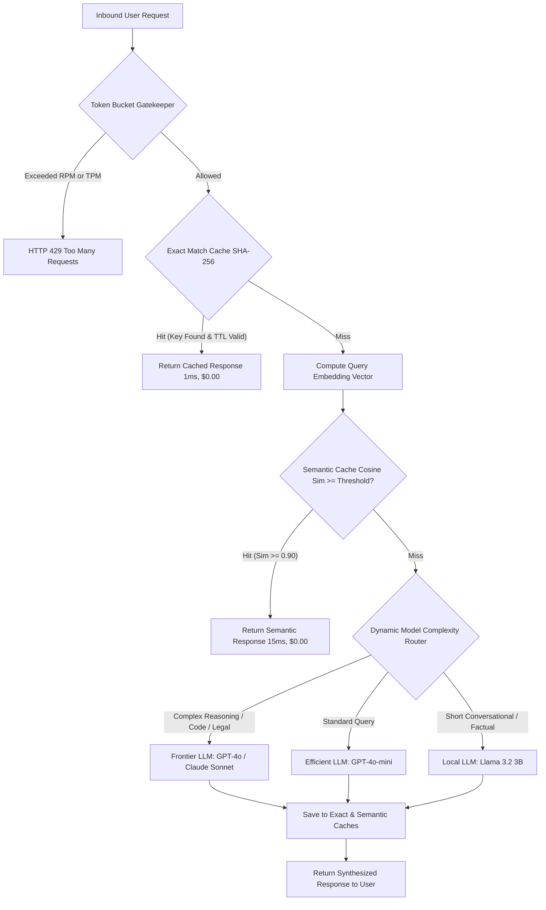

# Day 53: Caching, Rate Limiting & Cost Optimization for Enterprise Java AI

| Previous Day | Course Hub | Next Day |
|:---|:---:|---:|
| [Day 52: Observability — OpenTelemetry & Langfuse](../Day_52_Observability_OpenTelemetry_Langfuse/Day_52_Observability_OpenTelemetry_Langfuse.md) | [All 60 Days Overview](../../README.md) | [Day 54: Docker, CI/CD & Cloud Deployment](../Day_54_Docker_CICD_Cloud_Deployment/Day_54_Docker_CICD_Cloud_Deployment.md) |

---

## 1. Topic Overview

**AI Caching, Rate Limiting & Cost Optimization** is the practice of protecting enterprise cloud budgets and improving user response times by intercepting repetitive queries and throttling resource consumption before hitting expensive frontier LLM APIs. In enterprise Java systems, this discipline establishes four defensive rings—exact SHA-256 caching, semantic vector similarity caching, dual-constraint token bucket rate limiting (RPM + TPM), and dynamic model cascading—reducing operational API expenses by up to 85% while delivering sub-50ms response times.

---

## 2. Basic Foundations (True Zero)

### Core Cost Optimization Vocabulary

- **Exact Match Cache**: An in-memory or Redis key-value store keyed by the cryptographic SHA-256 hash of the normalized prompt. When an identical prompt arrives, the cached answer is returned in ~1ms at $0.00 API cost.
- **Semantic Vector Cache**: An intelligent cache that indexes queries by their mathematical meaning rather than exact characters. If Employee A asks *"How do I reset my password?"* and Employee B asks *"Forgot my login credentials, how to change?"*, the semantic cache detects that their cosine similarity exceeds the safe threshold ($\ge 0.90$) and serves the cached answer instantly.
- **Token Bucket Rate Limiter**: A concurrency controller that meters both Requests Per Minute (RPM) and Tokens Per Minute (TPM), preventing any single client from exhausting corporate API quotas or driving runaway costs.
- **Denial of Wallet (DoW)**: An accidental infinite loop or malicious adversarial attack that bombards AI endpoints with massive token payloads, incurring thousands of dollars in cloud API bills in minutes.
- **Dynamic Model Cascading (Routing)**: Automatically evaluating query complexity before execution: routing simple conversational queries to fast, near-zero-cost models (local Llama 3.2 or GPT-4o-mini), while reserving frontier reasoning models (GPT-4o, Claude 3.5 Sonnet) for high-stakes tasks.

---

### Relatable Physical Analogy: The 3-Star Michelin Kitchen

Imagine managing an exclusive three-star Michelin restaurant:
- **The Executive Chef (Frontier LLM, e.g., GPT-4o / Claude 3.5 Sonnet)**: Retaining the Executive Chef costs $500/hour. They can compose an avant-garde 12-course molecular gastronomy tasting menu. However, if every customer asks the Executive Chef to toast a slice of bread or pour tap water, the kitchen will grind to a halt and go bankrupt in days.
- **The Sous Chefs & Prep Cooks (Local Llama 3.2 & GPT-4o-mini)**: Front-line staff who handle routine chopping, plating, and bread baskets instantly at near-zero marginal cost.
- **The Pre-Prepped Amuse-Bouche Tray (Exact SHA-256 Cache)**: When a guest requests the standard welcome bite, the server grabs it from the tray in 2 seconds flat—no chef touches the stove, and zero cooking fuel is burned.
- **The Tasting Menu Substitution Guide (Semantic Vector Cache)**: If a diner asks *"Can I have something without dairy?"* and another asks *"Do you offer lactose-free options?"*, the maitre d' recognizes that both requests mean the exact same recipe and serves the pre-approved substitution instantly.
- **The Velvet-Rope Bouncer (Dual Token Bucket Rate Limiter)**: When a crowd swarms the entrance, the bouncer admits guests strictly according to table capacity (RPM) and kitchen ingredient limits (TPM), preventing a stampede that would trash the dining room.

```
 [ Client Inbound Request ]
             │
             ▼
 ┌─────────────────────────────────────────────────────────────┐
 │ 1. Velvet Rope Bouncer (Token Bucket Rate Limiter)          │
 │    • Checks RPM (Requests/min) & TPM (Tokens/min)           │
 └─────────────────────────────┬───────────────────────────────┘
                               │ Allowed
                               ▼
 ┌─────────────────────────────────────────────────────────────┐
 │ 2. Pre-prepped Tray (Exact SHA-256 Cache)                   │
 │    • Identical prompt? Return response in 1ms! Cost: $0.00  │
 └─────────────────────────────┬───────────────────────────────┘
                               │ Miss
                               ▼
 ┌─────────────────────────────────────────────────────────────┐
 │ 3. Substitution Guide (Semantic Vector Cache)               │
 │    • Similar meaning (Cosine Sim >= 0.90)? Return in 15ms!  │
 └─────────────────────────────┬───────────────────────────────┘
                               │ Miss
                               ▼
 ┌─────────────────────────────────────────────────────────────┐
 │ 4. Sommelier Routing Desk (Dynamic Model Cascade Router)    │
 │    • Simple factual lookup? -> Tier 2 (GPT-4o-mini / Llama) │
 │    • Complex architecture?  -> Tier 1 (GPT-4o Frontier)     │
 └─────────────────────────────────────────────────────────────┘
```

---

### Minimal Beginner-Friendly Example: Pure Java Exact SHA-256 Cache

Here is a minimal, self-contained Java program demonstrating prompt normalization, cryptographic SHA-256 key hashing, and TTL caching:

```java
package com.genai.enterprise.costopt.minimal;

import java.nio.charset.StandardCharsets;
import java.security.MessageDigest;
import java.util.HexFormat;
import java.util.Map;
import java.util.concurrent.ConcurrentHashMap;

public class MinimalExactPromptCache {

    public record CacheEntry(String response, long expiresAtMs) {}

    private final Map<String, CacheEntry> store = new ConcurrentHashMap<>();
    private final long ttlMs;

    public MinimalExactPromptCache(long ttlMs) {
        this.ttlMs = ttlMs;
    }

    public static String hashPrompt(String rawPrompt) {
        try {
            MessageDigest digest = MessageDigest.getInstance("SHA-256");
            // Normalize: trim whitespace and lowercase for consistent hashing
            String normalized = rawPrompt.trim().toLowerCase();
            byte[] hash = digest.digest(normalized.getBytes(StandardCharsets.UTF_8));
            return HexFormat.of().formatHex(hash);
        } catch (Exception ex) {
            throw new RuntimeException("SHA-256 unavailable", ex);
        }
    }

    public String get(String rawPrompt) {
        String key = hashPrompt(rawPrompt);
        CacheEntry entry = store.get(key);
        if (entry == null) return null;
        if (System.currentTimeMillis() > entry.expiresAtMs()) {
            store.remove(key); // Evict expired entry
            return null;
        }
        return entry.response();
    }

    public void put(String rawPrompt, String response) {
        String key = hashPrompt(rawPrompt);
        store.put(key, new CacheEntry(response, System.currentTimeMillis() + ttlMs));
    }

    public static void main(String[] args) {
        MinimalExactPromptCache cache = new MinimalExactPromptCache(60_000); // 1 minute TTL

        String prompt1 = "What is the corporate travel allowance? ";
        String prompt2 = "what is the corporate travel allowance?"; // Different casing & whitespace

        cache.put(prompt1, "The annual corporate travel allowance is $5,000 per employee.");

        // Querying with prompt2 matches prompt1 due to normalization!
        String cachedAnswer = cache.get(prompt2);
        System.out.println("Prompt 2 Cache Result: " + cachedAnswer);
        System.out.println("Hit successfully for $0.00 API cost!");
    }
}
```

#### Line-by-Line Walkthrough:
1. `record CacheEntry(...)`: Encapsulates the cached LLM completion along with an absolute epoch expiration timestamp.
2. `hashPrompt(String rawPrompt)`: Normalizes casing and whitespace before computing a fixed 64-character hexadecimal SHA-256 string, preventing memory bloat from giant prompt keys.
3. `get(String rawPrompt)`: Looks up the hash key and lazily evicts entries whose TTL has lapsed.
4. `put(String rawPrompt, String response)`: Stores the response with a calculated expiration timestamp.
5. `main(...)`: Confirms that queries differing only in formatting hit the cache in ~1ms without making an external model call.

---

## 3. Core Concept Walkthrough (Basic → Intermediate)

### 3.1 The 4 Defensive Rings of AI Cost Engineering



### Comparative Breakdown of Optimization Techniques

| Defensive Tier | Average Latency | Financial Cost | Enterprise Hit Rate | Recommended Technology |
|:---|:---|:---|:---|:---|
| **Ring 1: Exact Match Cache** | 1 – 3 ms | $0.00 | 25% – 35% | Redis, Caffeine, SHA-256 |
| **Ring 2: Semantic Vector Cache** | 10 – 30 ms | $0.00 | 20% – 30% | pgvector, Redis Vector, Qdrant |
| **Ring 3: Tier-2 / Local Model** | 80 – 250 ms | $0.00 – $0.0001 | 30% – 40% | Ollama (Llama 3.2), GPT-4o-mini |
| **Ring 4: Frontier Model (GPT-4o)** | 1,500 – 4,000 ms | $0.005 – $0.030 | 5% – 15% | OpenAI GPT-4o, Claude 3.5 Sonnet |

When combined in an enterprise pipeline, **over 75% of incoming queries never hit the expensive frontier LLM**, slashing monthly API bills by up to 85% while delivering sub-50ms average user latency.

---

### 3.2 Semantic Vector Caching (Fuzzy AI Caching)

Exact match caching fails when users express identical questions using different words:
- User A: *"What is our company annual leave policy?"*
- User B: *"How many vacation days do employees get each year?"*

Their SHA-256 hashes are completely different ($0\%$ exact hit rate). But in 1536-dimensional vector space, their cosine similarity is $0.94$!

#### The Cosine Similarity Metric

$$\text{Cosine Similarity}(\vec{u}, \vec{v}) = \frac{\vec{u} \cdot \vec{v}}{\|\vec{u}\| \|\vec{v}\|} = \frac{\sum_{i=1}^{n} u_i v_i}{\sqrt{\sum_{i=1}^{n} u_i^2} \sqrt{\sum_{i=1}^{n} v_i^2}}$$

#### Threshold Selection Strategy:
- **$\ge 0.95$**: Ultra-conservative. Catches near-exact paraphrases only. Zero false positives.
- **$0.88 - 0.92$ (Recommended)**: Optimal enterprise balance. Matches paraphrased queries accurately without mixing up distinct questions.
- **$< 0.82$**: Dangerous. Matches distinct questions (e.g., *"How do I reset my password?"* vs *"How do I change my username?"*), returning hallucinated or incorrect cached answers.

---

### 3.3 Dual Token Bucket Rate Limiter: RPM vs. TPM

In standard web apps, rate limiters meter only Requests Per Minute (RPM). In Generative AI, **RPM alone is fatally incomplete**.

#### The Flaw of RPM-Only Limiting:
An enterprise tenant permitted 10 requests per minute sends:
- Request 1: 50-word question (35 tokens).
- Request 2: Full 300-page corporate legal audit PDF (120,000 tokens).

Both count as 1 request! But Request 2 consumes 3,400x more tokens, risking provider throttling and generating massive cloud bills. Modern enterprise architectures enforce **Dual Token Buckets**:

```
       Dual-Constraint Rate Limiting Check:
       
       1. RPM Bucket: Requests / Minute (Guards JVM threads & network sockets)
       2. TPM Bucket: Tokens / Minute   (Guards cloud API budgets & quotas)
       
       If either bucket is depleted:
       ───> Return HTTP 429 Too Many Requests
            Header: Retry-After: <seconds_until_refill>
```

---

### 3.4 Dynamic Model Cascading & Complexity Routing

Why pay $5.00 per million tokens for an advanced 1.8-trillion parameter model to answer:
> *"What time does the company cafeteria open?"*

A **Dynamic Model Router** inspects incoming queries before making external API calls:
1. **Tier 1 (Frontier Models: GPT-4o, Claude 3.5 Sonnet)**: Reserved for code generation, multi-step architectural design, legal analysis, and deep reasoning.
2. **Tier 2 (Efficient Models: GPT-4o-mini, Claude 3.5 Haiku)**: Standard conversational Q&A, text summarization, data extraction.
3. **Tier 3 (Local Edge Models: Ollama Llama 3.2 3B)**: Intent classification, simple sentiment, routing checks, and short factual lookups at $0.00 marginal cost.

---

### 3.5 Companion Code Walkthrough

Let's examine the core classes in `Phase_08_Enterprise_Production/Day_53_Caching_Rate_Limiting_Cost_Optimization/code/`:

#### Step 1: Thread-Safe Dual Token Bucket (`TokenBucketRateLimiter.java`)

```java
package com.genai.enterprise.costopt;

public class TokenBucketRateLimiter {

    private final double maxRequests;
    private final double requestRefillRatePerSec;
    private double currentRequests;

    private final double maxTokens;
    private final double tokenRefillRatePerSec;
    private double currentTokens;

    private long lastRefillTimestamp;

    public TokenBucketRateLimiter(int requestsPerMinute, int tokensPerMinute) {
        this.maxRequests = requestsPerMinute;
        this.requestRefillRatePerSec = requestsPerMinute / 60.0;
        this.currentRequests = requestsPerMinute;

        this.maxTokens = tokensPerMinute;
        this.tokenRefillRatePerSec = tokensPerMinute / 60.0;
        this.currentTokens = tokensPerMinute;

        this.lastRefillTimestamp = System.currentTimeMillis();
    }

    public synchronized RateLimitResult tryConsume(int estimatedTokens) {
        refill();

        if (currentRequests < 1.0) {
            long waitMs = (long) Math.ceil((1.0 - currentRequests) / requestRefillRatePerSec * 1000.0);
            return RateLimitResult.rejected("RPM_EXCEEDED: Maximum requests per minute exceeded", waitMs);
        }

        if (currentTokens < estimatedTokens) {
            long waitMs = (long) Math.ceil((estimatedTokens - currentTokens) / tokenRefillRatePerSec * 1000.0);
            return RateLimitResult.rejected("TPM_EXCEEDED: Requested " + estimatedTokens + " tokens exceeds budget", waitMs);
        }

        currentRequests -= 1.0;
        currentTokens -= estimatedTokens;
        return RateLimitResult.allowed((int) currentRequests, (int) currentTokens);
    }

    private void refill() {
        long now = System.currentTimeMillis();
        double elapsedSeconds = (now - lastRefillTimestamp) / 1000.0;
        if (elapsedSeconds > 0) {
            currentRequests = Math.min(maxRequests, currentRequests + elapsedSeconds * requestRefillRatePerSec);
            currentTokens = Math.min(maxTokens, currentTokens + elapsedSeconds * tokenRefillRatePerSec);
            lastRefillTimestamp = now;
        }
    }

    public record RateLimitResult(boolean isAllowed, String rejectionReason, long retryAfterMs, int remainingRpm, int remainingTpm) {
        public static RateLimitResult allowed(int remRpm, int remTpm) {
            return new RateLimitResult(true, null, 0, remRpm, remTpm);
        }
        public static RateLimitResult rejected(String reason, long retryAfterMs) {
            return new RateLimitResult(false, reason, retryAfterMs, 0, 0);
        }
    }
}
```

#### Step 2: Semantic Vector Cache (`SemanticVectorCache.java`)

```java
package com.genai.enterprise.costopt;

import java.util.*;
import java.util.concurrent.ConcurrentHashMap;

public class SemanticVectorCache {

    public record CachedItem(String query, float[] embedding, String response, long timestamp) {}

    private final Map<String, CachedItem> cache = new ConcurrentHashMap<>();
    private final double similarityThreshold;

    public SemanticVectorCache(double similarityThreshold) {
        this.similarityThreshold = similarityThreshold;
    }

    public Optional<CachedItem> findSimilar(float[] queryEmbedding) {
        CachedItem bestMatch = null;
        double bestSimilarity = -1.0;

        for (CachedItem item : cache.values()) {
            double similarity = cosineSimilarity(queryEmbedding, item.embedding());
            if (similarity >= similarityThreshold && similarity > bestSimilarity) {
                bestSimilarity = similarity;
                bestMatch = item;
            }
        }
        return Optional.ofNullable(bestMatch);
    }

    public void put(String query, float[] embedding, String response) {
        cache.put(query, new CachedItem(query, embedding, response, System.currentTimeMillis()));
    }

    public static double cosineSimilarity(float[] vA, float[] vB) {
        double dotProduct = 0.0;
        double normA = 0.0;
        double normB = 0.0;
        for (int i = 0; i < vA.length; i++) {
            dotProduct += vA[i] * vB[i];
            normA += vA[i] * vA[i];
            normB += vB[i] * vB[i];
        }
        if (normA == 0.0 || normB == 0.0) return 0.0;
        return dotProduct / (Math.sqrt(normA) * Math.sqrt(normB));
    }
}
```

---

## 4. Prerequisite & Supporting Concepts

### Prerequisite / Supporting Concept: Cryptographic Hashing with SHA-256
The `java.security.MessageDigest` class produces a one-way, fixed 256-bit (32-byte) cryptographic digest of any arbitrary input. Normalizing user strings (lowercasing, trimming extraneous spaces) guarantees that formatting differences do not result in different cache keys.

### Prerequisite / Supporting Concept: Vector Cosine Similarity in Java
Cosine similarity calculates the cosine of the angle between two multi-dimensional vectors:
- Value = $1.0$: Identical direction and semantic meaning.
- Value = $0.0$: Orthogonal / completely unrelated.
- Value = $-1.0$: Diametrically opposed meaning.
Computing dot products across `float[]` arrays in Java 21 takes less than $1$ microsecond per comparison.

### Prerequisite / Supporting Concept: Token Bucket Algorithm & Leaky Bucket
The **Token Bucket** algorithm models a bucket that holds tokens up to a maximum capacity. Tokens are replenished continuously at a fixed rate (e.g., 10 tokens/sec). Each request consumes tokens; if insufficient tokens exist, the request is rejected immediately with an HTTP 429 and a calculated `Retry-After` duration.

---

## 5. Advanced Depth (Intermediate → Advanced)

### 5.1 Common Mistakes & Misconceptions: Bad vs. Good

#### Mistake 1: Setting the Semantic Similarity Threshold Too Low
Setting a similarity threshold of $0.75$ causes distinct questions to trigger false-positive cache hits.

```java
// ❌ BAD: Overly aggressive similarity threshold causes incorrect answers
SemanticVectorCache cache = new SemanticVectorCache(0.75);
// "How to delete an account?" matches "How to create an account?" (Cosine Sim = 0.78)

// ✅ GOOD: Conservative threshold (0.88 - 0.92) avoids false positives
SemanticVectorCache cache = new SemanticVectorCache(0.90);
```

#### Mistake 2: Missing the Cache Stampede (Thundering Herd) Guard
When an exact cache entry expires under high traffic (e.g., 500 concurrent requests), all 500 threads miss the cache simultaneously and fire identical expensive LLM calls.

```java
// ❌ BAD: Uncoordinated cache miss triggers 500 parallel LLM calls
String answer = cache.get(prompt);
if (answer == null) {
    answer = callLlmApi(prompt); // Thundering herd!
    cache.put(prompt, answer);
}

// ✅ GOOD: Use computeIfAbsent or CompletableFuture mutex to coordinate misses
String answer = threadSafeStore.computeIfAbsent(promptHash, k -> callLlmApi(prompt));
```

#### Mistake 3: Rate Limiting by Client IP Instead of Authenticated Tenant ID
In enterprise deployments, all internal employees access the AI service via a corporate forward proxy sharing a single egress IP. Rate limiting by IP will throttle the entire company when a single employee tests a script!

```java
// ❌ BAD: Keying rate limits by HTTP remote address
String clientKey = request.getRemoteAddr();

// ✅ GOOD: Key rate limits by authenticated Tenant ID or JWT Subject
String clientKey = jwt.getClaimAsString("tenant_id") + ":" + jwt.getSubject();
```

---

### 5.2 Complete Verification Suite & Demo Execution

Execute the verification suite in `Phase_08_Enterprise_Production/Day_53_Caching_Rate_Limiting_Cost_Optimization/code/`:

```bash
javac -d out Phase_08_Enterprise_Production/Day_53_Caching_Rate_Limiting_Cost_Optimization/code/*.java
java -cp out com.genai.enterprise.costopt.CostOptimizationDemo
```

```
==========================================================================
       ENTERPRISE AI COST OPTIMIZATION & RATE LIMITING SUITE             
==========================================================================

[Request 1: Cold Query] -> 'Explain Spring Boot dependency injection'
  Source     : LLM_GENERATED
  Model Used : llama-3.2-3b-local
  Latency    : 82 ms
  Cost       : $0.000000 USD (Saved: $0.000100 USD)

[Request 2: Exact Match Query] -> 'Explain Spring Boot dependency injection'
  Source     : EXACT_CACHE
  Model Used : none
  Latency    : 0 ms
  Cost       : $0.000000 USD (Saved: $0.000100 USD)

[Request 3: Paraphrased Query] -> 'Explain dependency injection in Spring Boot'
  Source     : SEMANTIC_CACHE
  Model Used : none
  Latency    : 0 ms
  Cost       : $0.000000 USD (Saved: $0.000100 USD)

[Request 4: Complex Architecture Query] -> 'Architect a distributed consensus algorithm with zero-deadlock guarantee'
  Source     : LLM_GENERATED
  Model Used : gpt-4o
  Latency    : 262 ms
  Cost       : $0.000100 USD (Saved: $0.000000 USD)

[Request 6: Rate Limiting Attack Simulation]
SUCCESS: Rate Limiter intercepted overload -> HTTP 429 Too Many Requests: TPM_EXCEEDED: Requested 3400 tokens exceeds remaining budget (Retry after 44580 ms)

==========================================================================
                     FINAL COST METRICS REPORT                            
==========================================================================
Exact Cache Hits    : 1
Semantic Cache Hits : 1
Total Budget Saved  : $0.000400 USD
==========================================================================
>>> Cost optimization and rate limiting verification completed successfully!
```

---

## 6. Quick Recap

| Technique | Function | Primary Benefit | Latency |
|:---|:---|:---|:---|
| **Exact Match Cache** | SHA-256 key lookup in memory or Redis | Eliminates identical repeated query costs | ~1 ms |
| **Semantic Vector Cache** | Cosine similarity match ($\ge 0.90$) | Matches paraphrased queries with identical intent | 10 – 30 ms |
| **Dual Token Bucket** | Dual enforcement of RPM and TPM | Prevents Denial of Wallet and cloud quota exhaustion | < 1 ms |
| **Dynamic Model Router** | Complexity evaluation (keywords & tokens) | Dispatches simple tasks to free local / mini models | 80 – 250 ms |
| **Frontier Fallback** | Advanced multi-step reasoning (GPT-4o) | Preserves high quality for complex tasks | 1,500 – 4,000 ms |

---

## 7. Self-Check Questions & Practice Exercises

### Conceptual Self-Check Questions

#### Question 1: Why is rate-limiting solely by Requests Per Minute (RPM) dangerously inadequate for Generative AI applications?
- A) HTTP/2 no longer supports RPM tracking.
- B) A single request can contain hundreds of thousands of tokens (e.g., an entire financial report), exhausting GPU memory and running up massive cloud bills while counting as only 1 request.
- C) RPM does not support JSON responses.
- D) Spring Boot cannot count requests per minute.

*Answer*: **B**. Tokens per minute (TPM) directly govern compute cost and model provider quotas; without TPM limiting, a single massive prompt can trigger a Denial of Wallet.

---

#### Question 2: What is the main advantage of Semantic Vector Caching over Exact Match Caching?
- A) Semantic caching eliminates the need for a database.
- B) Semantic caching matches paraphrased queries with identical meaning (cosine similarity $\ge 0.90$) even if the exact wording and SHA-256 hashes differ.
- C) Semantic caching runs faster than exact hash lookups.
- D) Semantic caching works without embedding models.

*Answer*: **B**. Exact match caching requires character-for-character equality, whereas semantic caching recognizes that *"How do I cancel?"* and *"What is the cancellation procedure?"* have identical intent.

---

#### Question 3: If a semantic vector cache has its similarity threshold set too low (e.g., 0.70), what primary risk emerges?
- A) The JVM will throw an `OutOfMemoryError`.
- B) False-positive cache hits: the application will serve cached answers to questions that have completely different meanings.
- C) Token costs will immediately double.
- D) The cache will refuse to accept new entries.

*Answer*: **B**. An overly permissive threshold treats dissimilar concepts as equivalent, returning inaccurate, stale, or hallucinated answers.

---

#### Question 4: What HTTP status code and response header should be returned when an AI rate limiter is triggered?
- A) HTTP 400 Bad Request with `Content-Type: text/plain`
- B) HTTP 500 Internal Server Error with `Connection: close`
- C) HTTP 429 Too Many Requests with a `Retry-After` header indicating wait time in seconds or milliseconds
- D) HTTP 403 Forbidden with an API key renewal link

*Answer*: **C**. RFC 6585 standardizes HTTP 429 Too Many Requests along with the `Retry-After` header for rate-limiting events.

---

### Hands-on Practice Exercises

#### Exercise 1: Multi-Tenant Token Bucket Registry
**Task**: Implement a `TenantRateLimiterRegistry` that maintains a distinct `TokenBucketRateLimiter` per customer `tenantId`. Free tier tenants get 20 RPM / 5,000 TPM; Enterprise tier tenants get 500 RPM / 200,000 TPM.

**Solution**:
```java
package com.genai.enterprise.exercises;

import com.genai.enterprise.costopt.TokenBucketRateLimiter;
import java.util.Map;
import java.util.concurrent.ConcurrentHashMap;

public class TenantRateLimiterRegistry {
    private final Map<String, TokenBucketRateLimiter> registry = new ConcurrentHashMap<>();

    public TokenBucketRateLimiter getLimiter(String tenantId, boolean isEnterprise) {
        return registry.computeIfAbsent(tenantId, id -> {
            if (isEnterprise) {
                return new TokenBucketRateLimiter(500, 200_000);
            } else {
                return new TokenBucketRateLimiter(20, 5_000);
            }
        });
    }
}
```

---

#### Exercise 2: Cache Invalidation on Knowledge Base Update
**Task**: When an enterprise document (e.g., "Employee Benefits 2026.pdf") is updated, any cached answers derived from the old document become obsolete. Implement a service that evicts cached entries associated with a document tag.

**Solution**:
```java
package com.genai.enterprise.exercises;

import java.util.Map;
import java.util.concurrent.ConcurrentHashMap;

public class CacheInvalidationService {
    private final Map<String, String> cacheEntries = new ConcurrentHashMap<>();
    private final Map<String, String> documentTagMap = new ConcurrentHashMap<>();

    public void registerEntry(String promptHash, String documentTag, String response) {
        cacheEntries.put(promptHash, response);
        documentTagMap.put(promptHash, documentTag);
    }

    public int evictByDocumentTag(String documentTag) {
        int evictedCount = 0;
        for (Map.Entry<String, String> entry : documentTagMap.entrySet()) {
            if (entry.getValue().equalsIgnoreCase(documentTag)) {
                cacheEntries.remove(entry.getKey());
                documentTagMap.remove(entry.getKey());
                evictedCount++;
            }
        }
        System.out.printf("[CACHE EVICTION] Evicted %d entries matching document: %s%n", evictedCount, documentTag);
        return evictedCount;
    }
}
```

---

#### Exercise 3: Dynamic Adaptive Threshold Tuner
**Task**: Build a controller that dynamically tightens the semantic cache similarity threshold whenever negative user feedback is recorded, preventing repeated false-positive matches.

**Solution**:
```java
package com.genai.enterprise.exercises;

public class AdaptiveThresholdManager {
    private double currentThreshold;

    public AdaptiveThresholdManager(double initialThreshold) {
        this.currentThreshold = initialThreshold;
    }

    public synchronized void recordFeedback(boolean isPositive) {
        if (!isPositive) {
            // Tighten threshold by 0.02 upon negative feedback, capped at 0.98
            currentThreshold = Math.min(0.98, currentThreshold + 0.02);
            System.out.printf("[ADAPTIVE THRESHOLD] Tightened similarity threshold to %.2f due to negative feedback%n", currentThreshold);
        }
    }

    public double getThreshold() {
        return currentThreshold;
    }
}
```

---

#### Exercise 4: Atomic Thundering Herd Guard with CompletableFuture
**Task**: Implement a concurrency guard that ensures when 50 concurrent requests miss the exact cache for the same prompt, only 1 thread executes the actual LLM API call while the other 49 wait for the shared result.

**Solution**:
```java
package com.genai.enterprise.exercises;

import java.util.concurrent.CompletableFuture;
import java.util.concurrent.ConcurrentHashMap;
import java.util.function.Function;

public class ThunderingHerdGuard<K, V> {

    private final ConcurrentHashMap<K, CompletableFuture<V>> inFlight = new ConcurrentHashMap<>();

    public V executeOnce(K key, Function<K, V> loader) {
        CompletableFuture<V> future = inFlight.computeIfAbsent(key, k -> {
            CompletableFuture<V> newFuture = new CompletableFuture<>();
            try {
                V result = loader.apply(k);
                newFuture.complete(result);
            } catch (Throwable t) {
                newFuture.completeExceptionally(t);
            }
            return newFuture;
        });

        try {
            return future.join();
        } finally {
            inFlight.remove(key, future);
        }
    }
}
```

---

| Previous Day | Course Hub | Next Day |
|:---|:---:|---:|
| [Day 52: Observability — OpenTelemetry & Langfuse](../Day_52_Observability_OpenTelemetry_Langfuse/Day_52_Observability_OpenTelemetry_Langfuse.md) | [All 60 Days Overview](../../README.md) | [Day 54: Docker, CI/CD & Cloud Deployment](../Day_54_Docker_CICD_Cloud_Deployment/Day_54_Docker_CICD_Cloud_Deployment.md) |
