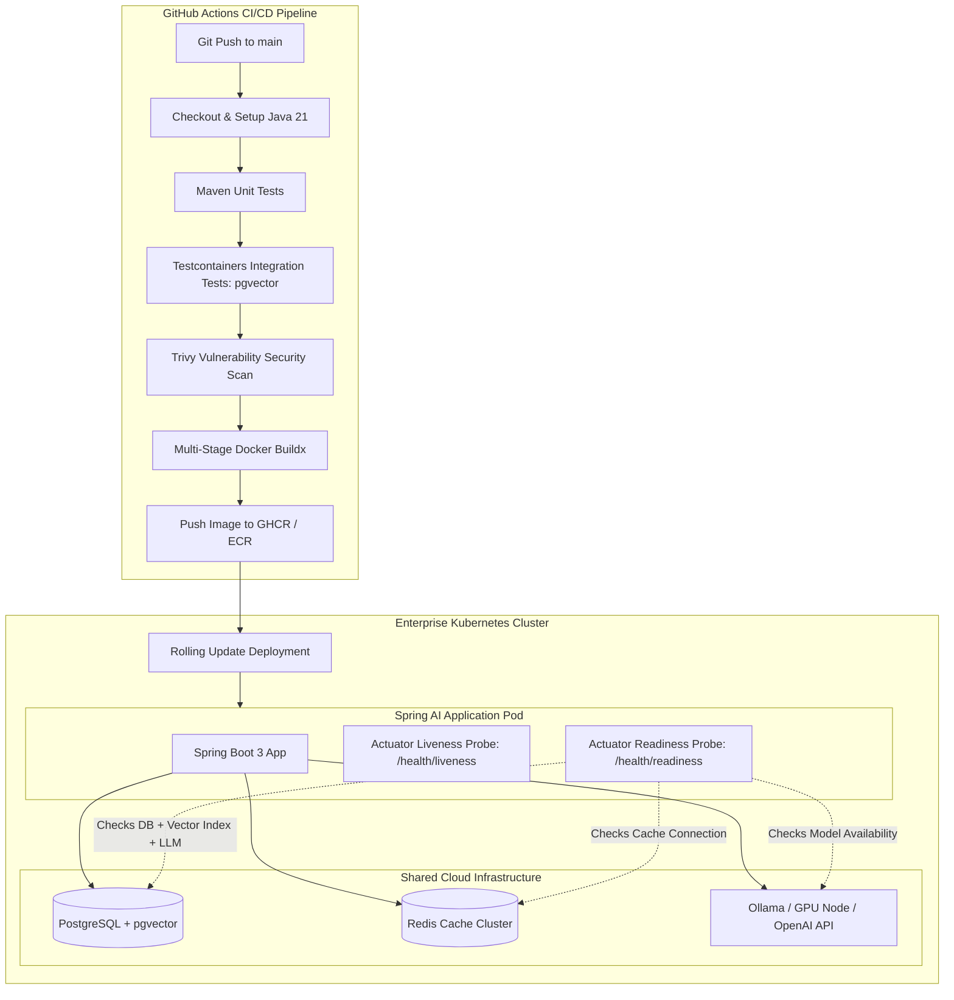

# Day 54: Docker, CI/CD & Cloud Deployment for Enterprise Java AI

| Previous Day | Course Hub | Next Day |
|:---|:---:|---:|
| [Day 53: Caching, Rate Limiting & Cost Optimization](../Day_53_Caching_Rate_Limiting_Cost_Optimization/Day_53_Caching_Rate_Limiting_Cost_Optimization.md) | [All 60 Days Overview](../../README.md) | [Day 55: Capstone — Enterprise AI Platform](../Day_55_Capstone_Enterprise_AI_Platform/Day_55_Capstone_Enterprise_AI_Platform.md) |

---

## 1. Topic Overview

**Cloud-Native Deployment for Java AI** encompasses packaging, testing, and deploying containerized Spring Boot AI microservices to Kubernetes clusters and enterprise cloud environments. In modern production systems, this discipline establishes multi-stage Docker builds, automated GitHub Actions CI/CD pipelines with real database Testcontainers, container-aware JVM tuning (Generational ZGC, `-XX:MaxRAMPercentage=75.0`), and intelligent Kubernetes readiness probes that ensure long-lived streaming responses terminate cleanly with zero downtime.

---

## 2. Basic Foundations (True Zero)

### Core Cloud & Deployment Vocabulary

- **Docker Container**: A standardized, lightweight standalone package containing your compiled Spring Boot `.jar` alongside the exact Java runtime (JRE) and OS dependencies it requires to execute identically across any cloud host.
- **Multi-Stage Docker Build**: A container build pattern that uses a full JDK and build tools (Maven/Gradle) in a temporary builder stage to compile the `.jar`, then copies *only* the finished artifact into a lean, stripped-down JRE runtime image (dropping image size from ~850MB to ~180MB).
- **CI/CD (Continuous Integration / Continuous Deployment)**: An automated delivery pipeline (such as GitHub Actions) that compiles code, executes unit and integration tests against real databases, scans for vulnerabilities, and publishes container images upon every commit.
- **Testcontainers**: A Java testing library that spins up throwaway, production-equivalent Docker containers (e.g., PostgreSQL with the `pgvector` extension) during automated Maven test runs.
- **Liveness Probe**: A Kubernetes health check answering: *"Is the JVM process responsive or deadlocked?"* If it fails, Kubernetes terminates and restarts the container.
- **Readiness Probe**: A Kubernetes health check answering: *"Is this pod ready to process AI queries right now?"* If the vector store is rebuilding an index or warming up, the probe fails, signaling Kubernetes to temporarily route user traffic to other pods without killing the instance.
- **Graceful Shutdown**: Configuring Spring Boot and Kubernetes to allow active streaming LLM connections (Server-Sent Events) up to 45 seconds to complete generation before terminating during a rolling deployment.

---

### Relatable Physical Analogy: The Intermodal Shipping Container & Port Inspector

Before 1956, international freight shipping was chaotic. Loose sacks of coffee, crates of fruit, and barrels of oil were loaded by hand onto ships. Barrels leaked, items broke, and offloading in London took two weeks of manual inspection.

Then came the **Intermodal Shipping Container**:
- A standardized, sealed steel box that fits identically on an American railway car, a Dutch container ship, a highway truck in Germany, and a gantry crane in Singapore.
- At the port terminal, the **Port Authority Inspector** does not open the container to taste every item. Instead, they inspect two external indicators:
  1. **Integrity Seal (Liveness Probe)**: Is the container structurally intact, or did the roof cave in? If crushed, remove it immediately.
  2. **Customs Clearance & Refrigeration (Readiness Probe)**: Is the cold-chain freezer running at $-18^\circ\text{C}$ and are the customs papers approved? If the generator is still warming up, **do not load the cargo onto delivery vans yet**, or the perishable food will spoil.

```
 [ Developer Machine (Local Train) ] ───► [ GitHub Actions CI/CD (Gantry Crane) ]
                                                        │
                                                        ▼
                                         [ Standardized Docker Image ]
                                         ┌───────────────────────────┐
                                         │ Java 21 JRE Jammy Runtime │
                                         │ Spring Boot 3 + Spring AI │
                                         │ Non-root user: appuser    │
                                         └──────────────┬────────────┘
                                                        │ Deployed to
                                                        ▼
 [ Cloud Kubernetes Cluster ] ◄─────────────────────────┘
  ├── Pod 1: Actuator Liveness: UP | Readiness: UP   ──► Receives User Queries
  └── Pod 2: Actuator Liveness: UP | Readiness: DOWN ──► Booting pgvector (Traffic Paused)
```

---

### Minimal Beginner-Friendly Example: A Pure Java Health Probe Simulator

Here is a minimal, self-contained Java program demonstrating how separate Liveness and Readiness probes behave during database maintenance:

```java
package com.genai.enterprise.deployment.minimal;

public class MinimalHealthProbeSimulator {

    public record HealthStatus(int statusCode, String status, String detail) {}

    public static class ApplicationHealthService {
        private boolean isJvmDeadlocked = false;
        private boolean isVectorIndexReady = true;

        public HealthStatus checkLiveness() {
            if (isJvmDeadlocked) {
                return new HealthStatus(500, "DOWN", "Deadlock detected in worker thread");
            }
            return new HealthStatus(200, "UP", "JVM process healthy");
        }

        public HealthStatus checkReadiness() {
            if (!isVectorIndexReady) {
                return new HealthStatus(503, "DOWN", "pgvector HNSW index rebuilding; pause traffic");
            }
            return new HealthStatus(200, "UP", "Vector store ready for queries");
        }

        public void simulateIndexRebuild() { this.isVectorIndexReady = false; }
        public void simulateIndexComplete() { this.isVectorIndexReady = true; }
    }

    public static void main(String[] args) {
        ApplicationHealthService service = new ApplicationHealthService();

        System.out.println("1. Normal Operations:");
        System.out.println("   Liveness:  " + service.checkLiveness());
        System.out.println("   Readiness: " + service.checkReadiness());

        System.out.println("\n2. Simulating Vector Index Rebuild:");
        service.simulateIndexRebuild();
        System.out.println("   Liveness:  " + service.checkLiveness() + " (Pod stays alive!)");
        System.out.println("   Readiness: " + service.checkReadiness() + " (Traffic diverted!)");

        System.out.println("\n3. Index Rebuild Complete:");
        service.simulateIndexComplete();
        System.out.println("   Readiness: " + service.checkReadiness() + " (Traffic restored!)");
    }
}
```

#### Line-by-Line Walkthrough:
1. `record HealthStatus(...)`: Represents an HTTP health probe response containing status code, status text, and diagnostic message.
2. `checkLiveness()`: Confirms the core JVM process is executing normally. If this fails, Kubernetes kills the pod.
3. `checkReadiness()`: Verifies external dependencies (like pgvector) are ready to serve queries.
4. `simulateIndexRebuild()`: When the vector index undergoes maintenance, readiness drops to `503 DOWN`.
5. `main(...)`: Confirms that during index rebuilds, Kubernetes keeps the container running (liveness remains `UP`) while cleanly stopping incoming traffic until readiness recovers.

---

## 3. Core Concept Walkthrough (Basic → Intermediate)

### 3.1 Cloud-Native Java 21 AI Architecture



---

### 3.2 The Multi-Stage Dockerfile for Spring AI

A single-stage Dockerfile containing Maven and the full JDK produces an image exceeding **850 MB** and carries unnecessary compilers and package managers into production.

Our hardened, multi-stage Dockerfile builds the application in an isolated stage and runs it in a minimal, non-root runtime environment:

```dockerfile
# ------------------------------------------------------------------------------
# STAGE 1: Build & Dependency Resolution
# ------------------------------------------------------------------------------
FROM eclipse-temurin:21-jdk-jammy AS builder
WORKDIR /workspace

# 1. Cache Maven dependencies separately from source code
COPY pom.xml .
RUN apt-get update && apt-get install -y maven && mvn dependency:go-offline -B

# 2. Copy source code and package application JAR
COPY src ./src
RUN mvn clean package -DskipTests -B

# ------------------------------------------------------------------------------
# STAGE 2: Minimal, Hardened Production Runtime
# ------------------------------------------------------------------------------
FROM eclipse-temurin:21-jre-jammy AS runner
WORKDIR /app

# Security: Create non-root system group and user
RUN groupadd -r appgroup && useradd -r -g appgroup -s /sbin/nologin -d /app appuser

# Copy executable JAR from builder stage
COPY --from=builder --chown=appuser:appgroup /workspace/target/*.jar app.jar

# Switch to unprivileged user
USER appuser:appgroup

EXPOSE 8080 8081

# Container-aware JVM tuning for Java 21:
ENV JAVA_OPTS="-XX:MaxRAMPercentage=75.0 -XX:+UseZGC -XX:+ZGenerational -Djava.security.egd=file:/dev/./urandom"

ENTRYPOINT ["sh", "-c", "exec java $JAVA_OPTS -jar app.jar"]
```

---

### 3.3 Container-Aware JVM Tuning (`-XX:MaxRAMPercentage=75.0`)

Historically, the JVM checked the host machine's total physical memory rather than the container's cgroups limit. If the host has 64 GB of RAM and Kubernetes assigns a 2 GB limit, an unconfigured JVM may size its heap to 16 GB, triggering the Linux kernel's **OOMKilled (exit code 137)**.

By configuring:
```bash
-XX:MaxRAMPercentage=75.0
```
the JVM dynamically sizes its maximum heap to 75% of whatever cgroup memory limit Kubernetes assigns to the pod, leaving 25% for Metaspace, off-heap vector buffers, and thread stacks.

Java 21 **Generational ZGC** (`-XX:+UseZGC -XX:+ZGenerational`) delivers sub-millisecond garbage collection pauses under heavy memory churn from streaming LLM responses.

---

### 3.4 Custom Spring Boot AI Readiness Indicator

```java
package com.genai.enterprise.deployment;

import org.springframework.boot.actuate.health.Health;
import org.springframework.boot.actuate.health.HealthIndicator;
import org.springframework.jdbc.core.JdbcTemplate;
import org.springframework.stereotype.Component;

@Component
public class VectorDatabaseReadinessIndicator implements HealthIndicator {

    private final JdbcTemplate jdbcTemplate;

    public VectorDatabaseReadinessIndicator(JdbcTemplate jdbcTemplate) {
        this.jdbcTemplate = jdbcTemplate;
    }

    @Override
    public Health health() {
        try {
            // 1. Verify pgvector extension is active
            String ext = jdbcTemplate.queryForObject(
                "SELECT extname FROM pg_extension WHERE extname = 'vector'", String.class);
            
            if (!"vector".equals(ext)) {
                return Health.down().withDetail("error", "pgvector extension missing").build();
            }

            // 2. Verify vector store table is reachable
            Integer count = jdbcTemplate.queryForObject(
                "SELECT COUNT(*) FROM vector_store", Integer.class);

            return Health.up()
                .withDetail("pgvector", "READY")
                .withDetail("vector_count", count)
                .build();

        } catch (Exception e) {
            return Health.down(e).withDetail("error", "Vector database unreachable: " + e.getMessage()).build();
        }
    }
}
```

---

### 3.5 Automated CI/CD with GitHub Actions & Testcontainers

A production AI CI/CD pipeline must never skip database integration tests. In-memory mocks hide syntax errors in pgvector queries, dimension mismatches, and cosine operator failures.

```yaml
name: Enterprise Java AI CI/CD Pipeline

on:
  push:
    branches: [ main ]
  pull_request:
    branches: [ main ]

jobs:
  build-and-test:
    name: Build, Test & Security Scan
    runs-on: ubuntu-latest

    services:
      postgres:
        image: pgvector/pgvector:pg16
        env:
          POSTGRES_DB: test_ai
          POSTGRES_USER: test_user
          POSTGRES_PASSWORD: test_password
        ports:
          - 5432:5432
        options: >-
          --health-cmd pg_isready
          --health-interval 10s
          --health-timeout 5s
          --health-retries 5

    steps:
      - name: Checkout Code
        uses: actions/checkout@v4

      - name: Set up OpenJDK 21
        uses: actions/setup-java@v4
        with:
          java-version: '21'
          distribution: 'temurin'
          cache: 'maven'

      - name: Compile and Run Unit Tests
        run: mvn clean test -B

      - name: Run Testcontainers Integration Tests
        run: mvn verify -Dtest="*IT" -B

      - name: Trivy Vulnerability Scanner
        uses: aquasecurity/trivy-action@master
        with:
          scan-type: 'fs'
          severity: 'CRITICAL,HIGH'

  publish-container:
    name: Build & Push Container Image
    needs: build-and-test
    if: github.ref == 'refs/heads/main'
    runs-on: ubuntu-latest

    steps:
      - name: Checkout Code
        uses: actions/checkout@v4

      - name: Set up Docker Buildx
        uses: docker/setup-buildx-action@v3

      - name: Build and Push Multi-Arch Docker Image
        uses: docker/build-push-action@v5
        with:
          context: .
          file: ./Dockerfile
          push: true
          tags: ghcr.io/${{ github.repository }}:latest
```

---

### 3.6 Graceful Shutdown & Streaming LLM Connections

In Generative AI, **Server-Sent Events (SSE) streaming connections stay active for 30 to 60 seconds** while the LLM generates tokens. If Kubernetes abruptly issues `SIGKILL`, user screens freeze mid-sentence.

#### Spring Boot Graceful Shutdown (`application.yml`):
```yaml
server:
  shutdown: graceful

spring:
  lifecycle:
    timeout-per-shutdown-phase: 45s
```

#### Kubernetes Pod Spec (`deployment.yaml`):
```yaml
spec:
  template:
    spec:
      terminationGracePeriodSeconds: 60
```

When a rolling update occurs:
1. Kubernetes removes the Pod from the Service endpoint (no new traffic arrives).
2. The readiness probe reports `DOWN`.
3. Spring Boot allows active streaming LLM connections up to 45 seconds to finish delivering tokens.
4. The pod terminates cleanly with zero interrupted responses.

---

## 4. Prerequisite & Supporting Concepts

### Prerequisite / Supporting Concept: Linux Containers & Cgroups Memory Limits
Docker containers rely on Linux Control Groups (cgroups) to enforce CPU and memory boundaries. The Linux kernel OOM killer monitors cgroup memory usage. If an unconfigured JVM allocates memory beyond its cgroup limit, the kernel terminates the container immediately with exit code 137.

### Prerequisite / Supporting Concept: Testcontainers & Ephemeral Docker Infrastructure
`org.testcontainers` communicates with the local Docker daemon to instantiate ephemeral containers (like `pgvector/pgvector:pg16`) for JUnit tests. Random available ports are assigned automatically to prevent port conflicts on shared CI runners.

### Prerequisite / Supporting Concept: Server-Sent Events (SSE) & Connection Lifecycle
Unlike standard HTTP request-response cycles where a connection lasts 50ms, SSE keeps an HTTP connection open with `Transfer-Encoding: chunked` and `Content-Type: text/event-stream` for the entire duration of LLM generation.

---

## 5. Advanced Depth (Intermediate → Advanced)

### 5.1 Common Mistakes & Misconceptions: Bad vs. Good

#### Mistake 1: Running Containers as `root`
Running as root exposes the underlying host kernel to severe privilege escalation attacks if any dependency contains a remote code execution vulnerability.

```dockerfile
# ❌ BAD: Defaults to root user
FROM eclipse-temurin:21-jre-jammy
COPY app.jar app.jar
ENTRYPOINT ["java", "-jar", "app.jar"]

# ✅ GOOD: Create and switch to an unprivileged system user
FROM eclipse-temurin:21-jre-jammy
RUN groupadd -r appgroup && useradd -r -g appgroup -s /sbin/nologin -d /app appuser
COPY --chown=appuser:appgroup app.jar app.jar
USER appuser:appgroup
ENTRYPOINT ["java", "-jar", "app.jar"]
```

#### Mistake 2: Using Hardcoded Heap Limits (`-Xmx2g`) in Dynamic Environments
Hardcoded heap sizes fail when Kubernetes cluster autoscalers adjust pod resource limits.

```bash
# ❌ BAD: Hardcoded memory limits trigger OOMKills if pod limit is reduced
ENV JAVA_OPTS="-Xmx2048m -Xms2048m"

# ✅ GOOD: Dynamically calculate heap as percentage of container memory
ENV JAVA_OPTS="-XX:MaxRAMPercentage=75.0 -XX:InitialRAMPercentage=50.0"
```

#### Mistake 3: Pointing Kubernetes Liveness Probes to Heavy External Checks
If the liveness probe queries an external database or model API, an outage in that downstream service causes Kubernetes to restart every pod in your cluster, amplifying the failure into a catastrophic crash loop.

```yaml
# ❌ BAD: Liveness probe checks external database (triggers cluster crash loops)
livenessProbe:
  httpGet:
    path: /actuator/health # Includes database, Redis, OpenAI checks!

# ✅ GOOD: Separate Liveness (JVM only) from Readiness (Dependencies)
livenessProbe:
  httpGet:
    path: /actuator/health/liveness
readinessProbe:
  httpGet:
    path: /actuator/health/readiness
```

---

### 5.2 Complete Verification Suite & Demo Execution

Execute the verification suite in `Phase_08_Enterprise_Production/Day_54_Docker_CICD_Cloud_Deployment/code/`:

```bash
javac -d out Phase_08_Enterprise_Production/Day_54_Docker_CICD_Cloud_Deployment/code/*.java
java -cp out com.genai.enterprise.deployment.DeploymentDemo
```

```
==========================================================================
     ENTERPRISE CLOUD DEPLOYMENT & KUBERNETES PROBE VERIFIER             
==========================================================================

[Step 1: Checking Kubernetes Liveness Probe (/actuator/health/liveness)]
  Status  : UP (HTTP 200 OK)
  Details : {jvm.uptimeMs=42500, jvm.threads.active=1, jvm.memory.freeBytes=252832344}

[Step 2: Checking Kubernetes Readiness Probe (/actuator/health/readiness)]
  Status  : UP (HTTP 200 OK -> Ready to receive traffic)
  Details : {db.postgresql=UP, db.pgvector.hnsw_index=READY, cache.redis=UP, llm.gateway=REACHABLE}

[Step 3: Simulating pgvector Index Rebuilding (Transient Dependency Delay)]
  Status  : DOWN (HTTP 503 SERVICE UNAVAILABLE)
  Action  : Kubernetes removes Pod IP from Service Endpoints (Traffic NOT routed)
  Details : {db.postgresql=UP, db.pgvector.hnsw_index=BUILDING, cache.redis=UP, llm.gateway=REACHABLE}

[Step 4: Simulating Vector Index Ready & Re-Enabling Pod in Load Balancer]
  Status  : UP (HTTP 200 OK -> Pod IP restored)
  Details : {db.postgresql=UP, db.pgvector.hnsw_index=READY, cache.redis=UP, llm.gateway=REACHABLE}

==========================================================================
>>> Cloud-native containerization and probe validation completed successfully!
```

---

## 6. Quick Recap

| Deployment Component | Configuration | Enterprise Purpose |
|:---|:---|:---|
| **Multi-Stage Docker** | Eclipse Temurin 21 JRE Jammy | Reduces image size from 850MB to 180MB; eliminates build tool attack surface. |
| **Non-Root Security** | `USER appuser:appgroup` | Adheres to CIS Docker Benchmark; prevents container root escapes. |
| **Container Memory** | `-XX:MaxRAMPercentage=75.0` | Adapts JVM heap dynamically to cgroup limit, preventing OOMKilled exit code 137. |
| **Generational ZGC** | `-XX:+UseZGC -XX:+ZGenerational` | Sub-millisecond GC pauses under high-throughput streaming allocations. |
| **Liveness Probe** | `/actuator/health/liveness` | Restarts pods only if the JVM process deadlocks. |
| **Readiness Probe** | `/actuator/health/readiness` | Diverts traffic when vector DB indexes are warming without killing the pod. |
| **Graceful Shutdown** | `timeout-per-shutdown-phase: 45s` | Guarantees in-flight LLM streaming tokens finish before pod termination. |

---

## 7. Self-Check Questions & Practice Exercises

### Conceptual Self-Check Questions

#### Question 1: What occurs if a Kubernetes Liveness probe fails 3 consecutive times?
- A) Kubernetes sends a warning email to the DevOps team.
- B) Kubernetes removes the pod from the service load balancer but leaves it running.
- C) Kubernetes terminates (kills) the container and restarts a new pod instance.
- D) The Horizontal Pod Autoscaler doubles the replica count.

*Answer*: **C**. The Liveness probe monitors process health; if it fails, Kubernetes assumes the process is deadlocked or unrecoverable and restarts the container.

---

#### Question 2: What occurs if a Kubernetes Readiness probe fails?
- A) The pod is terminated immediately with `SIGKILL`.
- B) The pod's IP is removed from the Kubernetes Service load balancer, pausing incoming traffic until the probe reports `UP` again.
- C) The entire node drains all pods.
- D) The database drops all active connections.

*Answer*: **B**. Readiness checks whether an application is currently prepared to accept traffic. If an AI service is waiting for a vector database index to warm up, traffic is diverted without killing the container.

---

#### Question 3: Why should production Docker containers run under an unprivileged user (`USER appuser`)?
- A) Non-root containers compile Java bytecode faster.
- B) To enforce least privilege, preventing an attacker who achieves arbitrary code execution from accessing host devices or tampering with container root filesystems.
- C) Docker requires non-root users to mount persistent volumes.
- D) The JVM crashes if started as root.

*Answer*: **B**. Running as non-root is a standard security hardening requirement (CIS Docker Benchmark) that restricts the blast radius of potential exploits.

---

#### Question 4: What is the purpose of `-XX:MaxRAMPercentage=75.0` in containerized Java?
- A) It limits CPU utilization to 75%.
- B) It instructs the JVM to configure its maximum heap size as 75% of the container's cgroup memory limit, preventing Linux kernel OOMKills.
- C) It reserves 75% of disk space for application logs.
- D) It guarantees a 75% vector cache hit rate.

*Answer*: **B**. It allows Java to dynamically adapt heap memory to container boundaries rather than incorrectly querying total host RAM.

---

### Hands-on Practice Exercises

#### Exercise 1: Multi-Architecture Container Build
**Task**: Write a `docker buildx` terminal command that builds your Spring AI container image for both `linux/amd64` (Intel/AMD cloud VMs) and `linux/arm64` (Apple Silicon / AWS Graviton instances) and pushes the multi-arch manifest to a container registry.

**Solution**:
```bash
docker buildx create --name enterprise-builder --use
docker buildx build \
  --platform linux/amd64,linux/arm64 \
  -t mycompany/spring-ai-backend:v1.0.0 \
  --push .
```

---

#### Exercise 2: Testcontainers PostgreSQL pgvector Integration Test
**Task**: Implement a JUnit 5 test class using Testcontainers that launches a real `pgvector/pgvector:pg16` Docker container, enables the vector extension, and asserts that a cosine distance query executes successfully.

**Solution**:
```java
package com.genai.enterprise.exercises;

import org.junit.jupiter.api.Test;
import org.testcontainers.containers.PostgreSQLContainer;
import org.testcontainers.junit.jupiter.Container;
import org.testcontainers.junit.jupiter.Testcontainers;

import java.sql.Connection;
import java.sql.DriverManager;
import java.sql.ResultSet;
import java.sql.Statement;

import static org.junit.jupiter.api.Assertions.assertTrue;

@Testcontainers
class PgVectorContainerTest {

    @Container
    static PostgreSQLContainer<?> postgres = new PostgreSQLContainer<>("pgvector/pgvector:pg16")
            .withDatabaseName("test_ai")
            .withUsername("test_user")
            .withPassword("test_pass");

    @Test
    void testPgVectorExtensionActive() throws Exception {
        try (Connection conn = DriverManager.getConnection(
                postgres.getJdbcUrl(), postgres.getUsername(), postgres.getPassword());
             Statement stmt = conn.createStatement()) {
            
            stmt.execute("CREATE EXTENSION IF NOT EXISTS vector;");
            ResultSet rs = stmt.executeQuery("SELECT extname FROM pg_extension WHERE extname = 'vector';");
            assertTrue(rs.next(), "pgvector extension must be installed and active");
        }
    }
}
```

---

#### Exercise 3: JVM Heap Dump Configuration on OOM
**Task**: Configure Docker `JAVA_OPTS` to automatically generate an HPROF heap dump file in a mounted volume `/dumps` whenever an OutOfMemoryError occurs, enabling diagnostic analysis of memory leaks caused by massive vector loads.

**Solution**:
```dockerfile
ENV JAVA_OPTS="-XX:MaxRAMPercentage=75.0 \
               -XX:+HeapDumpOnOutOfMemoryError \
               -XX:HeapDumpPath=/dumps/oom.hprof \
               -XX:+UseZGC -XX:+ZGenerational"
```

---

#### Exercise 4: Dynamic Model Gateway Readiness Indicator
**Task**: Implement a Spring Boot `HealthIndicator` that verifies whether the external LLM gateway is reachable within a 500ms HTTP connection timeout before marking the pod as ready.

**Solution**:
```java
package com.genai.enterprise.exercises;

import org.springframework.boot.actuate.health.Health;
import org.springframework.boot.actuate.health.HealthIndicator;
import org.springframework.stereotype.Component;

import java.net.URI;
import java.net.http.HttpClient;
import java.net.http.HttpRequest;
import java.net.http.HttpResponse;
import java.time.Duration;

@Component
public class LlmGatewayReadinessIndicator implements HealthIndicator {

    private final HttpClient client = HttpClient.newBuilder()
            .connectTimeout(Duration.ofMillis(500))
            .build();

    @Override
    public Health health() {
        try {
            HttpRequest request = HttpRequest.newBuilder()
                    .uri(URI.create("https://api.openai.com/v1/models"))
                    .timeout(Duration.ofMillis(1000))
                    .GET()
                    .build();

            // Check gateway reachability (HTTP 200 or 401 Unauthorized both prove gateway is reachable)
            HttpResponse<Void> resp = client.send(request, HttpResponse.BodyHandlers.discarding());
            if (resp.statusCode() == 200 || resp.statusCode() == 401) {
                return Health.up().withDetail("llm_gateway", "REACHABLE").build();
            }
            return Health.down().withDetail("http_status", resp.statusCode()).build();
        } catch (Exception ex) {
            return Health.down(ex).withDetail("error", "LLM Gateway unreachable: " + ex.getMessage()).build();
        }
    }
}
```

---

| Previous Day | Course Hub | Next Day |
|:---|:---:|---:|
| [Day 53: Caching, Rate Limiting & Cost Optimization](../Day_53_Caching_Rate_Limiting_Cost_Optimization/Day_53_Caching_Rate_Limiting_Cost_Optimization.md) | [All 60 Days Overview](../../README.md) | [Day 55: Capstone — Enterprise AI Platform](../Day_55_Capstone_Enterprise_AI_Platform/Day_55_Capstone_Enterprise_AI_Platform.md) |
