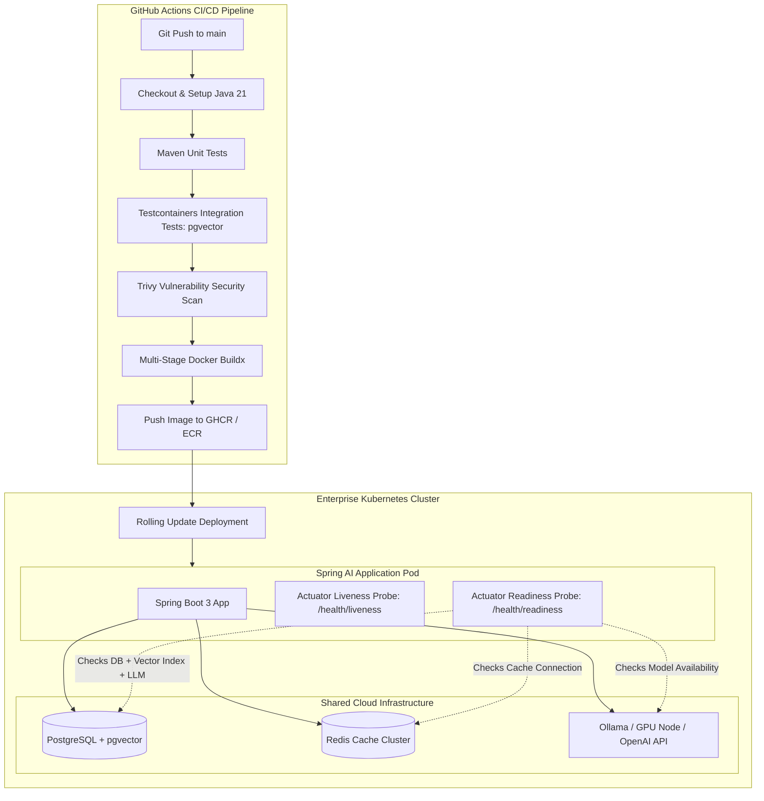

# Day 54: Docker, CI/CD & Cloud Deployment for Enterprise Java AI

---

## 1. Real-World Analogy: The Standardized Shipping Container & Port Authority Terminal

Before 1956, shipping cargo across oceans was pure chaos. Loose sacks of coffee, barrels of wine, and steel pipes were manually carried into ships by longshoremen. If a barrel leaked, it ruined the coffee. If a ship arrived in London, workers spent two weeks unpacking it piece by piece, and half the cargo was stolen or broken.

Then came the **Intermodal Shipping Container**:
- A standardized, sealed, steel box that fits identically on a truck bed in Ohio, a freight train in Chicago, a container ship in the Atlantic, and a gantry crane in Rotterdam.
- At the international port, the **Port Authority Inspector** does not open the container and taste every item. Instead, they check two external indicators:
  1. **Integrity Seal (Liveness)**: Is the container intact, or has the roof collapsed? If the box is structurally crushed, hoist it off immediately.
  2. **Customs Clearance & Refrigeration Power (Readiness)**: Is the cold-chain cooling unit running at -18°C and are the customs papers signed? If the cooling generator is still booting up, **do not load the cargo onto the delivery truck yet**, or the perishable food will spoil.

```
 [ Developer Machine (Local Train) ] ───► [ GitHub Actions CI/CD (Gantry Crane) ]
                                                        │
                                                        ▼
                                         [ Standardized Docker Image ]
                                         ┌───────────────────────────┐
                                         │ Java 21 JRE Jammy Runtime │
                                         │ Spring Boot 3 + Spring AI │
                                         │ Non-root user: appuser    │
                                         └──────────────┬────────────┘
                                                        │ Deployed to
                                                        ▼
 [ Cloud Kubernetes Cluster ] ◄─────────────────────────┘
  ├── Pod 1: Actuator Liveness: UP | Readiness: UP   ──► Receives User Queries
  └── Pod 2: Actuator Liveness: UP | Readiness: DOWN ──► Booting pgvector (Traffic Paused)
```

In enterprise Generative AI, packaging and deploying applications is significantly more demanding than traditional web services. AI microservices depend on:
- High-memory JVM heaps for embedding models and vector buffers.
- Synchronized companion infrastructure (PostgreSQL with `pgvector`, Redis for caching, Ollama for local LLMs).
- Stateful long-lived Server-Sent Events (SSE) connections that must not be abruptly terminated during rolling updates.
- Deep readiness checks verifying that vector indexes are fully warmed up before user queries hit the cluster.

---

## 2. Under-the-Hood Architecture: Cloud-Native Java 21 AI Infrastructure



---

## 3. The Multi-Stage Dockerfile: Slashing Image Size and Hardening Security

A standard single-stage `Dockerfile` with a full JDK weighs over **850 MB** and carries compilers, build tools, package managers, and root permissions directly into production—a massive security and bandwidth liability.

A **Multi-Stage Dockerfile** solves this:
1. **Builder Stage**: Uses a full Eclipse Temurin 21 JDK to download dependencies and compile the `.jar`.
2. **Runner Stage**: Uses a stripped-down Eclipse Temurin 21 JRE Jammy image (weighing only ~180 MB). Build tools (`mvn`, `javac`) are discarded.
3. **Non-Root Execution**: Creates an unprivileged user `appuser:appgroup` so that even in the unlikely event of a remote code execution exploit, the attacker has zero root capabilities.

```dockerfile
# ------------------------------------------------------------------------------
# STAGE 1: Build & Dependency Resolution
# ------------------------------------------------------------------------------
FROM eclipse-temurin:21-jdk-jammy AS builder
WORKDIR /workspace

# 1. Cache Maven dependencies separately from source code
COPY pom.xml .
RUN apt-get update && apt-get install -y maven && mvn dependency:go-offline -B

# 2. Copy source code and package application JAR
COPY src ./src
RUN mvn clean package -DskipTests -B

# ------------------------------------------------------------------------------
# STAGE 2: Minimal, Hardened Production Runtime
# ------------------------------------------------------------------------------
FROM eclipse-temurin:21-jre-jammy AS runner
WORKDIR /app

# Security: Create non-root system group and user
RUN groupadd -r appgroup && useradd -r -g appgroup -s /sbin/nologin -d /app appuser

# Copy executable JAR from builder stage
COPY --from=builder --chown=appuser:appgroup /workspace/target/*.jar app.jar

# Switch to unprivileged user
USER appuser:appgroup

EXPOSE 8080 8081

# Container-aware JVM tuning for Java 21:
ENV JAVA_OPTS="-XX:MaxRAMPercentage=75.0 -XX:+UseZGC -XX:+ZGenerational -Djava.security.egd=file:/dev/./urandom"

ENTRYPOINT ["sh", "-c", "exec java $JAVA_OPTS -jar app.jar"]
```

### Why JVM Container Awareness is Crucial (`-XX:MaxRAMPercentage=75.0`)
Historically, the JVM would query the host machine's total physical RAM rather than the Docker container's allocated limit. If your host has 64 GB of RAM and your container limit is 2 GB, an unconfigured JVM might allocate a 16 GB heap, causing the Linux kernel to immediately kill the container with an **OOMKilled (Out of Memory Killer)** exit code 137.

By specifying:
```bash
-XX:MaxRAMPercentage=75.0
```
the JVM dynamically calculates its heap size as 75% of whatever cgroup memory limit Kubernetes assigns to the pod, leaving the remaining 25% for Metaspace, off-heap vector buffers, and thread stacks.

Furthermore, Java 21 introduces **Generational ZGC** (`-XX:+UseZGC -XX:+ZGenerational`), delivering sub-millisecond garbage collection pauses even under heavy memory churn from streaming LLM responses.

---

## 4. Kubernetes Health Probes: Liveness vs Readiness in AI Applications

In standard microservices, `/health` simply checks if the HTTP port is open. In AI microservices, this naive check causes production outages during cold starts and index rebuilds.

```
              ┌──────────────────────────────────────────────┐
              │           KUBERNETES PROBE DYNAMICS          │
              └──────────────────────┬───────────────────────┘
                                     │
         ┌───────────────────────────┴───────────────────────────┐
         ▼                                                       ▼
  [ Liveness Probe ]                                      [ Readiness Probe ]
  Path: /actuator/health/liveness                         Path: /actuator/health/readiness
  Question: "Is the JVM process alive?"                   Question: "Can this pod answer AI queries?"
  If Fails: Kubernetes RESTARTS the pod                   If Fails: Kubernetes STOPS sending traffic
  Triggered by: Deadlocks, infinite loops                 Triggered by: Vector DB down, index warming
```

### Writing a Custom Spring Boot AI Readiness Indicator

```java
@Component
public class VectorDatabaseReadinessIndicator implements HealthIndicator {

    private final JdbcTemplate jdbcTemplate;
    private final VectorStore vectorStore;

    public VectorDatabaseReadinessIndicator(JdbcTemplate jdbcTemplate, VectorStore vectorStore) {
        this.jdbcTemplate = jdbcTemplate;
        this.vectorStore = vectorStore;
    }

    @Override
    public Health health() {
        try {
            // 1. Verify pgvector extension is installed
            String ext = jdbcTemplate.queryForObject(
                "SELECT extname FROM pg_extension WHERE extname = 'vector'", String.class);
            
            if (!"vector".equals(ext)) {
                return Health.down().withDetail("error", "pgvector extension missing").build();
            }

            // 2. Verify HNSW index is ready and readable
            Integer count = jdbcTemplate.queryForObject(
                "SELECT COUNT(*) FROM vector_store", Integer.class);

            return Health.up()
                .withDetail("pgvector", "READY")
                .withDetail("vector_count", count)
                .build();

        } catch (Exception e) {
            return Health.down(e).withDetail("error", "Vector database unreachable").build();
        }
    }
}
```

If the database is restarting or rebuilding an HNSW index of 5 million vectors, the readiness probe returns HTTP 503 `DOWN`. **Kubernetes does not kill the pod**; it simply routes incoming user traffic to other healthy replicas until the index completes!

---

## 5. Automated CI/CD Pipeline with GitHub Actions & Testcontainers

A production AI CI/CD pipeline must never skip database integration tests. Mocking `VectorStore` in memory hides syntax errors in pgvector SQL, dimension mismatches, and cosine distance operator failures.

### The CI/CD Pipeline Workflow

```yaml
name: Enterprise Java AI CI/CD Pipeline

on:
  push:
    branches: [ main ]
  pull_request:
    branches: [ main ]

jobs:
  build-and-test:
    name: Build, Test & Security Scan
    runs-on: ubuntu-latest

    services:
      postgres:
        image: pgvector/pgvector:pg16
        env:
          POSTGRES_DB: test_ai
          POSTGRES_USER: test_user
          POSTGRES_PASSWORD: test_password
        ports:
          - 5432:5432
        options: >-
          --health-cmd pg_isready
          --health-interval 10s
          --health-timeout 5s
          --health-retries 5

    steps:
      - name: Checkout Code
        uses: actions/checkout@v4

      - name: Set up OpenJDK 21
        uses: actions/setup-java@v4
        with:
          java-version: '21'
          distribution: 'temurin'
          cache: 'maven'

      - name: Compile and Run Unit Tests
        run: mvn clean test -B

      - name: Run Testcontainers Integration Tests
        run: mvn verify -Dtest="*IT" -B

      - name: Trivy Vulnerability Scanner
        uses: aquasecurity/trivy-action@master
        with:
          scan-type: 'fs'
          severity: 'CRITICAL,HIGH'

  publish-container:
    name: Build & Push Container Image
    needs: build-and-test
    if: github.ref == 'refs/heads/main'
    runs-on: ubuntu-latest

    steps:
      - name: Checkout Code
        uses: actions/checkout@v4

      - name: Set up Docker Buildx
        uses: docker/setup-buildx-action@v3

      - name: Build and Push Multi-Arch Docker Image
        uses: docker/build-push-action@v5
        with:
          context: .
          file: ./Dockerfile
          push: true
          tags: ghcr.io/${{ github.repository }}:latest
```

---

## 6. Hands-On Companion Code Walkthrough

Our companion repository inside `code/` provides production-grade deployment manifests and simulation code:

### 1. `Dockerfile`
A fully hardened, multi-stage Dockerfile using Eclipse Temurin 21 JRE Jammy, non-root `appuser`, and container-aware memory and GC tuning.

### 2. `docker-compose.prod.yml`
An enterprise stack orchestrating:
- `ai-backend`: Spring AI backend with resource limits (2 CPU / 2048 MB RAM).
- `postgres-pgvector`: PostgreSQL 16 with pre-installed pgvector and automated health checks.
- `redis-cache`: High-speed Alpine Redis with 512 MB LRU eviction.
- `ollama-service`: Open-weight model server for zero-cost edge inference.

### 3. `k8s-deployment.yaml`
Production Kubernetes Deployment, Service, and Horizontal Pod Autoscaler (HPA) manifests with `/actuator/health/liveness` and `/actuator/health/readiness` probes configured.

### 4. `ci-pipeline.yml`
GitHub Actions workflow executing automated unit tests, real pgvector integration tests, Trivy CVE scanning, and multi-arch Docker image publishing.

### 5. `HealthProbeSimulator.java` & `DeploymentDemo.java`
Interactive Java 21 classes verifying how Kubernetes health probes respond when vector databases undergo transient maintenance, confirming that traffic is cleanly diverted without restarting the container.

---

## 7. Verifying the Implementation

Run the test suite directly from your terminal:

```powershell
javac -d out Phase_08_Enterprise_Production/Day_54_Docker_CICD_Cloud_Deployment/code/*.java
java -cp out com.genai.enterprise.deployment.DeploymentDemo
Remove-Item -Recurse -Force out
```

Expected output:
```
==========================================================================
     ENTERPRISE CLOUD DEPLOYMENT & KUBERNETES PROBE VERIFIER             
==========================================================================

[Step 1: Checking Kubernetes Liveness Probe (/actuator/health/liveness)]
  Status  : UP (HTTP 200 OK)
  Details : {jvm.uptimeMs=42500, jvm.threads.active=1, jvm.memory.freeBytes=252832344}

[Step 2: Checking Kubernetes Readiness Probe (/actuator/health/readiness)]
  Status  : UP (HTTP 200 OK -> Ready to receive traffic)
  Details : {db.postgresql=UP, db.pgvector.hnsw_index=READY, cache.redis=UP, llm.gateway=REACHABLE}

[Step 3: Simulating pgvector Index Rebuilding (Transient Dependency Delay)]
  Status  : DOWN (HTTP 503 SERVICE UNAVAILABLE)
  Action  : Kubernetes removes Pod IP from Service Endpoints (Traffic NOT routed)
  Details : {db.postgresql=UP, db.pgvector.hnsw_index=BUILDING, cache.redis=UP, llm.gateway=REACHABLE}

[Step 4: Simulating Vector Index Ready & Re-Enabling Pod in Load Balancer]
  Status  : UP (HTTP 200 OK -> Pod IP restored)
  Details : {db.postgresql=UP, db.pgvector.hnsw_index=READY, cache.redis=UP, llm.gateway=REACHABLE}

==========================================================================
>>> Cloud-native containerization and probe validation completed successfully!
```

---

## 8. Graceful Shutdown & Streaming LLM Connections

When deploying new versions in Kubernetes, rolling updates terminate old pods. In traditional REST APIs, requests take 50ms, so pods can terminate immediately.

In Generative AI, **Server-Sent Events (SSE) streaming connections can stay open for 30 to 60 seconds** while the LLM generates tokens. If Kubernetes abruptly sends `SIGKILL`, user screens will freeze mid-sentence with an error.

### Configuring Graceful Shutdown in Spring Boot

In `application.yml`:
```yaml
server:
  shutdown: graceful

spring:
  lifecycle:
    timeout-per-shutdown-phase: 45s
```

In Kubernetes Deployment:
```yaml
spec:
  template:
    spec:
      terminationGracePeriodSeconds: 60
```

When Kubernetes signals a rolling update:
1. Kubernetes removes the Pod from the Service Endpoints (no new requests arrive).
2. The readiness probe reports `DOWN`.
3. Spring Boot allows existing streaming LLM responses up to 45 seconds to finish generating.
4. The pod terminates cleanly with zero dropped customer tokens.

---

## 9. Hands-On Exercises

### Exercise 1: Multi-Arch Container Image Build
**Problem**: Write a `docker buildx` terminal command that compiles your Spring AI application image for both `linux/amd64` (AWS EC2 / Intel servers) and `linux/arm64` (Apple Silicon / AWS Graviton instances) and pushes the manifest to Docker Hub.

**Solution**:
```bash
docker buildx create --name enterprise-builder --use
docker buildx build \
  --platform linux/amd64,linux/arm64 \
  -t mycompany/spring-ai-backend:v1.0.0 \
  --push .
```

### Exercise 2: Testcontainers PostgreSQL pgvector Integration Test
**Problem**: Write a JUnit 5 test class using Testcontainers that boots a real `pgvector/pgvector:pg16` Docker container, creates the vector extension, and asserts that a cosine distance query executes successfully.

**Solution**:
```java
import org.junit.jupiter.api.Test;
import org.testcontainers.containers.PostgreSQLContainer;
import org.testcontainers.junit.jupiter.Container;
import org.testcontainers.junit.jupiter.Testcontainers;
import java.sql.*;
import static org.junit.jupiter.api.Assertions.assertTrue;

@Testcontainers
class PgVectorContainerTest {

    @Container
    static PostgreSQLContainer<?> postgres = new PostgreSQLContainer<>("pgvector/pgvector:pg16")
            .withDatabaseName("testdb")
            .withUsername("testuser")
            .withPassword("testpass");

    @Test
    void testPgVectorExtensionEnabled() throws SQLException {
        try (Connection conn = DriverManager.getConnection(
                postgres.getJdbcUrl(), postgres.getUsername(), postgres.getPassword());
             Statement stmt = conn.createStatement()) {
            
            stmt.execute("CREATE EXTENSION IF NOT EXISTS vector;");
            ResultSet rs = stmt.executeQuery("SELECT extname FROM pg_extension WHERE extname = 'vector';");
            assertTrue(rs.next());
        }
    }
}
```

### Exercise 3: JVM Heap Dump on Out-of-Memory Configuration
**Problem**: Update your Dockerfile `JAVA_OPTS` to automatically generate an HPROF heap dump file in a mounted volume `/dumps` whenever the JVM encounters an OutOfMemoryError, allowing engineers to diagnose memory leaks caused by massive vector loads.

**Solution**:
```dockerfile
ENV JAVA_OPTS="-XX:MaxRAMPercentage=75.0 \
               -XX:+HeapDumpOnOutOfMemoryError \
               -XX:HeapDumpPath=/dumps/oom.hprof \
               -XX:+UseZGC -XX:+ZGenerational"
```

---

## 10. Self-Check Quiz

### Question 1: What happens if a Kubernetes Liveness probe fails 3 consecutive times?
- A) Kubernetes sends an alert email to the developer.
- B) Kubernetes stops sending network traffic to the pod but keeps it running.
- C) Kubernetes terminates (kills) the container and restarts a new one.
- D) The pod is automatically scaled up by the HPA.
*Answer: C. The Liveness probe monitors process viability; if it fails, Kubernetes assumes the process is deadlocked or unrecoverable and restarts it.*

### Question 2: What happens if a Kubernetes Readiness probe fails?
- A) The pod is immediately destroyed and restarted.
- B) The pod's IP address is removed from the Kubernetes Service load balancer, stopping new traffic until the probe reports UP again.
- C) The entire cluster restarts.
- D) Docker images are re-pulled.
*Answer: B. Readiness determines if a container is ready to accept user requests. If an AI service is waiting for a vector database or model gateway, traffic is paused without killing the container.*

### Question 3: Why should production Docker containers run under a non-root user (e.g. `USER appuser`)?
- A) Non-root containers compile Java code faster.
- B) To enforce the principle of least privilege, preventing an attacker who achieves arbitrary code execution from accessing host devices or altering container root filesystems.
- C) Docker requires non-root users to mount volumes.
- D) JVM cannot start if running as root.
*Answer: B. Running as non-root is a fundamental security hardening standard (CIS Docker Benchmark) that minimizes exploit blast radius.*

### Question 4: What is the purpose of the `-XX:MaxRAMPercentage=75.0` flag in containerized Java?
- A) It limits CPU usage to 75%.
- B) It forces the JVM to configure its maximum heap size as 75% of the container's cgroup memory limit, preventing Linux kernel OOMKills.
- C) It guarantees 75% cache hit rates.
- D) It reserves 75% of disk space for logs.
*Answer: B. It allows Java to dynamically adapt heap memory to container boundaries rather than incorrectly querying total host RAM.*

### Question 5: Why is `server.shutdown=graceful` critical for Generative AI applications?
- A) It deletes temporary vector database files on shutdown.
- B) It ensures active streaming LLM responses (Server-Sent Events) have time to finish generating and delivering tokens to users before the pod terminates during rolling deployments.
- C) It compresses log files into zip archives.
- D) It automatically renews expired OpenAI API keys.
*Answer: B. LLM token generation is an asynchronous streaming process that can take up to a minute; graceful shutdown prevents freezing user sessions mid-sentence.*
