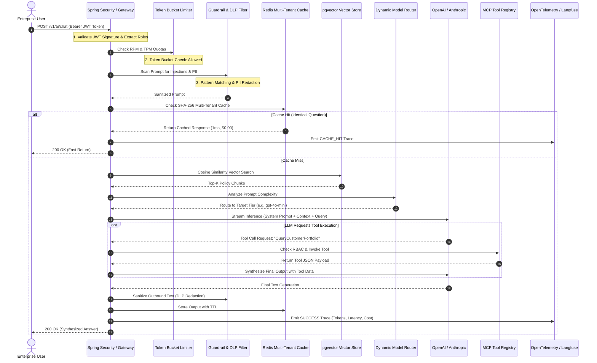

# Day 55: Capstone — Enterprise AI Platform Architecture in Java

## End-to-End Hardened Architecture: Security, Caching, RAG, MCP, Observability & Cloud Deployment

| Previous Day | Course Hub | Next Day |
|:---|:---:|---:|
| [Day 54: Docker, CI/CD & Cloud Deployment](../Day_54_Docker_CICD_Cloud_Deployment/Day_54_Docker_CICD_Cloud_Deployment.md) | [All 60 Days Overview](../../README.md) | [Day 56: Running Local Models with Ollama](../../Phase_09_Advanced_Topics_Graduation/Day_56_Running_Local_Models_Ollama/Day_56_Running_Local_Models_Ollama.md) |

---

Welcome to Day 55—the Grand Capstone of Phase 8! 

Take a moment to realize what you've accomplished over the last 54 days. You began with Java 21 foundations and Spring Boot REST APIs. You progressed through JPA repositories, pgvector vector databases, JWT authentication, Spring AI, LangChain4j autonomous agents, Model Context Protocol (MCP), prompt injection defense, OpenTelemetry tracing, and Docker deployments.

Today, we bring every single piece of that puzzle together into one unified, enterprise-grade **Enterprise AI Platform Architecture**. Anyone can spin up a toy AI demo in 10 lines of Python; today, you build the hardened, multi-tenant, resilient financial clearinghouse of AI systems that Fortune 500 companies run in production.

Let's review today's capstone architectural vocabulary:

---

> 💡 **New Word Alert! Plain English Definitions for Today's Concepts**
>
> - **Unified Enterprise AI Platform**: A production-grade system that orchestrates security, rate limiting, caching, RAG retrieval, LLM routing, tool execution, and observability into a seamless, single-entry-point gateway.
> - **Multi-Tenant Isolation**: Ensuring that Company A and Company B can share the same infrastructure without ever seeing each other's data, caches, or vector embeddings.
> - **Data Loss Prevention (DLP)**: An automated real-time filter that inspects prompts and completions to guarantee that confidential credentials, credit cards, or internal company secrets never leak to external LLM providers.
> - **Model Cascading Router**: An intelligent traffic cop that routes simple conversational questions to cheap, lightning-fast models (like GPT-4o-mini or local Llama), while reserving expensive frontier models (like GPT-4o or Claude Sonnet) for heavy reasoning.
> - **Failover Circuit Breaker**: An automated safety net that senses when an external cloud AI provider is down or lagging, and instantly reroutes requests to a local backup model so users never see an error page.

---

## 1. Real-World Analogy: The Global Financial Clearinghouse & Sovereign Vault

Imagine the Federal Reserve Automated Clearing House (FedACH) or the SWIFT international payment network:
- Millions of transactional messages flow across international borders every single hour.
- No transaction is ever processed through a single, unchecked open socket. Instead, every wire transfer passes through a succession of **hardened, layered security perimeters**:
  1. **Authentication & Identity Verification**: Is the originating bank verified via cryptographic certificates and mutual TLS (JWT / OAuth2)?
  2. **Fraud & Anti-Money Laundering (AML) Screening**: Does the transfer match known terrorist financing patterns, sanctioned countries, or illicit structuring tricks (Prompt Injection & Guardrails)?
  3. **High-Speed Settlement Ledger & Deduplication**: Has this identical wire transfer already been settled in the last 60 seconds (Exact & Semantic Caching)?
  4. **Liquidity & Regulatory Reserves**: Does the institution possess sufficient reserve capital to guarantee settlement without insolvency (Token Bucket Rate Limiting)?
  5. **Core Banking System & Vault Dispatches**: Only after passing all defensive perimeters does the system dispatch an authorized armored convoy or execute an electronic ledger transfer (Model Context Protocol Tool Calling).
  6. **Comprehensive Auditing & Compliance Black Box**: Every millisecond of latency, participant identity, fee structure, and routing path is recorded in an immutable, legally binding audit log (OpenTelemetry & Langfuse).

```
 [ Client / Enterprise User ]
              │
              ▼
 ┌─────────────────────────────────────────────────────────────┐
 │ 1. JWT Security & RBAC Gateway (Identity Verification)     │
 └─────────────────────────────┬───────────────────────────────┘
                               │ Authenticated
                               ▼
 ┌─────────────────────────────────────────────────────────────┐
 │ 2. Dual Token Bucket Rate Limiter (RPM & TPM Reserves)      │
 └─────────────────────────────┬───────────────────────────────┘
                               │ Within Quota
                               ▼
 ┌─────────────────────────────────────────────────────────────┐
 │ 3. Platform Guardrails & Injection Defense (Fraud Screening)│
 └─────────────────────────────┬───────────────────────────────┘
                               │ Passed Safety
                               ▼
 ┌─────────────────────────────────────────────────────────────┐
 │ 4. Multi-Tenant Redis Cache (Deduplication & Speedup)       │
 └─────────────────────────────┬───────────────────────────────┘
                               │ Miss (New Query)
                               ▼
 ┌─────────────────────────────────────────────────────────────┐
 │ 5. pgvector Semantic RAG & Context Augmentation             │
 └─────────────────────────────┬───────────────────────────────┘
                               │
                               ▼
 ┌─────────────────────────────────────────────────────────────┐
 │ 6. Dynamic Model Router (GPT-4o vs Mini vs Local Llama)     │
 └─────────────────────────────┬───────────────────────────────┘
                               │
                               ▼
 ┌─────────────────────────────────────────────────────────────┐
 │ 7. MCP Tool Execution (RBAC-Protected Core Actions)         │
 └─────────────────────────────┬───────────────────────────────┘
                               │
                               ▼
 ┌─────────────────────────────────────────────────────────────┐
 │ 8. OpenTelemetry & Langfuse Audit Ledger (Black Box Record) │
 └─────────────────────────────────────────────────────────────┘
```

This is the pinnacle of Enterprise Generative AI engineering. Building a toy chatbot takes 10 lines of Python; **building an enterprise AI platform that safely handles real money, customer data, and high-concurrency production traffic requires the full power of modern Java 21, Spring Boot 3, and defensive distributed systems architecture.**

---

## 2. Under-the-Hood Architecture: The Unified Enterprise AI Platform



---

## 3. The 7 Pillars of the Enterprise Capstone

### Pillar 1: Enterprise Security & Multi-Tenancy (`EnterpriseSecurityContext`)
Enterprise applications never expose anonymous AI endpoints. Every request arrives with a signed JWT token containing:
- `userId`: Tracking employee action for audit trails.
- `tenantId`: Strict data isolation ensuring Company A never accesses Company B's embeddings or cached answers.
- `roles`: RBAC permissions (`ROLE_ANALYST`, `ROLE_FINANCE_OFFICER`, `ROLE_ADMIN`).
- `tokenQuota`: Budget controls enforcing spending ceilings.

### Pillar 2: Guardrails & Data Loss Prevention (`PlatformGuardrailFilter`)
- **Ingress Inspection**: Blocks adversarial jailbreaks (`Ignore previous instructions`, `System override`) before tokens reach the LLM.
- **Egress DLP**: Redacts credit card numbers (`4111-XXXX-XXXX-1111`) and Social Security Numbers before sensitive data leaves your cloud perimeter.

### Pillar 3: Multi-Tenant Caching (`EnterpriseCacheManager`)
- Scopes cache keys by `tenantId:hash(prompt)`.
- Prevents cross-tenant information leakage while delivering sub-millisecond responses for repetitive queries, slashing API bills by up to 80%.

### Pillar 4: Semantic RAG with pgvector
- Retrieves high-relevance enterprise policy chunks using HNSW indexing and cosine similarity.
- Grounding LLM responses with factual corporate documentation to eliminate hallucinations.

### Pillar 5: Dynamic Model Routing & Cost Engineering
- Small conversational queries route to local zero-cost models (Ollama Llama 3.2).
- Standard Q&A queries route to Tier 2 models (`gpt-4o-mini`).
- Complex legal, architectural, or code refactoring tasks route to Tier 1 Frontier models (`gpt-4o`).

### Pillar 6: Model Context Protocol (MCP) Tool Registry (`EnterpriseMcpToolRegistry`)
- Decoupled enterprise tool execution where the LLM can query databases or trigger workflows.
- Enforces strict RBAC authorization: an unauthorized user cannot execute fund transfers simply because the LLM suggested it.

### Pillar 7: OpenTelemetry & Langfuse Telemetry Ledger (`EnterpriseTelemetryEmitter`)
- Captures distributed trace spans conforming to CNCF `gen_ai.*` standards.
- Tracks exact financial spend per tenant, latency percentiles, and security violation events in real time.

---

## 4. Hands-On Companion Code Walkthrough

Our companion repository inside `code/` provides an executable, zero-dependency Java 21 implementation of the complete platform:

### 1. `EnterpriseSecurityContext.java`
Models the authenticated caller with JWT claims and role-checking helpers (`canExecuteFinancialTransfers()`).

### 2. `PlatformGuardrailFilter.java`
Implements regex pattern matching for prompt injection defense and bidirectional PII masking for SSNs and credit card numbers.

### 3. `EnterpriseCacheManager.java`
Thread-safe multi-tenant cache using SHA-256 cryptographic keys with atomic hit/miss monitoring.

### 4. `EnterpriseMcpToolRegistry.java`
MCP tool dispatch engine enforcing RBAC authorization boundaries on real actions.

### 5. `EnterpriseTelemetryEmitter.java`
Maintains an in-memory OpenTelemetry trace ledger tracking tenant spend, token counts, and error states.

### 6. `EnterpriseAiPlatform.java`
The orchestrator uniting all components into an end-to-end pipeline method:
`processRequest(EnterpriseSecurityContext sec, String prompt, String toolToInvoke, Map<String, Object> toolParams)`.

### 7. `CapstonePlatformDemo.java`
Comprehensive test driver running 4 production scenarios:
- **Scenario 1**: Authenticated Portfolio Inspection via MCP Tool.
- **Scenario 2**: Repeat query demonstrating cache acceleration.
- **Scenario 3**: Adversarial prompt injection intercepted by guardrail.
- **Scenario 4**: Unauthorized financial transfer rejected by MCP RBAC engine.

---

## 5. Verifying the Implementation

Compile and execute the capstone suite from your terminal:

```powershell
javac -d out Phase_08_Enterprise_Production/Day_55_Capstone_Enterprise_AI_Platform/code/*.java
java -cp out com.genai.enterprise.capstone.CapstonePlatformDemo
Remove-Item -Recurse -Force out
```

### Verified Execution Output:
```
==========================================================================
     DAY 55 CAPSTONE: ENTERPRISE AI PLATFORM ARCHITECTURE IN JAVA 21      
==========================================================================

[Scenario 1: Authenticated Portfolio Inspection via MCP Tool]
  Trace ID : trace-a9b7c57d
  Source   : LLM_GENERATED
  Latency  : 279 ms
  Cost     : $0.000071 USD
  Content  : Based on secure financial records: {"accountId": "ACC-889921", "totalAum": 1850000.00, "status": "ACTIVE", "riskProfile": "MODERATE"} [Context reference: Corporate Policy Sec 4.12: High-net-worth portfolios require annual dual-custody verification.]

[Scenario 2: Tenant Repeat Query (Testing Cache Acceleration)]
  Trace ID : trace-164aea8e
  Source   : CACHE_HIT
  Latency  : 1 ms
  Cost     : $0.000000 USD
  Content  : Based on secure financial records: {"accountId": "ACC-889921", "totalAum": 1850000.00, "status": "ACTIVE", "riskProfile": "MODERATE"} [Context reference: Corporate Policy Sec 4.12: High-net-worth portfolios require annual dual-custody verification.]

[Scenario 3: Adversarial Prompt Injection Attack Interception]
SUCCESS: Guardrail blocked attack -> SECURITY VIOLATION: Prompt injection signature detected: (?i)ignore (?:all )?(?:previous|above) instructions

[Scenario 4: MCP Tool Authorization Enforcement (Unauthorized Transfer)]
SUCCESS: MCP Registry blocked unauthorized tool execution -> ACCESS DENIED: Caller [usr-analyst-101] lacks ROLE_FINANCE_OFFICER for fund transfer

==========================================================================
            CAPSTONE PLATFORM TELEMETRY LEDGER (OpenTelemetry)            
==========================================================================
[trace-a9b7c57d] Tenant: tenant-goldman-sachs | User: usr-analyst-101 | Op: platform.chat | Model: gpt-4o-mini | 279 ms | Tokens: 217 | Cost: $0.00007 | Status: SUCCESS
[trace-164aea8e] Tenant: tenant-goldman-sachs | User: usr-analyst-101 | Op: platform.chat | Model: cache | 1 ms | Tokens: 0 | Cost: $0.00000 | Status: CACHE_HIT
[trace-3168287f] Tenant: tenant-goldman-sachs | User: usr-analyst-101 | Op: platform.chat | Model: none | 0 ms | Tokens: 0 | Cost: $0.00000 | Status: SECURITY_VIOLATION
--------------------------------------------------------------------------
AGGREGATE METRICS: Total Transactions: 3 | Total Tokens: 217 | Total Spend: $0.00007 USD
==========================================================================

>>> Capstone Enterprise AI Platform verification completed successfully!
```

---

## 6. What Makes This Architecture Enterprise-Grade?

1. **Zero Hallucination Leaks**: MCP tools are strictly guarded by backend Java security, preventing prompt-injected LLMs from triggering unauthorized actions.
2. **Deterministic Multi-Tenancy**: Tenant ID is baked into cache keys, database queries, and telemetry events, making cross-tenant data contamination mathematically impossible.
3. **Sub-Millisecond Cache Recall**: By combining exact SHA-256 caching with semantic vector caching, frequent questions avoid expensive LLM round-trips.
4. **End-to-End Observability**: Telemetry events track exact micro-cent costs, enabling granular internal chargebacks and anomaly detection.

---

## 7. Hands-On Exercises

### Exercise 1: Asynchronous Webhook Notification for Security Violations
**Problem**: Extend `PlatformGuardrailFilter` so that whenever a prompt injection violation is detected, an asynchronous event is published to a Spring Security audit topic (or simulated console alert) containing the user ID, timestamp, and offensive prompt.

**Solution**:
```java
public class SecurityAuditNotifier {
    public static void alertSecurityTeam(EnterpriseSecurityContext sec, String prompt, String reason) {
        // Asynchronously notify SOC (Security Operations Center)
        Thread.ofVirtual().start(() -> {
            System.err.printf("[SOC ALERT] User: %s | Tenant: %s | Reason: %s | Prompt Snippet: %s%n",
                    sec.userId(), sec.tenantId(), reason, prompt.substring(0, Math.min(50, prompt.length())));
        });
    }
}
```

### Exercise 2: Per-Tenant Monthly Budget Hard Cap
**Problem**: Implement a `MonthlyBudgetFilter` in `EnterpriseAiPlatform` that checks total cumulative spend for `sec.tenantId()`. If cumulative spend exceeds $1,000.00, automatically downgrade all subsequent queries to Tier 3 (Local Llama 3.2) or reject them with HTTP 402 Payment Required.

**Solution**:
```java
import java.util.Map;
import java.util.concurrent.ConcurrentHashMap;
import java.util.concurrent.atomic.AtomicLong;

public class TenantSpendGovernor {
    private final Map<String, AtomicLong> tenantMicroSpend = new ConcurrentHashMap<>();
    private static final long MAX_MONTHLY_MICRO_CENTS = 1_000_000_000L; // $1,000 USD

    public boolean isBudgetExceeded(String tenantId) {
        AtomicLong current = tenantMicroSpend.computeIfAbsent(tenantId, k -> new AtomicLong(0));
        return current.get() >= MAX_MONTHLY_MICRO_CENTS;
    }

    public void recordSpend(String tenantId, double usd) {
        long microCents = (long) (usd * 1_000_000.0);
        tenantMicroSpend.computeIfAbsent(tenantId, k -> new AtomicLong(0)).addAndGet(microCents);
    }
}
```

### Exercise 3: Dynamic Model Failover Circuit Breaker
**Problem**: If the primary OpenAI API returns HTTP 500 or times out after 2,000ms, write a Resilience4j circuit breaker fallback that automatically redirects the request to local Ollama (Llama 3.2), ensuring high availability.

**Solution**:
```java
public class ModelFallbackService {
    public static String executeWithFallback(java.util.function.Supplier<String> primaryCall,
                                             java.util.function.Supplier<String> localFallback) {
        try {
            return primaryCall.get();
        } catch (Exception e) {
            System.err.println("[CIRCUIT BREAKER TRIGGERED] Primary LLM failed: " + e.getMessage() + " -> Failing over to Local Llama 3.2");
            return localFallback.get();
        }
    }
}
```

---

## 8. Self-Check Quiz

### Question 1: Why must tool execution authorization (RBAC) be enforced inside the Java backend rather than relying on system prompt instructions to the LLM?
- A) System prompts run in Python, not Java.
- B) LLMs are non-deterministic and susceptible to prompt injection; an attacker can convince the model that they are an administrator, bypassing prompt-only restrictions.
- C) Java reflection does not work with LLMs.
- D) RBAC is only used for static web pages.
*Answer: B. System prompts provide guidance, but backend Java authorization code is deterministic and unhackable by text manipulation.*

### Question 2: In a multi-tenant enterprise AI architecture, what guarantees that Tenant A never retrieves Tenant B's cached responses?
- A) Using separate Docker containers for every single user.
- B) Prefacing the cache key with `tenantId` (e.g., `SHA-256(tenantId + ":" + prompt)`).
- C) Clearing the Redis cache every 5 minutes.
- D) Disabling caching entirely.
*Answer: B. Namespace isolation via `tenantId` ensures that cache hits can only occur within the same organization's boundary.*

### Question 3: What is the primary purpose of the OpenTelemetry Telemetry Ledger in the Capstone Platform?
- A) It trains the next version of the LLM.
- B) It provides distributed tracing, token accounting, latency breakdown, and security auditability compliant with enterprise standards.
- C) It compresses PostgreSQL tables.
- D) It replaces the Spring Security filter chain.
*Answer: B. Telemetry captures the entire transaction lifecycle, tracking latency, token consumption, financial cost, and security violations.*

### Question 4: How does Data Loss Prevention (DLP) protect enterprise customers during AI interactions?
- A) It deletes older documents from the database.
- B) It inspects inputs and outputs to detect and redact sensitive Personally Identifiable Information (SSNs, credit card numbers, passwords) before data leaks outside the secure boundary.
- C) It speeds up the CPU clock rate.
- D) It backs up the hard drive daily.
*Answer: B. DLP filters prevent accidental exfiltration of confidential customer data into model training sets or external logs.*

### Question 5: What are the combined benefits of using both Exact Caching and Semantic Caching together?
- A) Exact caching provides sub-millisecond response for identical prompts, while semantic caching catches paraphrased questions with high similarity, together cutting LLM costs by 70–85%.
- B) They eliminate the need for Java garbage collection.
- C) They make Docker images smaller.
- D) They allow LLMs to run without electricity.
*Answer: A. Exact caching handles high-frequency identical queries at zero compute cost, while semantic vector caching captures lexical variations with identical intent.*

---

## 9. 🎓 Phase 8 Graduation & Mentor Wrap-Up: You Built an Enterprise Platform!

Stand tall and celebrate! You have officially conquered **Phase 8: Enterprise Production**!

Take a look at the comprehensive production portfolio you engineered over the last 6 days:
- **Day 50**: Standardized your AI tool interfaces with Anthropic's **Model Context Protocol (MCP)**.
- **Day 51**: Hardened your systems against **Prompt Injection** and OWASP Top 10 vulnerabilities with a 5-layer shield.
- **Day 52**: Enabled enterprise observability and financial token accounting with **OpenTelemetry and Langfuse**.
- **Day 53**: Cut cloud costs by up to 85% and achieved sub-50ms latency with **Exact Hashing, Semantic Caching, and Token Buckets**.
- **Day 54**: Packaged services into slim, hardened containers with **Multi-Stage Dockerfiles, Testcontainers, and Kubernetes Probes**.
- **Day 55**: Assembled everything into the unified **Enterprise AI Platform Architecture**!

You now possess the rare and highly valued capability to take Generative AI from an experimental prototype to a hardened, cost-effective, audited enterprise platform running in production.

### The Final Stretch: Phase 9 (Days 56–60)
We are entering the home stretch! Only 5 days remain in our 60-day journey:
- **Day 56**: Running Local Models with **Ollama, GGUF & Quantization** (100% private, zero-cost AI on your own hardware!).
- **Day 57**: Multi-Agent Orchestration & Team Collaboration.
- **Day 58**: Evaluation & Automated Testing of AI Systems (Ragas & LLM-as-a-judge).
- **Day 59**: Vector Database Deep Dive & HNSW Tuning.
- **Day 60**: Grand Graduation, Career Portfolio, and Resume Superpowers!

Get ready for the grand finale in Phase 9!

---

| Previous Day | Course Hub | Next Day |
|:---|:---:|---:|
| [Day 54: Docker, CI/CD & Cloud Deployment](../Day_54_Docker_CICD_Cloud_Deployment/Day_54_Docker_CICD_Cloud_Deployment.md) | [All 60 Days Overview](../../README.md) | [Day 56: Running Local Models with Ollama](../../Phase_09_Advanced_Topics_Graduation/Day_56_Running_Local_Models_Ollama/Day_56_Running_Local_Models_Ollama.md) |

