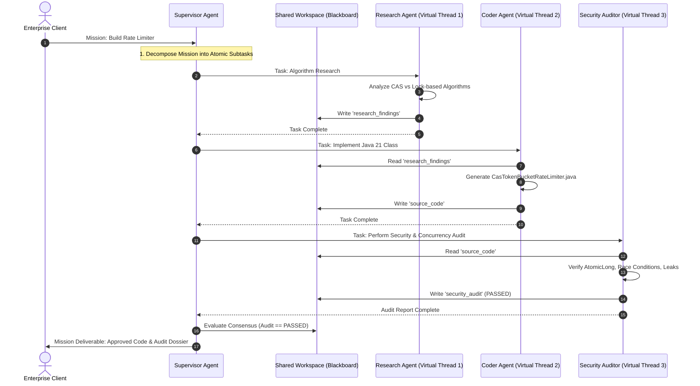

# Day 57: Multi-Agent Orchestration — The Supervisor Pattern & Hierarchical AI in Java 21

## Coordinating Autonomous Teams of Specialized AI Agents on Virtual Threads

| Previous Day | Course Hub | Next Day |
|:---|:---:|---:|
| [Day 56: Running Local Models with Ollama](../Day_56_Running_Local_Models_Ollama/Day_56_Running_Local_Models_Ollama.md) | [All 60 Days Overview](../../README.md) | [Day 58: Evaluation & Automated Testing of AI Systems](../Day_58_Evaluation_Testing_AI_Systems/Day_58_Evaluation_Testing_AI_Systems.md) |

---

Welcome to Day 57! In Day 49, you built your first autonomous ReAct agent. But what happens when you give an AI a complex, high-stakes enterprise mission?
> *"Audit our entire 5,000-line Java payment service, find security vulnerabilities, generate JUnit 5 tests with 90% coverage, and prepare a pull request summary."*

If you try to stuff all of that into one giant prompt for a single LLM, the model suffers from severe cognitive overload—it hallucinates, forgets requirements, and skips critical edge cases.

Today, you enter the forefront of AI architecture: **Multi-Agent Orchestration**! Instead of forcing one lone model to be a superhero, you will learn how to build an elite, coordinated team of AI specialists—researchers, coders, security auditors, and a supervisor director—collaborating asynchronously on Java 21 Virtual Threads. Let's look at today's core multi-agent vocabulary:

---

> 💡 **New Word Alert! Plain English Definitions for Today's Concepts**
>
> - **Multi-Agent Orchestration**: Coordinating multiple specialized AI agents so they can divide work, critique each other's outputs, and tackle complex problems that no single model could solve reliably.
> - **Supervisor Pattern**: A hierarchical team structure. The "Supervisor" acts like a Senior Project Manager—it takes the user's high-level goal, breaks it into subtasks, delegates them to specialized workers (like a Coder or Security Auditor), and compiles the final result.
> - **Peer Swarm Pattern**: A decentralized setup where agents pass messages directly to each other without a central manager (creative, but prone to infinite conversational ping-pong loops!).
> - **Shared Blackboard**: A thread-safe shared workspace (like a whiteboard in a team conference room) where every agent writes its outputs and reads previous findings.
> - **Consensus Voting**: An automated quality gate where multiple specialized reviewer agents (e.g. Security, Performance, and Architecture) each vote `APPROVE` or `REJECT` before any action is finalized.
> - **Virtual Threads Superpower**: Because multi-agent workflows spend 95% of their time waiting for LLM network responses, Java 21's Virtual Threads let you run dozens or hundreds of subagents concurrently with virtually zero RAM overhead!

---

## 1. Real-World Analogy: The Hollywood Film Production Crew

Imagine an Oscar-winning Hollywood blockbuster movie being produced:
- If the studio hired a single person and asked them to:
  > *"Write the script, compose the orchestral symphony, act as the lead hero, operate the 70mm IMAX camera, rig the explosive pyrotechnics, stitch the costumes, edit the CGI footage, and market the movie to theaters,"*
  the result would be an unmitigated disaster. The lone individual would suffer cognitive overload, botch the special effects, write plot holes, and likely blow up the movie set.
- Instead, successful movie studios operate as a **Hierarchical Multi-Agent Organization**:
  1. **The Director (The Supervisor Agent)**: Holds the overarching creative vision. Deconstructs the screenplay into scenes and assigns specialized tasks to department heads.
  2. **The Screenwriter (The Research Agent)**: Researches historical facts and crafts dialogue drafts.
  3. **The Director of Photography (The Coder / Builder Agent)**: Configures lighting, lenses, and framing to bring the script into reality.
  4. **The Stunt Coordinator / Safety Officer (The Security & Quality Auditor Agent)**: Inspects every harness, fire extinguisher, and crash mat. If a stunt is unsafe, the coordinator has unilateral veto power to halt production until revised.
  5. **The Shared Production Binder (The Shared Blackboard Workspace)**: Every department writes their daily call sheets, dailies, costume sketches, and audit notes into a central binder accessible to all crew members.

```
                  [ Executive Goal / User Request ]
                                  │
                                  ▼
                 ┌────────────────────────────────┐
                 │  The Director (Supervisor LLM) │
                 └───────────────┬────────────────┘
                                 │ Decomposes & Delegates
        ┌────────────────────────┼────────────────────────┐
        ▼                        ▼                        ▼
 ┌──────────────┐         ┌──────────────┐         ┌──────────────┐
 │ Screenwriter │         │ Cinematog.   │         │ Safety Audit │
 │  (Researcher)│         │   (Coder)    │         │  (Reviewer)  │
 └──────┬───────┘         └──────┬───────┘         └──────┬───────┘
        │                        │                        │
        └────────────────►┌──────┴──────┐◄────────────────┘
                          │ Shared Call │
                          │ Sheet / WS  │
                          └─────────────┘
```

In Generative AI, attempting to solve complex, multi-stage enterprise tasks with a **single mega-prompt to a single LLM** consistently fails. The model suffers from **attention degradation, prompt drift, and hallucination creep**. 

**Multi-Agent Orchestration** separates concerns: individual, hyper-focused agent personas collaborate through a centralized supervisor or peer network, delivering enterprise-grade accuracy, code quality, and security consensus.

---

## 2. Multi-Agent Topologies: Supervisor Pattern vs Peer Swarm

```
   A. SUPERVISOR PATTERN (Hierarchical)           B. PEER SWARM (Decentralized)
   
              ┌────────────┐                         ┌────────────┐
              │ Supervisor │                   ┌────►│  Agent A   │◄───┐
              └─────┬──────┘                   │     └─────┬──────┘    │
        ┌───────────┼───────────┐              │           │           │
        ▼           ▼           ▼              ▼           ▼           ▼
   ┌─────────┐ ┌─────────┐ ┌─────────┐    ┌─────────┐ ┌─────────┐ ┌─────────┐
   │ Agent A │ │ Agent B │ │ Agent C │    │ Agent B │ │ Agent C │ │ Agent D │
   └─────────┘ └─────────┘ └─────────┘    └─────────┘ └─────────┘ └─────────┘
   • Centralized control & auditing        • Dynamic peer-to-peer handoffs
   • Deterministic execution graph         • Emergent collaborative behavior
   • Best for enterprise business workflows• Prone to infinite conversational loops
```

### Architectural Comparison

| Dimension | Supervisor Pattern (Recommended) | Peer Swarm Pattern |
| :--- | :--- | :--- |
| **Control Flow** | Deterministic, directed by supervisor | Dynamic, decided by LLM handoffs |
| **Auditability** | High: Supervisor logs all steps | Medium: Difficult to trace root cause |
| **Infinite Loop Risk**| Zero (Hard iteration limit enforced) | High (Agents ping-ponging endlessly) |
| **Best Used For** | Code generation, legal audits, workflows | Creative brainstorming, open exploration |

---

## 🧭 The Mid-Level Java Developer Bridge: Multi-Agent Systems Demystified

If "Autonomous Multi-Agent Swarms" sounds like sci-fi hype, here is how a senior Java architect views it: **it's just a concurrent thread pool with specialized prompts.**

| Enterprise Concept | What It Actually Is in Java | Plain English Translation |
| :--- | :--- | :--- |
| **Agent** | A `ChatClient` configured with a specific system prompt and tools. | An employee with a job description (e.g. *"You only audit code for security flaws"*). |
| **Supervisor Agent** | The Project Manager. Receives user prompt, splits it into 3 sub-tasks, and calls the specialists. | The team lead assigning Jira tickets to developers. |
| **Shared Blackboard** | A thread-safe Java `ConcurrentHashMap` or database record. | The whiteboard in the conference room where all agents write their findings. |
| **The Java 21 Superpower**| `StructuredTaskScope` + **Virtual Threads**. | Python AI frameworks struggle with concurrency because of the GIL. In Java 21, you can run 50 AI agents concurrently on virtual threads with near-zero RAM! |
| **Circuit Breakers** | An `AtomicInteger turnCounter` with a hard limit of 10. | Guarantees agents never get stuck talking to each other in an infinite money-burning loop! |

---

## 3. Under-the-Hood Architecture: Virtual Threads & The Shared Blackboard Pattern

In traditional Python multi-agent frameworks (e.g. CrewAI, AutoGen), agents execute either sequentially in a single-threaded event loop or require heavy multiprocessing. 

In Java 21, **Virtual Threads (`Thread.ofVirtual()`) and `StructuredTaskScope`** provide the ultimate runtime engine for multi-agent systems:
- An enterprise supervisor can spawn **hundreds of specialized subagents concurrently**, each executing non-blocking network calls to vector stores, tools, or model endpoints, with near-zero OS memory overhead.



---

## 4. Guarding Against Multi-Agent Failure Modes

While multi-agent systems deliver superhuman capabilities, unconstrained agent networks can introduce severe operational hazards:

### 1. The Ping-Pong Loop (Infinite Re-delegation)
Agent A says *"I've drafted the code, Agent B please review."* Agent B responds *"Please tweak line 10 and return."* Agent A tweaks line 10 and says *"Reviewed, Agent B please re-check."* 
- **Defensive Fix**: Enforce a strict `maxIterations` guard in the Supervisor (e.g., maximum 3 revision loops). If consensus is not reached by round 3, escalate to a human engineer.

### 2. Context Smuggling & Hallucination Cascade
If Agent A hallucinates an incorrect API method, Agent B reads it from the blackboard, assumes it is fact, and builds an entire architecture around the fiction.
- **Defensive Fix**: Ground each specialized agent with independent tool verification and strict Pydantic/Java Record structured inputs.

### 3. Agent Privilege Escalation
A research agent with read-only access asks a deployment agent to execute a command on its behalf.
- **Defensive Fix**: Tool authorization must be verified against the **originating user's security token**, never the agent's identity.

---

## 5. Hands-On Companion Code Walkthrough

Our companion repository inside `code/` implements a production-grade, zero-external-dependency hierarchical multi-agent platform in Java 21:

### 1. `AgentRole.java`
An enum defining specialized agent personas with distinct responsibilities:
- `SUPERVISOR`: Orchestrates and delegates.
- `RESEARCHER`: Algorithmic investigation and trade-off analysis.
- `CODER`: Java 21 production source code generation.
- `SECURITY_AUDITOR`: Threat modeling, concurrency safety, and code review.

### 2. `AgentMessage.java`
An immutable record capturing inter-agent communication (`sender`, `recipient`, `content`, `timestamp`).

### 3. `SharedAgentWorkspace.java`
Thread-safe **Blackboard pattern** implementation maintaining the mission objective, artifact registry (`research_findings`, `source_code`, `security_audit`), message dispatch log, and formal approval state.

### 4. `SpecializedAgent.java`
Factory and interface defining autonomous worker behaviors. Each specialist reads necessary context from the shared workspace, simulates work, populates output artifacts, and reports completion to the supervisor.

### 5. `SupervisorOrchestrator.java`
The central manager leveraging Java 21's `Executors.newVirtualThreadPerTaskExecutor()`:
- Sequentially coordinates the dependency pipeline across Virtual Threads.
- Evaluates the final security audit artifact to verify whether consensus was reached.
- Marks the project approved or flags revisions.

### 6. `MultiAgentDemo.java`
Main test driver verifying the complete collaborative workflow:
- Supervisor task dispatch
- Step-by-step inter-agent communication
- Artifact inspection (Research findings, Source code, Audit report)
- Consensus sign-off

---

## 6. Verifying the Implementation

Run the test suite directly from your terminal:

```powershell
javac -d out Phase_09_Advanced_Topics_Graduation/Day_57_Multi_Agent_Orchestration/code/*.java
java -cp out com.genai.enterprise.multiagent.MultiAgentDemo
Remove-Item -Recurse -Force out
```

### Verified Execution Output:
```
==========================================================================
  DAY 57: MULTI-AGENT HIERARCHICAL ORCHESTRATION IN JAVA 21 (VIRTUAL THREADS)
==========================================================================

[Supervisor] Received Mission Goal: Design, Implement, and Security Audit a High-Throughput Token Bucket Rate Limiter

--------------------------------------------------------------------------
                INTER-AGENT MESSAGE DISPATCH LOG                          
--------------------------------------------------------------------------
[Supervisor -> Supervisor]: Initiating Mission: 'Design, Implement, and Security Audit a High-Throughput Token Bucket Rate Limiter'
[Supervisor -> Architect_Researcher]: Task: Research optimal concurrency algorithms for goal.
[Architect_Researcher -> Supervisor]: Completed algorithm research: Recommended CAS-based Token Bucket.
[Supervisor -> Software_Engineer]: Task: Implement production Java 21 class based on research.
[Software_Engineer -> Supervisor]: Implemented CasTokenBucketRateLimiter in Java 21 adhering to research guidelines.
[Supervisor -> Security_Officer]: Task: Audit generated code for concurrency safety and vulnerabilities.
[Security_Officer -> Supervisor]: AUDIT PASSED: Memory visibility safe via AtomicLong. No race conditions detected.
[Supervisor -> Supervisor]: CONSENSUS REACHED: All subtasks satisfied. Artifact signed off.

--------------------------------------------------------------------------
                      SYNTHESIZED ARTIFACTS                               
--------------------------------------------------------------------------
1. [RESEARCH ARTIFACT]:
ARCHITECTURAL RESEARCH FINDINGS:
- Token Bucket algorithm selected for predictable burst tolerance.
- Recommendation: Use AtomicLong with epoch-millisecond delta refill.
- Concurrency: Lock-free CAS (compare-and-swap) preferred over synchronized blocks.

2. [CODE ARTIFACT]:
public class CasTokenBucketRateLimiter {
    private final long capacity;
    private final AtomicLong tokens;
    public CasTokenBucketRateLimiter(long capacity) {
        this.capacity = capacity;
        this.tokens = new AtomicLong(capacity);
    }
    public boolean tryAcquire() {
        return tokens.getAndUpdate(t -> t > 0 ? t - 1 : 0) > 0;
    }
}
// Generated based on: Research Guideline Verified

3. [SECURITY AUDIT ARTIFACT]:
AUDIT PASSED: Memory visibility safe via AtomicLong. No race conditions detected.
==========================================================================
Mission Approval Status : APPROVED (100% Consensus)
==========================================================================
>>> Multi-agent orchestration verification completed successfully!
```

---

## 7. LangChain4j & Spring AI Multi-Agent Patterns

In enterprise Spring Boot applications, multi-agent hierarchies can be declared cleanly using distinct `AiServices` or `ChatClient` instances configured with different system instructions and tool subsets:

```java
@Configuration
public class MultiAgentConfig {

    @Bean
    public ResearcherService researcher(ChatModel model) {
        return AiServices.builder(ResearcherService.class)
                .chatLanguageModel(model)
                .systemMessageProvider(chatId -> "You are a Senior Systems Architect...")
                .build();
    }

    @Bean
    public CoderService coder(ChatModel model) {
        return AiServices.builder(CoderService.class)
                .chatLanguageModel(model)
                .systemMessageProvider(chatId -> "You are an Elite Java 21 Engineer...")
                .build();
    }

    @Bean
    public AuditorService auditor(ChatModel model) {
        return AiServices.builder(AuditorService.class)
                .chatLanguageModel(model)
                .systemMessageProvider(chatId -> "You are an Enterprise AppSec Auditor...")
                .build();
    }
}
```

The `SupervisorService` then orchestrates these three beans in an atomic `@Transactional` or virtual-thread pipeline.

---

## 8. Hands-On Exercises

### Exercise 1: Parallel Specialist Execution with Java 21 `StructuredTaskScope`
**Problem**: Update `SupervisorOrchestrator` to execute two independent subagents (e.g. `PerformanceBenchmarkAgent` and `SecurityAuditorAgent`) concurrently using Java 21's preview `StructuredTaskScope.ShutdownOnFailure()`, joining both before consensus evaluation.

**Solution**:
```java
import java.util.concurrent.StructuredTaskScope;

public class StructuredAgentSupervisor {
    public static void runParallelAudits(SpecializedAgent a1, SpecializedAgent a2, SharedAgentWorkspace ws) throws Exception {
        try (var scope = new StructuredTaskScope.ShutdownOnFailure()) {
            var sub1 = scope.fork(() -> { a1.execute(ws); return null; });
            var sub2 = scope.fork(() -> { a2.execute(ws); return null; });

            scope.join();
            scope.throwIfFailed();
            System.out.println("[SUPERVISOR] Both parallel audits completed successfully.");
        }
    }
}
```

### Exercise 2: Loop Guard & Human-in-the-Loop Escalation
**Problem**: Implement a multi-agent feedback loop between `Coder` and `Auditor` that retries generation up to 3 times if the audit fails, and escalates to `HumanOperator` if iteration count reaches 3.

**Solution**:
```java
public class ResilientAgentLoop {
    public static boolean executeWithRetry(SpecializedAgent coder, SpecializedAgent auditor, SharedAgentWorkspace ws) {
        int maxAttempts = 3;
        for (int i = 1; i <= maxAttempts; i++) {
            System.out.println("[ITERATION " + i + "] Generating and auditing code...");
            coder.execute(ws);
            auditor.execute(ws);

            String audit = ws.getArtifact("security_audit");
            if (audit != null && audit.contains("AUDIT PASSED")) {
                return true;
            }
        }
        System.err.println("[ESCALATION] 3 audit attempts failed. Halting pipeline and notifying Human On-Call.");
        return false;
    }
}
```

### Exercise 3: Consensus Voting Engine
**Problem**: Write a `ConsensusVotingService` where three distinct reviewer agents (Security, Performance, and Architecture) each vote `APPROVE` or `REJECT`. Consensus requires a majority (at least 2 `APPROVE` votes) for release.

**Solution**:
```java
import java.util.List;

public class ConsensusVotingEngine {
    public record AgentVote(AgentRole role, boolean approved, String comment) {}

    public static boolean evaluateConsensus(List<AgentVote> votes) {
        long approvals = votes.stream().filter(AgentVote::approved).count();
        boolean passed = approvals >= 2;
        System.out.printf("[CONSENSUS VOTING] Approvals: %d / %d -> Result: %s%n",
                approvals, votes.size(), passed ? "PASSED" : "REJECTED");
        return passed;
    }
}
```

---

## 9. Self-Check Quiz

### Question 1: Why does a multi-agent architecture outperform a single mega-prompt for complex software engineering tasks?
- A) Multi-agent systems use fewer total tokens.
- B) Decomposing complex tasks into specialized personas prevents context distraction, keeps attention focused on specific sub-domains, and introduces adversarial review checks.
- C) Multi-agent systems do not require an LLM.
- D) Single LLMs cannot process English text longer than 100 words.
*Answer: B. Division of labor and separation of concerns allows each specialized model persona to excel without cognitive overload.*

### Question 2: In the Supervisor Pattern, what is the role of the Supervisor Agent?
- A) It writes all the code itself.
- B) It evaluates user requirements, decomposes them into atomic subtasks, delegates them to specialized workers, tracks state on a shared blackboard, and enforces consensus criteria.
- C) It manages the Docker daemon directly.
- D) It replaces the database.
*Answer: B. The Supervisor acts as the central coordinator and quality gatekeeper.*

### Question 3: How does the Shared Blackboard pattern facilitate agent collaboration?
- A) It deletes older messages automatically.
- B) It acts as a thread-safe, centralized workspace where agents read prior findings and publish deliverables (code, research, audit reports) asynchronously.
- C) It renders chalkboard graphics in the browser.
- D) It prevents agents from using Java 21.
*Answer: B. The Blackboard serves as the shared state repository for the agent team.*

### Question 4: Why are Java 21 Virtual Threads uniquely well-suited for multi-agent systems?
- A) Virtual Threads make LLMs run 10x faster.
- B) They allow spawning thousands of concurrent agent tasks with near-zero memory footprint, cleanly suspending while awaiting I/O-bound LLM API responses without monopolizing OS kernel threads.
- C) Virtual Threads remove the need for synchronization.
- D) They run without a JVM.
*Answer: B. Multi-agent workflows are heavily I/O-bound; Virtual Threads handle massive agent concurrency effortlessly.*

### Question 5: What is the primary operational danger of decentralized Peer Swarms without a supervisor?
- A) Agents will refuse to speak to each other.
- B) Infinite ping-pong loops where agents perpetually re-delegate or critique each other without ever terminating or reaching a conclusion.
- C) Decreased GPU temperature.
- D) Java compiler syntax errors.
*Answer: B. Without a supervisor or iteration limit, autonomous agents can become trapped in infinite conversational cycles.*

---

## 10. Day 57 Mentor Wrap-Up: You're Directing an AI Ensemble!

You have unlocked one of the most exciting paradigms in modern artificial intelligence: multi-agent collaboration!

Let's review what you built today:
1. **The Hollywood Film Crew Analogy**: By splitting work between the Director (Supervisor), Screenwriter (Researcher), Cinematographer (Coder), and Stunt Coordinator (Safety Reviewer), complex missions get executed with extreme precision.
2. **The Java Concurrency Superpower**: You saw how Java 21's Virtual Threads and `StructuredTaskScope` make running 10 or 50 concurrent agents lightweight, non-blocking, and thread-safe.
3. **Blackboards & Consensus Voting**: Your shared workspace gives agents a common ground to exchange data, while multi-reviewer consensus gates keep flawed code from reaching production.

Tomorrow in **Day 58: Evaluation & Automated Testing of AI Systems**, we tackle a vital question: how do you write unit tests for an AI whose answers change slightly every time? You'll learn LLM-as-a-judge, Ragas metrics (faithfulness and answer relevancy), and automated regression testing. See you tomorrow!

---

| Previous Day | Course Hub | Next Day |
|:---|:---:|---:|
| [Day 56: Running Local Models with Ollama](../Day_56_Running_Local_Models_Ollama/Day_56_Running_Local_Models_Ollama.md) | [All 60 Days Overview](../../README.md) | [Day 58: Evaluation & Automated Testing of AI Systems](../Day_58_Evaluation_Testing_AI_Systems/Day_58_Evaluation_Testing_AI_Systems.md) |

