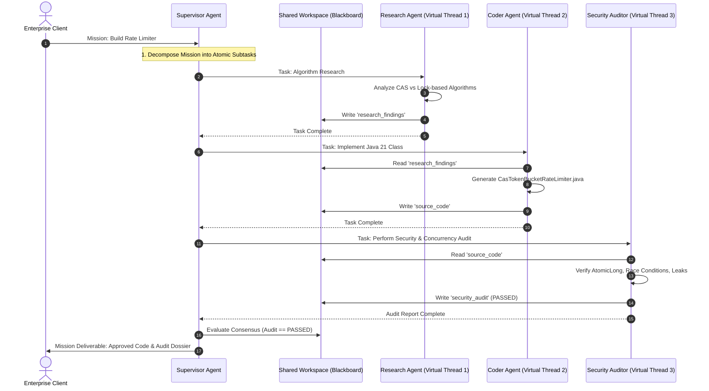

# Day 57: Multi-Agent Orchestration — The Supervisor Pattern & Hierarchical AI in Java 21

| Previous Day | Course Hub | Next Day |
|:---|:---:|---:|
| [Day 56: Running Local Models with Ollama](../Day_56_Running_Local_Models_Ollama/Day_56_Running_Local_Models_Ollama.md) | [All 60 Days Overview](../../README.md) | [Day 58: Evaluation & Automated Testing of AI Systems](../Day_58_Evaluation_Testing_AI_Systems/Day_58_Evaluation_Testing_AI_Systems.md) |

---

## 1. Topic Overview

**Multi-Agent Orchestration** is the software architecture of coordinating multiple specialized autonomous AI agents—each possessing distinct system prompts, tools, and domain responsibilities—to collaborate on complex enterprise missions. In Java 21 systems, multi-agent workflows leverage the **Supervisor Pattern**, a thread-safe **Shared Blackboard**, and **Virtual Threads** to decompose sprawling objectives into atomic subtasks, run adversarial peer reviews, and achieve consensus without single-model cognitive overload.

---

## 2. Basic Foundations (True Zero)

### Core Multi-Agent Vocabulary

- **Multi-Agent Orchestration**: Coordinating multiple specialized AI agents so they can divide work, critique each other's outputs, and tackle complex problems that no single model could solve reliably.
- **Supervisor Pattern**: A hierarchical team structure. The "Supervisor" acts like a Senior Project Manager—it takes the user's high-level goal, breaks it into subtasks, delegates them to specialized workers (like a Coder or Security Auditor), and compiles the final result.
- **Peer Swarm Pattern**: A decentralized setup where agents pass messages directly to each other without a central manager (creative, but prone to infinite conversational ping-pong loops!).
- **Shared Blackboard**: A thread-safe shared workspace (like a whiteboard in a team conference room) where every agent writes its outputs and reads previous findings.
- **Consensus Voting**: An automated quality gate where multiple specialized reviewer agents (e.g., Security, Performance, and Architecture) each vote `APPROVE` or `REJECT` before any action is finalized.
- **Virtual Threads Superpower**: Because multi-agent workflows spend 95% of their time waiting for LLM network responses, Java 21's Virtual Threads let you run dozens or hundreds of subagents concurrently with virtually zero RAM overhead.

---

### Relatable Physical Analogy: The Hollywood Film Production Crew

Imagine an Oscar-winning Hollywood blockbuster movie being produced:
- If the studio hired a single person and asked them to:
  > *"Write the script, compose the orchestral symphony, act as the lead hero, operate the 70mm IMAX camera, rig the explosive pyrotechnics, stitch the costumes, edit the CGI footage, and market the movie to theaters,"*
  the result would be an unmitigated disaster. The lone individual would suffer cognitive overload, botch the special effects, write plot holes, and likely blow up the movie set.
- Instead, successful movie studios operate as a **Hierarchical Multi-Agent Organization**:
  1. **The Director (The Supervisor Agent)**: Holds the overarching creative vision. Deconstructs the screenplay into scenes and assigns specialized tasks to department heads.
  2. **The Screenwriter (The Research Agent)**: Researches historical facts and crafts dialogue drafts.
  3. **The Director of Photography (The Coder / Builder Agent)**: Configures lighting, lenses, and framing to bring the script into reality.
  4. **The Stunt Coordinator / Safety Officer (The Security & Quality Auditor Agent)**: Inspects every harness, fire extinguisher, and crash mat. If a stunt is unsafe, the coordinator has unilateral veto power to halt production until revised.
  5. **The Shared Production Binder (The Shared Blackboard Workspace)**: Every department writes their daily call sheets, dailies, costume sketches, and audit notes into a central binder accessible to all crew members.

```
                  [ Executive Goal / User Request ]
                                  │
                                  ▼
                 ┌────────────────────────────────┐
                 │  The Director (Supervisor LLM) │
                 └───────────────┬────────────────┘
                                 │ Decomposes & Delegates
        ┌────────────────────────┼────────────────────────┐
        ▼                        ▼                        ▼
 ┌──────────────┐         ┌──────────────┐         ┌──────────────┐
 │ Screenwriter │         │ Cinematog.   │         │ Safety Audit │
 │  (Researcher)│         │   (Coder)    │         │  (Reviewer)  │
 └──────┬───────┘         └──────┬───────┘         └──────┬───────┘
        │                        │                        │
        └────────────────►┌──────┴──────┐◄────────────────┘
                          │ Shared Call │
                          │ Sheet / WS  │
                          └─────────────┘
```

In Generative AI, attempting to solve complex, multi-stage enterprise tasks with a **single mega-prompt to a single LLM** consistently fails due to **attention degradation, prompt drift, and hallucination creep**. Multi-agent orchestration separates concerns into hyper-focused personas.

---

### Minimal Beginner-Friendly Example: A Pure Java Supervisor & Specialists

Here is a minimal, self-contained Java program demonstrating a Supervisor coordinating two specialized worker agents via a shared blackboard:

```java
package com.genai.enterprise.multiagent.minimal;

import java.util.Map;
import java.util.concurrent.ConcurrentHashMap;

public class MinimalSupervisorDemo {

    // 1. Shared Blackboard Workspace
    public static class Blackboard {
        private final Map<String, String> artifacts = new ConcurrentHashMap<>();
        public void write(String key, String value) { artifacts.put(key, value); }
        public String read(String key) { return artifacts.get(key); }
    }

    // 2. Specialized Worker Agents
    public static class ResearchAgent {
        public void execute(Blackboard bb) {
            System.out.println("-> [Researcher] Investigating optimal thread-safe data structures...");
            bb.write("research_notes", "Selected ConcurrentHashMap for non-blocking lock-free reads.");
        }
    }

    public static class DeveloperAgent {
        public void execute(Blackboard bb) {
            String notes = bb.read("research_notes");
            System.out.println("-> [Developer] Writing code based on research: " + notes);
            bb.write("code_artifact", "public class Cache { private final Map<K,V> map = new ConcurrentHashMap<>(); }");
        }
    }

    public static class ReviewerAgent {
        public boolean audit(Blackboard bb) {
            String code = bb.read("code_artifact");
            System.out.println("-> [Reviewer] Auditing code artifact...");
            return code != null && code.contains("ConcurrentHashMap");
        }
    }

    // 3. Supervisor Director
    public static void main(String[] args) {
        Blackboard blackboard = new Blackboard();
        ResearchAgent researcher = new ResearchAgent();
        DeveloperAgent developer = new DeveloperAgent();
        ReviewerAgent reviewer = new ReviewerAgent();

        System.out.println("=== SUPERVISOR INITIATING MISSION ===");
        researcher.execute(blackboard);
        developer.execute(blackboard);
        boolean isApproved = reviewer.audit(blackboard);

        System.out.println("=== MISSION RESULT ===");
        System.out.println("Final Code: " + blackboard.read("code_artifact"));
        System.out.println("Consensus Status: " + (isApproved ? "APPROVED" : "REJECTED"));
    }
}
```

#### Line-by-Line Walkthrough:
1. `Blackboard`: Provides a thread-safe `ConcurrentHashMap` where agents deposit and inspect intermediate deliverables.
2. `ResearchAgent.execute(...)`: Generates domain analysis and writes findings under `"research_notes"`.
3. `DeveloperAgent.execute(...)`: Consumes the researcher's output and synthesizes the source code artifact.
4. `ReviewerAgent.audit(...)`: Deterministically inspects the code deliverable against architectural standards.
5. `main(...)`: The Supervisor coordinates execution sequentially, ensuring that each specialist acts on validated context.

---

## 3. Core Concept Walkthrough (Basic → Intermediate)

### 3.1 Multi-Agent Topologies: Supervisor Pattern vs. Peer Swarm

```
   A. SUPERVISOR PATTERN (Hierarchical)           B. PEER SWARM (Decentralized)
   
              ┌────────────┐                         ┌────────────┐
              │ Supervisor │                   ┌────►│  Agent A   │◄───┐
              └─────┬──────┘                   │     └─────┬──────┘    │
        ┌───────────┼───────────┐              │           │           │
        ▼           ▼           ▼              ▼           ▼           ▼
   ┌─────────┐ ┌─────────┐ ┌─────────┐    ┌─────────┐ ┌─────────┐ ┌─────────┐
   │ Agent A │ │ Agent B │ │ Agent C │    │ Agent B │ │ Agent C │ │ Agent D │
   └─────────┘ └─────────┘ └─────────┘    └─────────┘ └─────────┘ └─────────┘
   • Centralized control & auditing        • Dynamic peer-to-peer handoffs
   • Deterministic execution graph         • Emergent collaborative behavior
   • Best for enterprise business workflows• Prone to infinite conversational loops
```

### Architectural Comparison

| Dimension | Supervisor Pattern (Recommended) | Peer Swarm Pattern |
|:---|:---|:---|
| **Control Flow** | Deterministic, directed by supervisor | Dynamic, decided by LLM handoffs |
| **Auditability** | High: Supervisor logs all steps | Medium: Difficult to trace root cause |
| **Infinite Loop Risk**| Zero (Hard iteration limit enforced) | High (Agents ping-ponging endlessly) |
| **Best Used For** | Code generation, legal audits, workflows | Creative brainstorming, open exploration |

---

### 3.2 The Mid-Level Java Developer Bridge: Multi-Agent Systems Demystified

| Enterprise Concept | What It Actually Is in Java | Plain English Translation |
|:---|:---|:---|
| **Agent** | A `ChatClient` configured with a specific system prompt and tools. | An employee with a clear job description (e.g., *"You only audit code for security flaws"*). |
| **Supervisor Agent** | The Project Manager. Receives user prompt, splits it into 3 sub-tasks, and calls specialists. | The team lead assigning Jira tickets to developers. |
| **Shared Blackboard** | A thread-safe Java `ConcurrentHashMap` or database record. | The whiteboard in the conference room where all agents write their findings. |
| **Virtual Threads Superpower**| `Thread.ofVirtual()` + **Non-blocking I/O**. | Python AI frameworks struggle with the GIL. In Java 21, you can run 100 AI agents concurrently with near-zero RAM! |
| **Circuit Breakers** | An `AtomicInteger turnCounter` with a hard limit of 10. | Guarantees agents never get stuck talking to each other in an infinite money-burning loop. |

---

### 3.3 The Enterprise Multi-Agent Sequence on Virtual Threads



---

### 3.4 Companion Code Walkthrough

Let's examine the core classes in `Phase_09_Advanced_Topics_Graduation/Day_57_Multi_Agent_Orchestration/code/`:

#### Step 1: Agent Roles & Messaging (`AgentRole.java` & `AgentMessage.java`)

```java
package com.genai.enterprise.multiagent;

public enum AgentRole {
    SUPERVISOR("Project Supervisor & Director"),
    RESEARCHER("Architectural & Algorithmic Researcher"),
    CODER("Java 21 Production Software Engineer"),
    SECURITY_AUDITOR("AppSec & Concurrency Auditor");

    private final String description;
    AgentRole(String description) { this.description = description; }
    public String getDescription() { return description; }
}
```

```java
package com.genai.enterprise.multiagent;

public record AgentMessage(
    AgentRole sender,
    AgentRole recipient,
    String content,
    long timestamp
) {}
```

#### Step 2: Thread-Safe Shared Workspace (`SharedAgentWorkspace.java`)

```java
package com.genai.enterprise.multiagent;

import java.util.*;
import java.util.concurrent.ConcurrentHashMap;
import java.util.concurrent.CopyOnWriteArrayList;

public class SharedAgentWorkspace {

    private final String missionObjective;
    private final Map<String, String> artifacts = new ConcurrentHashMap<>();
    private final List<AgentMessage> messageLog = new CopyOnWriteArrayList<>();
    private volatile boolean isApproved = false;

    public SharedAgentWorkspace(String missionObjective) {
        this.missionObjective = missionObjective;
    }

    public void putArtifact(String key, String content) { artifacts.put(key, content); }
    public String getArtifact(String key) { return artifacts.get(key); }
    public Map<String, String> getAllArtifacts() { return Collections.unmodifiableMap(artifacts); }

    public void recordMessage(AgentRole sender, AgentRole recipient, String content) {
        messageLog.add(new AgentMessage(sender, recipient, content, System.currentTimeMillis()));
    }

    public List<AgentMessage> getMessageLog() { return Collections.unmodifiableList(messageLog); }
    public void markApproved(boolean status) { this.isApproved = status; }
    public boolean isApproved() { return isApproved; }
    public String getMissionObjective() { return missionObjective; }
}
```

#### Step 3: Supervisor Orchestrator (`SupervisorOrchestrator.java`)

```java
package com.genai.enterprise.multiagent;

import java.util.concurrent.ExecutorService;
import java.util.concurrent.Executors;
import java.util.concurrent.Future;

public class SupervisorOrchestrator {

    public SharedAgentWorkspace executeMission(String missionGoal) {
        SharedAgentWorkspace ws = new SharedAgentWorkspace(missionGoal);
        ws.recordMessage(AgentRole.SUPERVISOR, AgentRole.SUPERVISOR, "Initiating Mission: '" + missionGoal + "'");

        try (ExecutorService executor = Executors.newVirtualThreadPerTaskExecutor()) {

            // Step 1: Research Phase
            SpecializedAgent researcher = SpecializedAgent.createResearcher();
            ws.recordMessage(AgentRole.SUPERVISOR, AgentRole.RESEARCHER, "Task: Research optimal concurrency algorithms for goal.");
            Future<?> f1 = executor.submit(() -> researcher.execute(ws));
            f1.get();

            // Step 2: Coding Phase
            SpecializedAgent coder = SpecializedAgent.createCoder();
            ws.recordMessage(AgentRole.SUPERVISOR, AgentRole.CODER, "Task: Implement production Java 21 class based on research.");
            Future<?> f2 = executor.submit(() -> coder.execute(ws));
            f2.get();

            // Step 3: Security Audit Phase
            SpecializedAgent auditor = SpecializedAgent.createSecurityAuditor();
            ws.recordMessage(AgentRole.SUPERVISOR, AgentRole.SECURITY_AUDITOR, "Task: Audit generated code for concurrency safety and vulnerabilities.");
            Future<?> f3 = executor.submit(() -> auditor.execute(ws));
            f3.get();

            // Step 4: Consensus Evaluation
            String auditResult = ws.getArtifact("security_audit");
            if (auditResult != null && auditResult.contains("AUDIT PASSED")) {
                ws.markApproved(true);
                ws.recordMessage(AgentRole.SUPERVISOR, AgentRole.SUPERVISOR, "CONSENSUS REACHED: All subtasks satisfied. Artifact signed off.");
            } else {
                ws.markApproved(false);
                ws.recordMessage(AgentRole.SUPERVISOR, AgentRole.SUPERVISOR, "CONSENSUS REJECTED: Security audit detected unresolved flaws.");
            }
        } catch (Exception ex) {
            throw new RuntimeException("Mission execution failed: " + ex.getMessage(), ex);
        }

        return ws;
    }
}
```

---

## 4. Prerequisite & Supporting Concepts

### Prerequisite / Supporting Concept: Java 21 Virtual Threads & Structured Concurrency
Multi-agent systems spend virtually all their time waiting on external LLM inference responses (I/O blocking). With traditional OS platform threads, allocating 100 threads consumes ~100MB of RAM and incurs heavy kernel context-switching overhead. Java 21 Virtual Threads (`Executors.newVirtualThreadPerTaskExecutor()`) execute on a small pool of carrier threads, suspending automatically during network I/O with near-zero overhead.

### Prerequisite / Supporting Concept: The Blackboard Architectural Pattern
Originating in early AI systems, the **Blackboard Pattern** consists of three components:
1. **Blackboard**: Central repository storing problem state and evolving deliverables.
2. **Knowledge Sources (Agents)**: Autonomous specialists that monitor the blackboard and contribute new information when relevant conditions are met.
3. **Control Shell (Supervisor)**: Orchestrates agent execution order and decides when the problem is solved.

### Prerequisite / Supporting Concept: LangChain4j AiServices Hierarchies
In Spring Boot, multiple agents can be configured as separate `@Bean` definitions of LangChain4j `AiServices`:
```java
@Bean
public ResearcherService researcher(ChatModel model) {
    return AiServices.builder(ResearcherService.class)
            .chatLanguageModel(model)
            .systemMessageProvider(id -> "You are a Senior Systems Architect...")
            .build();
}
```

---

## 5. Advanced Depth (Intermediate → Advanced)

### 5.1 Guarding Against Multi-Agent Failure Modes

#### Failure 1: The Ping-Pong Infinite Loop
Agent A drafts code and asks Agent B for review. Agent B requests a minor comment change. Agent A updates the comment and re-requests review. Without iteration limits, this conversational loop burns thousands of dollars in cloud API tokens.
- **Remedy**: Enforce a strict `maxIterations` counter (e.g., maximum 3 revision loops). If consensus is not reached by round 3, escalate to a human engineer.

#### Failure 2: Hallucination Cascade (Context Poisoning)
If Agent A invents a non-existent Java API method, Agent B reads it from the blackboard, assumes it is ground truth, and writes an entire architecture around the fiction.
- **Remedy**: Ground each specialist with independent tool verification (e.g., executing real `javac` or unit tests via MCP tools) before publishing deliverables to the blackboard.

#### Failure 3: Agent Privilege Escalation
A research agent with public read-only access asks a deployment agent to execute an infrastructure update on its behalf.
- **Remedy**: Tool authorization must always validate the **originating human user's JWT token**, never the requesting agent's identity.

---

### 5.2 Common Mistakes & Misconceptions: Bad vs. Good

#### Mistake 1: Unstructured Natural Language Blackboard Entries
Allowing agents to write arbitrary, free-form text to the blackboard makes it difficult for downstream agents to parse inputs reliably.

```java
// ❌ BAD: Storing unformatted conversational text
workspace.putArtifact("result", "Hey team! I looked into it and think maybe CAS is cool.");

// ✅ GOOD: Use structured JSON or typed Record payloads
workspace.putArtifact("research_findings", """
    {
      "recommendedAlgorithm": "CAS_TOKEN_BUCKET",
      "concurrencyPrimitive": "AtomicLong",
      "riskScore": 0.05
    }
    """);
```

#### Mistake 2: Missing Hard Timeout Limits on Virtual Threads
If an LLM API hangs indefinitely during an agent task, the virtual thread will block forever without timing out.

```java
// ❌ BAD: Indefinite blocking wait
Future<?> task = executor.submit(() -> agent.execute(ws));
task.get(); // Could block forever!

// ✅ GOOD: Enforce a strict timeout deadline
Future<?> task = executor.submit(() -> agent.execute(ws));
task.get(30, TimeUnit.SECONDS);
```

---

### 5.3 Complete Verification Suite & Demo Execution

Execute the verification suite in `Phase_09_Advanced_Topics_Graduation/Day_57_Multi_Agent_Orchestration/code/`:

```bash
javac -d out Phase_09_Advanced_Topics_Graduation/Day_57_Multi_Agent_Orchestration/code/*.java
java -cp out com.genai.enterprise.multiagent.MultiAgentDemo
```

```
==========================================================================
  DAY 57: MULTI-AGENT HIERARCHICAL ORCHESTRATION IN JAVA 21 (VIRTUAL THREADS)
==========================================================================

[Supervisor] Received Mission Goal: Design, Implement, and Security Audit a High-Throughput Token Bucket Rate Limiter

--------------------------------------------------------------------------
                INTER-AGENT MESSAGE DISPATCH LOG                          
--------------------------------------------------------------------------
[Supervisor -> Supervisor]: Initiating Mission: 'Design, Implement, and Security Audit a High-Throughput Token Bucket Rate Limiter'
[Supervisor -> Architect_Researcher]: Task: Research optimal concurrency algorithms for goal.
[Architect_Researcher -> Supervisor]: Completed algorithm research: Recommended CAS-based Token Bucket.
[Supervisor -> Software_Engineer]: Task: Implement production Java 21 class based on research.
[Software_Engineer -> Supervisor]: Implemented CasTokenBucketRateLimiter in Java 21 adhering to research guidelines.
[Supervisor -> Security_Officer]: Task: Audit generated code for concurrency safety and vulnerabilities.
[Security_Officer -> Supervisor]: AUDIT PASSED: Memory visibility safe via AtomicLong. No race conditions detected.
[Supervisor -> Supervisor]: CONSENSUS REACHED: All subtasks satisfied. Artifact signed off.

--------------------------------------------------------------------------
                      SYNTHESIZED ARTIFACTS                               
--------------------------------------------------------------------------
1. [RESEARCH ARTIFACT]:
ARCHITECTURAL RESEARCH FINDINGS:
- Token Bucket algorithm selected for predictable burst tolerance.
- Recommendation: Use AtomicLong with epoch-millisecond delta refill.
- Concurrency: Lock-free CAS (compare-and-swap) preferred over synchronized blocks.

2. [CODE ARTIFACT]:
public class CasTokenBucketRateLimiter {
    private final long capacity;
    private final AtomicLong tokens;
    public CasTokenBucketRateLimiter(long capacity) {
        this.capacity = capacity;
        this.tokens = new AtomicLong(capacity);
    }
    public boolean tryAcquire() {
        return tokens.getAndUpdate(t -> t > 0 ? t - 1 : 0) > 0;
    }
}
// Generated based on: Research Guideline Verified

3. [SECURITY AUDIT ARTIFACT]:
AUDIT PASSED: Memory visibility safe via AtomicLong. No race conditions detected.
==========================================================================
Mission Approval Status : APPROVED (100% Consensus)
==========================================================================
>>> Multi-agent orchestration verification completed successfully!
```

---

## 6. Quick Recap

| Component | Responsibility | Concurrency / Data Mechanism |
|:---|:---|:---|
| **Supervisor Agent** | Decomposes mission, delegates tasks, monitors progress, enforces consensus | Virtual Thread Controller |
| **Researcher Agent** | Gathers algorithmic constraints and architectural trade-offs | Non-blocking LLM reasoning |
| **Coder Agent** | Synthesizes production Java 21 source code from research notes | Generates code artifacts |
| **Auditor Agent** | Adversarial review (concurrency, AppSec, memory leaks) | Grants or withholds approval |
| **Shared Blackboard** | Thread-safe artifact registry and inter-agent message ledger | `ConcurrentHashMap` + `CopyOnWriteArrayList` |
| **Virtual Threads** | High-throughput concurrent execution of I/O-bound agent tasks | Java 21 `Thread.ofVirtual()` |

---

## 7. Self-Check Questions & Practice Exercises

### Conceptual Self-Check Questions

#### Question 1: Why does a multi-agent architecture outperform a single mega-prompt for complex enterprise tasks?
- A) Multi-agent systems use fewer total tokens.
- B) Decomposing complex tasks into specialized personas prevents context distraction, keeps attention focused on specific sub-domains, and introduces adversarial review checks.
- C) Multi-agent systems eliminate the need for an LLM.
- D) Single LLMs cannot process English prompts longer than 100 words.

*Answer*: **B**. Separation of concerns allows each specialized model persona to excel without cognitive overload, while peer review catches bugs before deliverables are finalized.

---

#### Question 2: In the Supervisor Pattern, what is the role of the Supervisor Agent?
- A) It writes all the code itself.
- B) It evaluates user requirements, decomposes them into atomic subtasks, delegates them to specialized workers, tracks state on a shared blackboard, and enforces consensus criteria.
- C) It manages the Linux kernel directly.
- D) It replaces the database.

*Answer*: **B**. The Supervisor acts as the central coordinator and quality gatekeeper.

---

#### Question 3: How does the Shared Blackboard pattern facilitate agent collaboration?
- A) It deletes older messages automatically.
- B) It acts as a thread-safe, centralized workspace where agents read prior findings and publish deliverables (code, research, audit reports) asynchronously.
- C) It renders chalkboard graphics in the browser.
- D) It prevents agents from using Java 21.

*Answer*: **B**. The Blackboard serves as the shared state repository for the agent team.

---

#### Question 4: Why are Java 21 Virtual Threads uniquely well-suited for multi-agent systems?
- A) Virtual Threads make LLMs run 10x faster.
- B) They allow spawning dozens or hundreds of concurrent agent tasks with near-zero memory footprint, cleanly suspending while awaiting I/O-bound LLM API responses without monopolizing OS kernel threads.
- C) Virtual Threads remove the need for synchronization.
- D) They execute without a JVM.

*Answer*: **B**. Multi-agent workflows are heavily I/O-bound; Virtual Threads handle massive agent concurrency effortlessly.

---

### Hands-on Practice Exercises

#### Exercise 1: Parallel Specialist Execution with StructuredTaskScope
**Task**: Implement a supervisor method that executes two independent subagents (e.g., `PerformanceAuditor` and `SecurityAuditor`) in parallel using Java 21's `StructuredTaskScope.ShutdownOnFailure()`, joining both before evaluating consensus.

**Solution**:
```java
package com.genai.enterprise.exercises;

import com.genai.enterprise.multiagent.SharedAgentWorkspace;
import com.genai.enterprise.multiagent.SpecializedAgent;
import java.util.concurrent.StructuredTaskScope;

public class StructuredAgentSupervisor {

    public static void runParallelAudits(SpecializedAgent a1, SpecializedAgent a2, SharedAgentWorkspace ws) throws Exception {
        try (var scope = new StructuredTaskScope.ShutdownOnFailure()) {
            var sub1 = scope.fork(() -> { a1.execute(ws); return null; });
            var sub2 = scope.fork(() -> { a2.execute(ws); return null; });

            scope.join();
            scope.throwIfFailed();
            System.out.println("[SUPERVISOR] Both parallel audits completed successfully.");
        }
    }
}
```

---

#### Exercise 2: Loop Guard & Human-in-the-Loop Escalation
**Task**: Build an iterative review loop between a `Coder` agent and an `Auditor` agent that retries generation up to 3 times if the audit fails, and escalates to a human engineer if the iteration limit is reached.

**Solution**:
```java
package com.genai.enterprise.exercises;

import com.genai.enterprise.multiagent.SharedAgentWorkspace;
import com.genai.enterprise.multiagent.SpecializedAgent;

public class ResilientAgentLoop {

    public static boolean executeWithRetry(SpecializedAgent coder, SpecializedAgent auditor, SharedAgentWorkspace ws) {
        int maxAttempts = 3;
        for (int i = 1; i <= maxAttempts; i++) {
            System.out.println("[ITERATION " + i + "] Generating and auditing code...");
            coder.execute(ws);
            auditor.execute(ws);

            String audit = ws.getArtifact("security_audit");
            if (audit != null && audit.contains("AUDIT PASSED")) {
                System.out.println("[SUCCESS] Code approved on iteration " + i);
                return true;
            }
        }
        System.err.println("[ESCALATION] 3 audit attempts failed. Halting pipeline and notifying Human On-Call.");
        return false;
    }
}
```

---

#### Exercise 3: Consensus Voting Engine
**Task**: Write a `ConsensusVotingService` where three distinct reviewer agents (Security, Performance, and Architecture) each vote `APPROVE` or `REJECT`. Consensus requires a majority (at least 2 `APPROVE` votes) for release.

**Solution**:
```java
package com.genai.enterprise.exercises;

import com.genai.enterprise.multiagent.AgentRole;
import java.util.List;

public class ConsensusVotingEngine {

    public record AgentVote(AgentRole role, boolean approved, String comment) {}

    public static boolean evaluateConsensus(List<AgentVote> votes) {
        long approvals = votes.stream().filter(AgentVote::approved).count();
        boolean passed = approvals >= 2;
        System.out.printf("[CONSENSUS VOTING] Approvals: %d / %d -> Result: %s%n",
                approvals, votes.size(), passed ? "PASSED" : "REJECTED");
        return passed;
    }
}
```

---

#### Exercise 4: Dynamic Agent Handoff Router
**Task**: Create a router method that inspects an inbound subtask payload and dynamically routes it to either `AgentRole.CODER`, `AgentRole.SECURITY_AUDITOR`, or `AgentRole.RESEARCHER` based on task categorization keywords.

**Solution**:
```java
package com.genai.enterprise.exercises;

import com.genai.enterprise.multiagent.AgentRole;

public class AgentHandoffRouter {

    public static AgentRole routeTask(String taskDescription) {
        if (taskDescription == null) return AgentRole.SUPERVISOR;
        String lower = taskDescription.toLowerCase();

        if (lower.contains("vulnerability") || lower.contains("audit") || lower.contains("security")) {
            return AgentRole.SECURITY_AUDITOR;
        } else if (lower.contains("implement") || lower.contains("code") || lower.contains("class")) {
            return AgentRole.CODER;
        } else if (lower.contains("research") || lower.contains("investigate") || lower.contains("algorithm")) {
            return AgentRole.RESEARCHER;
        }
        return AgentRole.SUPERVISOR;
    }
}
```

---

| Previous Day | Course Hub | Next Day |
|:---|:---:|---:|
| [Day 56: Running Local Models with Ollama](../Day_56_Running_Local_Models_Ollama/Day_56_Running_Local_Models_Ollama.md) | [All 60 Days Overview](../../README.md) | [Day 58: Evaluation & Automated Testing of AI Systems](../Day_58_Evaluation_Testing_AI_Systems/Day_58_Evaluation_Testing_AI_Systems.md) |
