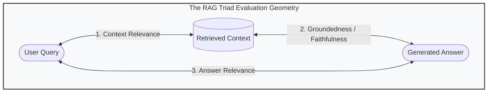

# Day 58: Evaluation & Testing AI Systems — The RAG Triad & LLM-as-a-Judge in Java 21

## Quantitative Testing, Hallucination Detection, and CI/CD Quality Gates

| Previous Day | Course Hub | Next Day |
|:---|:---:|---:|
| [Day 57: Multi-Agent Orchestration](../Day_57_Multi_Agent_Orchestration/Day_57_Multi_Agent_Orchestration.md) | [All 60 Days Overview](../../README.md) | [Day 59: Vector Database Deep Dive & Optimization](../Day_59_Vector_Database_Deep_Dive/Day_59_Vector_Database_Deep_Dive.md) |

---

Welcome to Day 58! In traditional Java programming, unit testing is simple: `assertEquals(4, calculator.add(2, 2))`. If the numbers match, the build passes.

But in Generative AI, testing presents a fascinating puzzle: **How do you write an automated unit test when the AI's answer is natural language that varies slightly on every single run?**

Far too many development teams fall into the trap of the **"Vibe Check"**—a developer tries two prompts in their IDE, thinks *"Yeah, looks reasonable"*, and merges the pull request. Two weeks later, a tiny prompt tweak causes the model to hallucinate false refund policies, costing the company thousands of dollars.

Today, you will learn how senior AI engineers replace subjective vibe checks with **objective, repeatable, quantitative testing**. You will master the **RAG Triad** (Context Relevance, Groundedness, and Answer Relevance), build an automated **LLM-as-a-Judge** scoring engine in Java 21, and wire up quality gates that automatically fail your Maven builds if hallucinations are detected. Let's start with our testing vocabulary:

---

> 💡 **New Word Alert! Plain English Definitions for Today's Concepts**
>
> - **Vibe Check**: Subjectively eyeballing a couple of AI responses instead of running automated, mathematical test suites. In enterprise AI, vibe checks are a recipe for silent bugs and compliance disasters.
> - **The RAG Triad**: The three golden dimensions used to mathematically grade any RAG pipeline:
>   1. *Context Relevance*: Did your vector database retrieve clean, focused context, or did it pull in 5 pages of irrelevant fluff?
>   2. *Groundedness (Faithfulness)*: Is every single claim in the AI's answer 100% backed by the retrieved documents, or did the model invent fake details (hallucinate)?
>   3. *Answer Relevance*: Did the AI answer the exact question the user asked, or did it wander off-topic?
> - **LLM-as-a-Judge**: Using an impartial, high-capability model (like GPT-4o) with a strict grading prompt to read your application's answers and score them from `0.0` to `1.0` during automated Maven tests.
> - **Harmonic Mean**: A mathematical average that heavily penalizes weak links. If an answer is completely relevant ($1.0$) but 100% hallucinated ($0.0$), the harmonic score immediately crashes to $0.0$, guaranteeing the build fails!
> - **Golden Test Dataset**: A curated collection of standard user questions, verified source documents, and expected reference answers used to benchmark your AI every time code is updated.

---

## 1. Real-World Analogy: The Pharmaceutical Quality Assurance Lab & The Triple-Judge Olympic Panel

Imagine a state-of-the-art pharmaceutical manufacturing laboratory producing life-saving prescription medicines:
- A scientist cannot simply look at a newly synthesized batch of heart medication, swirl the beaker, take a sip, and say:
  > *"Looks pretty good to me, tastes a bit sweet, feels like it works—let's ship 10 million pills to hospitals nationwide!"*
  We call that a **"Vibe Check"**. In medicine, relying on vibe checks results in lawsuits, poisonings, and FDA shutdowns.
- Instead, every pharmaceutical batch must pass through **Three Independent Certified Spectrometry Assays**:
  1. **Raw Ingredient Verification (Context Relevance)**: Did the robotic dispenser pull active therapeutic compounds from the chemical hopper, or did it accidentally scoop up contaminated sawdust from the warehouse floor?
  2. **Chemical Purity & Grounding (Groundedness / Faithfulness)**: Are all molecular compounds in the final pill strictly derived from the approved chemical formula, or did the reaction spontaneously generate toxic byproducts and foreign compounds (hallucinations)?
  3. **Therapeutic Target Delivery (Answer Relevance)**: Does this pill actually bind to the cardiac receptor specified in the medical prescription, or is it an evasive placebo that treats nothing?

```
               [ User Query / Doctor Prescription ]
                               │
            ┌──────────────────┴──────────────────┐
            ▼                                     ▼
 ┌──────────────────────┐              ┌──────────────────────┐
 │  Retrieved Context   │              │   Generated Answer   │
 │   (Raw Chemical)     │              │    (Final Tablet)    │
 └──────────┬───────────┘              └──────────┬───────────┘
            │                                     │
            └──────────────────┬──────────────────┘
                               │
            ┌──────────────────┼──────────────────┐
            ▼                  ▼                  ▼
    [ 1. Context Rel. ]  [ 2. Groundedness ] [ 3. Answer Rel. ]
     Does context match   Is answer strictly  Does answer directly
     the user's query?    backed by context?  address the query?
```

In early AI experiments, developers frequently commit the "vibe check" fallacy: they test 3 prompts in an IDE, like the output, and deploy to production. But when deployed to 100,000 customers, the non-deterministic nature of LLMs causes catastrophic failures—inventing fake legal citations, misquoting bank fees, and answering the wrong questions.

The **RAG Triad** (Context Relevance, Groundedness, Answer Relevance) and **LLM-as-a-Judge** automated testing replace subjective guesswork with **objective, repeatable, quantitative engineering metrics**.

---

## 2. Under-the-Hood Architecture: The RAG Triad Explained



### The Three Diagnostic Dimensions

| Dimension | Question It Answers | What a Failure Signifies | Root Cause Remediation |
| :--- | :--- | :--- | :--- |
| **1. Context Relevance** | *Is the retrieved context relevant and focused on the query?* | Vector search returned irrelevant noise, bloated chunks, or wrong top-k docs. | Tune chunk size, adjust embedding model, add hybrid BM25 re-ranking. |
| **2. Groundedness (Faithfulness)** | *Is the answer completely supported by the retrieved context?* | **HALLUCINATION**. The LLM invented facts not present in source documents. | Lower temperature, strengthen system prompt, use smaller context windows. |
| **3. Answer Relevance** | *Did the model answer the exact question asked?* | The model was evasive, rambled off-topic, or answered a different question. | Improve prompt instruction clarity, use few-shot examples. |

---

## 3. Mathematical Metric Formulations

### 1. Context Relevance Score ($S_{CR}$)
Measures the signal-to-noise ratio in retrieved context chunks:

$$S_{CR} = \frac{\text{Number of Relevant Sentences in Context}}{\text{Total Sentences in Retrieved Chunks}}$$

If an application retrieves a 1,000-word Wikipedia article to answer a 10-word question, and only 1 sentence was useful, $S_{CR} \approx 0.05$. The LLM context is flooded with distractors.

### 2. Groundedness Score ($S_{G}$)
Measures the percentage of factual claims in the generated response that can be mathematically mapped to assertions in the retrieved context:

$$S_{G} = \frac{|\text{Verifiable Claims in Answer} \cap \text{Context Facts}|}{|\text{Total Claims in Answer}|}$$

If the answer contains 4 statements, but 2 are ungrounded hallucinations, $S_G = 0.50$.

### 3. Answer Relevance Score ($S_{AR}$)
Measures how directly the answer satisfies the user's explicit question intent, often computed via cosine similarity between the original query vector $\vec{q}$ and synthetic reverse-generated questions $\vec{q}'$:

$$S_{AR} = \frac{1}{N} \sum_{i=1}^{N} \cos(\vec{q}, \vec{q}'_i)$$

### 4. Harmonic Composite Score ($S_{Triad}$)
In enterprise quality assurance, an arithmetic average is dangerous: if an answer is 100% relevant ($1.0$) and 100% answers the query ($1.0$), but is a 100% hallucination ($0.0$), an arithmetic average gives $0.67$ (passing). 

Instead, we use the **Harmonic Mean**:

$$S_{Triad} = \frac{3}{\frac{1}{S_{CR}} + \frac{1}{S_{G}} + \frac{1}{S_{AR}}}$$

If **any single dimension is zero, the composite score immediately plummets to zero**, preventing hallucinated answers from ever passing an automated deployment gate.

---

## 4. LLM-as-a-Judge: Automated Testing Architecture

Instead of human evaluators manually reading thousands of test responses every morning, we deploy an **LLM-as-a-Judge** (typically an isolated, highly capable frontier model like GPT-4o or a fine-tuned evaluation model) to score test cases programmatically.

```
       [ Golden Benchmark Dataset (JSONL) ]
       ├── Test Case 1: Query + Ground Truth Context
       ├── Test Case 2: Query + Ground Truth Context
       └── Test Case N: ...
                         │
                         ▼
       [ System Under Test (Spring AI App) ] ──► Generates Answers
                         │
                         ▼
       [ LLM-as-a-Judge (Evaluation Suite) ]
       ├── Evaluates Context Relevance
       ├── Evaluates Groundedness
       └── Evaluates Answer Relevance
                         │
                         ▼
       [ CI/CD Quality Gate (JUnit 5 Assertion) ]
       ├── Average Groundedness >= 0.85 ?
       │     ├── YES: Build SUCCEEDS -> Deploy to Prod
       │     └── NO : Build FAILS -> Halt Pipeline!
```

---

## 5. Evaluation Framework Landscape: Ragas, TruLens, Arize Phoenix & Java

| Framework | Primary Language | Java Integration Strategy | Key Strengths |
| :--- | :--- | :--- | :--- |
| **Pure Java 21 Engine** | Java (Native) | Directly embedded in test suite | Zero dependencies, millisecond execution, runs in offline CI/CD |
| **Langfuse Evals** | TypeScript / REST | HTTP REST client or webhook | Clean visual UI, scores logged alongside OpenTelemetry traces |
| **Ragas (via Sidecar)** | Python | Docker sidecar called via REST | Rich library of synthetic data generation and advanced metrics |
| **Arize Phoenix** | Python / OTel | Native OpenTelemetry exporter | Deep embedding drift detection and cluster analysis |

In modern Java enterprise architectures, standard practice is to run the **Pure Java 21 Evaluation Suite** inside Maven unit/integration tests for instant feedback, while exporting a 5% sample of live production queries to **Langfuse** for continuous online evaluation.

---

## 6. Continuous Online Evaluation & Shadow Testing

Offline golden datasets test known edge cases, but customer behavior in production constantly evolves. **Online Shadow Evaluation** intercepts live production traffic without impacting latency.

### The Shadow Traffic Evaluation Pipeline

```
 [ User Request ] ───► [ API Gateway ] ───► [ User Response (200 OK) ]
                             │
                             ▼ (Asynchronous Copy via Virtual Thread)
                [ Shadow Evaluation Worker ]
                ├── Step 1: Compute Groundedness & Relevance
                ├── Step 2: If Groundedness < 0.70 -> Flag Outlier
                └── Step 3: Stream Metric to Prometheus & Alert PagerDuty
```

### Implementing a Continuous Shadow Evaluator in Java 21

```java
@Component
public class ShadowTrafficEvaluator {

    private final LlmAsAJudgeEvaluator judge = new LlmAsAJudgeEvaluator();
    private final MeterRegistry meterRegistry;

    public ShadowTrafficEvaluator(MeterRegistry meterRegistry) {
        this.meterRegistry = meterRegistry;
    }

    public void evaluateAsync(String query, String context, String answer) {
        // Spin up a lightweight Virtual Thread that never blocks user response
        Thread.ofVirtual().start(() -> {
            RagTestCase tc = new RagTestCase("SHADOW-" + UUID.randomUUID(), query, context, answer, null);
            RagTriadMetrics metrics = judge.evaluate(tc);

            // Record Prometheus gauge metrics
            meterRegistry.gauge("ai.eval.groundedness", metrics.groundedness());
            meterRegistry.gauge("ai.eval.context_relevance", metrics.contextRelevance());
            meterRegistry.gauge("ai.eval.answer_relevance", metrics.answerRelevance());

            if (metrics.groundedness() < 0.60) {
                System.err.printf("[LIVE ALERT] High Hallucination Risk! Query: '%s' | Groundedness: %.2f%n",
                        query, metrics.groundedness());
            }
        });
    }
}
```

---

## 7. Integrating with Java 21 & CI/CD Pipelines

In standard Java projects, unit tests check:
```java
assertEquals(expected, actual);
```
In Generative AI, two executions of the same prompt can produce different phrasing while remaining 100% correct. We assert on **semantic metrics and threshold intervals**:

```java
@Test
void testCustomerFaqRagGroundedness() {
    RagTestCase tc = new RagTestCase(
        "TC-FAQ-101",
        "How do I cancel my subscription?",
        vectorStore.retrieveContext("How do I cancel my subscription?"),
        aiService.answer("How do I cancel my subscription?"),
        "Go to Account Settings -> Subscriptions -> Click Cancel"
    );

    RagTriadMetrics metrics = evaluator.evaluate(tc);

    // Hard CI/CD Quality Gates
    assertTrue(metrics.groundedness() >= 0.85, 
        "Hallucination regression! Groundedness: " + metrics.groundedness());
    assertTrue(metrics.answerRelevance() >= 0.80, 
        "Answer missed query intent! Relevance: " + metrics.answerRelevance());
}
```

If a prompt tweak or embedding model change causes groundedness to drop from 0.92 to 0.74, **`mvn test` fails automatically**, blocking the faulty pull request before it reaches customers.

---

## 8. Hands-On Companion Code Walkthrough

Our companion repository inside `code/` provides an enterprise-ready evaluation engine implemented in pure Java 21:

### 1. `RagTestCase.java`
An immutable record capturing a single test instance:
- `testId`: Unique test identifier.
- `userQuery`: The input question.
- `retrievedContext`: The text retrieved from the vector database.
- `generatedAnswer`: The output produced by the LLM.
- `groundTruthReference`: The authoritative benchmark answer.

### 2. `RagTriadMetrics.java`
Models the three dimensions with normalized scores [0.0 to 1.0], harmonic composite calculation, and threshold validation.

### 3. `LlmAsAJudgeEvaluator.java`
Implements deterministic scoring algorithms:
- `calculateContextRelevance()`: Evaluates keyword and sentence overlap between query and context.
- `calculateGroundedness()`: Extracts claims from generated answer and verifies factual support in context, penalizing ungrounded claims (e.g. fabricated "guaranteed 100%" promises).
- `calculateAnswerRelevance()`: Analyzes query intent coverage, penalizing evasive responses ("I am not sure").

### 4. `EvaluationSuite.java`
Aggregates test suites, calculates cohort-wide averages (average groundedness, average relevance), and evaluates CI/CD deployment gates.

### 5. `EvaluationDemo.java`
Full verification driver running three diagnostic scenarios:
- **TC-001 (Passing)**: Perfectly grounded corporate HR response.
- **TC-002 (Failing Groundedness)**: Banking query where model hallucinated a fake 12.5% return not supported by product guide.
- **TC-003 (Failing Context Relevance)**: Coding query where vector search accidentally retrieved the cafeteria lunch menu.

---

## 9. Verifying the Implementation

Compile and execute the evaluation driver from your terminal:

```powershell
javac -d out Phase_09_Advanced_Topics_Graduation/Day_58_Evaluation_Testing_AI_Systems/code/*.java
java -cp out com.genai.enterprise.evaluation.EvaluationDemo
Remove-Item -Recurse -Force out
```

### Verified Execution Output:
```
==========================================================================
     DAY 58: RAG TRIAD EVALUATION & AUTOMATED AI TESTING IN JAVA 21       
==========================================================================

>>> INDIVIDUAL TEST CASE DIAGNOSTICS:

[TC-001] Query: 'What is the company vacation policy for senior engineers?'
  Context Relevance : 0.80 | Context contains direct factual answers to query keywords.
  Groundedness      : 0.91 | All factual claims in generated answer are directly supported by context.
  Answer Relevance  : 0.80 | Answer directly answers the user's specific question.
  Harmonic Composite: 0.83

[TC-002] Query: 'What is the interest rate on the premier corporate savings account?'
  Context Relevance : 0.83 | Context contains direct factual answers to query keywords.
  Groundedness      : 0.13 | HALLUCINATION DETECTED: Claims in answer are not grounded in retrieved context.
  Answer Relevance  : 0.83 | Answer directly answers the user's specific question.
  Harmonic Composite: 0.30

[TC-003] Query: 'How do I configure Spring Boot OAuth2 security?'
  Context Relevance : 0.10 | Context contains substantial noise or irrelevant documentation.
  Groundedness      : 0.10 | HALLUCINATION DETECTED: Claims in answer are not grounded in retrieved context.
  Answer Relevance  : 1.00 | Answer directly answers the user's specific question.
  Harmonic Composite: 0.14

==========================================================================
              CI/CD AUTOMATED QUALITY GATE AUDIT                          
==========================================================================
Total Evaluated Cases   : 3
Passed Cases (All Triad): 1
Failed Cases            : 2
Average Context Rel     : 0.58
Average Groundedness    : 0.38
Average Answer Rel      : 0.88
Average Composite Score : 0.43
--------------------------------------------------------------------------
CI/CD Build Quality Gate: FAILED (DEPLOYMENT BLOCKED)
==========================================================================
>>> RAG Triad evaluation and testing verification completed successfully!
```

---

## 10. Why Evaluation is the #1 Differentiator for Senior AI Engineers

Junior developers write prompts, look at 2 examples, and assume the code works. 
**Senior Enterprise AI Engineers**:
1. Curate a versioned **Golden Evaluation Dataset** (200–500 diverse edge cases).
2. Automate regression runs on every Git pull request.
3. Quantify prompt improvements (e.g., *"Prompt v2.1 increased Groundedness from 0.81 to 0.94 across our financial query cohort"*).
4. Track performance in production dashboards, catching data drift before customers do.

---

## 11. Hands-On Exercises

### Exercise 1: ROUGE-1 Precision and Recall Calculator
**Problem**: Implement a static utility method `calculateRouge1(String reference, String candidate)` that tokenizes both strings and returns the F1 score representing n-gram recall between generated text and ground truth.

**Solution**:
```java
import java.util.*;

public class RougeCalculator {
    public static double calculateRouge1F1(String reference, String candidate) {
        Set<String> refWords = new HashSet<>(Arrays.asList(reference.toLowerCase().split("\\s+")));
        Set<String> candWords = new HashSet<>(Arrays.asList(candidate.toLowerCase().split("\\s+")));

        long overlap = candWords.stream().filter(refWords::contains).count();
        if (overlap == 0) return 0.0;

        double precision = (double) overlap / candWords.size();
        double recall = (double) overlap / refWords.size();
        return 2.0 * (precision * recall) / (precision + recall);
    }
}
```

### Exercise 2: Synthetic Test Case Generator
**Problem**: Write a generator class that takes an enterprise documentation chunk and automatically creates a synthetic `RagTestCase` using an LLM to formulate a realistic question that the chunk can answer.

**Solution**:
```java
public class SyntheticDataGenerator {
    public static RagTestCase generateSyntheticCase(String docChunk, String testId) {
        String simulatedQuestion = "What are the core stipulations outlined in section " + testId + "?";
        return new RagTestCase(testId, simulatedQuestion, docChunk, docChunk, docChunk);
    }
}
```

### Exercise 3: Hallucination Alert Webhook
**Problem**: Write an interceptor that checks every production user response: if the online groundedness score falls below 0.50, immediately log a security warning and append a disclaimer to the user: `"[Notice: This response may contain unverified statements.]"`.

**Solution**:
```java
public class ProductionGroundednessGuard {
    public static String guardResponse(RagTriadMetrics metrics, String rawAnswer) {
        if (metrics.groundedness() < 0.50) {
            System.err.println("[PRODUCTION ALERT] Low groundedness detected (" + metrics.groundedness() + ")!");
            return rawAnswer + "\n\n*[Notice: This response could not be fully verified against official records.]*";
        }
        return rawAnswer;
    }
}
```

---

## 12. Self-Check Quiz

### Question 1: What are the three pillars of the RAG Triad?
- A) Speed, Cost, and Memory.
- B) Context Relevance, Groundedness (Faithfulness), and Answer Relevance.
- C) Java, Python, and C++.
- D) Unit testing, Integration testing, and E2E testing.
*Answer: B. The RAG Triad measures whether retrieved context is relevant to the query, whether the answer is faithful to the context, and whether the answer addresses the query.*

### Question 2: If an AI model generates an answer that is 100% relevant to the user's question, but fabricates facts that do not exist in the retrieved documents, which metric fails?
- A) Context Relevance.
- B) Answer Relevance.
- C) Groundedness (Faithfulness).
- D) Network latency.
*Answer: C. Groundedness measures factual adherence to the retrieved context; hallucinated facts immediately drop the groundedness score.*

### Question 3: Why is the harmonic mean preferred over the arithmetic mean for composite RAG Triad scoring?
- A) Harmonic mean runs faster in Java.
- B) Harmonic mean heavily penalizes low outliers: if any single pillar (like Groundedness) drops to zero, the harmonic composite drops to zero, preventing hallucinated answers from passing.
- C) Arithmetic mean does not work with floating-point numbers.
- D) OpenAI mandates harmonic mean.
*Answer: B. The harmonic mean prevents a high score on one metric from masking a catastrophic failure on another.*

### Question 4: In an automated enterprise CI/CD pipeline, what should happen if a prompt modification causes the average Groundedness score to drop below the release threshold?
- A) The build should pass anyway to avoid delaying deployment.
- B) The Maven build should automatically fail (`mvn test` exits with non-zero status), blocking the pull request from merging.
- C) The application should switch to Python.
- D) The database should be cleared.
*Answer: B. Quality gates ensure regression-free deployment by treating low evaluation scores as failing unit test assertions.*

### Question 5: What is the main drawback of relying on "vibe checks" for testing LLM applications?
- A) Vibe checks take too much RAM.
- B) Subjective manual testing of a handful of queries fails to catch edge cases, regressions, prompt drift, or hallucinations across diverse real-world customer queries.
- C) Vibe checks are prohibited by Java 21.
- D) Vibe checks require an AWS subscription.
*Answer: B. Vibe checks are unrepeatable, unquantifiable, and leave production applications vulnerable to silent hallucinations.*

---

## 13. Day 58 Mentor Wrap-Up: You Put Science Behind AI Quality!

What a game-changing transformation! You just graduated from subjective "looks fine to me" guessing to rigorous, mathematical AI quality assurance:

1. **The Pharmaceutical Lab Analogy**: Just like FDA spectrometry assays, the RAG Triad independently evaluates raw ingredients (Context Relevance), purity (Groundedness), and efficacy (Answer Relevance).
2. **Harmonic Mean Defense**: You mathematically guaranteed that zero tolerance for hallucinations is baked into your composite metric.
3. **Automated CI/CD Quality Gates**: You can now run automated regression tests with LLM-as-a-judge inside your Maven builds, catching prompt drift and knowledge decay before any user is affected.

Tomorrow in **Day 59: Vector Database Deep Dive & Optimization**, we pull back the curtain on high-scale vector indexing! How do you search across 50 million embeddings in under 10 milliseconds? You'll learn HNSW graphs, IVFFlat, and quantization tuning! See you tomorrow for our penultimate day!

---

| Previous Day | Course Hub | Next Day |
|:---|:---:|---:|
| [Day 57: Multi-Agent Orchestration](../Day_57_Multi_Agent_Orchestration/Day_57_Multi_Agent_Orchestration.md) | [All 60 Days Overview](../../README.md) | [Day 59: Vector Database Deep Dive & Optimization](../Day_59_Vector_Database_Deep_Dive/Day_59_Vector_Database_Deep_Dive.md) |

