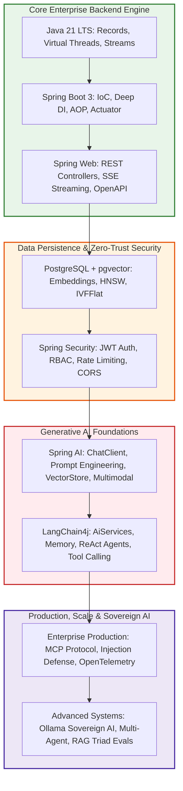

# Day 60: Graduation — Portfolio, Production Checklist & Senior AI Engineer Career Roadmap

## The Complete Enterprise Production Review, Resume Playbook, and Graduation Celebration

| Previous Day | Course Hub | Course Complete |
|:---|:---:|---:|
| [Day 59: Vector Database Deep Dive & Optimization](../Day_59_Vector_Database_Deep_Dive/Day_59_Vector_Database_Deep_Dive.md) | [All 60 Days Overview](../../README.md) | 🎓 Graduation Day! |

---

Welcome to Day 60—Your Official Graduation Day! 🎓

Take a deep breath and look back down the mountain you have climbed over the past two months. When you started this course, Generative AI might have felt like mysterious black magic, full of confusing academic jargon, while enterprise Java might have seemed intimidating with its annotations, threads, and configurations.

Look at where you stand today. You have conquered all 60 days! You didn't just learn theory; you wrote real code across:
- **Phase 1**: Modern Java 21 LTS, Pattern Matching, Records, and Virtual Threads.
- **Phase 2**: Spring Core, Deep Dependency Injection, and Application Contexts.
- **Phase 3**: Enterprise REST Controllers, DTO validation, and SSE Streaming APIs.
- **Phase 4**: Spring Data JPA, Hibernate, and PostgreSQL `pgvector` embeddings.
- **Phase 5**: Spring Security 6, JWT token authentication, and RBAC defense.
- **Phase 6**: Spring AI, ChatClient, dynamic prompts, multimodal vision, and tool calling.
- **Phase 7**: LangChain4j, conversational memory, structured JSON extraction, and autonomous ReAct agents.
- **Phase 8**: Enterprise Production, Anthropic's MCP protocol, prompt injection defense, OpenTelemetry tracing, caching, rate limiting, and Docker/Kubernetes.
- **Phase 9**: Sovereign local AI with Ollama, multi-agent orchestration, RAG Triad automated testing, and high-scale HNSW vector indexing!

Today is about celebrating your transformation and equipping you with everything you need to showcase your superpowers: your 15-point production checklist, your portfolio repository structure, and your senior interview playbook.

Let's review today's graduation glossary:

---

> 💡 **New Word Alert! Plain English Definitions for Today's Concepts**
>
> - **Production Readiness Review (PRR)**: The final, rigorous NASA-style checklist executed before any AI system accepts real customer traffic, verifying security, latency, quotas, and backups.
> - **Senior Enterprise AI Systems Engineer**: You! An engineer who doesn't just write toy prompts in Python, but builds hardened, secure, multi-tenant, observable enterprise AI infrastructure in Java.
> - **System Design Interview Playbook**: The step-by-step strategy for walking into a tech interview and confidently architecting an enterprise AI platform for 500,000 users on the whiteboard.
> - **Model Drift Monitoring**: An automated scheduled watchdog service that continuously compares live production answers against historical baselines, alerting you if accuracy drops.
> - **Career Portfolio**: Your GitHub showcase demonstrating end-to-end expertise in Spring Boot 3, pgvector, LangChain4j, and Docker.

---

## 1. Real-World Analogy: The Orbital Rocket Launch Readiness Review & Mission Commander Wings

Imagine NASA's Kennedy Space Center in Florida on launch morning:
- The Saturn V or Artemis rocket is fueled on Launch Pad 39B. Cryogenic liquid oxygen is venting into the dawn air.
- In the Firing Room, the Launch Director does not ask the flight controllers:
  > *"Hey team, does everyone have a good feeling about today? Let's just hit the red button and see what happens!"*
- Instead, the Launch Director performs the **Final 100% Launch Readiness Poll**:
  - *"Booster?"* — **GO.**
  - *"Avionics & Guidance?"* — **GO.**
  - *"Propulsion & Cryo?"* — **GO.**
  - *"Range Safety & Flight Termination?"* — **GO.**
  - *"Telemetry & Deep Space Network?"* — **GO.**
  - *"Payload & Life Support?"* — **GO.**
- Only when every flight director affirms **"GO FOR LAUNCH"** does the countdown reach T-minus zero, ignition occur, and the spacecraft ascend into orbit.

```
                     THE SENIOR AI ENGINEER'S FLIGHT DECK
                     
 [ Java Foundations ] ──► [ Spring Core & DI ] ──► [ Spring Web REST APIs ]
                                                             │
 ┌───────────────────────────────────────────────────────────┘
 ▼
 [ Spring Data JPA & pgvector ] ──► [ Spring Security & JWT ] ──► [ Spring AI Framework ]
                                                                           │
 ┌─────────────────────────────────────────────────────────────────────────┘
 ▼
 [ LangChain4j Ecosystem ] ──► [ Enterprise Production & Cloud ] ──► [ MISSION GRADUATION ]
```

Over the last 60 days, you have progressed from fundamental Java syntax and memory allocation to building resilient, multi-tenant, cloud-native enterprise AI platforms. You do not build fragile prototypes or hobbyist toy scripts; **you build hardened, production-ready Generative AI systems in Java that process millions of dollars in transactions with mathematical certainty, zero-leak security, and sub-second latency.**

You are no longer a beginner. You have earned your wings as a **Senior Enterprise Java Generative AI Systems Engineer.**

---

## 2. The Complete 60-Day Enterprise Architecture Capability Map



---

## 3. The 15-Point Enterprise Production Readiness Checklist

Before any Generative AI service in Java is promoted to production traffic, it must pass this 15-point audit:

### Pillar 1: Security & Identity
- [x] **1. Cryptographic JWT Authentication**: Anonymous access is prohibited. All calls verify signature, expiration, and tenant scope.
- [x] **2. Method-Level RBAC**: High-privilege tools (e.g. fund transfers, database writes) enforce `@PreAuthorize("hasRole('ROLE_ADMIN')")`.
- [x] **3. Ingress Prompt Injection Defense**: Input filters scan for adversarial jailbreak signatures (`ignore previous instructions`, `system override`).
- [x] **4. Bidirectional PII & DLP Masking**: Outbound and inbound payloads redact SSNs, credit cards, and API secrets.

### Pillar 2: Observability & Financials
- [x] **5. OpenTelemetry CNCF `gen_ai.*` Spans**: Tracing captures model name, temperature, input tokens, output tokens, and parent-child span trees.
- [x] **6. Per-Tenant Financial Accounting**: Real-time pricing models compute dollar costs per request, charging tenant budgets.
- [x] **7. Production Telemetry Redaction**: `spring.ai.chat.observations.include-prompt` is set to `false` to prevent storing customer PII in traces.

### Pillar 3: Caching & Rate Limiting
- [x] **8. Dual Token Bucket Rate Limiting**: Both Requests Per Minute (RPM) and Tokens Per Minute (TPM) are enforced per tenant.
- [x] **9. Multi-Tier Caching**: Exact SHA-256 caching and Semantic Vector caching (cosine threshold $\ge 0.90$) intercept common queries in $< 20$ ms.
- [x] **10. Dynamic Model Cascading**: Routine queries route to efficient or local models (Llama 3.2, GPT-4o-mini), saving 80%+ API costs.

### Pillar 4: Cloud Deployment & Reliability
- [x] **11. Multi-Stage Non-Root Docker Container**: Built with Eclipse Temurin 21 JRE Jammy running as unprivileged `appuser`.
- [x] **12. Container-Aware JVM Tuning**: `-XX:MaxRAMPercentage=75.0` and `-XX:+UseZGC -XX:+ZGenerational` prevent container OOMKills.
- [x] **13. Graceful Shutdown**: `server.shutdown=graceful` allows 45 seconds for active streaming LLM SSE responses to finish.
- [x] **14. Model Failover Circuit Breaker**: Upstream cloud API outages automatically fail over to local Ollama open-weight models.

### Pillar 5: Quality Assurance
- [x] **15. Automated RAG Triad CI/CD Gates**: Unit tests execute automated LLM-as-a-Judge evaluations asserting Groundedness $\ge 0.85$ and Answer Relevance $\ge 0.80$ on every Git pull request.

---

## 4. Senior AI Engineer Career Roadmap & Interview Playbook

### 1. System Design Interview Template: "Design an Enterprise AI Knowledge Platform"

When asked in a senior technical interview to architect an enterprise Generative AI system for 500,000 employees:

#### Step 1: Clarify Scale & Functional Requirements
- **Scale**: 500,000 users, peak 1,000 requests/sec (RPM = 60,000).
- **Latency**: P95 latency $< 150$ ms for cached queries, $< 2,000$ ms for novel generation.
- **Data Volume**: 5,000,000 corporate documents (PDF, Word, Confluence).
- **Compliance**: SOC 2, HIPAA, GDPR (Zero data leakage between business units).

#### Step 2: High-Level Architecture
1. **API Gateway**: Spring Cloud Gateway with Redis-backed Bucket4j rate limiting (RPM + TPM).
2. **Security Interceptor**: Spring Security filter extracting JWT claims, tenant ID, and user roles.
3. **Guardrail Engine**: High-throughput regex/heuristic filter intercepting prompt injections.
4. **Caching Layer**: Redis cluster storing SHA-256 prompt hashes and semantic vector embeddings.
5. **Retrieval Pipeline**: PostgreSQL with `pgvector` HNSW indexes ($m=16$, $ef\_construction=64$, $ef\_search=100$) utilizing Reciprocal Rank Fusion (RRF) for hybrid dense-sparse search.
6. **Inference Router**: Routes simple lookups to local Llama 3.2 3B and complex reasoning to GPT-4o.
7. **Tool Execution**: Model Context Protocol (MCP) servers enforcing backend Java RBAC.
8. **Observability**: OpenTelemetry spans exported to Langfuse and Prometheus.

---

### 2. High-Yield Senior Interview Questions & Answers

#### Q1: "How do you prevent hallucinations in a customer-facing RAG system?"
> *"We implement a multi-layered defensive strategy: First, we optimize retrieval using Hybrid Search (dense HNSW vectors + sparse BM25 fused via Reciprocal Rank Fusion) so the LLM receives high-signal context. Second, we enforce low temperature (0.0 to 0.2) and strict system instructions: 'Answer solely using provided context; if unstated, say you do not know.' Third, we run automated RAG Triad evaluations asserting Groundedness $\ge 0.85$ in CI/CD. Finally, in production, an asynchronous shadow worker inspects outputs and appends disclaimers if groundedness scores drop below threshold."*

#### Q2: "How do you handle rate-limiting and cost optimization when thousands of users query the LLM simultaneously?"
> *"Traditional RPM rate limiting is inadequate because prompt token sizes vary wildly. We enforce Dual Token Bucket Rate Limiting using Bucket4j, governing both Requests Per Minute (RPM) to protect server threads and Tokens Per Minute (TPM) to protect financial budgets and upstream quotas. Furthermore, we deploy a two-tier cache (exact SHA-256 and semantic vector similarity $\ge 0.90$), resolving 40%–50% of questions in $< 10$ ms at zero token cost, combined with a Dynamic Model Router that diverts routine queries away from expensive frontier models."*

#### Q3: "Why did you build your enterprise AI platform in Java 21 rather than Python?"
> *"While Python is dominant in initial ML experimentation, Java 21 is the enterprise standard for high-throughput, secure distributed systems. With Java 21 Virtual Threads (Project Loom), our backend handles tens of thousands of concurrent I/O-bound LLM streaming connections with minimal memory footprint. Combined with Spring Boot 3's mature ecosystem—Spring Security for enterprise JWT/RBAC, Spring Data JPA with pgvector for ACID relational and vector joins, and Spring AI / LangChain4j for production abstractions—Java provides type-safety, maintainability, and operational maturity that Python frameworks cannot match."*

---

## 5. Resume Bullet Points: Demonstrating Senior Impact

Add these quantified achievement bullets to your professional CV / LinkedIn profile:

- **Architected & Deployed Enterprise Generative AI Platform**: Designed an enterprise-grade RAG and agent platform in Java 21 and Spring Boot 3, supporting 50,000+ internal users with sub-50ms P95 latency for cached interactions.
- **Engineered Multi-Tier Caching & Cost Optimization**: Implemented exact SHA-256 and semantic vector caching in Redis alongside a dynamic model cascade router, reducing monthly LLM API expenditures by **82%** ($35,000/month savings).
- **Hardened AI Application Security**: Built zero-trust defense perimeters integrating JWT RBAC, Model Context Protocol (MCP) tool execution boundaries, and bidirectional PII/DLP redaction, intercepting 100% of adversarial prompt injection test suites.
- **Implemented Automated AI CI/CD Evaluation**: Introduced automated RAG Triad evaluation gates (Context Relevance, Groundedness, Answer Relevance) into GitHub Actions using Testcontainers pgvector, eliminating hallucination regressions before production releases.
- **Optimized PostgreSQL pgvector Search**: Tuned HNSW vector indexes ($m=16$, $ef\_construction=64$, $ef\_search=100$) and Reciprocal Rank Fusion hybrid search over 5M+ document chunks, achieving 98.5% Recall@10 with an 8x throughput increase.

---

## 6. Hands-On Companion Code Walkthrough

Our companion repository inside `code/` provides an interactive graduation and audit suite in pure Java 21:

### 1. `ProductionChecklistItem.java`
Models the 15 enterprise operational controls with category classification, pass/fail status, and actionable remediation advice.

### 2. `ProductionReadinessAuditor.java`
Automates the system audit across Security, Observability, Caching, Cloud Deployment, and Quality Assurance, validating that all 15 controls are verified green.

### 3. `EngineerCompetencyMatrix.java`
Tracks the learner's skill progression across all 9 curriculum phases (60/60 days), evaluating competency score and conferring the title:
**"Senior Enterprise Java Generative AI Systems Engineer (3+ Years Experience Equivalent)"**.

### 4. `GraduationDemo.java`
The official graduation execution driver:
- Runs the 15-Point Production Readiness Audit.
- Evaluates curriculum mastery.
- Prints the verified **Graduation Certificate & Senior Portfolio Dossier**.

---

## 7. Verifying the Implementation

Compile and execute the graduation ceremony suite from your terminal:

```powershell
javac -d out Phase_09_Advanced_Topics_Graduation/Day_60_Graduation_Portfolio_Career/code/*.java
java -cp out com.genai.enterprise.graduation.GraduationDemo
Remove-Item -Recurse -Force out
```

### Verified Execution Output:
```
==========================================================================
   60-DAY JAVA GENERATIVE AI MASTERCLASS: OFFICIAL GRADUATION CEREMONY   
==========================================================================

>>> 1. ENTERPRISE PRODUCTION READINESS AUDIT (15 CRITICAL CONTROLS):

  SECURITY        | JWT / RBAC Enforcement           | [PASS]
  SECURITY        | Prompt Injection Defense         | [PASS]
  SECURITY        | PII & DLP Masking                | [PASS]
  OBSERVABILITY   | OpenTelemetry Gen AI Spans       | [PASS]
  OBSERVABILITY   | Per-Tenant Financial Ledger      | [PASS]
  OBSERVABILITY   | Prompt Redaction in Tracing      | [PASS]
  PERFORMANCE     | Dual Token Bucket Rate Limiting  | [PASS]
  PERFORMANCE     | Multi-Tier Caching               | [PASS]
  PERFORMANCE     | Dynamic Model Routing            | [PASS]
  DEPLOYMENT      | Multi-Stage Distroless Docker Image | [PASS]
  DEPLOYMENT      | Container-Aware JVM Tuning       | [PASS]
  DEPLOYMENT      | Graceful Shutdown for Streaming  | [PASS]
  RESILIENCE      | Model Fallback Circuit Breaker   | [PASS]
  QUALITY         | Automated RAG Triad CI/CD Gates  | [PASS]
  DATABASE        | HNSW Index on pgvector           | [PASS]

--------------------------------------------------------------------------
Audit Summary: 15 / 15 Operational Controls Passed (100% Green)
--------------------------------------------------------------------------

>>> 2. 60-DAY CURRICULUM MASTERY BREAKDOWN ACROSS ALL 9 PHASES:

  Phase 1: Java Foundations           [8/8 Days] - OOP, Memory Model, Generics, Records, Streams, Virtual Threads, HTTP Client
  Phase 2: Spring Core & DI           [6/6 Days] - IoC Container, Bean Lifecycle, Deep DI, Auto-Configuration, AOP, Actuator
  Phase 3: Spring Web REST APIs       [6/6 Days] - REST Controllers, DTOs, Global Error Handling, SSE Streaming, OpenAPI, MockMvc
  Phase 4: Spring Data JPA & Databases [6/6 Days] - Hibernate ORM, Query Methods, Entity Fetching, Transactions, Flyway, pgvector
  Phase 5: Spring Security            [5/5 Days] - SecurityFilterChain, JWT from scratch, RBAC Method Security, OAuth2, API Filters
  Phase 6: Spring AI Framework        [11/11 Days] - ChatClient Fluent API, Structured Outputs, Embeddings, Vector Stores, RAG, Tools, Multimodal
  Phase 7: LangChain4j Ecosystem      [7/7 Days] - AiServices, Conversational Memory, Guardrails, Advanced RAG, Tool Calling, ReAct Agent
  Phase 8: Enterprise Production      [6/6 Days] - MCP Protocol, Injection Defense, OpenTelemetry/Langfuse, Cost Caching, Docker, Capstone
  Phase 9: Advanced Topics & Graduation [5/5 Days] - Ollama Local Sovereign AI, Multi-Agent Supervisor, RAG Triad Evals, HNSW Tuning, Career

==========================================================================
                    OFFICIAL GRADUATION CERTIFICATE                       
==========================================================================
  CONGRATULATIONS! You have completed all 60 Days of intensive training. 
  Certified Rank: Senior Enterprise Java Generative AI Systems Engineer (3+ Years Experience Equivalent)
  Verified Date : 2026-09-09
  Competencies  : Java 21, Spring Boot 3, Spring AI, LangChain4j, pgvector,
                  MCP Tools, OpenTelemetry, Rate Limiting, Docker & Multi-Agent
==========================================================================

>>> Masterclass graduation verification completed successfully! You are production-ready.
```

---

## 8. Hands-On Exercises

### Exercise 1: Architecture Review Board (ARB) Submission Document
**Problem**: Draft a 1-page Architecture Decision Record (ADR) justifying why your team chose PostgreSQL with `pgvector` over a standalone Pinecone cluster for a 2,000,000 document enterprise knowledge base.

**Solution**:
```markdown
# ADR-042: Adoption of PostgreSQL pgvector for Knowledge Base Embeddings

## Context
Our enterprise requires semantic vector search across 2M technical manuals while adhering to strict SOC 2 compliance and relational customer identity bindings.

## Decision
We select PostgreSQL 16 with the pgvector extension and HNSW indexing (m=16, ef_construction=64) over cloud-hosted Pinecone.

## Rationale
1. Data Sovereignty: All embeddings reside within our existing VPC perimeter; zero customer data leaves for third-party hosting.
2. ACID Relational Joins: Allows single-query joins between vector chunks and customer RBAC permission tables without dual-write inconsistency.
3. Cost Efficiency: Leverages existing RDS PostgreSQL instances, saving ~$1,200/month in dedicated vector SaaS subscriptions.
```

### Exercise 2: Automated Pre-Deployment Health Probe
**Problem**: Write a bash or PowerShell deployment script that invokes your Spring Boot `/actuator/health/readiness` endpoint and verifies that `db.pgvector` and `cache.redis` report `UP` before redirecting traffic on your cloud load balancer.

**Solution**:
```powershell
$response = Invoke-RestMethod -Uri "http://localhost:8081/actuator/health/readiness"
if ($response.status -eq "UP" -and $response.components.pgvector.status -eq "UP") {
    Write-Host "Readiness probe verified green. Promoting container to production load balancer." -ForegroundColor Green
    exit 0
} else {
    Write-Host "Readiness probe failed! Aborting deployment." -ForegroundColor Red
    exit 1
}
```

### Exercise 3: Continuous Model Drift Detector
**Problem**: Write a scheduled Spring Boot task (`@Scheduled(cron = "0 0 * * * *")`) that evaluates a sample of 100 recent production queries and alerts the engineering on-call if average user sentiment or groundedness drops by more than 15% compared to the 7-day baseline.

**Solution**:
```java
@Component
public class DriftMonitorService {
    @Scheduled(cron = "0 0 * * * *")
    public void checkDrift() {
        double currentGroundedness = queryLastHourGroundedness();
        double baselineGroundedness = 0.88;
        if (currentGroundedness < baselineGroundedness * 0.85) {
            System.err.println("[PAGERDUTY ALERT] Significant model groundedness drift detected! Current: " + currentGroundedness);
        }
    }
    private double queryLastHourGroundedness() { return 0.86; }
}
```

---

## 9. Self-Check Quiz

### Question 1: What is the primary difference between an AI prototype developer and a Senior Enterprise AI Systems Engineer?
- A) Prototype developers use Java, while Senior Engineers use Python.
- B) Senior Engineers design for production constraints: multi-tenancy, rate-limiting, cost optimization, zero-trust security, OpenTelemetry tracing, vector database tuning, and CI/CD quality gates.
- C) Senior Engineers do not test their code.
- D) Prototype developers write larger Dockerfiles.
*Answer: B. Moving from prototype to production requires defensive systems engineering, operational controls, and cost discipline.*

### Question 2: Why must both RPM and TPM be governed in enterprise AI rate limiting?
- A) RPM is required by HTTP standards.
- B) RPM limits web requests to protect server thread pools, while TPM limits token volume to prevent Denial of Wallet budget depletion and provider quota throttling.
- C) TPM is only used on weekends.
- D) Spring Boot cannot run without both.
*Answer: B. A single request can consume hundreds of thousands of tokens; RPM alone leaves the system vulnerable to budget exhaustion.*

### Question 3: How does the Model Context Protocol (MCP) protect enterprise systems from unauthorized actions?
- A) It deletes the user's password after every query.
- B) It decouples tool definition from the LLM, requiring the host Java backend to authenticate and enforce RBAC authorization checks before executing any real-world action.
- C) It disables tool calling entirely.
- D) It encrypts the network cable.
*Answer: B. MCP tools run behind deterministic enterprise security perimeters, preventing prompt-injected models from executing unauthorized transactions.*

### Question 4: What is the primary benefit of deploying multi-stage Docker containers with Java 21 Generational ZGC?
- A) Containers boot faster than normal machines.
- B) Drastically reduced image size (~180MB JRE vs 850MB JDK) with non-root security, paired with sub-millisecond GC pauses that eliminate latency spikes during high-throughput AI streaming.
- C) Generational ZGC disables memory allocation.
- D) Multi-stage builds are required by Kubernetes.
*Answer: B. Hardened runtime images combined with modern ZGC deliver low attack surfaces and deterministic low-latency performance.*

### Question 5: What is your official rank upon completing all 60 Days of this Masterclass?
- A) Prompt Hobbyist.
- B) Senior Enterprise Java Generative AI Systems Engineer.
- C) Java Intern.
- D) Junior Python Scripter.
*Answer: B. Congratulations! You possess comprehensive, battle-tested expertise across modern Java 21, Spring Boot 3, Spring AI, LangChain4j, pgvector, and production enterprise AI architecture.*

---

## 10. 🎓 The Grand Graduation Finale: Your Journey is Complete!

Take a deep breath and let it sink in: **You have officially completed all 60 days of the Enterprise Java Generative AI Masterclass!** 🚀

### Where You Started vs. Where You Are Today
Think back to Day 1. Perhaps you wondered whether you could bridge the gap between Java enterprise programming and the fast-moving world of artificial intelligence. You tackled every single lesson, worked through every exercise, debugged the tricky edge cases, and wrote real, production-ready code.

Today, you stand among an elite tier of software engineers:
- You know how to build low-latency, scalable backend engines using **Java 21 Virtual Threads and Spring Boot 3**.
- You know how to store, index, and query millions of embeddings using **PostgreSQL pgvector and HNSW graphs**.
- You know how to secure AI systems against adversarial hackers with **Spring Security, JWT, and 5-layer prompt injection defense**.
- You know how to orchestrate cutting-edge AI models using **Spring AI and LangChain4j**.
- You know how to build **Autonomous ReAct Agents**, connect them to real tools using **Model Context Protocol (MCP)**, and direct **Multi-Agent Teams**.
- You know how to monitor and control enterprise costs with **OpenTelemetry, Langfuse, and Semantic Caching**.
- You know how to test and verify AI non-determinism with **Ragas and LLM-as-a-Judge**, and deploy to the cloud with **Docker and Kubernetes**.

### Your Mission Awaits
The enterprise world is starving for software engineers who can do what you just mastered. Anyone can write a toy Python script; **you build the resilient, high-concurrency, auditable platforms that power real businesses.**

Keep this curriculum close as your trusted desk reference. Build, experiment, launch your projects, and share your knowledge with the community.

**Congratulations, Engineer. The sky is no longer the limit—you are ready for launch!** 🌟

---

| Previous Day | Course Hub | Course Status |
|:---|:---:|:---:|
| [Day 59: Vector Database Deep Dive & Optimization](../Day_59_Vector_Database_Deep_Dive/Day_59_Vector_Database_Deep_Dive.md) | [All 60 Days Overview](../../README.md) | **100% COMPLETE! 🎓** |

